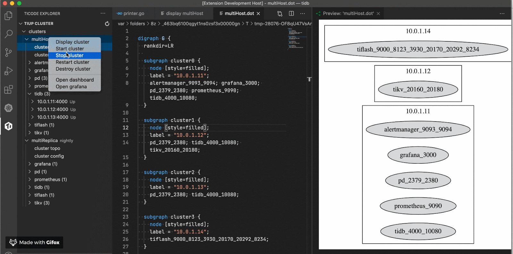
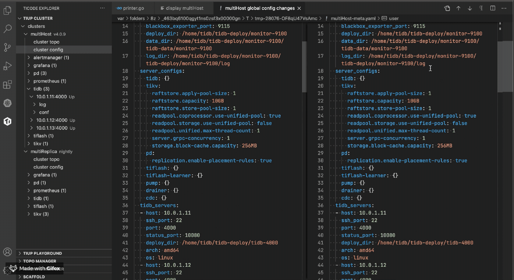
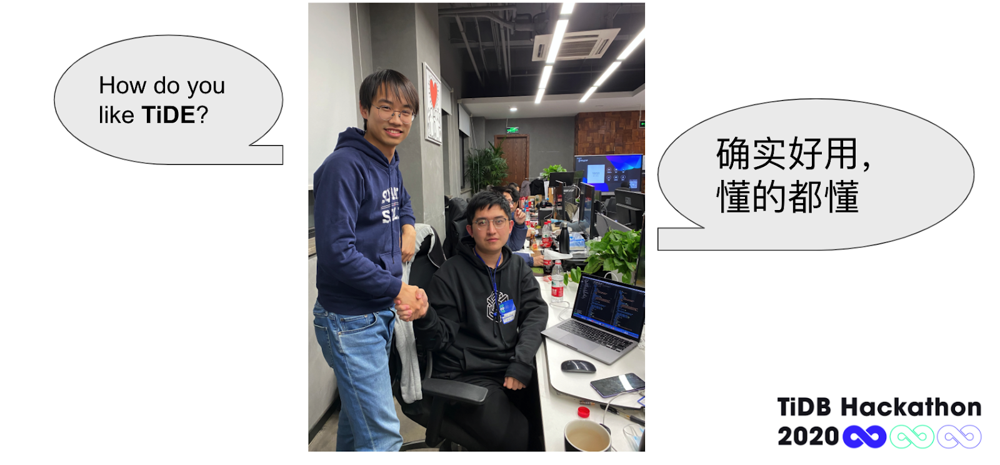
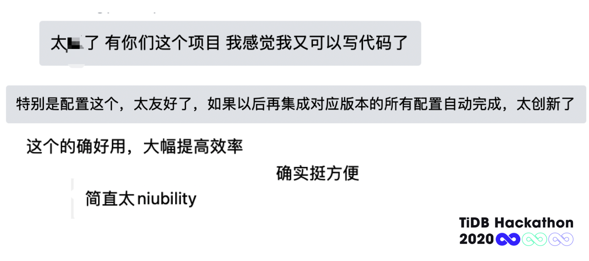
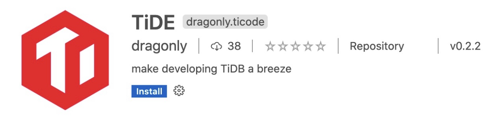

社区开发者参与开发 TiDB 需要比较长的前期学习周期，其中除了复杂的编程语言外，另外一个最大的困难主要来自于项目本身的复杂度。作为一个多语言、多运行时组件的分布式项目，TiDB 的开发和调试门槛远远高于一些类似于移动端 App、Web 服务端、游戏客户端的常规软件项目。

**B.A.D 团队的项目 TiDE 是一个基如今最流行的代码编辑器 Visual Studio Code 的 TiDB 插件，可以开发和本地/远程调试 TiDB 集群，让开发者不需要搞清楚 TiDB 的内部机制也能方便地在本地启动测试集群和实时调试编写，极大地提升了开发者开发和调试 TiDB 项目的体验。** 本项目在本次 TiDB Hackathon 2020 中一举夺得了二等奖与 CTO 特别奖两项殊荣。

## 项目背景：一切要从 CTO 的一个 idea 说起

大赛前一周，我司 CTO 黄东旭突然在群里说他有一个特厉害的 idea，这个想法起源于几周前，东旭本来想给 TiDB 加点功能，但是 TiDB 的代码太复杂，折腾了三天才把环境搭好，最后也没把代码写成。所以他想做个 VSCode 插件，有点类似脚手架，当开发者想加一个功能时，可以一键帮他把模板代码在 TiDB/TiKV/PD 组件中都直接生成出来，只需要自己往里面填充逻辑代码就行了。

团队成员李逸龙从这个 idea 受到了启发，他发现 TiDB/TiKV/PD 的研发同学在日常开发时，需要自己手动替换服务器上的二进制和修改组件配置，重启后再手动去捞日志看结果，过程非常繁琐，同时在本地对各大组件同时进行 debug 单步调试也很复杂。他就想到能不能用 VSCode 插件把这些工作都自动化处理呢？类似 K8S 的 VSCode 插件，通过这个插件不用敲一行代码就可以管理 K8S 集群。于是研发工程师李逸龙、前端工程师黄宝灵和 K8S 专家吴叶磊三个人一拍即合，都觉得这个 idea 太好了，直击痛点！

通过讨论，三个人大致确定了项目方向，**开发一个为 TiDB 开发者打造的一站式 IDE，提升效率的神器！**

## 项目设计：做一个造福所有 TiDB 开发者的项目太有成就感了

项目开发之初完全是原生态开发模式，大家一边实现自己擅长和最想做的部分，一边把想法记录下来列为 TODO。初步分工为宝灵哥负责实现脚手架及集群管理功能；阿磊负责调试功能的实现；小龙担任队长，负责产品及 K8S 部分功能的实现，同时他还是团队的灵感担当，不仅输出项目灵感，还根据三个人的 GitHub 首字母将团队取名为 B.A.D，很霸气的名字，全员好评。

经过几天紧张且充实的发开，TiDE 终于初见雏形，它主要实现了以下几个重要功能：

### 脚手架功能

一键为 TiDB 生态中某个或某几个组件添加一项新功能，目前已经拥有一键为 TiDB Dashboard 添加一个 APP 的能力，添加之后用户只需要修改默认实现就能快速将自己想要的功能添加到 TiDB 生态当中。

为 TiDB Dashboard 添加一个新页面并实时预览

### 本地开发

TiDB 生态是由多个项目构成的，很多功能的开发调试需要横跨多个项目，TiDE 能够一键将工作目录中各组件的代码编译打包并部署或更新到本地集群中，同时提供查看日志、拓扑管理、配置管理能力，让本地开发丝般顺滑。

从工作目录中的代码启动一个本地集群

### 远程开发

TiDB 作为分布式系统，在分布式环境下进行远程开发也是很多场景下必不可少的能力。TiDE 提供了针对远程集群的一系列能力封装，包括集群启停，修改配置，替换本地编译的二进制到远端节点，查看日志，一键 SSH 到远程节点等操作。

操作远程集群

管理远程集群配置

### 调试 TiDB 集群

包括调试本地集群和远程集群。同样遵循“TiDB 的典型开发运行模式是集群”这个思想，TiDE 能够一键对集群中所有组件启动单步断点调试，当然，调试单个组件或进程也能轻松搞定。

单步断点调试本地集群

### 「TiDE 确实好用，懂的都懂」

项目开发的过程运用了边开发边推广策略，团队成员也表示参赛意图之一就是为了推广 TiDE，从而得到更多种子用户的反馈，再进而优化功能，在这其中也发生了几件意想不到的趣事。在 Hackathon 比赛现场，有一位友 team 的开发者遇到了 TiUP 的使用困难，在小龙的热心帮助下，使用 TiDE 解决了 TiUP 部署的权限问题，意外当场收获用户一枚，这位开发者在试用 TiDE 后不禁发出了感叹“ **TiDE 能提升我的开发效率，解放我的思路，确实好用，懂的都懂。**”

几位成员还在项目答辩前将初版 Demo 给几位同事小小的剧透了一下，没想到把大家都震惊住了，直呼「这也太爽了吧！」，并且立即开始向团队成员提需求“诶，这个重启能不能支持一下只重启单个实例或单个组件呀？”，“诶，bench 功能能不能支持一下呢？”嗯，很合理，可以有，加到 TODO 里！看到大家的认可，B.A.D 的三位同学都表示非常开心，因为他们看到自己的项目确实是有价值的，做一个造福所有 TiDB 开发者的项目真的太有成就感了！

## 项目意义：功在当代，利在千秋

「**功在当代，利在千秋**」是黄东旭对 TiDE 的评价，尤其对于 TiDB 这样一个拥有庞大并且活跃社区的开源项目来说，TiDE 的实现就是在为整个社区添砖加瓦。它不仅能反映到某一个产品上，而是能反映到未来和 TiDB 相关的所有产品上，具有极大的社会价值。具体项目意义可总结为以下两点：

**降低 TiDB 的开发和调试门槛，从此上车 TiDB 不再困难。** 由于 TiDB 的代码非常复杂，让很多想学习或者想加入开源社区的小伙伴们望而却步，但有了 TiDE 这个神器后，大幅度降低了大家开发 TiDB 的门槛，让更多人能够快速上手 TiDB，融入社区。同时，小龙也表示 TiDE 有望替代开源项目中传统的文档先行吸纳成员的模式，传统开源社区一般是在项目首页放一些例子和文档来让人了解项目，而 TiDE 可以直接让用户快速上手操作，并且把文档里面死的内容变成交互式展现，迅速且直观的让用户了解到 TiDB 的各个功能，从而产生兴趣加入社区。

**提高开发效率与用户体验，真正享受编程过程与结果。**有了 TiDE，我们再也不用把 90% 的时间花费在搭建环境上，而是让开发者们回归初心，尽情享受写代码快乐与编程的结果。阿磊也认为 TiDE 最大的意义就在于让更多的人目光聚焦到提升开发者体验上来。“在各类技术社区中，致力于提升开发者体验的小组相较之下往往显得不够关键也不够 sexy，甚至于我自己以前也有这样的成见。但 TiDE 打动了我自己，用实际效果告诉我提升开发者体验这件事空间极大并且能够做得非常有意思——我想这种启发是每一个使用过 TiDE 的人都能感受到的。”

## 未来方向：Just a Beginning

这届 Hackathon 虽然已经结束了，但对于 TiDE 来说，才刚刚是一个开始，TODO LIST 还很长，未来可以大致分为以下几个发展及优化方向：

- **部署集群功能**：一键布署用于开发测试的各种类型集群

- **机器管理**：管理用于布署集群的物理机或虚拟机

- **TiUP 自动安装**：自动安装和升级 TiUP

- **优化 TiDB 在 K8S 上的开发体验**：一键更新本地代码到 K8S 集群中并进行调试，让 K8S 上的开发流程如同本地一般简单轻松

- **联动 UDF**：与本次 Hackathon第一名的项目 WASM UDF功能结合，提供脚手架和调试功能，轻松开发 TiDB UDF，让自定义 TiDB 功能变得轻而易举

- **进入 TiDB Incubator Program**：一个好汉三个帮，如此好用的工具项目当然希望所有 TiDB 社区小伙伴参与进来，自己的痛点自己最清楚

本次 Hackathon 之旅 TiDE 以揽得二等奖以及 CTO 特别奖两项大奖完美收官，在谈及本次参与黑客马拉松的感受时，三位成员也都表示收获满满：

**黄宝灵：“** 非常开心的一次 Hackathon，尤其是我们的项目得到了大家的认可，帮大家解决了痛点。开阔了眼界，感觉大家都太强了。我们能同时收获两个大奖，也是特别地惊喜。”

**吴叶磊：“** 兴奋、震撼和满足。兴奋于自己组的产品收到的认可与赞许，震撼于各种大胆又巧妙的 idea 和 Demo Show，满足于收获了两天深刻的回忆与一群新朋友（当然还有两个大奖！）。”

**李逸龙：“** 收获了满满的 idea 和大家的热情，真的是神仙打架。比赛中展现的技术深度和广度都令人叹为观止，我觉得贵司不愧是 Hackathon Driven Company，这个传统一定要延续下去，毕竟中文开发者社区中很少见到过这么硬核的 Hackathon 比赛了。我们都非常享受比赛的过程，觉得与其说是比赛，更觉得是一个派对。同时也认识了非常多有趣的小伙伴，这就够了。”

最后，[https://github.com/dragonly/ticode](https://github.com/dragonly/ticode)，目前已经在 GitHub 上收获了 46 颗星，在 VSCode 应用商店也有近 40 的下载量。

>TiDE 才刚刚开始，未来还很长，让我们一起期待