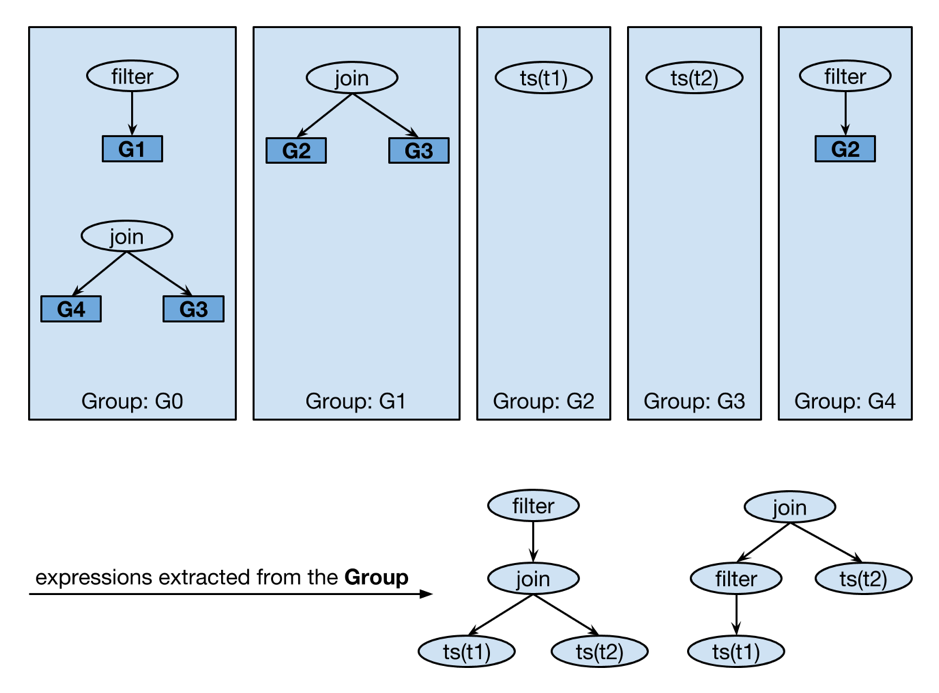
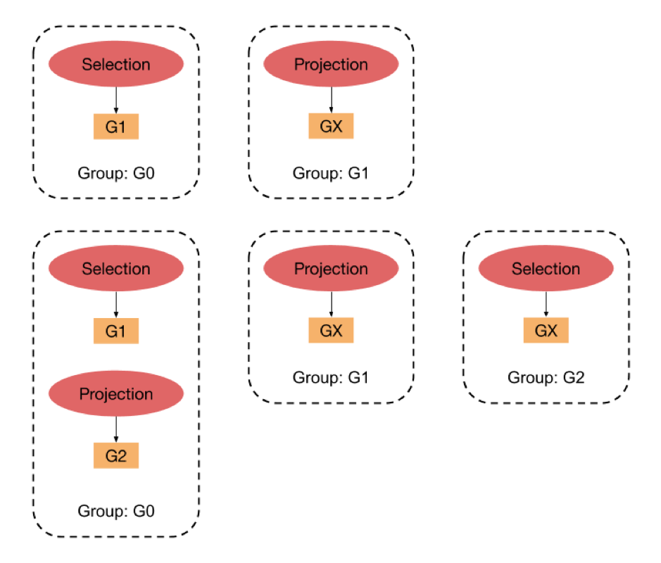

到今天为止，“成为 Contributor 系列”已经推出了 “[支持 AST 还原为 SQL](https://pingcap.com/blog-cn/support-ast-restore-to-sql-text/)”，“[为 TiKV 添加 built-in 函数](https://pingcap.com/blog-cn/30mins-become-contributor-of-tikv/)”，“[向量化表达式](https://pingcap.com/blog-cn/10mins-become-contributor-of-tidb-20190916/)”等一列活动。**这一次借着 TiDB 优化器重构的契机，我们将这个系列再向着数据库的核心前进一步，挑战一下「为 TiDB 的优化器增加优化规则」，带大家初步体验一下可以对查询的执行时间产生数量级影响的优化器的魅力。**

众所周知优化器是数据库的核心组件，需要在合理的时间内寻找到一个合理的执行计划，确保查询可以稳定快速地返回正确的结果。最初的优化器只有一些启发式的优化规则，随着数据量和业务的变化，业界设计出了 System R 优化器框架来处理越来越多的复杂 SQL 查询。它将查询优化分为逻辑优化和物理优化两个阶段，逻辑优化根据规则对执行计划做等价变形，物理优化则根据统计信息和代价计算将逻辑执行计划转化为能更快执行的物理计划。目前 TiDB 优化器采用的也是该优化器模型。

虽然 System R 优化器框架大大提升了数据库处理复杂 SQL 的能力，但也存在一定缺陷，比如：

1. 扩展性不好。每次添加优化规则都需要考虑新的规则和老的规则之间的关系，需要对优化器非常了解的同学才能准确判断出新的优化规则应该处在什么位置比较好。另外每个优化规则都需要完整的遍历整个逻辑执行计划，添加优化规则的心智负担和知识门槛非常高。

2. 搜索空间有限。搜索空间一方面因为优化规则难以添加导致比较狭小，另一方面，逻辑优化要求该优化规则一定在各个场景下都有收益才行，但在数据库面临的各种场景中，总有一些优化规则在某种数据分布下有收益，在另一种数据分布下没有收益，需要根据数据的分布估算代价来判断是否启用这些优化规则，因为这个原因，进一步导致一些优化规则不能添加到这个搜索框架中，或者添加后需要人工的通过开关来开启或关闭该优化规则。

为了解决上面的问题，更方便地添加优化规则，扩展优化器搜索空间，寻找更优的执行计划，我们基于 Cascades 优化器模型重新写了一个新的优化器，名字就叫 Cascades Planner。在这个优化器框架下，添加优化规则变得异常简单：

1. 不用考虑优化规则之间的顺序关系，规则和规则之间完全解耦。

2. 只针对特定的模式添加优化规则，不再需要遍历整个逻辑执行计划，不用熟知所有逻辑算子的功能，极大的降低了优化器的开发门槛。

在这篇文章中，我们主要聚焦在一条优化规则是如何工作以及如何给新优化器添加规则上，先让大家对这个优化器有一个直观的感受——“优化器没什么难的，不过如此”。下一篇文章，我们将更加详细的介绍 TiDB Cascades Planner 的原理和框架，供感兴趣的同学深入研究，如果大家等不及的话，可以先阅读下面的参考文献，提前了解一下 Cascades 优化器模型：

1. [The Cascades Framework for Query Optimization](https://15721.courses.cs.cmu.edu/spring2018/papers/15-optimizer1/graefe-ieee1995.pdf)

2. [Orca: A Modular Query Optimizer Architecture for Big Data](https://15721.courses.cs.cmu.edu/spring2016/papers/p337-soliman.pdf)

3. [CMU SCS 15-721 (Spring 2019) : Optimizer Implementation (Part II)](https://15721.courses.cs.cmu.edu/spring2019/slides/23-optimizer2.pdf)

## Cascades 优化器简介

Cascades 优化器是 Goetz Graefe 在 [volcano optimizer generator](https://cs.uwaterloo.ca/~david/cs848/volcano.pdf) 的基础上优化调整之后诞生的一个搜索框架。这个框架有如下一些概念：

* Expression：原论文中，Expression 用来指代包括 Plan 节点（也就是大家常说的的 SQL 算子）以及各种函数表达式（例如 MySQL 支持的 200 多个内置函数）在内的所有表达式。在 TiDB 现有框架实现中，只将 Plan 节点视作 Expression。Expression 大多会包含子节点，但每个子节点并不是一个 Expression ，而是一组等价的 Expression 集合，也就是接下来要介绍的 Group。

* Group：表示等价 Expression 的集合，即同一个 Group 中的 Expression 在逻辑上等价。Expression 的每个子节点都是以一个 Group 表示的。在下文图例中，Group `G0` 中包含谓词下推前后的两个等价 Expression。

* Transformation Rule：是作用于  Expression 和 Group 上的等价变化规则，用来扩大优化器搜索空间，也是本次要重点介绍的模块。下图 Group `G0` 中的第二组 `Expression` 便是第一组 `Expression` 经过了一个谓词条件（Filter）下推过连接（Join）的 Transformation Rule 之后新产生的 `Expression`。

* Pattern：描述一个执行计划的片段，注意这个 “片段” 不是 “子树”。这个片段可以是执行计划算子树中任意一段。每一个 Transformation Rule 都拥有自己的 Pattern，表示该 Rule 只作用于满足这个 Pattern 的 Expression。

* Implementation Rule：将一个逻辑算子转换成物理算子的规则。如一个 Join 可以被转换成 HashJoin、MergeJoin、IndexNestedLoopJoin 等。每一个转换都由一个对应的 Implementation Rule 完成。

以查询 `select * from t1 join t2 on t1.a = t2.a where t1.b > 1` 为例，在经过 Cascades 优化器的谓词下推这一 Transformation Rule 后，搜索空间中的 Group 和 Expression 会是如下：



目前 TiDB 中 Cascades 优化器的搜索过程大致如下：

1. 首先将抽象语法树（AST）转换为初始的逻辑执行计划，也就是由 LogicalPlan 所表示的算子树。

2. Cascades Planner 将这棵初始的 LogicalPlan 树等价地拆分到 `Group` 和 `GroupExpr` (Expression 在代码中对应的具体数据结构) 中，这样我们便得到了 Cascades Planner 优化器的初始输入。

3. Cascades Planner 将搜索的过程分为了两个阶段，第一阶段是 Exploration ，该阶段不停地遍历整个 Group ，应用所有可行的 Transformation Rule，产生新的 Group 和 GroupExpr ，不停迭代直到没有新的 GroupExpr 诞生为止。

4. 在第二个阶段 Implementation 中，Cascades Planner 通过对 GroupExpr 应用对应的 Implementation Rule，为每一个 Group 搜索满足要求的最佳（Cost 最低）物理执行计划。

5. 第二阶段结束后，Cascades Planner 将生成一个最终的物理执行计划，优化过程到此结束，物理执行计划交给 TiDB 执行引擎模块继续处理。

## 一条优化规则如何工作

目前所有的 Transformation Rule 的实现代码都放在 `planner/cascades/transformation_rules.go` 文件中。我们以 `PushSelDownProjection` 为例，来简单介绍一条 Transformation Rule 的工作流程。

Transformation Rule 是一个 interface，该接口的定义如下（省去注释部分）：

```
type Transformation interface {
	GetPattern() *memo.Pattern
	Match(expr *memo.ExprIter) bool
	OnTransform(old *memo.ExprIter) (newExprs []*memo.GroupExpr, eraseOld bool, eraseAll bool, err error)
}
```

在 Cascades 中，每个 rule 都会匹配一个局部的 Expression 子树，这里的 `GetPattern()` 就是返回这个 rule 所要匹配的 Pattern。Pattern 的具体结构如下（省去注释部分）：

```
type Pattern struct {
	Operand
	EngineTypeSet
	Children []*Pattern
}
```

这里需要提一下的是 `EngineTypeSet` 这个参数，因为有的算子比如 Selection ，既可以在 TiDB 执行，也可以在 TiKV 或者 TiFlash（一个列存引擎，目前尚未开源）Coprocessor 上执行。为了处理只在特定执行引擎上生效的规则，我们引入了这个参数。

Pattern 的构造可以借助 `BuildPattern()` 以及 `NewPattern()` 来完成。对于 `PushSelDownProjection` 这个规则来说，它起作用的执行计划 Pattern 是 `Projection -> Selection`。

```
func (r *PushSelDownProjection) GetPattern() *memo.Pattern {
	return memo.BuildPattern(
		memo.OperandSelection,
		memo.EngineTiDBOnly,
		memo.NewPattern(memo.OperandProjection, memo.EngineTiDBOnly),
	)
}
```

`Match()` 函数是在命中 Pattern 后再做的一些更具体的判断，因为 Pattern 只包含了算子类型和算子树的结构信息。这时比如有一个 Rule 只对 inner join 生效，Pattern 只能判断到算子是 Join，要进一步判断它是否是 inner join 就需要依靠 `Match()` 函数了。对于大部分简单的 Transformation Rule，所以 `Match()` 函数只需要简单地返回 `true` 就行了。

`OnTransform()` 函数是规则的主要逻辑所在，在函数内部我们会创造新的 Expression 并返回合适的 `eraseOld` 以及 `eraseAll` 的值。举例来说，谓词下推会让计算尽可能提前，减少后续计算量，因此新生成地 Expression 一定是更好的选择，这时 `eraseOld` 就可以返回 `true`。类似地，当一个 rule 返回的 Expression 一定比其他所有选择都更好时，比如某一个优化规则发现 `a > 1 and a < 1` 恒为假后，判断查询一定不会有结果产生所以生成了 `TableDual` 的新 Expression ，这时就可以让 `eraseAll` 返回 `true` 让优化器将同 Group 内的其他 Expression 全部清空。

`PushSelDownProjection` 的 `OnTransform()` 的行为如下图所示，简单来说：



1. 在初始时只有 `G0` 和 `G1` 两个相关的 Group。

2. 这个优化规则会将 `Selection` 推到 `Projection` 下面去，产生新的 Group `G2`，同时在 `G0` 中新增了 `Projection->G2` 的 `GroupExpr`。

## 如何添加一个 Transformation Rule

添加一个 Transformation Rule 简单来说就是编写一个新的结构体，实现 `Transformation` 这个 interface 的三个接口。Cascades 架构的优势就是它做了足够的抽象，让添加 Rule 的工作不需要考虑太多繁杂的事情。如果你在添加 Rule 时觉得有些地方写起来不是那么顺手，可以立刻停下手中的键盘来 [#sig-planner](https://tidbcommunity.slack.com/messages/sig-planner) 中和我们做一些讨论。

当然这里还是要列出一些注意事项方便大家在添加 Transformation Rule 时不走歪路：

* `OnTransform()` 的函数头以及函数过程中添加充足的注释，说明自己的 Rule 做了一个什么样的变换，方便他人在读到这个 Rule 的代码时，能快速明白这个 Rule 做了哪些工作。

* `OnTransform()` 函数中不要对原有的 Expression 做任何修改，因为原有 Expression 可能之后会继续触发其他的行为，如果做了修改，那么在下一次触发规则时，就可能产生一些意想不到的化学反应。

* 要在 `defaultTransformationRuleMap` 中注册这个 Rule，这个 Map 是 TiDB 目前默认的 `RuleSet`。使用 `RuleSet` 的好处很多，比如针对 TP 和 AP 查询使用不同的 Rule 集合，使得优化器在处理 TP 查询时能快速做出不差的执行计划，在处理 AP 查询时多应用一些优化规则做出执行时间更短的执行计划等。

* 单元测试必不可少。目前，Transformation Rule 的测试在 `transformation_rules_test.go` 中。测试函数的编写可以参考文件下的其他函数，主要是以跑一个完整的 SQL 进行测试。为了减轻修改测试输出的工作量，我们将测试输入输出单独记录在文件中，并可以通过命令行快捷更新输出。在添加了测试函数后，需要修改 testdata 目录下的 `transformation_rules_suite_in.json` 文件添加测试的输入,然后用 `go test github.com/pingcap/tidb/planner/cascades --record` 即可生成对应的 `xxx_out.json` 文件。记得要检查测试的输出是否符合预期，确保测试结果是自己想要的等价变换。

* 目前 Cascades 优化器仍在早期阶段，偶尔会有一些框架性的改动可能会制造一些需要解决的代码冲突，还请大家理解。

## 如何成为 Contributor

为了方便和社区讨论 Planner 相关事情，我们在 [TiDB Community Slack](https://pingcap.com/tidbslack/) 中创建了[#sig-planner](https://tidbcommunity.slack.com/messages/sig-planner) 供大家交流讨论，之后还将成立优化器的专项兴趣小组，不设门槛，欢迎感兴趣的同学加入。大家在添加规则时遇到一些问题时，可以毫不犹豫的来 channel 里和我们吐槽～

**参与流程：**

1. 在 [Cascades Tracking Issue](https://github.com/pingcap/tidb/issues/13709) 中 `porting the existing rules in the old planner` 选择感兴趣的函数并告诉大家你会完成它。

2. 添加一个 rule 并为其增加单元测试。

3. 运行 `make dev`，保证所有 test 都能通过。

4. 发起 Pull Request 并完成 merge 到主分支。

如果你有任何疑问，也欢迎到 [#sig-planner](https://tidbcommunity.slack.com/messages/sig-planner) 中提问和讨论。
