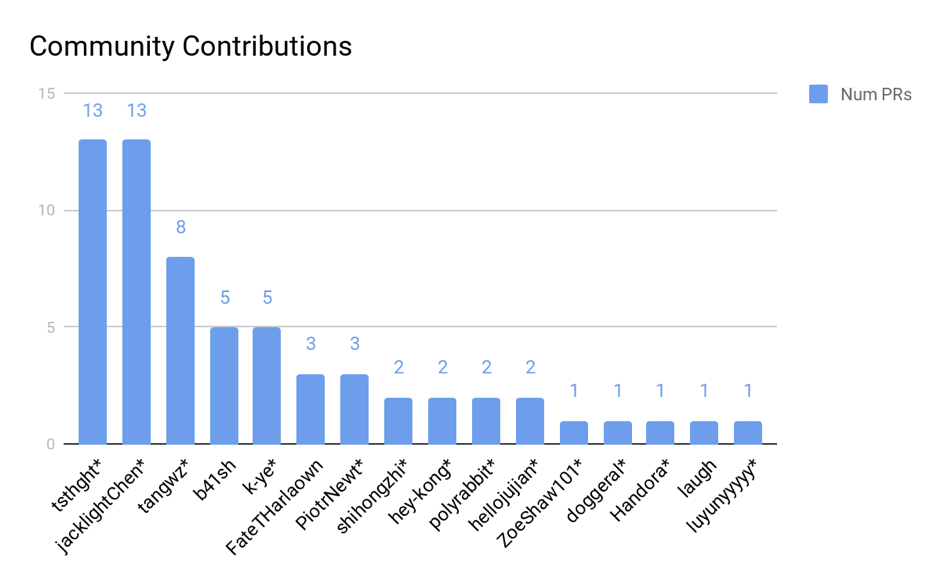

在 [上篇文章](https://pingcap.com/blog-cn/10mins-become-contributor-of-tidb-20190916/) 中，我们介绍了 TiDB 如何实现表达式的向量化优化，以及社区同学如何参与这项工程。两周过去了，我们收到了很多来自社区小伙伴们的建议和反馈，今天在这里和大家分享一下活动进展和这些建议及反馈。

## 活动进展

**先来看看这两周的活动进展吧。截至 9 月 30 日中午，所有 Issue 中需要向量化的函数签名总共有 517 个，目前已完成 89 个，占总体的 17%。其中绝大多数的函数签名向量化都是由社区开发者们完成的，感谢大家的贡献！**

各类型函数签名的完成度如下，我们通过这几个 Issue 来追踪向量化的工作进展，欢迎大家去里面挑选感兴趣的，还未被其他人认领的函数签名去实现：

* [Date/Time builtin functions](https://github.com/pingcap/tidb/issues/12101) (7/65)

* [Decimal builtin functions](https://github.com/pingcap/tidb/issues/12102) (7/31)

* [Int builtin functions](https://github.com/pingcap/tidb/issues/12103) (22/187)

* [JSON builtin functions](https://github.com/pingcap/tidb/issues/12104) (1/27)

* [Real builtin functions](https://github.com/pingcap/tidb/issues/12105) (28/49)

* [String builtin functions](https://github.com/pingcap/tidb/issues/12106) (19/113)

* [Duration builtin functions](https://github.com/pingcap/tidb/issues/12176) (5/45)

## FAQ

**Q1：前期开发过程中，PR 很容易和主干代码冲突，如何解决？**

A1：在前期的开发过程中，我们发现大家的 PR 冲突比较多，抱歉给大家的开发带来了不便。目前该问题已由 [PR/12395](https://github.com/pingcap/tidb/pull/12395) 解决。经过这个 PR 以后，所有表达式的开发接口和测试接口都被预先定义好了，避免了不同 PR 修改同一行代码造成频繁的冲突。大家后续开发时，可以直接修改这些预先定义好的接口的内部实现，参考：[PR/12400](https://github.com/pingcap/tidb/pull/12400)。

**Q2：如何让测试框架只测试某个具体函数签名？**

A2：我们在 [PR/12153](https://github.com/pingcap/tidb/pull/12153) 中，支持了以命令行变量的方式，如 -args "builtinLog10Sig"，让测试框架只跑被指定的函数，方便大家进行测试，更具体的使用方法请见此 PR 内的说明。

**Q3：如何计算结果向量的 Null Bitmap？**

A3：在 TiDB 中，我们使用一个 Bitmap 来标记 Column（也就是我们的“向量”） 中某个元素是否为 `NULL`，在向量化计算的函数中，经常会有如下处理 `NULL` 的需求：

```
for rowID := range rows {
    if child1.IsNull(rowID) || child2.IsNull(rowID) {
        col.SetNull(rowID)
        continue
    }
    // do something
}

```

上面的计算逻辑没有正确性问题，但是不够高效。在 [PR/12034](https://github.com/pingcap/tidb/pull/12034) 里面，我们为 Column 添加了一个 `MergeNulls()` 的接口，用于快速完成上面这段计算 NULL Bitmap 的过程。出于性能考虑，建议大家尽可能使用这一接口来计算结果向量的 NULL Bitmap，示例如下：

```
col.MergeNulls(child1, child2)
for rowID := range rows {
    if col.IsNull(rowID) {
        continue
    }
    // do something
}
```

## 开发者社区

如上面所说，在表达式向量化优化过程中的代码绝大多数都是由社区开发者们贡献的，具体来说是以下 Contributor（按照 PR 数排序，“*” 表示这次活动中新晋的 TiDB Contributor）：



再次感谢社区伙伴们的大力支持！也恭喜新晋 Contributor，当然 TiDB Contributor 专属马克杯也已经准备好啦，社区运营小姐姐将会统一邮寄给大家，敬请期待！

在 TiDB 的 Expression Package 上，下面几位同学的 PR 贡献数已经超过了 8 个（包括向量化相关的 PR），达到了 Active Contributor 的要求，他们分别是：[jacklightChen](https://github.com/jacklightChen)，[tsthght](https://github.com/tsthght)，[tangwz](https://github.com/tangwz) 和 [b41sh](https://github.com/b41sh)，也恭喜他们！

成为 Active Contributor 之后，如果继续为 Expression Package 贡献 PR，且合并的 PR 数量超过 20 个，就有机会获得提名成为 Expression Package [Reviewer](https://github.com/pingcap/community/blob/master/special-interest-groups/sig-exec/roles-and-organization-management.md#from-active-contributor-to-reviewer)。Expression Package 的 Reviewer 在技术上受到社区认可，其对 PR 的 review comments 具有技术公信力，可以和 TiDB 工程师一起 Review Expression 包的 PR，并拥有点赞的权限，当然还拥有持续发展成 TiDB Committer 的机会！

## 未来工作

[上篇文章](https://mp.weixin.qq.com/s/aJEwU8xGiruIIn0niWvgIg) 中提到，我们成立了 [Vectorized Expression Working Group](https://github.com/pingcap/community/blob/master/working-groups/wg-vec-expr.md)，并在 slack - [tidbcommunity](https://pingcap.com/tidbslack) 中开放了 #wg-vec-expr 的公共 channel 供大家讨论问题，欢迎感兴趣的同学参与进来一起讨论表达式计算的向量化优化。目前表达式向量化重构的工作还在继续，欢迎各位新老 Contributor 持续的参与这项工程。

此外，我们后续会优化升级 Community Organizer 组织架构，除了现在 Working Group 的组织以外，还会新增 Special Interest Group（简称 SIG)，负责专门维护和开发 TiDB 中某些具体模块，并将在国庆节后成立 Expression 的 SIG。届时将邀请 Expression Package 中 Active Contributor 及以上角色的同学参加。我们会在 Expression SIG 中为社区同学提供详尽的辅导，帮助 SIG 中的同学在提升自我，满足自己兴趣的同时，持续为 TiDB 贡献代码，和 TiDB 一起成长，敬请期待！
