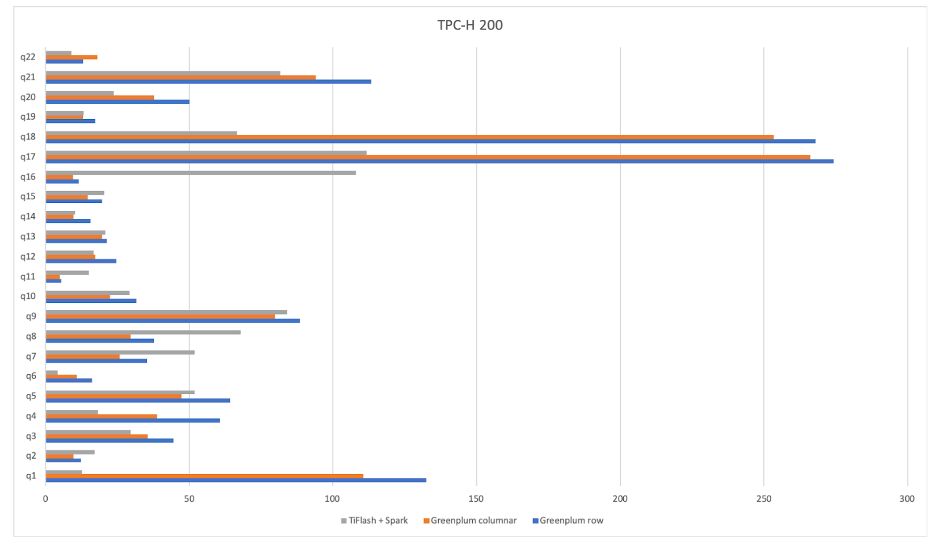
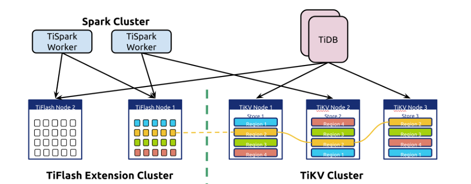
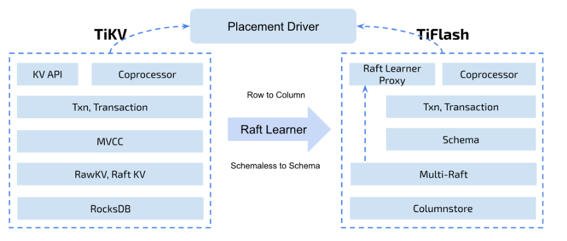

---  
title: 一两个节点、一两条命令，轻松让 TiDB 分析场景无痛提速十倍
author: ['马晓宇']
date: 2020-02-05
summary:  TiDB 3.1 推出的 TiFlash 产品，可以让你的 AP 查询提升数倍，不需要复杂的操作，无需多少节点，轻轻松松。
tags: ['TiFlash']
---  

## 讲个故事

某天，老板让你分省统计口罩最近的订货数据，以快速决策需要向哪里调货。你发起查询，全部订单数据多达数亿甚至更多，TiDB 不得不花费一小段时间。由于存储节点在全力计算，你的集群波动的监控哔哔作响，主站的订单提交也一下子变得慢起来。倒了杯咖啡回来，你得到了结果。老板站在你身后，声音低沉而有磁性：“能否更快一点？”

请架构师吃了顿饭，她向你推荐将数据从线上导出到 Hadoop 或者分析型数据库，用列存格式存储，这样就可以大大提速。码农们加班加点，将 ETL 作业架设起来。你惊喜地发现，查询快了很多！

你兴奋地跟老板说：“我们的分析已经变快了，也不会影响在线业务，您可以放心提要求。”

“干得好！马上告诉我过去 48 小时上海板蓝根的销量。”

“啊？我们只能查一天前的数据……”

**所以，你需要更快：接入业务更快，数据到达更快，查询也需要更快。**

## 一两个节点，一两条命令，数倍提速

**即将随着 TiDB 3.1 推出的 TiFlash 产品，可以让你的 AP 查询提升数倍，不需要复杂的操作，无需多少节点，轻轻松松。只要将集群升级到 TiDB 3.1+，然后执行如下两条命令：**

```
./run_tiflash.sh
mysql> ALTER TABLE orders SET TIFLASH REPLICA 1;
```

然后再发起查询查询，对比一下，体验数倍甚至十几倍的提速。没有互相干扰，数据永远保持最新（而不仅仅是新鲜），TiDB 会自动或者按照用户意愿选取行存或列存。

**TiDB 加入了对 TiFlash 的读取支持同时，也将列存纳入优化器代价估算中。这意味着，作为用户，你可以无需选择使用 TiKV 还是 TiFlash 进行查询，可以简单丢给优化器完成；另一方面，如果你有业务隔离的需求，也可以简单执行如下命令强制隔离：**

```
set @@session.tidb_isolation_read_engines = "tiflash";
```

## 有多快？

放两个用户的实际案例，SQL 是经过脱敏的，但是不会影响实际执行时间。事实上，我们也建议你用自己的真实场景进行测试，而非某种 Benchmark。

测试使用如下三节点的 TiFlash 和 TiKV 进行对比：

CPU: 40 Cores, Intel(R) Xeon(R) CPU E5-2630 v4 @ 2.20GHz @ 1268.383 MHz

Mem: 188G @ 2133 MHz

OS: centos-release-7-6.1810.2.el7.centos.x86_64

Disk: NVME SSD

### 查询 1

```sql
SELECT code, COUNT(DISTINCT order_id) FROM shipping_order 
WHERE ( prod_id in ( 'T1', 'C4', 'Z1', 'F15', 'C21', 'D01' ) ) AND cannel_shipping = 'N' AND drop_order = 'N' AND order_type = '01' AND vip_flag = 'N' AND TIMESTAMPDIFF(HOUR, create_time, NOW()) > 2 AND DW_is_enabled = 1 
GROUP BY prod_id;
```

其中 `shipping_order` 表为 100 列，6 千万行的送货单表。查询使用 TiDB。这是一个典型的销售订单多维分析统计（聚合类）查询。

| Engine | Time |
|:---|:---|
| TiKV | 30.91 sec |
| TiFlash | 1.94 sec |

使用 TiFlash 查询提速接近 16 倍。单表的统计聚合是最能体现 TiFlash 引擎加速效果的场景。借助高效的向量化引擎以及列存，计算可以完全下推到 TiFlash 进行，加速效果爆炸。

### 查询 2

其中 `shipping_order_detail` 表为 50 列，1 亿行的送货明细表。查询使用 TiDB。这是一个典型的销售订单关联后再多维分析统计查询（表连接+聚合）。

```sql
SELECT prod_code, prod_name, SUM(sales_qty)
FROM shipping_order a JOIN shipping_order_detail b
ON a.order_no = b.shipping_order_no AND a.prod_id = b.prod_id 
WHERE a.cannel_shipping = 'N' AND
a.drop_order = 'N' AND a.shipping_order_type = '01' AND
a.discount_is_enabled = 1 AND b.discount_is_enabled = 1 AND a.prod_id in ('C003') AND
a.order_time >= '2019-11-18 00:00:00.0' AND 
b.ts >= '2019-11-18 00:00:00.0' 
GROUP BY prod_code, prod_name 
ORDER BY SUM(qty_ordered) DESC LIMIT 10;
```

| Engine | Time |
|:---|:---|
| TiDB + TiKV | 23.74 sec |
| TiDB + TiFlash | 3.90 sec |

这个场景下，使用 TiFlash 查询提速 6 倍多。哪怕表连接仍需在 TiDB 中进行，但是批量扫表仍然可以体验到明显的加速。

以上均为用户测试场景。该用户实际测试场景在维度无法建立索引的情况下，几乎都可以观测到 2 至 10 倍以上的加速。须知，你在多维分析场景下，往往无法为很多维度建立索引。


### 对比 Greenplum

那么对比 Greenplum，TiFlash 配合分布式计算引擎 TiSpark 又能达到什么样的速度呢？



测试使用了 TPC-H 标准测试，横轴为运行时间（越短越好），灰色是 TiFlash + TiSpark，蓝色为 Greenplum 行存，橙色为 Greenplum 列存。

可以看到，TiFlash + TiSpark 在做到无缝镜像的同时，能取得和 Greenplum 近似甚至更快的速度。

## 除了速度之外，还有何特点？

### 简化技术栈

TiFlash 并不是另一个系统，也无需维护复杂的数据搬运，无需考虑数据的新老和一致性。TiFlash 可以近似看做是一种特殊的 TiKV 节点，它可以一样地通过 Mult-Raft 和 PD 调度无缝扩展，提供对等的协处理器读取服务，只是它在分析查询场景下更快。

### 新鲜且一致的数据

你仍然享有最新的数据，而不用像做 ETL 搬运那样，在搬运周期之间只能读取老的数据。读取也总可以捕捉最新的数据（而不仅仅是新鲜数据）：你总是可以保证读到刚写下去的数据，但也不会捕获未完成的事务。TiFlash 提供了和 TiKV 一样的一致性和事务隔离级别。

### 隔离

关闭 TiDB 自动选择，或者用 TiSpark 开启 TiFlash 模式，那么你是在使用 TiFlash 的 HTAP 模式。简单说，你不希望某些大型分析查询干扰任何正在运行的其他业务，用 TiFlash 你可以很容易做到，仅仅是一个开关配置的问题。这种模式下，你可以放心地对在线数据进行分析，随时观察业务的最新走向，而不用担心业务是否受到影响。

### 智能

关闭隔离设定，你可以让 TiDB 自主选择。如果你的业务对隔离要求不敏感，你只是希望很简单地让 TiDB 以它判断下最快的方式访问表，可以走行存 + 索引，也可以走列存，你完全不想操心，那你可以依靠 TiDB 使用统计信息进行自动选择。这个设计并不神秘，选择 TiFlash 副本的过程和在不同索引之间做选择没什么差别。

## 说正经的，TiFlash 是什么？

TiFlash 是一种特殊的存储节点：

* 它提供了对 TiDB 的加速功能；
* 它继承了 TiDB 存储架构的无缝扩展性；
* 它可以在不影响正常在线业务的同时，将数据转存为列存并提供查询；
* 并且这个转存，除了格式和访问速度不同，对用户来说是完全一样的镜像。

一直以来，TiDB 作为 HTAP 数据库存在两个大缺憾：使用行存格式很难快速响应大型分析查询；进行 AP 查询会影响 TP 业务稳定。其实这不只是 TiDB 的缺憾，也是业界面临的两个很难调和的设计矛盾。

* 存储格式的矛盾

  列存保存时会拆列和压缩，对于点查类访问带来了很大困难，你需要将散落在不同磁盘位置的列数据分别读取再拼接起来。但是列存对于分析查询却是非常高效的：它可以仅仅读取查询选中的列，并且列存格式也天然契合向量化加速引擎，因此它也成为了分析场景的推荐格式。如何调和这样的矛盾？

* 分析和交易无法稳定共存的矛盾

  分析查询往往耗时更长，单次查询访问的数据量比在线交易业务类大得多。分析引擎设计上倾向于同时将大量资源投入同一个查询，以做到尽快响应。但是一旦这么做了，在线业务资源将受到挤占，造成巨大抖动。

**为了解决这个问题，业界最常见的做法是，将数据导出到其他平台用列存转储，比如 Hadoop + Parquet，或者分析型数据库如 Greenplum 等，这样用户可以同时解决隔离以及查询性能问题。但是代价却是，引入了复杂的架构，需要维护数据迁移和 ETL 作业，并且数据无法实时，导出也可能无法保证一致性。**

**TiFlash 是为了解决这个痛点而设计的产品。它是一款支持更新的列存引擎，在实时镜像行存数据的同时，提供数倍乃至数十倍以上的对行存的访问加速。它可以使用独立节点，以完全隔绝两种业务之间的互相影响。它部分基于 Clickhouse，继承了 Clickhouse 优秀的向量化计算引擎。**

架构上，TiFlash 是一个提供与 TiKV 类似功能的存储层模块，它使用 [Raft Learner](https://etcd.io/docs/v3.3.12/learning/learner/) 进行数据传输并转存为列存。这意味着，TiFlash 节点的状态和延迟，不会影响 TiKV 的运行，哪怕 TiFlash 节点崩溃，TiKV 也能毫无影响地运行；另一方面也可以提供最新（线性一致 + 快照隔离），和 TiKV 一致的数据。





## 何不试试看？

你可以使用一两台现成的机器进行测试，简单一两条命令，上线 TiFlash 节点，添加列存副本，等副本同步完成之后就可以看到效果，绿色无害。何不试试看呢？

**TiFlash 已经在进行第一轮用户测试，并在 2 到 3 月间会开启开放公测，请关注后续信息，也欢迎联系询问提前体验：maxiaoyu@pingcap.com。**