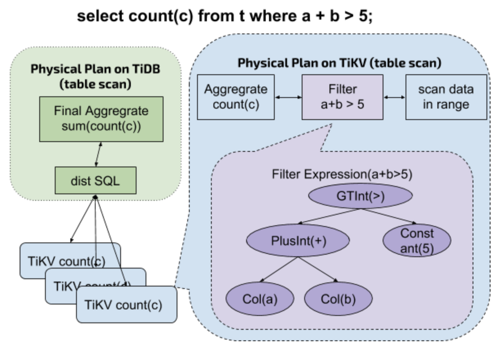

## 背景知识

SQL 语句发送到 TiDB 后经过 parser 生成 AST（抽象语法树），再经过 Query Optimizer 生成执行计划，执行计划切分成很多子任务，这些子任务以表达式的方式最后下推到底层的各个 TiKV 来执行。



<div class="caption-center">图 1</div>

如图 1，当 TiDB 收到来自客户端的查询请求

`select count(*) from t where a + b > 5`

时，执行顺序如下：

1. TiDB 对 SQL 进行解析，组织成对应的表达式，下推给 TiKV

2. TiKV 收到请求后，循环以下过程

	* 获取下一行完整数据，并按列解析

	* 使用参数中的 where 表达式对数据进行过滤

	* 若上一条件符合，进行聚合计算

3. TiKV 向 TiDB 返回聚合计算结果

4. TiDB 对所有涉及的结果进行二次聚合，返回给客户端

这里的 where 条件便是以表达式树的形式下推给 TiKV。在此之前 TiDB 只会向 TiKV 下推一小部分简单的表达式，比如取出某一个列的某个数据类型的值，简单数据类型的比较操作，算术运算等。为了充分利用分布式集群的资源，进一步提升 SQL 在整个集群的执行速度，我们需要将更多种类的表达式下推到 TiKV 来运行，其中的一大类就是 MySQL built-in 函数。

目前，由于 TiKV 的 built-in 函数尚未全部实现，对于无法下推的表达式，TiDB 只能自行解决。这无疑将成为提升 TiDB 速度的最大绊脚石。好消息是，TiKV 在实现 built-in 函数时，可以直接参考 TiDB 的对应函数逻辑（顺便可以帮 TiDB 找找 Bug），为我们减少了不少工作量。

**Built-in 函数无疑是 TiDB 和 TiKV 成长道路上不可替代的一步，如此艰巨又庞大的任务，我们需要广大社区朋友们的支持与鼓励。亲爱的朋友们，想玩 Rust 吗？想给 TiKV 提 PR 吗？想帮助 TiDB 跑得更快吗？动动您的小手指，拿 PR 来砸我们吧。您的 PR 一旦被采用，将会有小惊喜哦。**

## 手把手教你实现 built-in 函数

### Step 1：准备下推函数

在 TiKV 的 [https://github.com/tikv/tikv/issues/3275](https://github.com/tikv/tikv/issues/3275) issue 中，找到未实现的函数签名列表，选一个您想要实现的函数。

### Step 2：获取 TiDB 中可参考的逻辑实现

在 TiDB 的 [expression](https://github.com/pingcap/tidb/tree/master/expression) 目录下查找相关 builtinXXXSig 对象，这里 XXX 为您要实现的函数签名，本例中以 [MultiplyIntUnsigned](https://github.com/tikv/tikv/pull/3277) 为例，可以在 TiDB 中找到其对应的函数签名（`builtinArithmeticMultiplyIntUnsignedSig`）及 [实现](https://github.com/pingcap/tidb/blob/master/expression/builtin_arithmetic.go#L532)。

### Step 3：确定函数定义

1. built-in 函数所在的文件名要求与 TiDB 的名称对应，如 TiDB 中，[expression](https://github.com/pingcap/tidb/tree/master/expression) 目录下的下推文件统一以 builtin_XXX 命名，对应到 TiKV 这边，就是 `builtin_XXX.rs`。若同名对应的文件不存在，则需要自行在同级目录下新建。对于本例，当前函数存放于 TiDB 的 [builtin_arithmetic.go](https://github.com/pingcap/tidb/blob/master/expression/builtin_arithmetic.go#L532) 文件里，对应到 TiKV 便是存放在 [builtin_arithmetic.rs](https://github.com/tikv/tikv/blob/master/components/tidb_query/src/expr/builtin_arithmetic.rs) 中。

2. 函数名称：函数签名转为 Rust 的函数名称规范，这里 `MultiplyIntUnsigned` 将会被定义为 `multiply_int_unsigned`。

3. 函数返回值，可以参考 TiDB 中实现的 `Eval` 函数，对应关系如下：

    | TiDB 对应实现的 Eval 函数 | TiKV 对应函数的返回值类型 |
    | ----------------------- | ---------------------- |
    | `evalInt` | `Result<Option<i64>>` |
    | `evalReal` | `Result<Option<f64>>` |
    | `evalString` | `Result<Option<Cow<'a, [u8]>>>` |
    | `evalDecimal` | `Result<Option<Cow<'a, Decimal>>>` |
    | `evalTime` | `Result<Option<Cow<'a, Time>>>` |
    | `evalDuration` | `Result<Option<Cow<'a, Duration>>>`|
    | `evalJSON` | `Result<Option<Cow<'a, Json>>>`|

    可以看到 TiDB 的 `builtinArithmeticMultiplyIntUnsignedSig`  对象实现了 evalInt 方法，故当前函数（`multiply_int_unsigned`）的返回类型应该为 `Result<Option<i64>>`。

4. 函数的参数, 所有 builtin-in 的参数都与 Expression 的 `eval` 函数一致，即：

	* 环境配置量 (ctx:&StatementContext)

	* 该行数据每列具体值 (row:&[Datum])

综上，`multiply_int_unsigned` 的下推函数定义为：

```
    pub fn multiply_int_unsigned(
       &self,
       ctx: &mut EvalContext,
       row: &[Datum],
   ) -> Result<Option<i64>>
```  


### Step 4：实现函数逻辑

这一块相对简单，直接对照 TiDB 的相关逻辑实现即可。这里，我们可以看到 TiDB 的 `builtinArithmeticMultiplyIntUnsignedSig` 的具体实现如下：

```
func (s *builtinArithmeticMultiplyIntUnsignedSig) evalInt(row types.Row) (val int64, isNull bool, err error) {
  a, isNull, err := s.args[0].EvalInt(s.ctx, row)
  if isNull || err != nil {
     return 0, isNull, errors.Trace(err)
  }
  unsignedA := uint64(a)
  b, isNull, err := s.args[1].EvalInt(s.ctx, row)
  if isNull || err != nil {
     return 0, isNull, errors.Trace(err)
  }
  unsignedB := uint64(b)
  result := unsignedA * unsignedB
  if unsignedA != 0 && result/unsignedA != unsignedB {
     return 0, true, types.ErrOverflow.GenByArgs("BIGINT UNSIGNED", fmt.Sprintf("(%s * %s)", s.args[0].String(), s.args[1].String()))
  }
  return int64(result), false, nil
}
```

参考以上代码，翻译到 TiKV 即可，如下：

```
 pub fn multiply_int_unsigned(
       &self,
       ctx: &mut EvalContext,
       row: &[Datum],
   ) -> Result<Option<i64>> {
       let lhs = try_opt!(self.children[0].eval_int(ctx, row));
       let rhs = try_opt!(self.children[1].eval_int(ctx, row));
       let res = (lhs as u64).checked_mul(rhs as u64).map(|t| t as i64);
       // TODO: output expression in error when column's name pushed down.
       res.ok_or_else(|| Error::overflow("BIGINT UNSIGNED", &format!("({} * {})", lhs, rhs)))
           .map(Some)
   }
```

### Step 5：添加参数检查

TiKV 在收到下推请求时，首先会对所有的表达式进行检查，表达式的参数个数检查就在这一步进行。

TiDB 中对每个 built-in 函数的参数个数有严格的限制，这一部分检查可参考 TiDB 同目录下 builtin.go 相关代码。

在 TiKV 同级目录的 `scalar_function.rs` 文件里，找到 ScalarFunc 的 `check_args` 函数，按照现有的模式，加入参数个数的检查即可。

### Step 6：添加下推支持

TiKV 在对一行数据执行具体的 expression 时，会调用 `eval` 函数，`eval` 函数又会根据具体的返回类型，执行具体的子函数。这一部分工作在 `scalar_function.rs` 中以宏（dispatch_call）的形式完成。

对于 `MultiplyIntUnsigned`, 我们最终返回的数据类型为 Int，所以可以在 dispatch_call 中找到 `INT_CALLS`，然后照着加入 `MultiplyIntUnsigned => multiply_int_unsigned` , 表示当解析到函数签名 `MultiplyIntUnsigned` 时，调用上述已实现的函数 `multiply_int_unsigned`。

至此 `MultiplyIntUnsigned` 下推逻辑已完全实现。

### Step 7：添加测试

在函数 `multiply_int_unsigned` 所在文件 [builtin_arithmetic.rs](https://github.com/tikv/tikv/blob/master/components/tidb_query/src/expr/builtin_arithmetic.rs) 底部的 test 模块中加入对该函数签名的单元测试，要求覆盖到上述添加的所有代码，这一部分也可以参考 TiDB 中相关的测试代码。本例在 TiKV 中实现的测试代码如下：

```
    #[test]
   fn test_multiply_int_unsigned() {
       let cases = vec![
           (Datum::I64(1), Datum::I64(2), Datum::U64(2)),
           (
               Datum::I64(i64::MIN),
               Datum::I64(1),
               Datum::U64(i64::MIN as u64),
           ),
           (
               Datum::I64(i64::MAX),
               Datum::I64(1),
               Datum::U64(i64::MAX as u64),
           ),
           (Datum::U64(u64::MAX), Datum::I64(1), Datum::U64(u64::MAX)),
       ];
       let mut ctx = EvalContext::default();
       for (left, right, exp) in cases {
           let lhs = datum_expr(left);
           let rhs = datum_expr(right);
           let mut op = Expression::build(
               &mut ctx,
               scalar_func_expr(ScalarFuncSig::MultiplyIntUnsigned, &[lhs, rhs]),
           ).unwrap();
           op.mut_tp().set_flag(types::UNSIGNED_FLAG as u32);
           let got = op.eval(&mut ctx, &[]).unwrap();
           assert_eq!(got, exp);
       }
       // test overflow
       let cases = vec![
           (Datum::I64(-1), Datum::I64(2)),
           (Datum::I64(i64::MAX), Datum::I64(i64::MAX)),
           (Datum::I64(i64::MIN), Datum::I64(i64::MIN)),
       ];
       for (left, right) in cases {
           let lhs = datum_expr(left);
           let rhs = datum_expr(right);
           let mut op = Expression::build(
               &mut ctx,
               scalar_func_expr(ScalarFuncSig::MultiplyIntUnsigned, &[lhs, rhs]),
           ).unwrap();
           op.mut_tp().set_flag(types::UNSIGNED_FLAG as u32);
           let got = op.eval(&mut ctx, &[]).unwrap_err();
           assert!(check_overflow(got).is_ok());
       }
   }
```

### Step 8：运行测试

运行 make expression，确保所有的 test case 都能跑过。

完成以上几个步骤之后，就可以给 TiKV 项目提 PR 啦。想要了解提 PR 的基础知识，尝试移步 [此文](https://pingcap.com/blog-cn/how-to-contribute/)，看看是否有帮助。