>本文为今年年初 PingCAP 商业产品团队负责人刘寅在 TiDB DevCon2018 上分享的 《 TiDB 工具链和生态》实录内容，文内详细介绍了 TiDB 的周边工具以及生态系统。Enjoy～

大家下午好，我叫刘寅。在 PingCAP 主要负责 TiDB 商业工具产品开发，也在做公司 SRE 方面的事情。今天下午我分享的主题是介绍下 TiDB 的周边工具以及生态系统。

今天要讲的内容主要包含这几方面，首先是关于 TiDB 的部署，这是很多使用 TiDB 的用户首先关心的事情。接下来会介绍 TiDB 的数据导入工具和数据迁移同步工具，以及管理配置，数据可视化相关的工具。

TiDB 的架构可能大家都比较清楚了。TiDB 是一个由若干模块组成的分布式系统。这些模块相互依赖协调工作组成一个集群，整体构成了 TiDB 数据库。这样一个架构，对于用户进行部署和运维，其复杂程度相对单机数据库比如 MySQL 来说不那么容易的事情。那让我们来看看如何快速部署一套 TiDB 集群实例。最近我们公开了一个项目( [https://github.com/pingcap/tidb-docker-compose](https://github.com/pingcap/tidb-docker-compose) )，这令我们在一个本地的开发和测试环境上跑一套 TiDB 变得非常简单。只需要用一个命令 `docker compose up` 就能快速启动起来。docker-compose 是 Docker 生态中的一个非常便利的工具，它可以在本机方便的把 TiDB 的各个组件，包括它的监控，可视化工具，全部整合在一个 yaml 文件来描述，非常的方便。不仅可以通过我们官方 docker image 镜像启动，也可以支持从本地的 binary 启动。比如当我本机编译了一个特殊版本的 binary，我就可以直接构建本地镜像来启动，甚至还可以支持现场编译源码来启动。所以这对于我们自己开发和测试也是非常方便的。另外我们也做了一个很简化的配置文件，比如我不希望默认跑 3 个 TiKV，我想启 5 个或者更多，简单的改下配置就可以搞定。

对于生产环境的部署和运维，往往面对的是一个成规模的集群，docker-compose 的部署方式就不够了。我们建议采用提供的 Ansible 部署方式。用户首先在一个 Inventory 文件中描述和编排所需的 TiDB 集群拓扑，然后执行我们提供的 ansible-playbook 脚本，就可以快速部署和运维一个生产环境下的 TiDB 集群。我们现在很多的线上用户，也是用了这样的部署方式。

TiDB Ansible 不仅实现在裸机上部署集群，同时也支持 Cloud 的部署方式。比如说用 Ansible 提供的组件，我们可以基于 AWS / Azure / GCP 上一键创建 TiDB 的集群，而将来也会支持国内的公有云平台。其次可以根据用户需求，定制集群的拓扑。这个比较细，也会包含 TiDB 的一些周边工具的部署，比如说 TiDB Binlog 组件。第三，它提供一个配置管理的功能，包括 TiDB、TiKV 很多的参数配置。我们也集成进去，可以在一个地方统一管理整个集群的配置。除此之外，我们对运维操作的执行脚本做了一系列的优化。这样对于在部署一个规模庞大的集群会变得及其方便。另外这里顺便还要提一下，我们在 Ansible 部署过程中，我们会对硬件和系统环境做一个严格的检查。可能有些用户出于测试的目的，使用较低速的机械硬盘，而达不到跑 TiDB 的最低要求。所以这里，我们会有限定要求，会在安装过程中交互提示出来。

TiDB 作为一个可以弹性水平扩展的分布式数据库，天生为云而设计，从初期我们就和容器走的非常近。容器的优势，相信大家都非常了解。首先，它提供了一致化的环境，用户不需要去适应各种不同的系统环境，而分别构建运行时 Binary。另外容器的启动运行非常方便，可以很快速的在开发环境运行或者生产环境部署。另外容器提供了资源隔离的特性，通过 Namespace 和 CGroups 这些现代操作系统提供的能力，来实现容器内部和外部的资源隔离和限制。

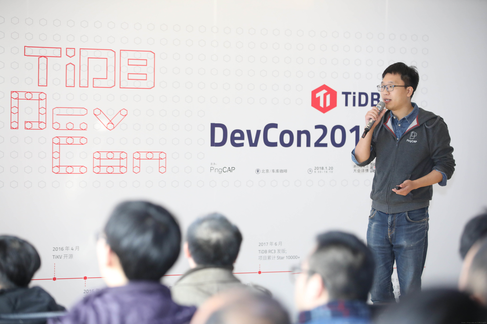

说到容器就不得不提容器编排，TiDB 在与 K8s 的整合方面我们做了非常多的事情。比如在 K8s 之上实现对 TiDB 集群的自动化管理，快速部署、扩缩容、以及故障的自动愈合。同时更好的支持云平台下的多租户管理，通过限制单个租户的资源的使用，利用容器完成隔离。来保证租户之间不会相互影响。不至于说一个用户执行高负载的查询或者写入，对同一台宿主机上的其他用户实例造成影响。然而 TiDB 存储本身是有状态的，在 K8s 上部署的时候，如何管理好有状态的服务，并且保证存储的 iops 和延迟方面苛刻的要求，同时还要保证服务的高可用性就成为一个难题。

如果采用 K8s 提供的 native 存储解决方案，外挂 PV，也就是挂网络存储。但是这样对于数据库系统来说，尤其是大量的随机读和顺序写的场景下，网络盘的性能是达不到要求的。所以说从最开始我们设计 TiDB 上云解决方案，其实主要就是探索 K8s 的本地 PV 解决方案。当然现在 K8s 1.9 已经开始对 Local PV 有一定支持，而我们在 1.7 的时候就实现了一个 Local Storage Manager。我们现在做的一些工作，也逐渐在和社区 K8s 主版本进行整合。另外 TiDB 本身是一个复杂集群，除了存储还有网络，以及周边工具的管理都需要考虑。为了实现将专业领域的运维管理变的更加自动化，我们造了 **TiDB Operator**。Operator 这个 pattern 其实是最初借鉴 CoreOS 的 Etcd Operator。TiDB Operator 就是降低 TiDB 部署和运维的复杂度，实现自动化的扩缩容和故障转移。同时 Operator 在 K8s 上同时管理多套 TiDB 集群，像在腾讯云和 UCloud 两个公有云上，就是用这种方式来实现多租户统一化管理。我们实现的 Local PV 管理机制，实质上是对集群中所有本地磁盘的统一管理，并赋予他们生命周期，从而作为 K8s 中的一类资源参与调度。同时新版本 K8s 的趋势上，在往云上的操作系统方向上发展，自身的资源以及 API 变的更加开放。我们不需要去改动 K8s 本身的代码，而是去做更好的扩展，来实现满足自己的调度功能。比如说我们利用 K8s 亲和性的特点，让同种类型的服务运行在同一台物理机上，更充分的利用硬件资源。再比如说 PD 和 TiKV 这两种服务，你不能在一起混部使用同一块 SSD，否则 IO 会相互影响。所以我们利用反亲和的特性，让 PD 和 TiKV 调度的时候尽量分开。另外再举一个调度的例子，TiDB 集群本身是支持区分节点的地域属性的，PD 根据地域属性来实现数据层面的调度，并且尽量保证同一份数据的多个副本尽可能按地域分散开。那么 K8s 部署 TiDB 节点的时候，也需要考虑地域特征来进行调度。比如按照跨 Region、跨可用区将一个集群的节点分散部署，并且把地域的信息传递给 TiKV 和 PD，使数据副本尽量分散。而这个知识本身 K8s 是不具备的，我们需要扩展 K8s 的调度器把经验和原则传递进去。

Operator 包含一些 TiDB 扩展的 Controller 和 Scheduler，但还不够，我们需要在上面包装一层，以暴露出来统一的运维和管理接口，这就是 Cloud Manager。Cloud Manager 对外暴露标准化的接口，用于和云平台的前端控制台对接，这样就通过前台可以完成 K8s 以及 TiDB 集群的相关资源的综合管理。

DBaaS 结构图可以看到 Cloud TiDB 的分层架构。最下层是容器云，中间一层是 K8s 自身的服务管理和 API Server。我们在此基础上进行扩展，实现各种 Controller 和调度器，自己本地存储管理 Volume Manager，最终通过 Cloud Manager 提供的 RESTful API 进行暴露。可以很容易接一个前端的 Dashboard，或者直接使用 CLI 命令行工具，完成 TiDB 集群实例的统一化管理。

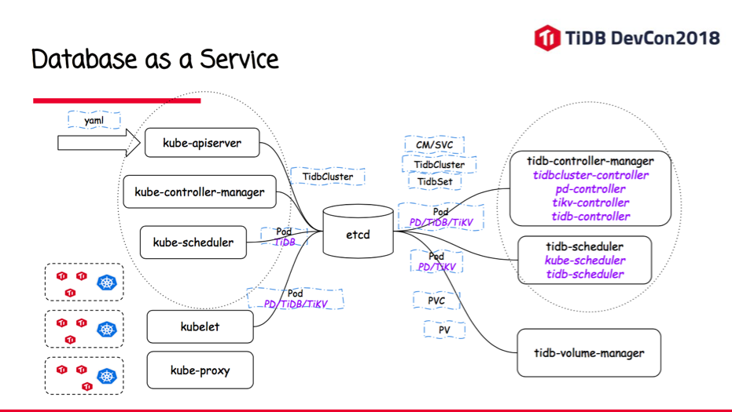

这个图就是前面讲的一些细节。这里面可以看到，左半边是 Kube 本身的组件，右侧是我们的扩展出来组件，另外，我们也自己定义了一些 TiDB 的资源类型放在 CDR 里面。比如说 TiDB Cluster，在这个资源对象上可以描述要启动多少个 TiKV，多少个 TiDB。另外还有 TiDB Set / TiKV Set / PD Set 等一系列对象，来分别描述某个服务的配置。

这是在腾讯云上面的一个截图，

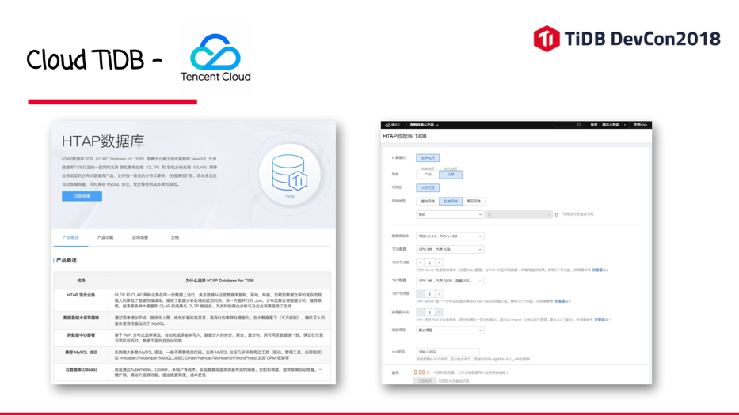

这是 UCloud 的截图，

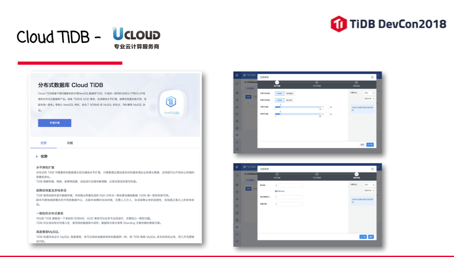

现在这两个产品都在公测，有兴趣的同学可以关注一下。

此外，我们提供了 Operator Chart 的安装方式，使用 Helm 工具可以一键通过 Operator 拉起来一套 TiDB 实例。

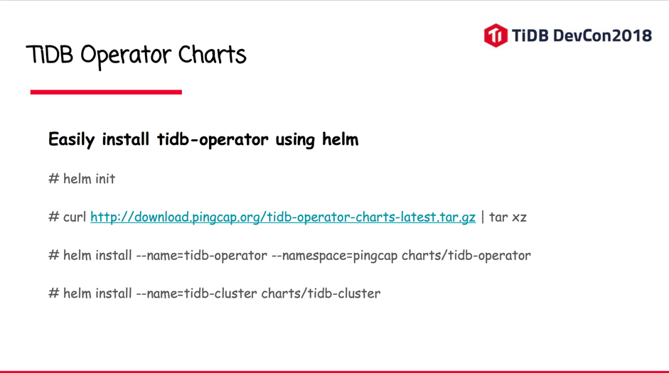

这种方式在 K8s 上就更像是一个 RPM 包的方式部署服务，并且管理服务之间依赖。只需要一行命令，就可以获得到官方的 Cloud TiDB 的核心组件。如果你有一个 K8s 集群，或者你在使用一个公有云提供的 K8s 集群，用上面的命令，就可以快速运行 TiDB Operator 和 TiDB 集群。

这是一个配置的例子，打开 charts 压缩包可以找到对应的配置 yaml 文件。

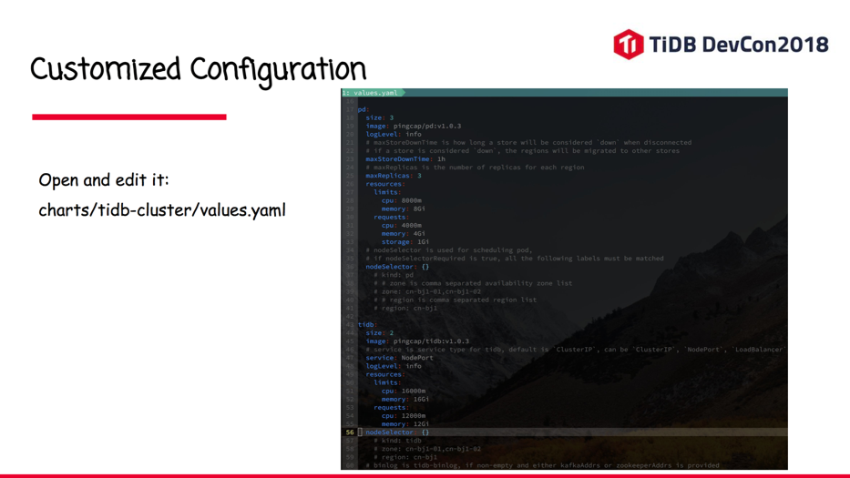

我们对每一行的配置做了详细的注释。比如可以设定一些参数：像副本数、CPU 内存使用限制、TiDB 起多少个、TiKV 起多少个，等等。

**部署工具就先介绍这么多。下一部分，我们开始介绍一下 TiDB 周边的工具，其实这里面有一些大家已经接触和使用过了。**

首先是 Syncer，这个小工具在很多生产环境上已经用起来了。它是一个 MySQL 到 TiDB 间的实时同步工具。原理很简单，就是把自己伪装成一个 MySQL 的 Slave 库，从上游 MySQL 里面把 binlog 实时 dump 出来，并且还原成 SQL 到下游（TiDB）回放。

这里我们支持简单的规则过滤，也支持分库分表的合并。我们也可以同时跑多个 Syncer 把多个上游 MySQL，按库同步到一个大的 TiDB 集群。**Syncer 的主要一些特性，首先是要支持按 GTID 同步。**GTID 是什么？它是 MySQL 自身的 replication 机制提供的一种特性。MySQL 主从同步最早是以 binlog pos（文件名+offset）来描述同步位置，但这个设计有明显的缺陷，比如说这样一个场景，最初是 1 个 Master 带 2 个 Slaves，当 Master 挂了这时需要把一个 Slave 升级为 Master，另一个 Slave 从新 Master 继续同步。但这样就要保证，新的 Master 和旧 Master 的 binlog pos 能接续上，但是 MySQL 不同实例的 binlog 记录方式是不同的，因此必须有一个全局唯一 ID 来和 binlog 对应上，这就是 GTID。在 MySQL 5.6 之后 GTID 支持的就比较好了，生产环境大多是开启了这种方式。Syncer 除了支持按 pos 同步，也支持 GTID。Syncer 从公有云的 RDS 同步支持的都比较好，比如像阿里云、腾讯云我们测的也比较多，因为云平台后端机器故障或者维护，主从切换比较频繁，而且 Virtual IP 还保持不变对用户无感知，所以假如 Syncer 不能很好支持 GTID 的话那切一次主从数据就会不一致了。**第二是分库分表合并。**不管上游库是按库拆，按表拆，甚至混合拆分，Syncer 都能很好支持，通过配置文件描述出来。另外还有同步性能的问题，因为 binlog 是一个单向数据流，我们同步的时候如果是单线程来做虽然比较简单，但性能可能很差。使用多线程，就必须区分对同一行数据操作的因果顺序，没有关联关系的行可以并行执行，有关联的行只能顺序执行。对于 MySQL 每一个 binlog event 都是一个事务，他里面会包含对不同表，不同行的多次操作。所以 Syncer 会对事务进行拆分，然后并行执行。这样的代价是 Syncer 不保证按上游的事务原子性来同步，但最终一致性没有问题。Syncer 也支持一些简单的过滤规则，可以选择指定库或者表同步，也可以做排除。另外也支持一些简单的表名映射变换。

在一个公司初期，可能业务铺的比较快，每块业务用一个 MySQL 库，不同的业务之间数据是隔离的。后来业务复杂了，可能 MySQL 要挂从库了。从库专门用于一些数据分析的场景，而不能影响主库支撑线上的读写。随着进一步的发展，数据分析可能要跨业务线，那么跨库进行统计查询，比如 Join 和 Sub Query 这样的操作基本上很难。这个场景下我们可以把一个 TiDB 集群作为所有线上 MySQL 的 Slave，而使用 Syncer 完成同步。数据分析团队可以在 TiDB 中完成复杂的关联查询和分析，这跟使用 MySQL 没有什么区别。而且 Syncer 同步的实时性很高，使后端的分析可以做到非常的实时。

接下来我们介绍一下 **TiDB Binlog**。TiDB Binlog 本质上不同于 MySQL，这个要声明一下，我们的 binlog 跟 MySQL 的 binlog 格式不同，TiDB 采用一种自描述的 protobuf 格式的 binlog。而每个 TiDB Server，都会写自己的 binlog，一个事务就是一个 binlog event。然后通过一个叫作 Pump 的小程序，汇总写入到 Kafka 集群。Pump 直接写本地就好了，为什么还要用 Kafka？这是考虑到 log 落本地盘会有单点故障的风险。所以采用 Kafka 或者一个分布式文件系统来解决这个问题。在下游有一个叫 Drainer 的组件来消费 Kafka 的数据。Drainer 的职责是将 binlog 按照事务的顺序还原成 SQL，同步到下游数据库，比如 MySQL，也可能是另外一个 TiDB 集群，还可以写到文件流实现增量数据备份。

其实 Drainer 做的事情是有一些难度的，因为 TiDB 不像 MySQL，他是一个分布式系统，大家可以思考一下。首先，怎么保证事务的完整性，什么意思呢，因为 TiDB 的事务大家都知道是两阶段事务。那么有可能事务提交成功，但是 binlog 没有写成功；也有可能事务没有写成功但是 binlog 发出去了，这两种情况都可能导致不一致。第二点，如何来还原分布式事务之间的因果顺序。TiDB 事务是提交到 TiKV 上来执行，每个事务又是两阶段，事务的顺序号是由 PD 产生，在同一个 TiDB 节点上可能会并发执行多个事务，所以产生的 binlog 的事务 seq 不能保证单调递增，那如何还原顺序并实时输出。第三点，网络本身可能也是不可靠的，你可能写到 TiDB 是前一个事务在前，一个在后。而在网络传输的过程中，顺序可能变化。在多机都在产生 binlog 的情况下，最终落到 Drainer 的顺序是错乱的，那么如何进行顺序还原。这个似乎跟 TCP 有点像，但又不太一样。在 TiDB 里面事务的全局顺序编号并不是连续递增，所以说当 Drainer 收到了一个 binlog 的时候，永远不知道下一个 binlog 的事务编号是多少。至于实现，我们设计了一个比较复杂的动态窗口算法。时间关系我就不展开讲，大家有兴趣可以思考一下。

在场景方面，我们用 TiDB Binlog 可以做很多事儿。比如在 TiDB 集群上再挂一个从集群。也可以同步到 MySQL 做从库。像一些客户在线上初期开始使用 TiDB 可能会比较谨慎，开始把 TiDB 通过 Syncer 挂到 MySQL 的后面做一个从库，跑一段时间验证觉得没有问题，就可以把它调换一下。TiDB 成为主库，用 binlog 去反向同步到 MySQL。再跑一段时间觉得 OK 了很安全，就可以把 MySQL 从库摘下来，这样就完成了一个灰度上线的过程。此外我们还可以用 binlog 去同步其他异构数据库，或者一些数据仓库、或者分布式存储产品。包括我们也在研发自己的 OLAP 的存储引擎。将来都是通过 binlog 来完成数据实时同步。只需要给 Drainer 写不同的 Adapter 插件即可。

TiDB Binlog 还可以用于数据增量备份，可以找到最近的一个全量备份点，然后回放这段时间的 Binlog，就可以还原到任意时间点的数据状态。另外还有一些场景，比如说有的公司业务希望在 binlog 基础上实现事件订阅。我们可以通过监听 binlog，当监测到某个业务数据发生变化的时候往 Kafka 里面触发一条消息，类似实现 trigger 的功能。binlog 本身是描述成一种通用的 protobuf 格式，也可以用来驱动流式计算引擎，来实现一些异步/流式分析需求。Binlog 的使用场景非常广泛，可以在实际业务中灵活发挥。

另外介绍一个工具就是 **Lightning**，Lightning可能大家都没有用到过，因为我们还在最后的测试和优化阶段，这是一个快速的 TiDB 导入工具，之前我们提供的工具是 MyDumper，MyDumper 是 MySQL 通用的一个数据导出的工具。它同时还有一个 MyLoader，我们在这个基础上又做了一个 TiDB Loader，但这个东西本质上还是去执行 SQL。就是说 MyDumper 输出的数据文件是很多的 SQL 文本。那么用 Loader 导入到 TiDB 这个过程中大家可能会觉得导数据比较慢。这是因为这种方式的数据导入，TiKV 底层存储的 region 要不断的分裂和搬移，而且一般顺序写数据，表的主键往往是递增的，这样会导致写入热点，不能同时把所有 TiKV 节点都调动起来，失去了分布式的优势。那么 Lightning 是怎么做的呢？首先我们会直接把输入的数据格式绕过 SQL 解析器和优化器直接转换成有序的 KV 键值对，并分批进行处理，根据 PD 预先计算好新插入数据的 Region 分布，然后直接生成 SST 文件 Ingest 到 TiKV 中，非常接近物理数据导入。我们在内部测试比之前的 Loader 方式要快 7 到 10 倍，1T 的数据将近在 5 个小时之内完成导入，预计很快会跟大家见面。

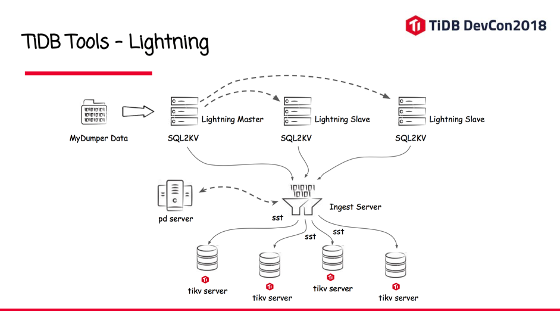

MyDumper 格式的文件作为输入，首先完成 SQL 到 KV 的转换，它是由若干分布式 worker 来完成，多机并行执行。同时绕过了优化器，生成连续的 KV 流，再通过一个专门的 Ingest Server 对 KV 进行全局排序。同时可以预计算 region，通过 PD 提前安排调度到哪个节点，所以整个的流程是非常高效的。

接下来介绍一个我们商业化工具，叫作 **Wormhole**。这个可以理解为是一个带控制面板的 Syncer，但比 Syncer 强大。它支持多源多目的地的数据同步。而且本身也是分布式结构，具有高可用、并行执行的特点。另外它对于分库分表支持的更好，配置可视化。在同步前检查也更为严格，比如说同步 MySQL，会提前检查表结构和 TiDB 的兼容性，是否开启 row 模式的 binlog 等等，避免在运行过程中发现了再报异常。另外 Wormhole 也支持一些简单的 ETL 转换规则，比如在同步过程中对表的某些字段进行简单映射计算和 UDF。比如对于分库分表的合并，如果每张分表都有自己的自增主键，合表之后插入 TiDB 就可能遇到主键冲突。Wormhole 通过配置就可以完成主键的合并，也可以新增一个字段作为真正的主键，原表的主键保留名字，去掉唯一性约束。

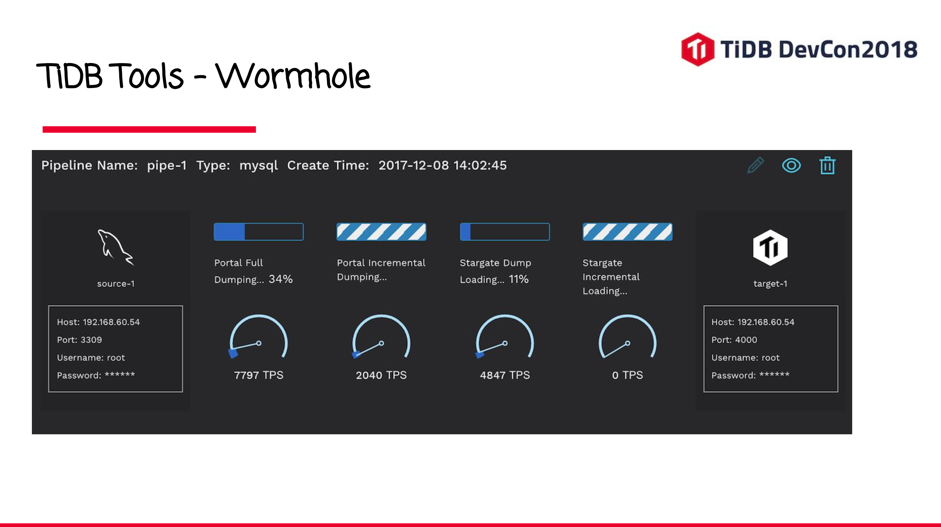

我截了一些界面的图，可以看到整个数据同步过程中的进度，包括全量、增量的同步速度，以及我随时可以把它暂停下来，或者进行一些特定的操作。对于多源/目的地这样同步，像这个配置，我可以直接把数据库里面的表结构全部读出来，用在界面上就可以决定同步表和数据库以及字段映射关系。

接下来第三部分，说说 TiDB 的数据可视化。**TiDB Vision** 这个项目是开源的，我们会在 PD 提供的接口上，来实现数据可视化。

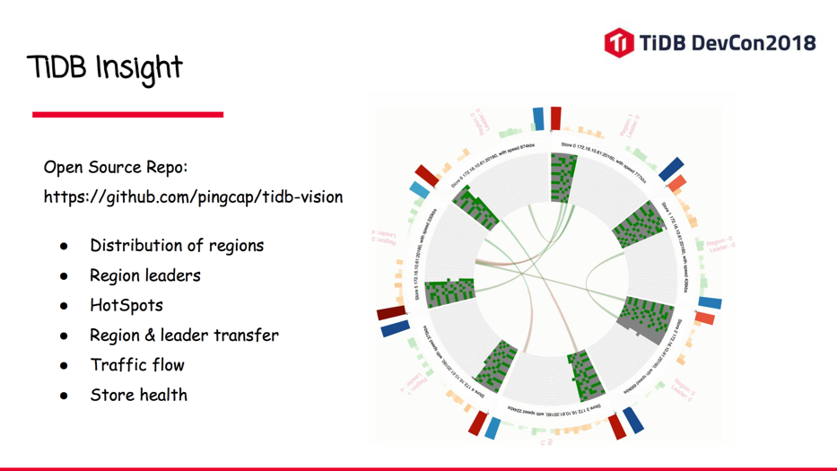

从图中可以清楚的看到在不同节点上 region 的分布，以及 region leader 的关系。图中环上的每一段，代表一个 TiKV store。每个 store 的每一个小格代表一个 region，绿色代表是 leader ，中间的这些线段在运行过程中是有动画效果的，当 Leader 发生分裂，迁移，还有 Leader transfer，都有不同颜色的动画来表示。从而反映一个真实 PD 产生调度的过程，我们可以通过可视化很直观的看到。另外就是热点，这个图里可能没有体现，如果某一个 region 出现热点，在界面上就可以看到一些红色的点。另外，这个边缘展示的是每个 PD 调度的一些网络流量，TiKV 的一些流量的信息我们也是实时的展示。如果某一个结点挂了，在这个边缘，它会有一定的颜色表示，比如说 TiKV 下线，熟悉 TiDB 的人知道，下线 TiKV 并不是立即就下线了，它会先变成下线中，然后变成 Tombstone 的状态，这个在图上都可以直观的反映出来。这个工具非常简单，就在 TiDB Vision 开源项目，有兴趣的同学，可以给 TiDB 做更多的皮肤。让这个展示更 cool，对业务监控更有帮助。

这个是我们在做的一个企业版的 **Dashboard**，这个可能跟大家看到的 Grafana 还有现有开源的界面不太相同，这里截了一些局部的图。大家可以看到，每个节点上面每个进程的状态，包括节点运行时日志，和服务健康状态。通过 Dashboard 就可以把整个的集群的拓扑和运行状态，全部展示出来。在这个界面它可以选择去创建多少个 TiDB 多少个 TiKV 节点，并且选择规格。左边可以选择升级的 TiDB 组件版本，完成滚动升级这样的事情。

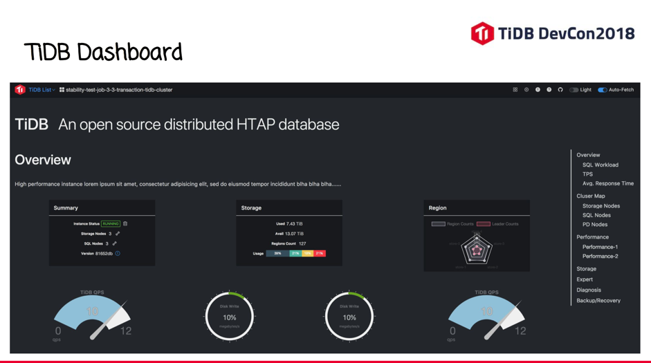

最后说一下 TiDB 的监控。监控我们后台用的 Prometheus 这个非常出名的项目，通过它来做存储数据库各个服务的 metrics。每个 TiDB、TiKV 组件都会把自己的状态上报到 Prometheus（实际是 pull 的模式），我们通过 Node Exporter 来采集每台主机的状态。而对于 K8s 集群，是通过 cAdvisor 进行收集，把 metrics 在 Prometheus 进行汇总。通过 Grafana 来做监控和可视化。我们配置好的 Grafana 面板点击编辑按钮，都可以看到对应的 Prometheus 查询表达式，通过一种类似 SQL 的查询语句，你就可以很方便的从 Prometheus 拉取监控数据然后对接到自己的监控平台。 Alert manager 也是 Prometheus 生态里面的一个工具，它可以去接受 Prometheus 发出的报警事件，然后通过各种报警方式推送出来。日志方面我们也是用比较流行的 EFK 套件。在 K8s 集群中，采集每个 Pod 的日志，存放到 ES 里面再通过 Kibana 进行展示。

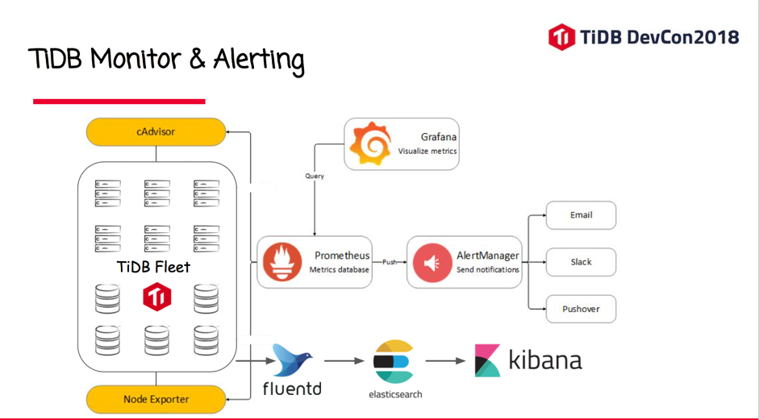

这个是监控的几个截图，这个大家可能都比较熟悉了。

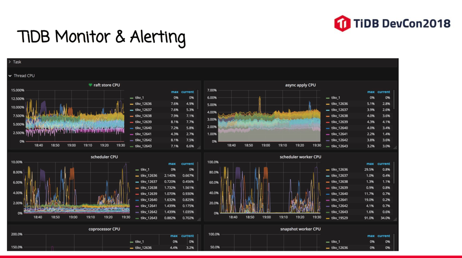

最后简单聊一下 **TiDB 生态**，因为 TiDB 最大的优势是兼容 MySQL 协议。所以不光是命令行工具，包括比如 MySQL 自己的 MySQL Workbench 这样的工具，还有大家用传统的 Navicat 这样的产品工具，还有就是一个老牌的 phpMyAdmin 这样的 Web 管理工具，都可以直接连到一个 TiDB 实例。我们同时也在不断的优化 TiDB 兼容性，因为毕竟它跟 MySQL 有些区别。像这些工具，它可能会去读 MySQL 的一些系统表，我们会尽量会跟 MySQL 保持兼容。还有一些很方便的功能，比如把 schema 抓出来，绘制 ER 图，其实我们也希望在 TiDB 上跑的很顺畅。这样习惯使用 MySQL 各种管理工具的用户，可以非常平滑的切换到 TiDB。

我今天介绍的内容主要就这些了，谢谢大家！

