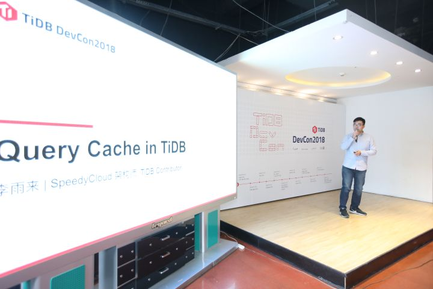
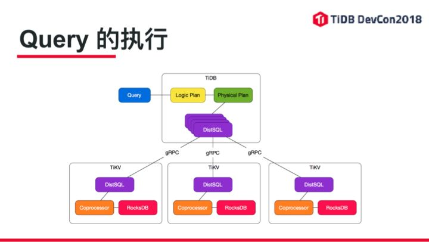
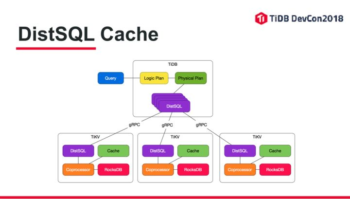
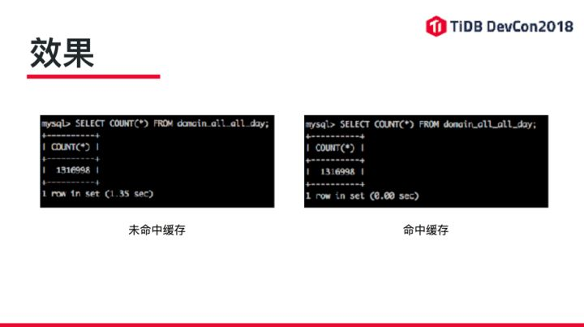

>本文为 TiDB DevCon2018 实录系列第一篇，是由 TiDB Committer 李雨来分享的《Query Cache in TiDB》的完整视频及文字实录。enjoy~~

+ [视频 | Query Cache in TiDB 完整视频](https://v.qq.com/x/page/q0549wlsfop.html)

大家好，我叫李雨来，是 SpeedyCloud 的架构师。同时也是 TiDB 的一个 Contributor，我今天帮大家介绍一下在业余时间里帮 TiDB 做的一个 commit，这个功能包含了一个和查询缓存相关的一个功能。

说到查询缓存，大家可能第一个想的到的就是跟 OLAP 相关的一些应用程序。比如说，我这边写了两个比较简单的 SQL 的模型，第一个统计类查询和聚合，去做一些 SUM，或者做一些 AVERAGE，同时还有 GROUP BY，ORDER BY 。另外一个是排序类查询，比如我查 Top 10，Top 100。然后同时还有一些 WHERE 的查询在里面，这个其实对于像 OLAP 的一些 Web 的应用程序来讲，大家可能很容易就想到，就是我画一张图，或者说出一个表，或者说给基本上对应的界面上的这两种显示。那么这两种类型的 SQL 如果我在 TiDB 里面做的话，我发现有几个痛点。

第一，多个同时查同一类型的执行的话，发现同一个 SQL 我要执行多次，会导致 TiDB 做一些重复计算。一千个人来访问这个页面，做了一千次的查询，那么这一千次的查询，对 TiDB 和 TiKV 来讲的话，好多的结果是一样的。没有查询缓存的话，肯定是重复计算，重复计算另外一个问题是当我并发量大到一定程度的时候，TiKV 的计算资源可能会变的更紧张一些。因为我们的 CPU 核数是有限的，我扫同样的数据，我扫一遍跟扫一千遍，对于 CPU 来讲，他要占用更多的 CPU 的计算时间。那么很多人就想到，我肯定要加一个缓存把一些重复计算的内容，给他缓存起来，下一次请求的时候，给他返回。缓存的话，一般我们会想到，两个地方可以加缓存，第一个我应用程序加一下缓存，比如像 Redis，Memcached。这个时候会有一个问题，在有写操作的时候，我需要刷这个缓存，如果我对缓存的要求又比较实时性，比如说我先插入一条数据之后，我希望我这个缓存更新的数据，跟我新插入的这个数据是一样的，那么就有一个问题，我需要控制好这个缓存的刷新节奏。

比如大家如果做过 Web 开发的应该都知道，前面的是 N 台 Web 服务器，我每台服务器在读写相应缓存的刷的逻辑都要写到 Web 应用程序里头去，而且我同时保证并发的时候，大家在刷的时候，是一样的。我整个刷的逻辑，刷的节奏都要保证他是一致性的。这个其实对于开发者来讲的话，可能是有点负担，因为毕竟我要多写一些代码去做一些缓存的刷新。另外一个，我看在 TiDB 这个层面上，可不可以做一个 Cache，这样的话，我直接丢一个 SQL 进去就可以了。

TiDB 实现缓存有两种方式，可以在 TiDB 层面上做缓存，也可以在 TiKV 层面做缓存。TiDB 层面做缓存，可能有一个问题，比应用程序操作反而还复杂的就是说，TiDB 是无状态的，大家可以理解为 TiDB 本身的 TiDB Server 这个进程，可以是无状态的。他所有的状态其实都在 TiKV 这个 Server 里头。我在 TiDB 想缓存的话，最后有一个问题，我多个 TiDB Server 之间，我要同步缓存刷新。因为我不可能在 A TiDB 服务器上插入一条数据，把 A 这个服务器的缓存刷新之后，我 B 服务器没有刷新，当我下一个请求，落到 B 服务器的话，我这数据其实是个错的（过期的）。另外一点，接下来就是我可以在 TiKV 这个地方加缓存，他也有他的好处，因为我 TiDB 读数据的时候，他其实是选 Raft Leader 去读和写数据。那么我现在就是说，基于现有的 TiKV 设计的话，我在 TiKV 一侧加缓存的优势就是我不需要去在多台 TiKV 服务之间去同步我实际缓存的最终结果。

这个图解释了一个 Query 的执行在整个 TiDB 集群里是怎么做的。

当一个 Query 进来之后，通过 TiDB 的 Server 去获取到这个请求，然后通过程序去解析逻辑的计划，然后再转成物理计划。转成物理计划之后，它会把物理计划，根据你所在的 Region 区间，去给每一个 Region 生成一个 DistSQL，然后再通过 gRPC 把 DistSQL（分布式计算单元）发到对应的 TiKV 的服务器上，然后 TiKV 再进行执行。TiKV 里头有 Coprocessor 这个其实就是说我把计算任务下推下去，然后 Coprocessor 再去通过 RocksDB 去读到真正的数据，进行计算，最终返回出来。那么加上这个 DistSQL Cache 的话，现在整个架构就变成这样。

就是说我在 Coprocessor 的层面上，再挂一个 Cache，如果 Coprocessor 发现这个 DistSQL 曾经被我执行过，然后在缓存里头也有执行的结果，那么我 Coprocessor 不用再把 DistSQL 重新做一次计算，直接返回到 TiDB上，这样能节省很多时间。尤其像这种 OLAP，我对整个 Region 进行扫描，再对不同的列进行 SUM，AVERAGRE 的计算的时候，这块其实能提高很大的性能。

我现在实现的方式，其实就是 TiKV 侧加了一个缓存。他针对 DistSQL 做结果的一个缓存。目前用了一个最简单的缓存算法，就是 LRU Cache。另外一个好处呢，就是我这个是一个天然的分布式的缓存。也就是说，我每一个 TiKV 可以配一个很小的缓存，但是我多台 TiKV 服务加在一起的话，我的缓存量会变的很大。

另外他的优势，刚才也提到了，我不需要维护多台 TiDB Server 之间的缓存一致性。大家了解过，CPU的 L2 Cache 和 L3 Cache 开始刷新的时候，你也知道这个东西是有多么热闹。可能会导致性能问题。其实现在好多比如像 C++ 的编译器，在对缓存这块，要做很多很多的事情，才让我们看到，我们现在应用程序执行的非常好。如果你在 CPU 的缓存上，有些地方，做的不是特别协调的话，可能执行速度反而会更慢当然这些这都是一些题外话。

另外一点，DistSQL Cache 还有一个比较有意思的特性，也是我自己在执行做测试的时候才发现，查询他会有一个局部命中的这么一个概念，比如我查一条 SQL 的话，我落到十个 Region，这十个 Region 的 Cache 被命中的时候，我认为是一个百分之百的命中然后返回的，但是如果我新的查询，查询条件是一样的，然后你发现，我 TiDB 的 Cache Miss 之后，我发现我下推计算的算子是一样的情况下。但是我增加了第十一个 Region 的话，你会发现这个特别有意思的效果，就是说我只用算第十一个 Region 的数据，剩下的十个 Region 的数据，其实他也是为 Cache 直接就能返回的。比如像我查一些历史数据，从 1 日查到 15 日，我可能重新建一个 1 日到 15 日的缓存。如果另外一个情况，我 1 日到 16 日，整个我的查询执行是只是重新算一遍 16 日的数据，然后从 1 日到 15 日的数据，我可以直接从 Cache 拿走。这样的话不用重新来算 1 日到 16 日，这样可能数据计算快很多。

另外一个就是，我们的缓存要缓存什么内容。因为看一下这个 TiDB 本身的配置文件，我们也知道，其实 RocksDB 本身有一个 Cache，所以第二条我写了简单的这种无须计算的 RocksDB 本身就有一个 Cache 我们可以直接用起来的优势。当然了，我这边想法，主要是我在聚合和 TopN 这种类型的查询的时候，包括我需要做大量的 CPU 计算。这样的话，我就是说把这些东西缓存起来，减少我的整个重复计算的次数。另外一个点，在这块，我最后一条写的就是说我们要限制缓存的结果的大小，这个主要原因是，如果我一个数据，本身如果一个 DistSQL 查询，我可能把整个 Region 的数据全读取出来了，那么其实你会发现，TiKV 跟 TiDB 之间的网络的 I/O 可能也会比较高。因为我们曾经在一个项目做测试的时候发现一个问题，TiDB 执行一个查询下去了，可能做一个全表扫描，如果 plan 做的不太好的话。他可能会把所有的数据推到 TiDB 层面上。然后 TiDB 再给你做计算，如果 TiDB 跟 TiKV 之间，你做一个全表扫描的时候你会发现，你慢的其实不是TiKV，是你 TiDB 的网卡。比如说，可能带宽会达到八九百兆，你可能万兆的(网)感觉不出来，但是如果你是千兆的时候，单台 TiDB 的服务器的带宽，有可能会因为你把所有的数据，加载到 TiDB 而把你的带宽给打满，所以这块缓存的话，如果你一个查询的数据量非常大，TiKV把数据推上来的时候，其实你瓶颈可能在网卡，未必是在你的 CPU 的计算，还有磁盘的读写。网卡这块，如果被打满的话，其实整个这个执行过程还是挺疼的。

那我们怎么去控制这个缓存的刷新呢，这也是我最开始做这个 Pull Request 之后，然后 PingCAP 另一个工程师做的 Pull Request，他其实提供了一个 Coprocessor Observer，我通过这个可以去获取一些在 TiKV 的读写的事件，通过这读写的事件，我可以对缓存做一定的刷新，读写的事件，他一般包括什么呢，其实这块的话，我可以告诉大家一些名词，具体的代码肯定还得去看里面的东西。其实在 Region 调度的时候，他会有一些事件，当我 Region 去写入数据的时候，他也会有一些事件，然后这些事件，就可以为我们来去更新整个缓存的生命周期，比如像 pre_apply 和 post_apply 这两个系列的请求。

另外一个点就是说，我跟 TiDB 的开发同学交流了之后，他告诉我的一个点，我在 TiKV 去写数据的时候，其实是有 Critical Section 的，因为写数据，肯定不是说我一写一瞬间就落盘了，他可能在落盘和完全落盘之间有一个时间差。在这个时间差的情况下，我需要把对应 Region 的 Cache 关掉，因为这种情况下，会导致我的 Cache 本身 Cache 一个不正确的数据。

这个 PPT 写的就是整个逻辑，比如在 pre_apply 的时候，我就要关了整个 Region 的 DistSQL Cache，然后我在 post_apply 的时候，我数据已经写到数据库，写入到磁盘的时候，我希望刷新相关 Region 的 Cache。然后再把整个 DistSQL Cache 打开，这个 PR，其实会有一个副作用是什么呢，因为我引入了 Cache，那么这个 Cache 应该是全局唯一的一个单件的模式，必然，多线程的去对 Cache 进行读写的时候，我肯定要加锁，加锁必然会降低我并发的时候请求的性能。为了绕开这个问题，如果你对并发要求很高，然后你对 Cache 这个东西，你发现没有什么太大的意义的话，你可以通过配置文件去关掉。其实这个东西很难去避免的。如果大家用的 MySQL 的话，也知道的，如果你把 Query Cache 打开的话，当你并发的环境大的时候。你 show processlist 你可以看到有一部分查询的状态是在等待 Query Cache 的锁，这个 MySQL 本身是有这个问题的。反过来到 TiDB 的话，这个问题，如果你加 Cache 的话，你很难去绕开这个点。但是相比 MySQL 的这个 Query Cache 的 lock 来讲的话。TiKV 的 lock，其实还是比较细的。因为他是针对 TiKV Server 这层的，那么我们来看看效果，这个是在我本地，我自己的笔记本电脑上做的一个测试。

第一个左边的，我第一次执行的一个 COUNT，我电脑也不是什么特别好机型，这些行 COUNT 完之后是 1.35 秒，那么第二次我在执行的时候，其实就应用缓存了。直接从内存里拉出来。这应该是 10 毫秒以下的速度。

谢谢大家。

