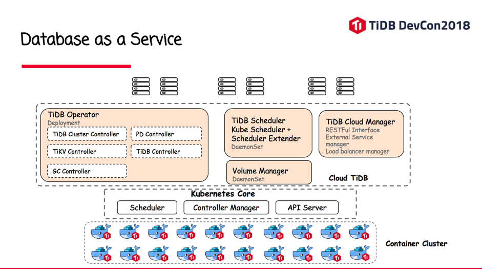

> 本文整理自今日头条数据库中间件/分布式数据库负责人吴镝（知乎 ID：吴镝）在 TiDB DevCon2018 上的分享内容。

TiDB 主要应用在今日头条核心 OLTP 系统 - 对象存储系统中，存储其中一部分元数据，支持头条图片和视频相关业务，比如抖音等。

如今（数据截至发文），TiDB 支撑着今日头条 OLTP 系统里 QPS 比较高的场景：集群容量约几十 T，日常 QPS 峰值会达到几十万。

## 为什么我们需要用 TiDB

今日头条内部有一些业务数据量非常大，之前用的 MySQL 的单机盘是大概 2.8T 的 SSD 盘。我们做对象存储。因为头条不但做视频，还做图片，这些视频和图片当中基本上都是用我们自研的 S3 存储系统，这种存储系统需要一个元数据，比如一个图片存下来，它存在 S3 系统的哪个机器、哪个文件、哪个偏移里面的数据，还有比如一个大的视频，S3 会把它切成很多小的视频片段，每一个分片的位置，都会存在元数据里面。

用 TiDB 之前，元数据是存在 MySQL 里的一个 2.8TB 的盘，因为增长的特别快，所以导致磁盘不够用，只能用分库分表的方案。我们以前用的的分库分表方案是 MyCAT。但用这个方案的过程中我们有遇到了一些问题，比如丢数据。某一个数据我 commit 了之后，最后发现这个数据丢了。

再就是连接的问题，目前头条做分片是大概固定分 100 个片。如果你的业务是需要分库分表，那你这边搞 101 个分片，这样有些业务，他用了一个分片键，用分片键来做查询，那可能中间件只用一个连接就可以找到相关数据。但有些业务，确实有不带分片键的请求。会导致 select 语句过来的时候，下面会建 101 个对后端的连接，也就是说，因为有连接的限制，有一个没有带分片键的这种请求过来之后， MyCAT 可以启 101 个连接到后面的每一个 MySQL 库。那这样的话，有时候我给它 5 万个连接，他一下子就把一百万用掉了。这样会导致它在非分片键的 select 请求，它连接速度消耗非常快，经常在业务这边会抛出说，连接数不够。

头条的数据库主要用的是 MySQL 和 MongoDB，相对比较单一，所我们也想多尝试一些其他的数据库。

## 主要使用场景

目前，TiDB 主要在以下两个场景下使用：

- 首先是 OLTP 的场景，也就是大数据量的场景，我们不仅仅是考虑到延时，而是考虑到数据量单机装不下，需要扩展性；

- 还有 OLAP 场景，有些用户，他用的是 Hive 或者 Tableau，然后用的过程中发现，因为后面都是接 MySQL，做一些 OLAP 的方式查询就比较慢。后来公司在推广 TiDB，所以就接了一些 OLAP 的业务场景。

头条的自研对象存储系统元数据量非常大，而且增长非常快。以其中最大的一个集群举例：该集群有两种方式，一是分片信息最早是用 MySQL 的。如果想用 TiDB 的话，可能先得把 TiDB 做了 MySQL 的备，用 TiDB 提供的 syncer 来同步数据，有些读请求我们可以从 MySQL 上切到 TiDB 上来。

我们用了一段时间，觉得 TiDB 其实挺稳定的。然后，公司会有这种需求，比如说突然接了一个元旦的活动，这个时候上传的图片就比较多，数据增长的就太大了，这种活动中 S3 系统压力比较大。我们 MySQL 的单盘基本上稳定的在 2.0TB 以上（盘总计 2.8TB），对此我们就只能删数据（一些很老的数据），跟业务部门沟通说，这个数据不要了，从 MySQL 的单盘里删掉，通过这种方式来支撑。

但即使这么做，单盘还是扛不住现在数据增长的需求。然后当时就想干脆激进点，把一些写进来后立即就读、并且以后都不会读的一些流量切到 TiDB 里。因为 S3 存储分很多 bucket ，做活动的人就去新建一些 bucket， 这些 bucket 的元数据就直接存在 TiDB 里面，就不存 MySQL 了。

这两个 case，就是目前在头条的 OLAP 和 OLTP 里数据流量最大、QPS 最大的一个场景。

## 集群部署状态

关于部署，我们把 TiDB 和 PD 部在一起，都是 3 个。TiKV 我们一共是用了几十台的机器。CPU 是 40 个虚拟的 CPU，256G 的内存。

目前平均值 QPS 在十几万，用了 3 个 TiDB，3 个 TiDB 总的连接数加起来大概 14K，然后 Latency 的 pct99 小于 60ms。这其实都属于挺高峰时期的数据了，做活动的时候 QPS 会达到几十万。

## 与 MySQL 的延时对比

在使用 TiDB 过程中，我们也比较了一下 TiDB 和 MySQL 的延时：

第一条线就是 MySQL 的延时，pct99 的，下面的黑线是 TiDB 的延时。可以看到，在 MySQL 的数据量非常大的情况下，TiDB 是明显 Latency 更优的，虽然说它用的机器会稍微多点。

## 一些使用中的吐槽和经验

使用的过程中我们也碰到了一些槽点，这些槽点 TiDB 现在的版本已经基本都解决了。

第一个就是直方图。大家知道基于 CBO 的这种优化器，肯定要用一些统计信息，TiDB 在之前的版本里对直方图的统计信息的更新没有做到很及时，导致我拿了一个 SQL 选执行计划的时候我会选错。比如说我可以选一个索引，但是实际上，因为这个更新信息不实时，所以它可能会做全表扫描。

大家以后发现这种你可以用 explain 这个命令看执行计划，如果有这样的问题就可以用 analyze 这个命令，他可以把一张表统计信息给更新，更新之后再一次执行 SQL 语句，你会发现他的执行计划已经变了。

第二个就是 raft leader。因为大家都知道，每个 region 是一个 raft ，TiDB 有一个监控指标，给出每个机器上有多少个 raft leader。当我们数据量跑到 10TB+，大概 20TB 的时候，会发现这个 raft leader 频繁掉线。掉线的原因主要是由于做 region 迁移的时候，比如你后边做迁移或者做负载均衡，会把 RocksDB 里面一个 range 的数据发到你要迁移的目标机器上面去。发过去了之后，目标端相当于要把 SST 文件 load 到 RocksDB 里，这个过程中，由于 RocksDB 实现的一个问题，导致把 SST 加到 RocksDB 的里面去的这个过程花费了大概 30 到 40 秒，正常情况下可能就毫秒级或者 1 秒。RocksDB 实现 ingest file 的时候，它打开了一些其实不需要打开的文件。因为 LevelDB、RocksDB 有很多层，把一个 file 给 ingest 进去的时候其实你要和一些 overlap 的数据做合并，因为它的实现问题，导致有一些没有必要去 touch 的 SST 它都会去 touch，会产生大量 IO 。因为我们数据量比较大， SST 就非常多，所以在数据量非常大的情况下就会踩到这个坑。

然后，RocksDB ingest 一个文件时间过长，导致 Raft 的心跳就断了。因为 Raft 协议要维持你的 lease，你要发心跳包，这个时候心跳包都给堵在后面，因为前面 ingest file 时间太长了。然后 Raft leader 就掉，掉了以后很多读写请求就会有问题。

第三个是大量的短链接。我们的业务使用数据库的时候，经常建了非常多短链接。因为大部分业务都是不大会使用数据库的，它也不知道要设置连接池，idle connection 这种东西。所以经常用完一个连接后就关掉。这种大量的短链接最后打到 TiDB，TiDB 连接建立了之后要去查一个 System 的变量，这些变量在 TiDB 里面是存在某几个 TiKV 实例里面的，那如果有大量短链接，这些短链接一上来，就会去查这些系统变量，刚好这些系统变量就聚在几台机器上面，导致说这几台机器就负载特别大。然后就会报警读请求堆积。TiKV 使用的是线程模型，请求过来之后，丢到队列里面去。然后线程再拿出来处理。现在 PingCAP 也在做优化，把这些 Cache 在 TiDB 这个进程里面。

第四点，严格来说这不算是 TiKV 的问题，算是 prometheus 的客户端有问题。我们当时遇到这么一个情况：部署 prometheus 的这个机器宕掉了，重启之后，我们会发现很多 TiKV 的监控信息都没有上报。后来查的时候发现压根 TiKV 这台机器都没有到 prometheus 这台机器的连接。所以我们就觉得 prometheus 这边客户端实现有问题。

第五个问题就是 Row id 的打散。这个问题正好是我们这边碰到的一个性能上的问题。因为 TiDB 存储数据是这么存的：我要插入一行数据，他会有两行，第一行是索引，索引是 Key ，然后 value 是 row id；第二行是 row id 是 Key，value 是整行的数据，相当于第二行有点像聚集索引这种东西。但是这个聚集索引的 Key 是 row id。原来的版本实现上是说这个 row id 是个递增了，所以这种就导致不管你插入什么数据，这个 row id 都是递增的，因为 row id 一递增，这些数据都会打到一个 TiKV 的一个 region 上面。因为我的 TiKV 是一个有序的 Map，所以说 row id 如果递增的话，肯定大家插入的时候都是打到一个 TiKV 上面。我们当时业务的压力比较大，导致客户发现他把这个业务的机器实例数给扩容上去之后，会发现这个 insert 的 TPS 大概也就在两万，一行大概就一百多个字节吧，你再怎么加他上不去了，也就是说 insert 的这个 QPS 上不去了。

这一点 TiDB 新版本的方案就是，row id 不是单调递增，而是把 row id 打的很散，这种方案性能会比较好，没有热点。

最后这个问题，因为 TiDB 这种事务模型，是需要拿一个事务版本，这个事务版本在 TiDB 里面是一个时间戳，并且这个时间戳是由 PD 这个组件来管理的。相当于每一个事务基本上连上来之后，它都要去访问 PD 这个组件拿时间戳。其实做 rpc 的时候拿时间戳延迟不会太长，也就是个位数毫秒级。但因为 TiDB 是 Go 写的，有调度开销。从 PD 拿回来一堆时间戳的 goroutine 把这堆时间戳发放给执行事务的一堆 goroutine 很慢，在链接数和压力都比较大的时候，大概有 30 毫秒左右的延时。可能调 rpc 的时候也就大概需要 1 毫秒，不到 2 毫秒。但由于 Go 的开销，能把这个延时翻几倍。

**以上这些讲的都是 TiDB 在头条做 OLTP 的场景下，碰到的一些主要的问题，这些问题大部分现在已经修复。**

## 头条在 OLAP 上的一些应用

在 OLAP 的场景下内容就比较少了。前面的一些业务喜欢用 tableau 这种客户端后面连接 MySQL，这就太慢了。可以用 syncer 把一些数据从 MySQL 同步到 TiDB。

这就可能碰到一个问题：我们公司有一个组件，是会把 Hive 的数据批量的同步到 MySQL 的一个工具，很多做数据分析的同学就会把 Hive 里的数据同步到 TiDB。但是这个工具产生的事务非常大，而 TiDB 本身对事务的大小是有一个限制的。

此时，把下面这两个配置项打开之后，TiDB 内部会把这种大的事务切成很多小的事务，就没有这个问题：

- `set @@tidb_batch_insert =ON`

- `set @@tidb_batch_delete = ON`

有事务大小的限制主要在于 TiKV 的实现用了一致性协议。对于任何一个分布式数据库，如果你要用一致性协议去做这种复制，肯定要避免非常大的事务。所以这个问题不是 TiDB 的问题。基本上，每个想要做分布式数据库的肯定都会碰到这么一个问题。在 OLAP 场景下，大家对数据的事务性要求没那么高，所以把这个配置项打开没什么问题。

这就是头条在 OLAP 上的一些应用：比如说 ugc 点击量，app crash 的需求是客户端请求挂掉之后，要打一个 log 在 TiDB 的集群里面。druid 这个 OLAP 这个引擎，他会有 MySQL 的数据做元数据，有些人就把这个元数据存在 TiDB 上了，还有一些问答业务，也是把一些相关的数据放到 TiDB 上。

