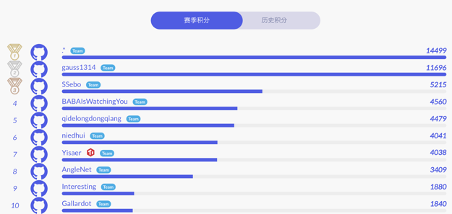
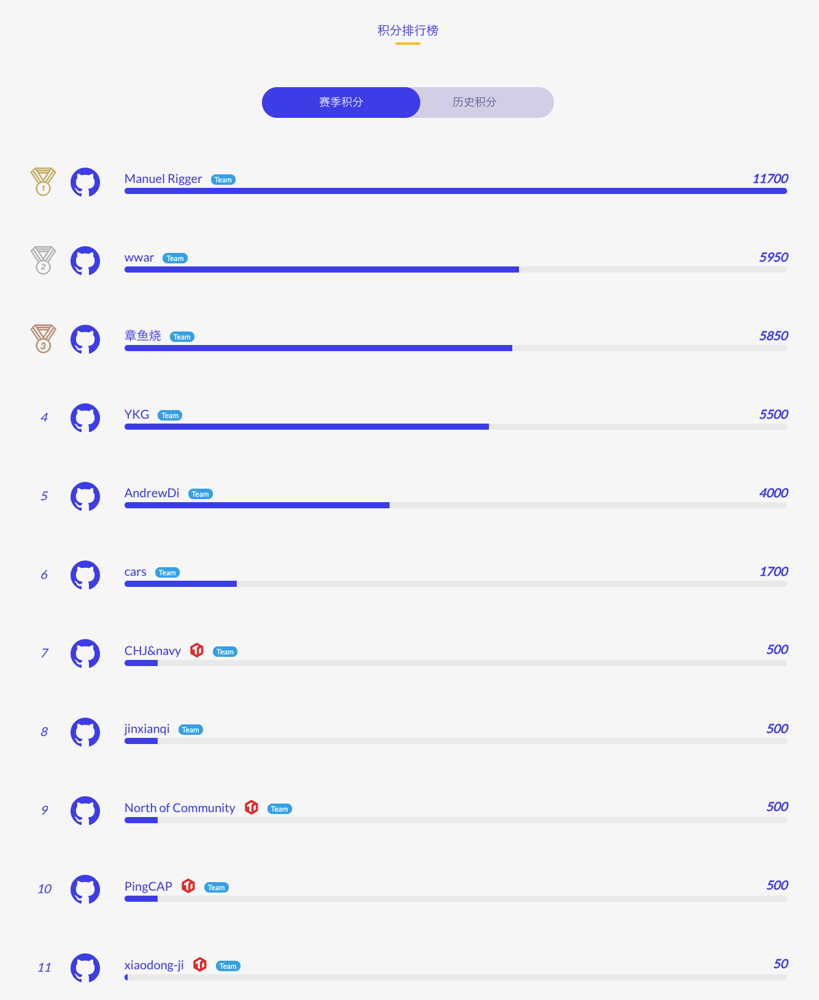
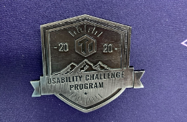

从 2019 年 11 月开始，我们开启了 TiDB 挑战赛系列，在经历了 [第一季性能挑战赛](https://pingcap.com/blog-cn/pcp-report-202002/) 后，

* 参赛成员意犹未尽；

* 围观同学蠢蠢欲动；

* 社区小伙伴们热情似火。

大家都迫切地想要为 TiDB 作出更多的贡献，让他跑得更远更稳。于是乎在大家的强烈要求下，今年三月我们又紧锣密鼓地开启了 [挑战赛第二季易用性挑战赛](https://pingcap.com/blog-cn/TiDB-usability-challenge-program/) 和 [TiDB 4.0 捉虫竞赛](https://pingcap.com/blog-cn/tidb-bug-hunting-guide/)，为 TiDB 全球社区建设添砖加瓦。

而今随着疫情好转，天气变暖，大家纷纷摘下口罩出去玩耍的同时，我们也迎来了本次赛季的累累硕果，下面我们一起来围观一下我们的选手是在漫漫疫情期间中，是如何边找 bug，边把 TiDB 做得更好玩更好用的。

## 最终积分排名与奖项揭晓

### 易用性挑战赛

让我们先来揭晓易用性挑战赛的排行榜：

本次比赛完整积分榜见 [赛事活动页](https://pingcap.com/community-cn/tidb-usability-challenge/)。

本次活动计入排名的参赛队伍基本信息如下（按照比赛规则，有 PingCAP 人员参与的小组不计入挑战赛最终排名，即上图中有 TiDB Logo 标示的选手）：

*   总参赛人员：141

*   总队伍数：102

*   个人参赛者：87

本次比赛奖项设置为：

*   第一名（状元）：[.*](https://github.com/tidb-challenge-program/register/issues/7) (14499 积分)

*   第二名（榜眼）：[gauss1314](https://github.com/tidb-challenge-program/register/issues/35) (11696 积分）

*   第三名（探花）：[SSebo](https://github.com/tidb-challenge-program/register/issues/72) (5215 积分)

除了以上三个优秀团队以外，我们看到本次大赛人才济济，吸引了众多优秀人才的加入，积分竞争尤其激烈，4000 分以上同学如下：

*   [BABAIsWatchingYou](https://github.com/tidb-challenge-program/register/issues/15) (4560 积分)

*   [qidelongdongqiang](https://github.com/tidb-challenge-program/register/issues/88) (4479 积分)

*   [niedhui](https://github.com/tidb-challenge-program/register/issues/61) (4041 积分)

除此以外也感谢以下同学的参与，可使用积分参与兑换奖品。

*   Yisaer(TiDB) (4038 积分)

*   [AngleNet](https://github.com/tidb-challenge-program/register/issues/13) (3409 积分)

*   [Interesting](https://github.com/tidb-challenge-program/register/issues/4) (1880 积分)

*   [Gallardot](https://github.com/tidb-challenge-program/register/issues/24) (1840 积分)

*   [mantuliu](https://github.com/tidb-challenge-program/register/issues/26) (1836 积分)

*   [STRRL](https://github.com/tidb-challenge-program/register/issues/33) (1755 积分)

*   [zzh-wisdom](https://github.com/tidb-challenge-program/register/issues/30) (1644 积分)

*   [□□□□□](https://github.com/tidb-challenge-program/register/issues/109) (1550 积分)

*   [unsafe](https://github.com/tidb-challenge-program/register/issues/8) (1336 积分)

*   [hawking&chacha](https://github.com/tidb-challenge-program/register/issues/31) (1300 积分)

*   [oraluben](https://github.com/tidb-challenge-program/register/issues/11) (1086 积分)

*   [ziyi-yan](https://github.com/tidb-challenge-program/register/issues/12) (550 积分)

*   [hsqlu](https://github.com/tidb-challenge-program/register/issues/47) (550 积分)

*   [blueshit](https://github.com/tidb-challenge-program/register/issues/45) (450 积分)

*   [Rustin-Liu](https://github.com/tidb-challenge-program/register/issues/23) (400 积分)

*   [imnotbigfacecat](https://github.com/tidb-challenge-program/register/issues/77) (400 积分)

*   meow(TiDB) (350 积分)

*   [走进新时代](https://github.com/tidb-challenge-program/register/issues/74) (300 积分)

*   Hexilee (TiDB) (300 积分)

*   [FoggyBottom](https://github.com/tidb-challenge-program/register/issues/75) (300 积分)

*   [build](https://github.com/tidb-challenge-program/register/issues/44) (100 积分)

*   [b41sh](https://github.com/tidb-challenge-program/register/issues/103) (100 积分)

*   [bigger](https://github.com/tidb-challenge-program/register/issues/110) (100 积分)

*   [psinghal20](https://github.com/tidb-challenge-program/register/issues/53) (100 积分)

*   [Poytr1](https://github.com/tidb-challenge-program/register/issues/25) (100 积分)

*   [SeaRise](https://github.com/tidb-challenge-program/register/issues/55) (80 积分)

*   [krzysztofpioro](https://github.com/tidb-challenge-program/register/issues/63) (50 积分)

*   [trabbart](https://github.com/tidb-challenge-program/register/issues/46) (50 积分)

*   [SHUOSC](https://github.com/tidb-challenge-program/register/issues/113) (50 积分)

*   [andrisak](https://github.com/tidb-challenge-program/register/issues/116) (50 积分)

*   [Lifeistrange](https://github.com/tidb-challenge-program/register/issues/54) (50 积分)

*   [zhang555](https://github.com/tidb-challenge-program/register/issues/6) (50 积分)

*   fredchenbj(TiDB) (50 积分)

*   [Beginner](https://github.com/tidb-challenge-program/register/issues/120) (50 积分)

*   [Alex Chi](https://github.com/tidb-challenge-program/register/issues/125) (50 积分)

*   [CopyAndSwap](https://github.com/tidb-challenge-program/register/issues/96) (50 积分)

*   Tenzor(TiDB) (50 积分)

*   [Hidehalo](https://github.com/tidb-challenge-program/register/issues/127) (50 积分)

### 捉虫大赛

[捉虫竞赛](https://pingcap.com/blog-cn/tidb-bug-hunting-guide/) 也在同一天圆满结束。本次 TiDB 捉虫竞赛，共有 40 位社区小伙伴组成 23 支队伍进行参赛。通过大家共同不懈的努力，一共为 4.0 GA 找出 51 个 P1 级别的 bug 和 8 个 P0 级别 bug。下面就来揭晓最终排名。

获得前三名的参赛队伍依次为：

*   第一名：Manuel Rigger，总分 11700；

*   第二名：wwar，总分 5950；

*   第三名：章鱼烧，总分 5850。

值得一提的是，本次 [捉虫竞赛](https://pingcap.com/blog-cn/tidb-bug-hunting-guide/) 第一名的获奖者 Manuel Rigger 是一位专攻数据库测试方向的博士后，来自苏黎世联邦理工学院，他的测试框架也帮助 MySQL，PostgreSQL，MariaDB 等找到 400 多个 bug。想更加了解他的框架是如何应用在 TiDB 的，欢迎关注即将到来的 [TiDB DevCon 2020](https://pingcap.com/community-cn/devcon2020/)，在大会上他也将给出精彩的分享。

除此之外也非常感谢以下几支队伍的参与：

*   YKG，5500 分

*   AndrewDi，4000 分

*   cars，1700 分

*   CHJ&navy，500 分

*   jinxianqi，500 分

*   North of community，500 分

*   PingCAP，500 分

*   xiaodong-ji，50 分

本次 [易用性挑战赛](https://pingcap.com/blog-cn/TiDB-usability-challenge-program/) 和 [捉虫竞赛](https://pingcap.com/blog-cn/tidb-bug-hunting-guide/) 均设置了杰出贡献奖。在两个竞赛获得前三名的同学都将获得这个奖项。欢迎大家在 [TiDB DevCon 2020](https://pingcap.com/community-cn/devcon2020/) 与我们一起见证这个荣誉时刻！

#### 成果展示：

在这次捉虫竞赛中，有几个 bug 引起了我们的注意：

[Server Panics when using partitions](https://github.com/tidb-challenge-program/bug-hunting-issue/issues/9)  这是 bug hunter Rigger 大神发现的 bug，查询导致 TiDB server 退出。

[TiDB 4.0 beta 在极高压力下有小概率发生请求无响应](https://github.com/tidb-challenge-program/bug-hunting-issue/issues/42) 是 P0 的问题。AndrewDi 用他的独门测试场景帮助我们发现和反复重现了这个 bug。得益于他的帮助，我们在 RC2 中快速 fix 了这个很重要的稳定性问题。

Dashboard 是 TiDB 在 4.0 中推出的提升易用性的功能，目前还处于内测阶段。YKG 在这次的大赛中，深度试用了 Dashboard 功能，提交了 5+ 的 bug。完善这些功能和解决这些易用性问题为我们继续提升 Dashboard 提供了巨大的帮助。

感谢以上三位同学对 TiDB 4.0 做出的巨大贡献！

虽然本赛季易用性挑战赛和捉虫竞赛已经结束，但 TiDB 追求一个完美数据库的脚步永不停歇，下一季赛季已经在路上了，敬请期待！

恭喜以下同学可以获取到 Ping CAP 定制的双肩包：

*   [AngleNet](https://github.com/tidb-challenge-program/register/issues/13) (3409 积分)

*   [Interesting](https://github.com/tidb-challenge-program/register/issues/4) (1880 积分)

*   [Gallardot](https://github.com/tidb-challenge-program/register/issues/24) (1840 积分)

*   [mantuliu](https://github.com/tidb-challenge-program/register/issues/26) (1836 积分)

恭喜以下同学可获取 JetBrains Toolbox 任选一个：

*   [STRRL](https://github.com/tidb-challenge-program/register/issues/33) (1755 积分)

*   [zzh-wisdom](https://github.com/tidb-challenge-program/register/issues/30) (1644 积分)

* [□□□□□](https://github.com/tidb-challenge-program/register/issues/109) (1550 积分)

恭喜以下同学可获取 Ping CAP 办公室五件套：

*   [unsafe](https://github.com/tidb-challenge-program/register/issues/8) (1336 积分)

*   [hawking&chacha](https://github.com/tidb-challenge-program/register/issues/31) (1300 积分)

*   [oraluben](https://github.com/tidb-challenge-program/register/issues/11) (1086 积分)

*   [ziyi-yan](https://github.com/tidb-challenge-program/register/issues/12) (550 积分)

[hsqlu](https://github.com/tidb-challenge-program/register/issues/47) (550

恭喜以下同学获得 Ping CAP 套帽衫：

*   [blueshit](https://github.com/tidb-challenge-program/register/issues/45) (450 积分)

*   [Rustin-Liu](https://github.com/tidb-challenge-program/register/issues/23) (400 积分)

*   [imnotbigfacecat](https://github.com/tidb-challenge-program/register/issues/77) (400 积分)

*   [走进新时代](https://github.com/tidb-challenge-program/register/issues/74) (300 积分)

*   [FoggyBottom](https://github.com/tidb-challenge-program/register/issues/75) (300 积分)

恭喜以下团队获得纪念书签套装或 TiDB 内胆包一套：

*   [AndrewDi](https://github.com/tidb-challenge-program/register/issues/21) (200 积分)

*   [zhaox1n](https://github.com/tidb-challenge-program/register/issues/48) (200 积分)

*   [dasinlsb](https://github.com/tidb-challenge-program/register/issues/10) (200 积分)

*   [tsthght](https://github.com/tidb-challenge-program/register/issues/98) (200 积分)

*   [Sullivan12138](https://github.com/tidb-challenge-program/register/issues/67) (150 积分)

*   [TiCloud](https://github.com/tidb-challenge-program/register/issues/83) (150 积分)

[JmPotato](https://github.com/tidb-challenge-program/register/issues/131) (150 积分)

恭喜以下团队可获取 TiDB 黑色或白色 T 恤：

*   [build](https://github.com/tidb-challenge-program/register/issues/44) (100 积分)

*   [b41sh](https://github.com/tidb-challenge-program/register/issues/103) (100 积分)

*   [bigger](https://github.com/tidb-challenge-program/register/issues/110) (100 积分)

*   [psinghal20](https://github.com/tidb-challenge-program/register/issues/53) (100 积分)

*   [Poytr1](https://github.com/tidb-challenge-program/register/issues/25) (100 积分)

恭喜以下团队可获取完赛纪念奖章一枚：

*   [SeaRise](https://github.com/tidb-challenge-program/register/issues/55) (80 积分)

*   [krzysztofpioro](https://github.com/tidb-challenge-program/register/issues/63) (50 积分)

*   [trabbart](https://github.com/tidb-challenge-program/register/issues/46) (50 积分)

*   [SHUOSC](https://github.com/tidb-challenge-program/register/issues/113) (50 积分)

*   [andrisak](https://github.com/tidb-challenge-program/register/issues/116) (50 积分)

*   [Lifeistrange](https://github.com/tidb-challenge-program/register/issues/54) (50 积分)

*   [zhang555](https://github.com/tidb-challenge-program/register/issues/6) (50 积分)

*   [Beginner](https://github.com/tidb-challenge-program/register/issues/120) (50 积分)

*   [Alex Chi](https://github.com/tidb-challenge-program/register/issues/125) (50 积分)

*   [CopyAndSwap](https://github.com/tidb-challenge-program/register/issues/96) (50 积分)

*   [Hidehalo](https://github.com/tidb-challenge-program/register/issues/127) (50 积分)