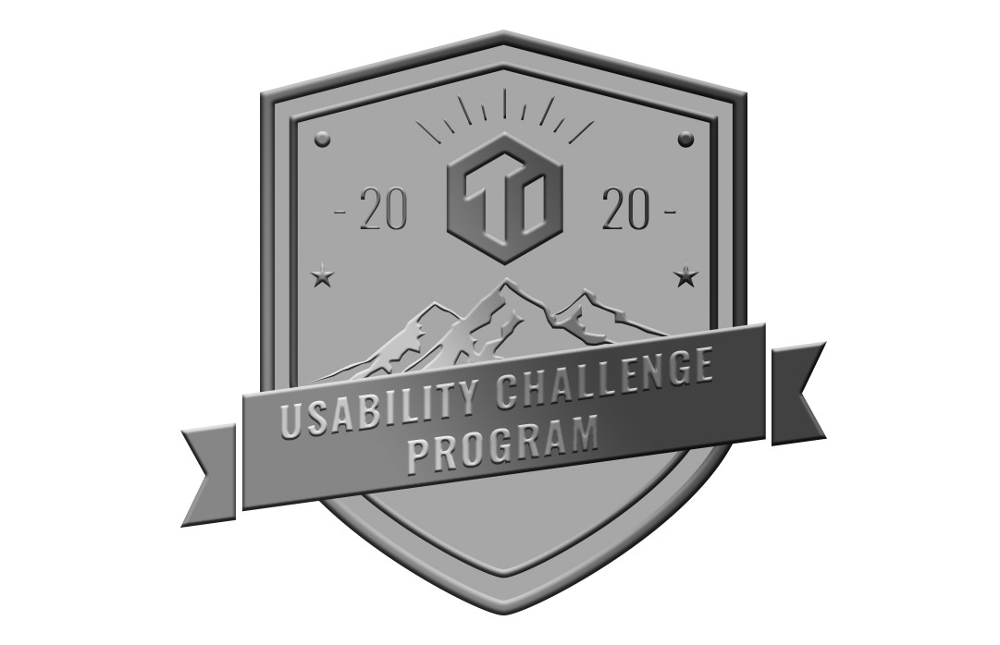
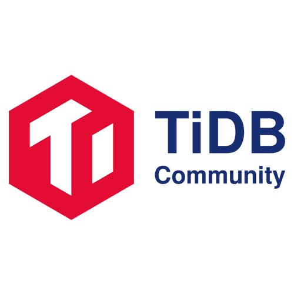

**两周前，我们发布了 [TiDB 挑战赛第一季](http://mp.weixin.qq.com/s?__biz=MzI3NDIxNTQyOQ==&mid=2247490854&idx=1&sn=6491780302bf66f58e58f0693fb81b19&chksm=eb163a4cdc61b35ab14afbfa4b24033ef51d854e0b7b83257eddb9a95cf83cc2091068327dd2&scene=21#wechat_redirect) 结赛公告，选手们在过去 3 个月里一顿炫酷的操作，让 TiDB 的「性能」产生了“惊人”的提升，比如：**

- .*team 在比赛第一个月就将 IN() 函数性能提升了 150+ 倍，并让 LIKE() 函数性能得到指数级提升；
- tabokie 让 Titan GC 机制不再受在线写的影响，极大提升了 TiKV 写入性能；
- pingyu 把 Window 算子和 Sort 算子结合起来，一起进行哈希分组，超预期地提升了窗口函数的性能；
- …… 

**不过比赛结束后，大家好像都有点意犹未尽：**

>参赛选手 A：折腾 TiDB 真有意思，有意思（摇扇子.gif）
>
>参赛选手 B：对啊，这得让更多人玩儿起来啊！
>
>吃瓜群众 1：那得让 TiDB 更好上手、更好用，玩的人才会多。
>
>吃瓜群众 2：不如再来一轮挑战吧，改造一下 TiDB 易用性，让大家能快速上手把玩，感受一下这个炫酷的产品（悄悄地说，我上一季没找到地方下手，求以后多开放些 Repo 选项！
>
>参赛选手 C：“易用性”的话，TiDB 用户比较有感受吧，可以问问他们的痛点。
>
>**TiDB Robot**：附议。

## TiDB 挑战赛第二季，说来就来！

TiDB 挑战赛第二季今天正式开启，赛程持续 3 个月，本赛季将围绕“提升 TiDB 的易用性”展开。考虑到用户们对 TiDB 落地实操中的“易用性”有深刻的体验，我们特地征求了一波 TiDB User Group（TUG）的意见。最后根据 TUG 投票的前 20 个需求，再加上我们自己对“易用性”改进的想法，综合设置了本次挑战赛的任务。**值得注意的是：完成用户投票前三的需求会有额外加分哦！**排名前三的需求整体上各自分别加 10000、8000、6000 分。在需求被完整实现或者本赛季结束，该需求对应的加分将由该需求的子任务完成者们一起分享。

本赛季任务依然分三个等级：Easy / Medium / Hard，每个任务对应一定的积分。这次我们优化了本赛季的分级赛制：**如果你是第一次参与挑战赛的新人，Easy 的任务可以直接上手；而老玩家（在该 Repo 历史积分大于 200 分）则可直接挑战 Medium 及以上难度的任务！**

本赛季将有更多 TiDB 相关 Repo 发布任务，大家可以根据自己擅长的方向自由选择：

- [TiDB](https://github.com/pingcap/tidb/projects/26)
- [TiKV](https://github.com/tikv/tikv/projects/20)
- [PD](https://github.com/pingcap/pd/projects/2)
- [Chaos-Mesh](https://github.com/pingcap/chaos-mesh/projects/14)
- [Data Migration](https://github.com/pingcap/dm/projects/1)
- [Backup&Restore](https://github.com/pingcap/br/projects/1)
- [client-rust](https://github.com/tikv/client-rust/projects/3)
- [tidb-dashboard](https://github.com/pingcap-incubator/tidb-dashboard/projects/17)
- 持续更新中

比赛结束后，选手可以用积分兑换丰富的奖品，这次兑换奖项也有了大升级！除了 TiDB 限量周边（T 恤、帽衫、双肩包、办公室五件套、黑白游戏机充电宝、书签日历套装），还新增了 **jetbrain toolbox 中任意一个软件的一年 license、PingCAP 年度大会荣誉席**，甚至还有**包机酒的硅谷之行**！此外，完成任意一个任务的选手还可以得到“**完赛纪念徽章**”一枚，长这样👇

欢迎大家加入 [TiDB Community Slack Workspace](https://join.slack.com/t/tidbcommunity/shared_invite/enQtNzc0MzI4ODExMDc4LWYwYmIzMjZkYzJiNDUxMmZlN2FiMGJkZjAyMzQ5NGU0NGY0NzI3NTYwMjAyNGQ1N2I2ZjAxNzc1OGUwYWM0NzE)，参赛过程中遇到任何问题都可以直接通过 [#tidb-challenge-program channel](https://tidbcommunity.slack.com/join/shared_invite/enQtNzc0MzI4ODExMDc4LWYwYmIzMjZkYzJiNDUxMmZlN2FiMGJkZjAyMzQ5NGU0NGY0NzI3NTYwMjAyNGQ1N2I2ZjAxNzc1OGUwYWM0NzE) 与我们取得联系。

## 报名流程

### 报名方式

发起 Issue 至 [pingcap/tidb-challenge-program/register](https://github.com/tidb-challenge-program/register) repo。

格式要求：

- 标题：UCP/Sign Up
- 内容：如果是个人参赛，请对你自己进行简要介绍，并留下可以与你取得联系的邮箱地址。
如果是团队参赛，请对你的团队进行简要介绍，写明团队名称，每个团队成员的 GitHub ID，并留下可以与你们取得联系的邮箱地址。可参考示例。

### 注意事项

- 如果以团队形式参赛，每队成员最多三人。
- 有 PingCAP 内部员工参与的队伍，将作为打星队伍，不参与积分总排名，但所获积分仍具有兑换权益。
- 如需更改报名信息，需关闭错误报名 Issue，重新开启一个新的 Issue 进行报名，暂不支持在原始 Issue 上进行编辑。

## 赛前准备

- 参考 [Join GitHub](https://github.com/join) 完成 GitHub 账号的创建。
- 参考 [Installing Git](https://git-scm.com/book/en/v2/Getting-Started-Installing-Git) 在本地环境中安装 Git。
- 通过 [Set up Git](https://help.github.com/en/github/getting-started-with-github/set-up-git) 配置 Git 访问 GitHub。
- 阅读“参赛流程”文档。本次参赛流程较第一季更加科学、细化，比如：挑战某个 medium 以上的题目需要在该题所属 repo 完成 200 分以上的 easy。所以大家比赛前一定要仔细阅读哦～**请进入 [活动官网](https://pingcap.com/community-cn/tidb-usability-challenge/?utm_source=wechat&utm_medium=read%20more&utm_campaign=20200302) ，查看“挑战赛细则”。**

## 学习资料

我们准备了一些学习资料，方便大家快速上手。

- [TiDB 精选技术讲解文章](https://github.com/pingcap/presentations/blob/master/hackathon-2019/reference-document-of-hackathon-2019.md)：帮助大家轻松掌握 TiDB 各核心组件的原理及功能
- [数据库小课堂](https://github.com/pingcap/awesome-database-learning)：帮助大家快速熟悉数据库知识，大家可以根据任务所需，有针对性地补充学习

## FAQ

**Q1：如何进行报名信息变更？报名信息变更后积分将如何变化？**

变更报名信息需关闭错误报名 Issue，重新开启一个新的 Issue 进行报名，暂不支持在原始 Issue 上进行编辑。报名信息变更后积分方面的变化有以下三种情况：

- 团队成员增加或减少不会影响团队总积分；
- 加入团队的新成员个人积分将冻结至加入团队前的状态，加入团队后所获积分为团队所有；
- 从团队中脱离出来以个人身份参赛的选手不继承团队积分，初始积分为 0。

**Q2：如何放弃/变更已领取的 Issue？**

- 放弃 Issue：在已领取的 Issue 下回复 “give-up-challenge”
- 变更 Issue：先对已领取的 Issue 执行 “放弃 Issue” 操作，再选择新的 Issue

**Q3：能否邀请 PingCAP 内部员工组队参赛？**

当然可以！我们非常欢迎社区小伙伴与 PingCAP 内部员工共同参赛。PingCAP 小伙伴可以在非工作时间与社区小伙伴一起攻克难题。为了尽可能保证赛事的公平，当 PingCAP 内部员工数在团队总人数中所占比例大于 ⅔ 时，该团队只能选择 Hard 级别以上的 Issue 进行挑战，且团队将作为打星队伍，不参与积分最终排名，但仍保留积分兑换权限。

**Q4：我不记得哪个 Repo 是否完成了 200 分怎么办？**

每个参赛主体在报名之后都会收到 sre-bot 发送的自动回复，回复中包含了当前每个 Repo 的积分。

> 进入 [活动官网](https://pingcap.com/community-cn/tidb-usability-challenge/?utm_source=wechat&utm_medium=read%20more&utm_campaign=20200302) 查看比赛详情
> 
>期待与各位一起创造无限可能！