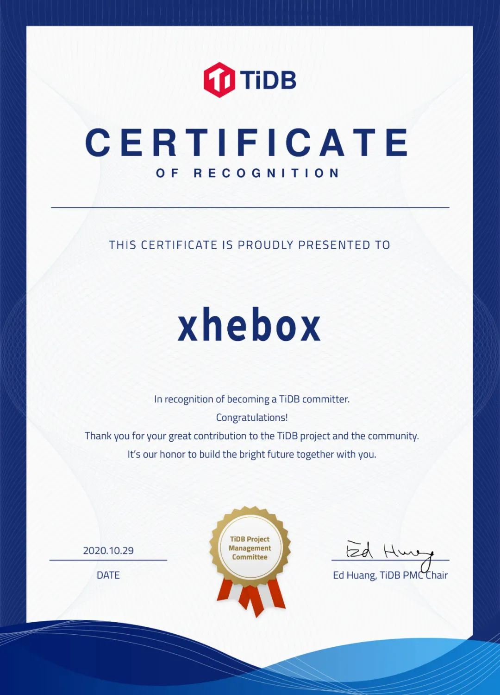

王贺看起来是一个不走寻常路的大三学生，从小就喜欢计算机，对于很多大学才开始接触编程的同学来说，高三就可以自己做一个 Linux 发行版无疑是同龄人中的佼佼者了。

**今天就来了解一下 TiDB Committer，DDL SIG 的 xhebox 的贡献之路。**

## 当时怎么想到要自己做一个 Linux 发行版呢？

开始接触 Linux 的时候我觉得 glibc 太大了，下载下来有几十 MB 所以想换掉它。当时正好接触到了除了 glibc 以外的 libc，我就萌生了自己做发行版这个想法，甚至还想把 GNU 所有的东西都换掉，虽然最后失败了，但发行版还是做了下来。

我从小就喜欢折腾这些东西，小学的时候用 Discuz 搭建过网站，高中时折腾苹果系统，这些都是因为兴趣所以自学的，也给我高三做 Linux 发行版打下了基础。我也是那个时候开始了解到 Go，我的 Linux 发行版的包管理器就是用 Go 写的，最近也开始在学习 Rust。

## 你做的 linux 发行版现在可以下载到吗？

以前是可以在 GitHub 上下载，现在不行了，我没有维护二进制包管理器，如果别人想用的话恐怕需要见到我本人，我可以用硬盘复制一份：）主要原因是维护二进制包非常耗时间，以前有 600 个包，现在被我削减到只有 300 个。我平时上课做实验也没有这么多时间， 几百个包都是手动编译，如果开源再维护，那可能没办法做其他事了。

## 你是怎么和 TiDB 结缘的？

第一次了解 TiDB 是 TCP 项目（Talent Challenge Program），在这之前我没有接触过数据库。有一天正好看到群里在发这个活动的信息，觉得挺有意思，不过这个活动需要 TiDB Contributor 才能参与，于是我就给 TiDB 提了一个 PR，在成为 Contributor 之后我就开始正式的加入了这个项目。

## 参加过其他社区的活动吗？

假期的时候我参加过快手的 KCode，主要比赛内容是读文件去计算 QPS。不过我参加完热身赛就不做了，到了决赛和半决赛会加一些限制，赛程后面比较偏向 IO 优化。我感觉我不是很擅长做竞赛或算法之类的比赛，更偏向学习和动手能力，所以更适合 TCP 这样的项目，自己发挥的空间更大。

## 会经常给其他开源项目做贡献吗？

有，不过其他项目的补丁比较散，不像 TCP 做了一个比较完整的功能。比如 musl libc 的兼容性不太好，我和使用 musl libc 的外国网友讨论过这个问题，也给 Google Chrome，Firefox 都提过补丁。

## 贡献过程中遇到最困难的地方是什么？

困难可能是因为从来没写过数据库，学校的数据库课程也才开始，教的也只是基本的 SQL 语句，所以我本身对 TiDB 和数据库也没什么了解，觉得入门比较难。

## 从开源贡献中获得了什么？

**协作经验**，之前虽然有共同协作的经历，但是没做过这么成熟的项目，并且有时候需要跨两个项目一起做开发。TiDB 的测试很完整，是我第一个提交的有完善 CI 的项目。之前提交的都比较传统，要么没有 CI，要么单元测试很薄弱，TiDB 是我接触的第一个有跨项目测试、集成测试的大型项目。

## 贡献过程中最有成就感的事？

有一次提 PR 主动推动了 PD 的进程，本来我只要给 TiDB 提就行，但当时项目的进度也需要 PD 那边的配合，我就给 PD 提了几个 PR。因为推动了 PD 并且在 DDL SIG 贡献，所以一个月就拿到了 PD 和 DDL 两个 Reviewer，还是挺有成就感的。

另外我也通过了面试，拿到贵司的实习机会：）

## 给 TiDB 社区的新人们一些建议

贡献最开始的一段比较困难，可能刚进去社区还不熟悉流程，一定要坚持过去，就会豁然开朗。**在参与的过程中一定要 get hands dirty，观望不如动手，实践出真知。**

## 对于本次 PingCAP D 轮融资，你作为社区的一份子，你怎么看？

感觉很厉害，我听过的一些融资项目都不到一亿，PingCAP D 轮能融资到 2.7 亿美刀，都有点感觉不太真实了，而且还是开源项目。作为社区的一份子，这个事情还是挺让人有自豪感的，也有些认识的人给我发这个消息。

**衷心希望 TiDB 社区越来越好！**
