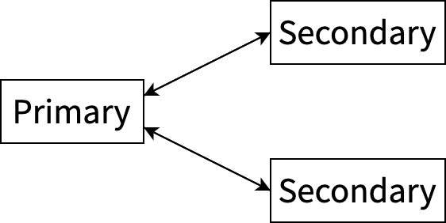
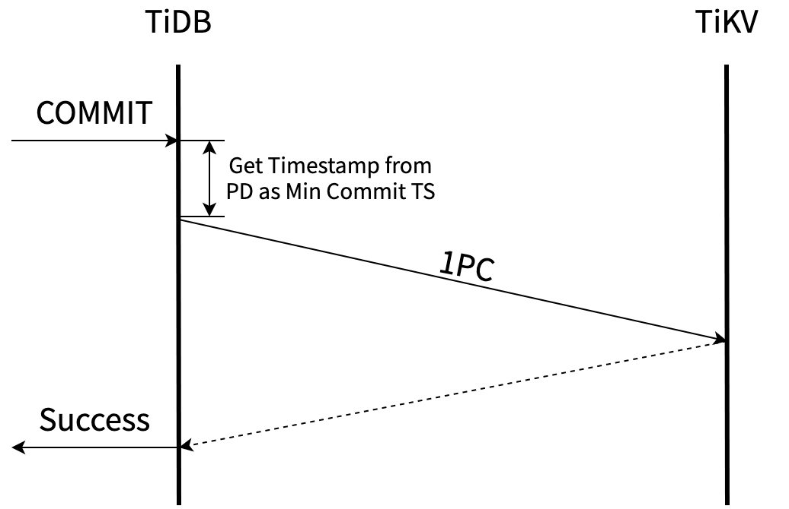
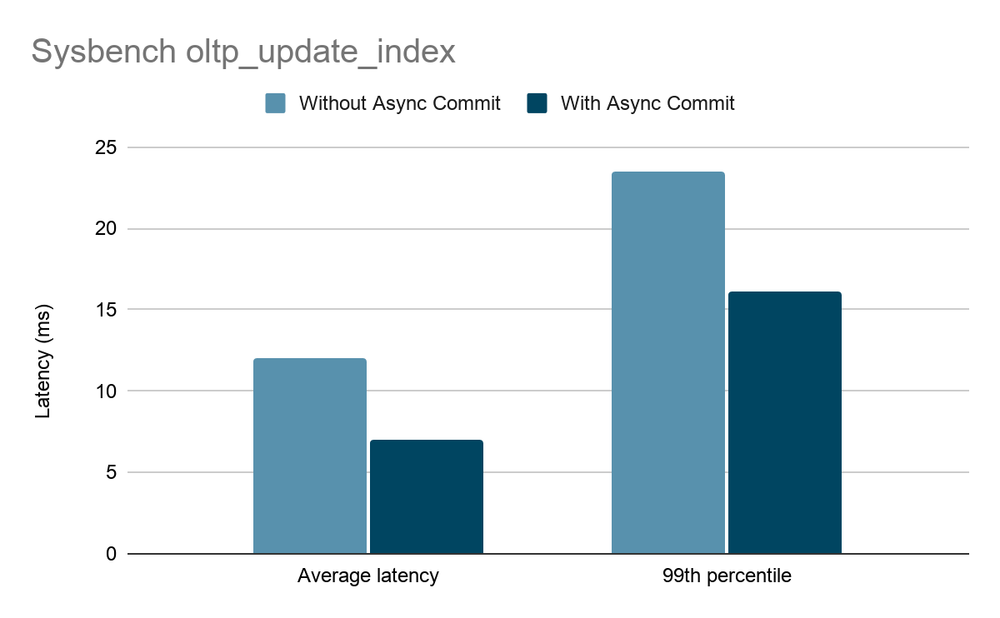
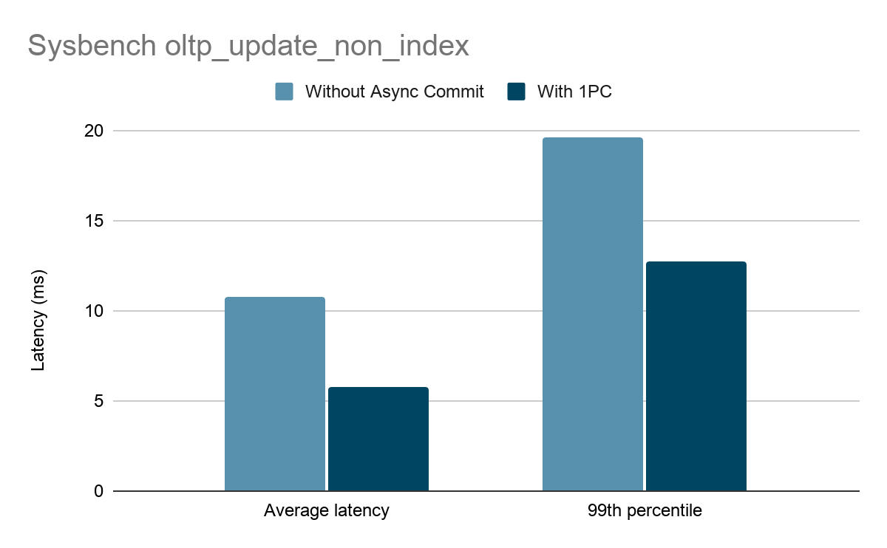

> 本文作者：陈奕霖(sticnarf)，PingCAP 研发工程师，TiKV Committer，热衷于开源技术，在分布式事务领域有丰富经验，目前致力于优化 TiDB 的分布式事务性能。

TiDB 提供了原生的分布式事务支持，实现低延迟的分布式事务是持续的优化方向。TiDB 5.0 引入的 Async Commit 特性大大改善了事务提交的延迟，这一特性主要由本文作者陈奕霖(sticnarf)，以及赵磊(youjiali1995)，Nick Cameron(nrc) 和周振靖(MyonKeminta)实现。

本文将向大家介绍 Async Commit 的设计思路、原理以及关键的实现细节。

## Percolator 的额外延迟

TiDB 事务基于 Percolator 事务模型。读者可以参考我们[之前的博客](https://pingcap.com/blog-cn/percolator-and-txn/)详细了解 Percolator 事务模型的提交过程。

上图是引入 Async Commit 之前的提交流程示意图。用户向 TiDB 发送 COMMIT 语句之后，TiDB 至少要经历以下的步骤才能向用户返回提交结果：

1. 并发地 prewrite 所有的 keys；

2. 从 PD 获取时间戳作为 Commit TS；

3. 提交 primary key。

整个提交过程的关键路径包括了至少两次 TiDB 和 TiKV 之间的网络交互。只有提交 secondary keys 的操作在 TiDB 后台异步完成。

在 TiDB 的事务模型中，我们可以大致将 TiDB 节点认为是事务的协调者，而 TiKV 节点是事务的参与者。传统二阶段提交中我们一般默认协调者的数据存储在节点本地，但 TiDB 事务模型中，所有的事务相关数据都在 TiKV 上。也正是因此，传统二阶段提交中，第一阶段结束后事务状态即可确定；而 TiDB 需要完成第二阶段的一部分，将事务状态存储到 TiKV 上，才能向用户响应。

不过这也意味着，TiDB 之前的事务模型是有提升空间的。能否改进 Percolator 事务模型，让事务的状态在完成第一阶段后，无需额外的网络交互即可确定呢？

## 改进事务完成条件

引入 Async Commit 之前，事务的 primary key 被提交才意味着这个事务被提交。Async Commit 力图实现的，就是把确定事务状态的时间提前到完成 prewrite 的时候，让整个提交的第二阶段都异步化进行。也就是说，对于 Async Commit 事务，只要事务所有的 keys 都被成功 prewrite，就意味着事务提交成功。

下图是 Async Commit 事务的提交流程（你可能发现原来获取 Commit TS 的环节没有了，在 prewrite 前多了从 PD 获取时间戳作为 Min Commit TS 的操作，这里的原因会在后文中介绍）：

为了达到这个目标，我们有两个主要问题要解决：

- 如何确定所有 keys 已被 prewrite。

- 如何确定事务的 Commit TS。

### 如何找到事务所有的 keys

引入 Async Commit 之前，事务的状态只由 primary key 决定，所以只需要在所有 secondary key 上存储到 primary key 的指针。如果遇到未提交的 secondary key，查询 primary key 的状态即可知道当前事务的状态：

判断 Async Commit 事务则需要知道所有 keys 的状态，所以我们需要能从事务的任意一个 key 出发，查询到事务的每一个 key。于是我们做了一点小的修改，保留从 secondary key 到 primary key 指针的同时，在 primary key 的 value 里面存储到到每一个 secondary key 的指针：

Primary key 上存储了所有 secondary keys 的列表，但显然，如果一个事务包含的 keys 的数量特别多，我们不可能把它们全部存到 primary key 上。所以 Async Commit 事务不能太大，当前我们只对包含不超过 256 个 keys 且所有 keys 的大小总和不超过 4096 字节的事务使用 Async Commit。

过大的事务的提交时长本身较长，减少一次网络交互带来的延迟提升不明显，所以我们也不考虑用类似多级结构的方式让 Async Commit 支持更大的事务。

### 如何确定事务的 Commit TS

Async Commit 事务的状态在 prewrite 完成时就必须确定了，Commit TS 作为事务状态的一部分也不例外。

默认情况下，TiDB 事务满足快照隔离的隔离级别和线性一致性。我们希望这些性质对于 Async Commit 事务同样能够成立，那么确定合适的 Commit TS 非常关键。

对于 Async Commit 事务的每一个 key，prewrite 时会计算并在 TiKV 记录这个 key 的 Min Commit TS，事务所有 keys 的 Min Commit TS 的最大值即为这个事务的 Commit TS。

下文会介绍 Min Commit TS 的计算方式，以及它们是如何使 Async Commit 事务满足快照隔离和线性一致性的。

#### 保证快照隔离

TiDB 通过 MVCC 实现快照隔离。事务在开始时会向 TSO 获取 Start TS，为实现快照隔离，我们要保证以 Start TS 作为快照时间戳始终能读取到一个一致的快照。

为此，TiDB 的每一次快照读都会更新 TiKV 上的 Max TS[1](#f1)。Prewrite 时，Min Commit TS 会被要求至少比当前的 Max TS 大[2](#f2)，也就是比所有先前的快照读的时间戳大，所以可以取 Max TS + 1 作为 Min Commit TS。在这个 Async Commit 事务提交成功后，由于其 Commit TS 比之前的快照读的时间戳大，所以不会破坏快照隔离。

下面的例子中，事务 T1 要写 x 和 y 两个 keys。T2 读取 y 将 Max TS 更新到 5，所以接下来 T1 prewrite y 时，Min Commit TS 至少为 6。T1 prewrite y 成功即意味着 T1 提交成功，而 T1 的 Commit TS 至少为 6。所以之后 T2 再读取 y 时，不会读取到 T1 更新的值，事务 T2 的快照保持了一致。

|  **T1: Begin (Start TS = 1)** |   |
|  :----:  | :----:  |
|  **T1: Prewrite(x)** | **T2: Begin (Start TS = 5)** |
|    | **T2: Read(y) => Max TS = 5**  |
|  **T1: Prewrite(y) => Min Commit TS = 6**  |   |
|    | **T2: Read(y)**  |

### 保证线性一致性

线性一致性实际上有两方面的要求：

- 循序性（sequential）

- 实时性（real-time）

实时性要求在事务提交成功后，事务的修改立刻就能被新事务读取到。新事务的快照时间戳是向 PD 上的 TSO 获取的，这要求 Commit TS 不能太大，最大不能超过 TSO 分配的最大时间戳 + 1。

在快照隔离一节提到，Min Commit TS 的一个可能的取值是 Max TS + 1。用于更新 Max TS 的时间戳都来自于 TSO，所以 Max TS + 1 必然小于等于 TSO 上未分配的最小时间戳。除了 TiKV 上的 Max TS 之外，协调者 TiDB 也会提供 Min Commit TS 的约束（后面会提到），但也不会使其超过 TSO 上未分配的最小时间戳。

循序性要求逻辑上发生的顺序不能违反物理上的先后顺序。具体地说，有两个事务 T1 和 T2，如果在 T1 提交后，T2 才开始提交，那么逻辑上 T1 的提交就应该发生在 T2 之前，也就是说 T1 的 Commit TS 应该小于 T2 的 Commit TS。[3](#f3)

为了保证这个特性，TiDB 会在 prewrite 之前向 PD TSO 获取一个时间戳作为 Min Commit TS 的最小约束。由于前面实时性的保证，T2 在 prewrite 前获取的这个时间戳必定大于等于 T1 的 Commit TS，而这个时间戳也不会用于更新 Max TS，所以也不可能发生等于的情况。综上我们可以保证 T2 的 Commit TS 大于 T1 的 Commit TS，即满足了循序性的要求。

综上所述，每个 key 的 Min Commit TS 取 prewrite 时的 Max TS + 1 和 prewrite 前从 PD 获取的时间戳的最大值，事务的 Commit TS 取所有 key 的 Min Commit TS 的最大值，就能够同时保证快照隔离和线性一致性。

### 一阶段提交 (1PC)

如果一个事务只更新一条记录的非唯一索引，或是只插入一条没有二级索引的记录，它只会涉及到单个 Region。在这种只涉及一个 Region的场景下，是不是可以不使用分布式事务提交协议，只用一个阶段完成事务的提交？这当然是可行的，但困难就在于一阶段提交的事务的 Commit TS 如何确定。

有了 Async Commit 计算 Commit TS 的基础，一阶段提交实现的困难点也解决了。我们用和 Async Commit 相同的方式去计算出一阶段提交事务的 Commit TS，通过一次和 TiKV 的交互直接将事务提交即可：

一阶段提交没有使用分布式提交协议，减少了写 TiKV 的次数。所以如果事务只涉及一个 Region，使用一阶段提交不仅可以降低事务延迟，还可以提升吞吐。[4](#f4)

一阶段提交特性在 TiDB 5.0 中作为 Async Commit 的一部分被引入。

## 因果一致性

上文提到向 TSO 获取 Min Commit TS 可以保证循序性。那么如果把这一步省去会怎样？这样不就又省了一次 PD 和 TiDB 的网络交互延时吗？

然而在这种情况下，我们可以找到违反循序性的例子。假设 x 和 y 位于不同的 TiKV 节点上，事务 T1 会修改 x，事务 T2 会修改 y。T1 比 T2 开始得早，但用户在 T2 在提交成功后才通知 T1 提交。这样，对于用户来说，事务 T1 的提交发生在事务 T2 提交完成之后，如果满足循序性，逻辑上 T1 应该晚于 T2 提交。

如果省去了 prewrite 前获取 Min Commit TS 的操作，T1 的 Commit TS 可能为 2，小于 T2 的 Commit TS = 6。如果有一个 Start TS 为 3 的事务 T3，它可以观察到 T2 在逻辑上晚于 T1 的事实。 所以此时是没有线性一致性的。

|  **T1: Begin (Start TS = 1)** |    |  |
|  :----:  | :----:  | :----:  |
|   |  | **T3: Begin (Start TS = 3)**  |
|    | **T2: Begin (Start TS = 5)**  |   |
|    | **T2: Prewrite(y)Min Commit TS = 6**  |   |
|    | **通知 T1 提交**  |   |
|  **T1: Prewrite(x)Min Commit TS = 2**  |   |   |
|    |   | **T3: Read(x, y)**  |

此时，快照的概念也可能和预期的不太一样。下面的例子中，晚开始的 T2 通知事务 T1 提交，T1 的 Commit TS 可能会小于 T2 的 Start TS。

对于用户来说，T2 在后续读取到 T1 对 x 的修改是不符合预期的。这种情景下，可重复读的性质没有被破坏，但是否还符合快照隔离就存在争议了[5](#f5)。

|  **T1: Begin (Start TS = 1)** |   |
|  :----:  | :----:  |
|   | **T2: Begin (Start TS = 5)** |
|    | **T2: Read(y)**  |
|    |  **通知 T1 提交** |
|  **T1: Prewrite(x)Min Commit TS = 2**  |   |
|    | **T2: Read(x)**  |

我们将这样更弱的一致性称为因果一致性：有因果关系的事务的顺序和它们物理上提交的顺序一致，但没有因果关系的事务之间的提交顺序则是不确定的。当且仅当两个事务加锁或写入的数据有交集时，我们认为它们有因果关系。事实上，这里的因果关系只包含数据库可知的因果关系，不涉及上面例子中“应用层通知”这种外部的因果关系。

发生这样的异常场景的条件比较苛刻，所以我们给用户提供了省去获取 Min Commit TS 的方式：使用 START TRANSACTION WITH CAUSAL CONSISTENCY ONLY 开启的事务，在提交时不获取 Min Commit TS。如果你的使用场景里，不涉及上面这种在数据库外部控制两个同时运行的事务提交顺序的情况，可以尝试将一致性级别降低，减少一次 TiDB 从 PD TSO 获取时间戳的耗时。

## 性能提升

Async Commit 使事务完成的时间点提前到 prewrite 结束时，使提交 primary key 的操作异步化。提交 primary key 这一步操作在整个事务中耗时的占比越大，那 Async Commit 的提升就越显著。交互少的小事务通常能依靠 Async Commit 得到较大的提升。
反之，也有一些 Async Commit 提升不明显的场景：

- 包含很多条语句，有较长的交互逻辑的事务，事务提交的耗时占比较低，Async Commit 的提升则不会很明显。

- 包含 keys 较多，写入数据量较大的事务，prewrite 的耗时明显长于提交 primary key 的耗时，Async Commit 的提升也不会很明显。

- Async Commit 没有减少对 TiKV 的读写量，所以不能提升极限吞吐。所以如果系统本身已接近吞吐极限，Async Commit 不会带来明显提升。

Sysbench `oltp_update_index` 场景下，一个事务只写入行记录和索引两个 keys，同时也是没有额外交互的 auto commit 事务，所以理论上 Async Commit 能大幅降低其延时。

实际测试也能证明这一点。如上图所示，在固定 2000 TPS 的条件下测试 sysbench `oltp_update_index`，开启 Async Commit 后，平均延时降低了 42%，p99 延时降低了 32%。

如果事务只涉及一个 Region，一阶段提交的优化能够更加显著地降低事务提交的延迟。由于减少了 TiKV 的写入量，所以也可以提升极限吞吐。

如上图所示，在固定 2000 TPS 的条件下测试 sysbench `oltp_update_non_index`。这是一个一个事务只写入一个 Region 的场景，开启一阶段提交后，平均延时降低了 46%，p99 延时降低了 35%。

## 总结

Async Commit 让 TiDB 事务提交减少了一次写 TiKV 的延时，是对原先 Percolator 事务模型的一个较大的改进。新创建的 TiDB 5.0 集群默认启用 Async Commit 和一阶段提交。从旧版本升级到 5.0 的集群，则需要用户手动将全局系统变量 `tidb_enable_async_commit` 和 `tidb_enable_1pc` 设为 ON 来开启 Async Commit 和一阶段提交特性。

限于篇幅，本文只涉及到了 Async Commit 中的关键设计，感兴趣的读者可以阅读 Async Commit 的[设计文档](https://github.com/tikv/sig-transaction/tree/master/design/async-commit)了解更多的细节。未来我们也会持续改进 TiDB 事务的性能，改善大家的 TiDB 使用体验，让更多人能从 TiDB 中收益。

> 欢迎联系我们：
Transaction SIG 的主要职责是对 TiKV 分布式事务的未来发展进行讨论和规划，并组织社区成员进行相关开发和维护。
现在你们可以在 TiKV 社区 Slack 的 [#sig-transaction channel](https://slack.tidb.io/invite?team=tikv-wg&channel=sig-transaction&ref=community-sig) 找到我们。

>从 TiDB 4.0 发布以来总计有 538 位 Contributor 提交了 12513 个 PR 帮助我们一起完成企业级核心场景的里程碑版本的开发，Async Commit 只是这些 PR 的代表。为感谢所有参与 5.0 版本的 Contributor 们，TiDB 社区精心准备了一份 5.0 定制周边。如果你也是 5.0 的 Contributor，请在 5 月 5 日前填写[表单](https://forms.pingcap.com/f/tidb-v5-contributors)，告诉我们你的地址。

## 注释

<b id="f1">1</b> 为了保证在 Region Leader 迁移后，新 Leader 的 Max TS 足够大，在 Region Leader 迁移和 Region Merge 后，TiKV 也会从 PD 获取最新的时间戳更新 Max TS。. [↩](#a1)

<b id="f2">2</b> 在 prewrite 过程中，为了防止更新的快照读破坏这个约束，TiKV 会对 prewrite 的 key 加上内存锁，短暂地阻塞住 Start TS ≥ Min Commit TS 的读请求。. [↩](#a2)

<b id="f3">3</b> 如果 T1 和 T2 的提交过程在时间上有重叠，那么它们逻辑上的提交的先后顺序则是无法确定的。. [↩](#a3)

<b id="f4">4</b> 准确地说，一阶段提交只应用于通过单次写 TiKV 请求就能完成事务的情况。为了提升提交效率，较大的事务会被切分成很多个请求，此时就算它们涉及的都是同一个 Region，目前也不会使用一阶段提交。. [↩](#a4)

<b id="f5">5</b> 如果我们允许认为 T1 在逻辑上的提交时间早于 T2 开始的时间（因为不满足线性一致性），那么这种情况依然可以认为是满足快照隔离的。. [↩](#a5)
