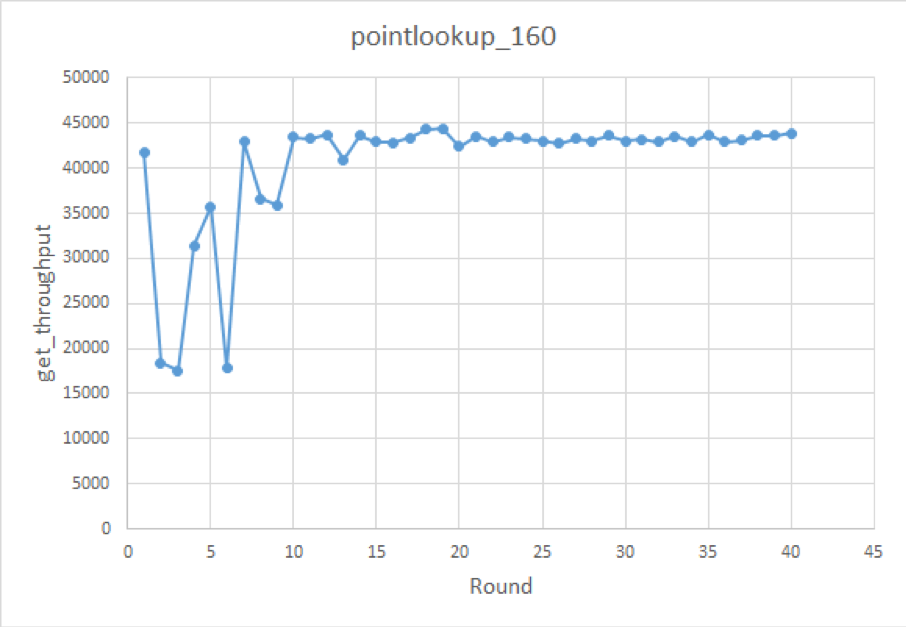

[TiKV](https://github.com/tikv/tikv) 底层使用了 [RocksDB](https://github.com/facebook/rocksdb) 作为存储引擎，然而 RocksDB 配置选项很多，很多情况下只能通过反复测试或者依靠经验来调优，甚至连 RocksDB 的开发者都自嘲，他们没办法弄清楚 [每个参数调整对性能的影响](https://github.com/facebook/rocksdb/wiki/RocksDB-Tuning-Guide#final-thoughts)。如果有一个自动 tuning 的方案就可以大大减少调优的人力成本，同时也可能在调优的过程中，发现一些人工想不到的信息。我们从 AutoML 中得到启发，希望能用 Automated Hyper-parameter Tuning 中的一些方法来对数据库参数进行自动调优。

常用的 Automated Hyper-parameter Tuning 方式大体上有以下三种：

1.  随机搜索，或者说叫启发式搜索。包括 GridSearch 和 RandomSearch。这种方法的改进空间主要体现在使用不同的采样方法生成配置，但本质上仍然是随机试验不同的配置，没有根据跑出来的结果来反馈指导采样过程，效率比较低。

2.  Multi-armed Bandit。这种方法综合考虑了“探索”和“利用”两个问题，既可以配置更多资源（也就是采样机会）给搜索空间中效果更优的一部分，也会考虑尝试尽量多的可能性。Bandit 结合贝叶斯优化，就构成了传统的 AutoML 的核心。

3.  深度强化学习。强化学习在 AutoML 中最著名的应用就是 [NAS](https://arxiv.org/pdf/1611.01578.pdf)，用于自动生成神经网络结构。另外它在 [深度学习参数调优](https://arxiv.org/pdf/1709.07417.pdf) 中也有应用。它的优点是从“从数据中学习”转变为“从动作中学习”（比如 knob 中的 cache size 从小调到大），既可以从性能好的样本中学习，也可以从性能坏的样本中学习。但强化学习坑也比较多，体现在训练可能比较困难，有时结果比较难复现。

目前学术界针对 auto-tune 数据库的研究也有很多，采用的方法大多集中在后面两种。其中一个比较有名的研究是 [OtterTune](https://www.cs.cmu.edu/~ggordon/van-aken-etal-parameters.pdf) 。我们受 OtterTune 的启发，开发了 AutoTiKV，一个用于对 TiKV 数据库进行自动调优的工具。项目启动三个月以来，AutoTiKV 在 TiKV 内部测试和调参的环节起到了较好的效果，有了一个很好的开始。后续我们还会针对生产环境上的一些特点，对它进行继续探索和完善。

项目地址：[https://github.com/tikv/auto-tikv](https://github.com/tikv/auto-tikv) 

## 设计目标

整个调优过程大致如下图：


整个过程会循环跑 200 个 round（可以用户自定义），或者也可以定义成到结果收敛为止。

AutoTiKV 支持在修改参数之后重启 TiKV（如果不需要也可以选择不重启）。需要调节的参数和需要查看的 metric 可以在 controller.py 里声明。

一开始的 10 轮（具体大小可以调节）是用随机生成的 knob 去 benchmark，以便收集初始数据集。之后的都是用 ML 模型推荐的参数去 benchmark。

## ML 模型

AutoTiKV 使用了和 [OtterTune](https://mp.weixin.qq.com/s/y8VIieK0LO37SjRRyPhtrw) 一样的高斯过程回归（Gaussian Process Regression，以下简称 GP）来推荐新的 knob[1]，它是基于高斯分布的一种非参数模型。高斯过程回归的好处是：

1. 和神经网络之类的方法相比，GP 属于无参数模型，算法计算量相对较低，而且在训练样本很少的情况下表现比 NN 更好。

2. 它能估计样本的分布情况，即 `X` 的均值 `m(X)` 和标准差 `s(X)`。若 `X` 周围的数据不多，则它被估计出的标准差 `s(X)` 会偏大（表示这个样本 `X` 和其他数据点的差异大）。直观的理解是若数据不多，则不确定性会大，体现在标准差偏大。反之，数据足够时，不确定性减少，标准差会偏小。这个特性后面会用到。

但 GP 本身其实只能估计样本的分布，为了得到最终的预测值，我们需要把它应用到贝叶斯优化（Bayesian Optimization）中。贝叶斯优化算法大致可分为两步：

1. 通过 GP 估计出函数的分布情况。

2. 通过采集函数（Acquisition Function）指导下一步的采样（也就是给出推荐值）。

采集函数（Acquisition Function）的作用是：在寻找新的推荐值的时候，平衡探索（exploration）和利用（exploitation）两个性质：

* exploration：在目前数据量较少的未知区域探索新的点。
* exploitation：对于数据量足够多的已知区域，利用这些数据训练模型进行估计，找出最优值。

在推荐的过程中，需要平衡上述两种指标。exploitation 过多会导致结果陷入局部最优值（重复推荐目前已知的最好的点，但可能还有更好的点没被发现），而 exploration 过多又会导致搜索效率太低（一直在探索新区域，而没有对当前比较好的区域进行深入尝试）。而平衡二者的核心思想是：当数据足够多时，利用现有的数据推荐；当缺少数据时，我们在点最少的区域进行探索，探索最未知的区域能给我们最大的信息量。

贝叶斯优化的第二步就可以帮我们实现这一思想。前面提到 GP 可以帮我们估计 `X` 的均值 `m(X)` 和标准差 `s(X)`，其中均值 `m(x)` 可以作为 exploitation 的表征值，而标准差 `s(x)` 可以作为 exploration 的表征值。这样就可以用贝叶斯优化方法来求解了。

使用置信区间上界（Upper Confidence Bound）作为采集函数。假设我们需要找 `X` 使 `Y` 值尽可能大，则 `U(X) = m(X) + k*s(X)`，其中 `k > 0` 是可调的系数。我们只要找 `X` 使 `U(X)` 尽可能大即可。

* 若 `U(X)` 大，则可能 `m(X)` 大，也可能 `s(X)` 大。

* 若 `s(X)` 大，则说明 `X` 周围数据不多，需要探索未知区域新的点。

* 若 `m(X)` 大，说明估计的 `Y` 值均值大， 则需要利用已知数据找到效果好的点。

* 其中系数 `k` 影响着探索和利用的比例，`k` 越大，越鼓励探索新的区域。

在具体实现中，一开始随机生成若干个 candidate knobs，然后用上述模型计算出它们的 `U(X)`，找出 `U(X)` 最大的那一个作为本次推荐的结果。

## 数据库参数

### workload

测试中我们使用了 [YCSB](https://github.com/brianfrankcooper/YCSB/wiki/Core-Properties) 来模拟 write heavy、long range scan、short range scan和point-lookup 四种典型 workload。数据库大小都是 80GB。[2]

### knobs

我们试验了如下参数：

| Options | Expected behavior | valid range/value set |
|:-----------|:-------------------------|:------------|
| write-buffer-size | point-lookup, range-scan: larger the better | [64MB, 1GB] |
| max-bytes-for-level-base | point-lookup, range-scan: larger the better | [512MB, 4GB] |
| target-file-size-base | point-lookup, range-scan: larger the better | {8M, 16M, 32M, 64M, 128M} |
| disable-auto-compactions | write-heavy: turn on is better point-lookup, range-scan: turn off is better | {1, 0} |
| block-size | point-lookup: smaller the better, range-scan: larger the better | {4k,8k,16k,32k,64k} |
| bloom-filter-bits-per-key | point-lookup, range-scan: larger the better | [5,10,15,20] |
| optimize-filters-for-hits | point-lookup, range-scan: turn off is better | {1,0} |

这些参数的含义如下：

* `block-size`：RocksDB 会将数据存放在 data block 里面，block-size 设置这些 block 的大小，当需要访问某一个 key 的时候，RocksDB 需要读取这个 key 所在的整个 block。对于点查，更大的 block 会增加读放大，影响性能，但是对于范围查询，更大的 block 能够更有效的利用磁盘带宽。 

* `disable-auto-compactions`：定义是否关闭 compaction。compaction 会占用磁盘带宽，影响写入速度。但如果 LSM 得不到 compact， level0 文件会累积，影响读性能。其实本身 [compaction 也是一个有趣的 auto-tuning 的方向](https://www.jianshu.com/p/0fdeed70b36a)

* `write-buffer-size`：单个 memtable 的大小限制（最大值）。理论上说更大的 memtable 会增加二分查找插入位置的消耗，但是之前的初步试验发现这个选项对 writeheavy 影响并不明显。

* `max-bytes-for-level-base`：LSM tree 里面 `level1` 的总大小。在数据量固定的情况下，这个值更大意味着其实 LSM 的层数更小，对读有利。

* `target-file-size-base`：假设 `target-file-size-multiplier=1` 的情况下，这个选项设置的是每个 SST 文件的大小。这个值偏小的话意味着 SST 文件更多，会影响读性能。

* `bloom-filter-bits-per-key`：设置 Bloom Filter 的位数。对于读操作这一项越大越好。

* `optimize-filters-for-hits`：True 表示关闭 LSM 最底层的 bloom filter。这个选项主要是因为最底层的 bloom filter 总大小比较大，比较占用 block cache 空间。如果已知查询的 key 一定在数据库中存，最底层 bloom filter 其实是没有作用的。

### metrics

我们选择了如下几个 metrics 作为优化指标。

* throughput：根据具体 workload 不同又分为 write throughput、get throughput、scan throughput

* latency：根据具体 workload 不同又分为 write latency、get latency、scan latency

* store_size

* compaction_cpu

其中 throughput 和 latency 通过 go-ycsb 的输出结果获得，store_size 和 compaction_cpu 通过 tikv-ctl 获得。

## 实验测试结果

**测试平台**

AMD Ryzen5-2600 (6C12T)，32GB RAM，512GB NVME SSD，Ubuntu 18.04，tidb-ansible 用的 master 版本。

所有的实验都是前 10 轮用随机生成的配置，后面使用模型推荐的配置：

```
workload=writeheavy  knobs={disable-auto-compactions, block-size}  metric=write_latency
```

实验效果如下：


这个实验中推荐结果是启用 compaction、同时 block size 设为 4KB。

虽然一般来说写入时需要关闭 compaction 以提升性能，但分析后发现由于 TiKV 使用了 Percolator 进行分布式事务，写流程也涉及读操作（写冲突检测），所以关闭 compaction 也导致写入性能下降。同理更小的 block size 提高点查性能，对 TiKV 的写流程性能也有提升。

接下来用 point lookup 这一纯读取的 workload 进行了试验：

```
workload=pntlookup80  knobs={'bloom-filter-bits-per-key', 'optimize-filters-for-hits', 'block-size', 'disable-auto-compactions'}  metric=get_latency
```
实验效果如下：


推荐结果为：bloom-filter-bits-per-key==20，block-size==4K，不 disable auto compaction。而 optimize-filters-for-hits 是否启用影响不大（所以会出现这一项的推荐结果一直在摇摆的情况）。

推荐的结果都挺符合预期的。关于 optimize-filter 这一项，应该是试验里面 block cache 足够大，所以 bloom filter 大小对 cache 性能影响不大；而且我们是设置 default CF 相应的选项（关于 TiKV 中对 RocksDB CF 的使用，可以参考 [《TiKV 是如何存取数据的》](https://pingcap.com/blog-cn/how-tikv-store-get-data/)），而对于 TiKV 来说查询 default CF 之前我们已经确定相应的 key 肯定存在，所以是否有 filter 并没有影响。之后的试验中我们会设置 writeCF 中的 optimize-filters-for-hits（defaultCF 的这一项默认就是 0 了）；然后分别设置 defaultCF 和 writeCF 中的 bloom-filter-bits-per-key，把它们作为两个 knob。

为了能尽量测出来 bloom filter 的效果，除了上述改动之外，我们把 workload 也改了一下：把 run phase 的 recordcount 设成 load phase 的两倍大，这样强制有一半的查找对应的 key 不存在，这样应该会测出来 write CF 的 optimize-filters-for-hits 必须关闭。改完之后的 workload 如下：

```
workload=pntlookup80  knobs={rocksdb.writecf.bloom-filter-bits-per-key,  rocksdb.defaultcf.bloom-filter-bits-per-key, rocksdb.writecf.optimize-filters-for-hits,  rocksdb.defaultcf.block-size, rocksdb.defaultcf.disable-auto-compactions}  metric=get_throughput
```

这次的实验效果如下（发现一个很出乎意料的现象）：



测出来发现推荐配置基本集中在以下两种：

* {3,1,1,0,0}
  
  rocksdb.writecf.bloom-filter-bits-per-key ['rocksdb', 'writecf'] bloom-filter-bits-per-key **20**  
  
  rocksdb.defaultcf.bloom-filter-bits-per-key ['rocksdb', 'defaultcf'] bloom-filter-bits-per-key **10** 
  
  rocksdb.writecf.optimize-filters-for-hits ['rocksdb', 'writecf'] optimize-filters-for-hits **True**  
  
  rocksdb.defaultcf.block-size ['rocksdb', 'defaultcf'] block-size **4KB**  
  
  rocksdb.defaultcf.disable-auto-compactions ['rocksdb', 'defaultcf'] disable-auto-compactions **False**

* {2,2,0,0,0}

  rocksdb.writecf.bloom-filter-bits-per-key ['rocksdb', 'writecf'] bloom-filter-bits-per-key **15**  
  
  rocksdb.defaultcf.bloom-filter-bits-per-key ['rocksdb', 'defaultcf'] bloom-filter-bits-per-key **15**  
  
  rocksdb.writecf.optimize-filters-for-hits ['rocksdb', 'writecf'] optimize-filters-for-hits **False**  
  
  rocksdb.defaultcf.block-size ['rocksdb', 'defaultcf'] block-size **4KB**  
  
  rocksdb.defaultcf.disable-auto-compactions ['rocksdb', 'defaultcf'] disable-auto-compactions **False**

分析了一下，感觉是因为 write CF 比较小，当 block cache size 足够大时，bloom filter 的效果可能就不很明显了。

如果仔细看一下结果，比较如下两个 sample，会发现一个现象：

* 30 , 2019-08-23 03:03:42 , [3\. 1\. 1\. 0\. 0.] , [4.30542000e+04 1.18890000e+04 8.68628124e+10 5.10200000e+01]

* 20 , 2019-08-22 16:09:26 , [3\. 1\. 0\. 0\. 0.] , [4.24397000e+04 1.20590000e+04 8.68403016e+10 5.07300000e+01]

它们 knob 的唯一区别就是 30 号关闭了底层 bloom filter（optimize-filters-for-hits==True），20 号启用了底层 bloom filter（optimize-filters-for-hits==False）。结果 20 号的 throughput 比 30 还低了一点，和预期完全不一样。于是我们打开 Grafana 琢磨了一下，分别截取了这两个 sample 运行时段的图表：

（两种场景 run 时候的 block-cache-size 都是 12.8GB）


图中粉色竖线左边是 load 阶段，右边是 run 阶段。可以看出来这两种情况下 cache hit 其实相差不大，而且 20 号还稍微低一点点。这种情况是因为 bloom filter 本身也是占空间的，如果本来 block cache size 够用，但 bloom filter 占空间又比较大，就会影响 cache hit。这个一开始确实没有预料到。其实这是一个好事情，说明 ML 模型确实可以帮我们发现一些人工想不到的东西。

接下来再试验一下 short range scan。这次要优化的 metric 改成 scan latency：

```
workload=shortscan    knobs={'bloom-filter-bits-per-key', 'optimize-filters-for-hits', 'block-size', 'disable-auto-compactions'}  metric=scan_latency
```

实验结果如下：


由于篇幅有限我们先看前 45 轮的结果。这个推荐结果还没有完全收敛，但基本上满足 optimize-filters-for-hits==False，block-size==32KB 或者 64KB，disable-auto-compactions==False，这三个也是对结果影响最明显的参数了。根据 [Intel 的 SSD 白皮书](https://www.intel.com/content/dam/www/public/us/en/documents/white-papers/ssd-server-storage-applications-paper.pdf)，SSD 对 32KB 和 64KB 大小的随机读性能其实差不多。bloom filter 的位数对 scan 操作的影响也不大。这个实验结果也是符合预期了。

## 与 OtterTune 的不同点

我们的试验场景和 OtterTune 还是有一些区别的，主要集中在以下几点[3][4]：

* AutoTiKV 直接和 DB 运行在同一台机器上，而不是像 OtterTune 一样设置一个集中式的训练服务器。但其实这样并不会占用很多资源，还避免了不同机器配置不一样造成数据不一致的问题。

* 省去了 workload mapping（OtterTune 加了这一步来从 repository 中挑出和当前 workload 最像的训练样本，而我们目前默认 workload 类型只有一种）

* 要调的 knobs 比较少，省去了 identity important knobs（OtterTune 是通过 Lasso Regression 选出 10 个最重要的 knob 进行调优）

* 另外我们重构了 OtterTune 的架构，减少了对具体数据库系统的耦合度。更方便将整个模型和 pipeline 移植到其他系统上（只需修改 controller.py 中具体操作数据库系统的语句即可，其它都不用修改），也更适合比起 SQL 更加轻量的 KV 数据库。

* 最后我们解决了 OtterTune 中只能调整 global knob，无法调节不同 session 中同名 knob 的问题。

## 总结

一个复杂的系统需要很多环节的取舍和平衡，才能使得总体运行效果达到最好。这需要对整个系统各个环节都有很深入的理解。而使用机器学习算法来做参数组合探索，确实会起到很多意想不到的效果。在我们的实验过程中，AutoTiKV 推荐的配置有些就和人工预期的情况不符，进而帮助我们发现了系统的一些问题：

* 有些参数对结果的影响并没有很大。比如这个参数起作用的场景根本没有触发，或者说和它相关的硬件并没有出现性能瓶颈。

* 有些参数直接动态调整是达不到效果的，或者需要跑足够长时间的 workload 才能看出效果。例如 block cache size 刚从小改大的一小段时间肯定是装不满的，必须要等 workload 足够把它填满之后，才能看出大缓存对总体 cache hit 的提升效果。

* 有些参数的效果和预期相反，分析了发现该参数其实是有副作用的，在某些场景下就不大行了（比如上面的 bloom filter 那个例子）。

* 有些 workload 并不是完全的读或者写，还会掺杂一些别的操作。而人工判断预期效果的时候很可能忽略这一点（比如上面的 writeheavy）。特别是在实际生产环境中，DBA 并不能提前知道会遇到什么样的 workload。这大概也就是自动调优的作用吧。

后续我们还会对 AutoTiKV 继续进行改进，方向集中在以下几点：

* 动态适应不断变化的 workload（比如一会读一会写），以及之前没有出现过的不同业务特征的 workload。

* 有时 ML 模型有可能陷入局部最优（尝试的 knob 组合不全，限于若干个当前效果还不错的 knob 循环推荐了）。

* 借鉴 AutoML 中的思路，尝试更多不同的 ML 模型来提高推荐效果，减少推荐所需时间。

>参考资料
>
>[1] [https://mp.weixin.qq.com/s/y8VIieK0LO37SjRRyPhtrw](https://mp.weixin.qq.com/s/y8VIieK0LO37SjRRyPhtrw)
>
>[2] [https://github.com/brianfrankcooper/YCSB/wiki/Core-Properties](https://github.com/brianfrankcooper/YCSB/wiki/Core-Properties)
>
>[3] [https://www.cnblogs.com/pdev/p/10948322.html](https://www.cnblogs.com/pdev/p/10948322.html)
>
>[4] [https://www.cnblogs.com/pdev/p/10903628.html](https://www.cnblogs.com/pdev/p/10903628.html)
