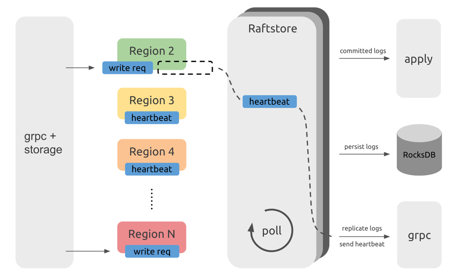
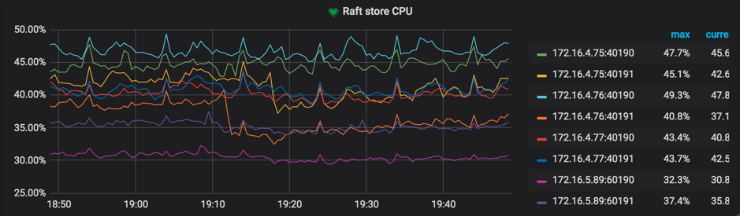
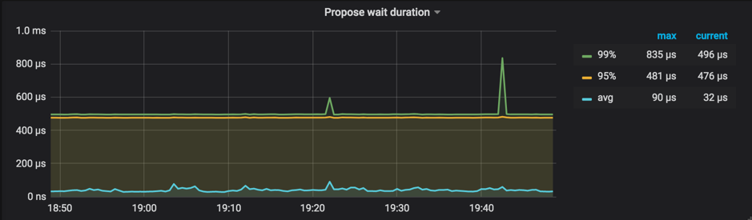
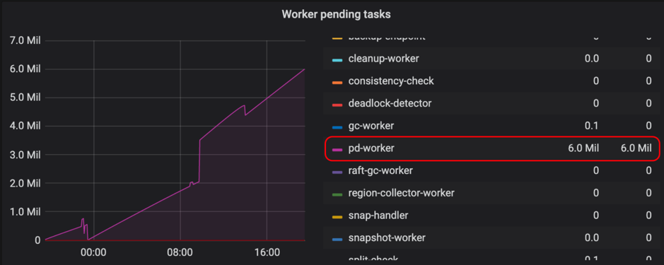

在 TiDB 的架构中，所有的数据按照 range 划分成一个个 Region 分布在多个 TiKV 实例上。随着数据的写入，一个集群中会产生上百万，甚至千万个 Region。而量变引起质变，单 TiKV 实例上过多的 Region 无疑会带来比较大的负担，进而影响整个集群的性能表现。

本文将介绍 TiKV 核心模块 Raftstore 的处理流程以使大家更好得理解海量 Region 导致性能问题的根源，以及针对这种情况的一些优化手段。

## Raftstore 的处理流程

大家都知道在一个 TiKV 实例上会有多个 Region，这些 Region 消息处理就是通过 Raftstore 这个模块来驱动的，包括 Region 上读写请求的处理，Raft log 的持久化以及复制，还有 Raft 的心跳处理等等。为什么 Region 数多了就会影响到整个集群的性能呢？为了解释这个问题，我们先来看看 TiKV 的核心模块 Raftstore 是怎样工作的。



<div class="caption-center">图 1 Raftstore 处理流程示意图</div>

>注：该示意图仅仅表意，不代表代码层面的实际结构。

上图是 Raftstore 处理流程的示意图，可以看到，从 TiDB 发来的请求会通过 gRPC 和 storage 模块变成最终的 KV 读写消息发往相应的 Region，而这些消息并不会立即处理而是暂存下来。而在 Raftstore 中会轮询检查每个 Region 是否有需要处理的消息。如果有消息，那么 Raftstore 会驱动 Raft 状态机去处理这些消息，并根据这些消息所产生的状态变更去完成一些后续动作。比如，在有写请求时，Raft 状态机需要将日志落盘并且将日志发送给其他副本；在达到心跳间隔时，Raft 状态机需要将心跳信息发送给其他副本。

## 性能问题及优化方法

从上面我们可以看到，这么多 Region 的消息是一个接一个地处理。那么在 Region 很多的情况下，Raftstore 会需要花费一些时间处理大量 Region 的心跳，势必会引入一些延迟，导致一些读写请求得不到特别及时的处理。如果在读写压力大的情况下，很容易使得 Raftstore 线程 CPU 达到瓶颈，而延迟会被进一步放大，进而影响性能表现。

### 常见现象

一般来说，在有负载的情况下，如果 TiKV 的 Raftstore CPU 使用率达到了 85%+（指的是单线程的情况，多线程等比例放大），我们就认为 Raftstore 已经达到了比较繁忙的状态成为了瓶颈（由于 Raftstore 线程中有 IO 操作，所以 CPU 使用率不可能达到 100%），同时 propose wait duration 可能会达到百毫秒级别。

相关 metrics 可在 TiKV grafana 面板下查看：

* Thread-CPU 下的 `Raft store CPU`

  参考值：最好低于 `raftstore.store-pool-size * 85%`（v2.1 版本中无此配置项，可认为 `raftstore.store-pool-size = 1`）。

  

  <div class="caption-center">图 2 查看 Raft store CPU</div>

* Raft Propose 下的 `Propose wait duration`

  `Propose wait duration` 是发送请求给 Raftstore、到 Raftstore 真正处理请求之间的延迟。如果该延迟比较长，说明 Raftstore 比较繁忙或者 append log 比较耗时导致 Raftstore 不能及时处理请求。

  参考值：最好低于 50-100ms。

  

  <div class="caption-center">图 3 查看 Propose wait duration</div>

### 优化方法

既然我们已经知道了性能问题的根源，那么就可以从两方面入手：减少单个 TiKV 实例的 Region 数；减少单个 Region 的消息数。根据不同版本，具体可以参考以下优化方法：

#### v2.1 版本

在 v2.1 版本中 Raftstore 只能是单线程，因此一般在 Region 数超过 10 万时就会逐渐成为瓶颈。

**1. 增加 TiKV 实例**

如果 IO 资源和 CPU 资源都还有比较多的盈余的话，可以在单个机器上部署多个 TiKV 实例，以减少单个 TiKV 实例上的 Region 个数，或者扩容集群的 TiKV 机器数。

**2. 开启 Region Merge**

另外一种可以减少 Region 个数的办法是开启 Region Merge。与 Region Split 相反，Region Merge 是通过调度把相邻的小 Region 合并的过程。在集群有删除数据或者进行过 Drop Table/Truncate Table 后，可以将那些小 Region 甚至空 Region 进行合并以减少资源的消耗。

简单来说，通过 pd-ctl 设置相关参数即可开启 Region Merge

```
>> pd-ctl config set max-merge-region-size 20
>> pd-ctl config set max-merge-region-keys 200000
>> pd-ctl config set merge-schedule-limit 8
```

关于更多详情请参考文档 [PD 配置文件描述](https://pingcap.com/docs-cn/dev/reference/configuration/pd-server/configuration-file/#schedule)，在此不再展开。

同时，默认配置的 Region Merge 默认参数设置相对保守，可以根据需求参考 [《TiDB 最佳实践系列（二）PD 调度策略》](https://pingcap.com/blog-cn/best-practice-pd/#5-region-merge-%E9%80%9F%E5%BA%A6%E6%85%A2) 中提及的具体方法加快 Region Merge 速度。

**3. 调整 raft-base-tick-interval**

除了减小 Region 个数，我们还可以通过尽量减少 Region 单位时间内的消息数量以减小 Raftstore 压力。比如，在 TiKV 配置中适当增大 `raft-base-tick-interval`： 

```
[raftstore]
raft-base-tick-interval = “2s”
```

`raft-base-tick-interval` 是 Raftstore 驱动每个 Region 的 Raft 状态机的基本时间单位，也就是每隔这么久就需要向 Raft 状态机发送一个 tick 消息。显然增大这个时间间隔，可以有效减少 Raftstore 消息数量。

需要注意的是，这个 tick 也决定了 election timeout 和 heartbeat 的间隔。

```
raft-election-timeout = raft-base-tick-interval * raft-election-timeout-ticks
raft-heartbeat-interval = raft-base-tick-interval * raft-heartbeat-ticks
```

follower 在 `raft-election-timeout` 间隔内未收到来自 leader 的心跳会认为 leader 出现故障而发起新的选举，而 `raft-heartbeat-interval` 是 leader 向 follower 发送心跳的间隔，因此增大 `raft-base-tick-interval` 可以减少单位时间内 Raft 发送的网络消息，但也会让 Raft 检测到 leader 故障的时间更长。

#### v3.0 版本

除了以上提及的优化方法外（注：Region Merge 在 v3.0 版本中默认开启），v3.0 版本中还可以进行以下优化：

**1. 提高 Raftstore 并发数**

在 v3.0 版本中 Raftstore 已经扩展为多线程，极大降低了 Raftstore 线程成为瓶颈的可能性。

默认 TiKV 配置 `raftstore.store-pool-size` 为 `2`，如果在 Raftstore 出现瓶颈的时候可以根据实际情况适当提高，但不建议设置过大以防引入不必要的线程切换开销。

**2. 开启 Hibernate Region**

在实际情况下，读写请求并不会均匀的打在每个 Region 上，而是主要集中在少数的 Region 上，那么对于暂时空闲的 Region 我们是不是可以尽量减少它们的消息数量。这也就是 Hibernate Region 的主要思想，在无必要的时候不进行 `raft-base-tick`，也就是不去驱动那些空闲 Region 的 Raft 状态机，那么就不会触发这些 Region 的 Raft 心跳信息的产生，极大得减小了 Raftstore 的工作负担。

截止发稿时 Hibernate Region 还是一个实验 feature，在 master 上已经默认开启。如有需要，可酌情开启，相关配置说明请参考  [配置 Hibernate Region](https://docs.pingcap.com/zh/tidb/stable/tikv-configuration-file#raftstorehibernate-regions-%E5%AE%9E%E9%AA%8C%E7%89%B9%E6%80%A7)。

## 其他可能出现的问题

### PD Leader 切换慢

PD 需要将 Region Meta 信息持久化在 etcd 以保证 PD Leader 节点切换后能快速继续提供 Region 路由服务。随着 Region 数量的增长，Etcd 的性能问题会使得 PD 在切换 Leader 时从 etcd 获取这些信息时比较慢，在百万 Region 量级时可能达到十几秒甚至几十秒。

因此在 v3.0 版本中 PD 将 Region Meta 信息存在本地的 LevelDB 中，通过另外的机制同步 PD 节点间的信息。

在 v3.0 版本中 PD 已经默认开启配置 `use-region-storage`，而 v2.1 版本如碰到类似问题建议升级到 v3.0。

### PD 路由信息更新不及时

在 TiKV 中是由 pd-worker 这个模块来将 Region Meta 信息定期上报给 PD，在 TiKV 重启或者 Region Leader 切换时需要通过统计信息重新计算 Region 的 `approximate size/keys`。那么在 Region 数量比较多的情况下，pd-worker 单线程可能成为瓶颈，造成任务的堆积不能及时处理，因此 PD 不能及时获取某些 Region Meta 信息以致路由信息更新不及时。该问题不会影响实际的读写，但可能导致 PD 调度的不准确以及 TiDB 更新 region cache 时需要多几次 round-trip。

可以在 TiKV grafana 面板中查看 Task 下的 Worker pending tasks 来确定 pd-worker 是否有任务堆积，正常来说 pending tasks 应该维持在一个比较低的值。



<div class="caption-center">图 4 查看 pd-worker</div>

我们在 master 上已经对 pd-worker 进行了效率优化，预计会在 v2.1.19 和 v3.0.5 中带上相关优化，如碰到类似问题建议升级。

### Prometheus 查询慢

在大规模集群中，TiKV 实例数的增加会让 Prometheus 的查询时的计算压力较大导致 Grafana 查看 metrics 时较慢，在 v3.0 版本中通过设置了一些 metrics 的预计算有所缓解。

## 总结

本文介绍了百万级 Region 的集群规模下的常见问题以及相应的处理方法。总体来讲，在 v3.0 版本中我们做了比较多的优化，海量 Region 导致的性能问题上已经有了明显的改善。希望本文在问题根源的解释上能帮助读者更好的理解相关参数调整背后的逻辑，并能举一反三地应用在类似问题的解决上。最后，“量变引起质变”，大家的参与才能让我们的产品更进一步，期待你们的反馈和建议（zhangbokang@pingcap.com）。
