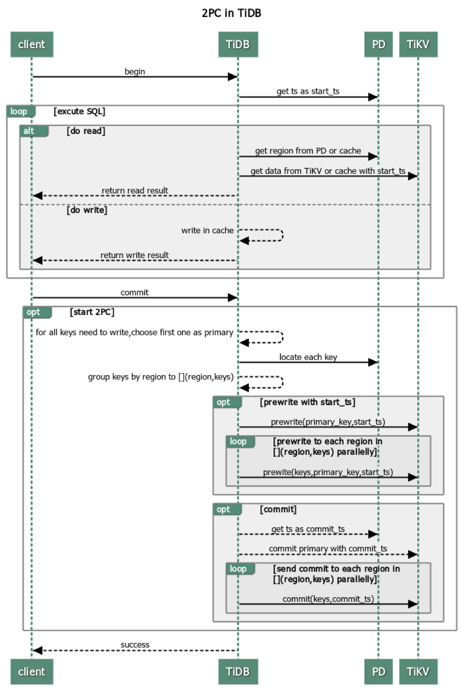
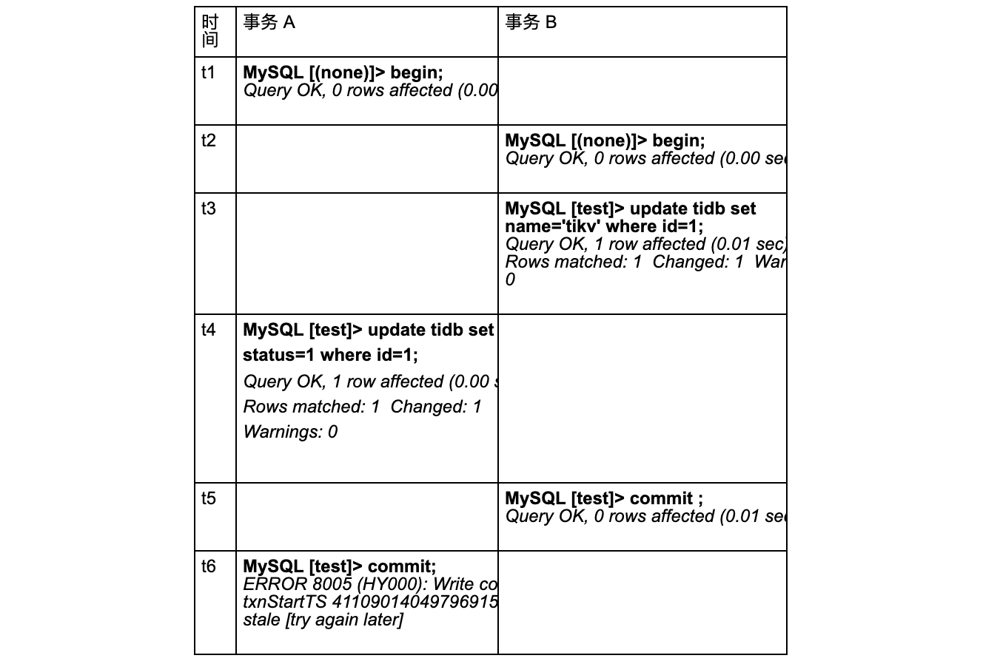
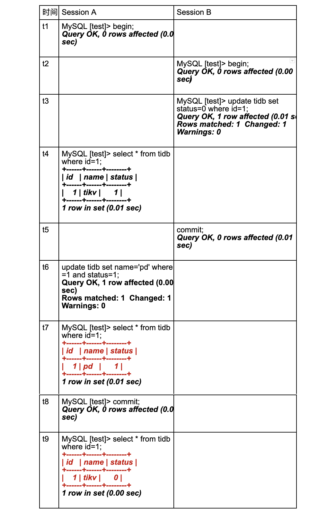
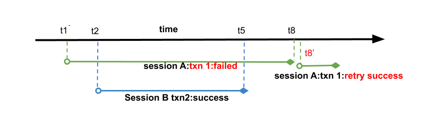
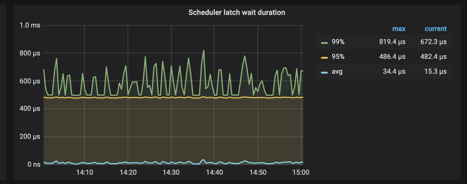

>TiDB 最佳实践系列是面向广大 TiDB 用户的系列教程，旨在深入浅出介绍 TiDB 的架构与原理，帮助用户在生产环境中最大限度发挥 TiDB 的优势。我们将分享一系列典型场景下的最佳实践路径，便于大家快速上手，迅速定位并解决问题。

在前两篇的文章中，我们分别介绍了 [TiDB 高并发写入常见热点问题及规避方法](https://pingcap.com/blog-cn/tidb-in-high-concurrency-scenarios/) 和 [PD 调度策略最佳实践](https://pingcap.com/blog-cn/best-practice-pd/)，本文我们将深入浅出介绍 TiDB 乐观事务原理，并给出多种场景下的最佳实践，希望大家能够从中收益。同时，也欢迎大家给我们提供相关的优化建议，参与到我们的优化工作中来。

建议大家在阅读之前先了解 [TiDB 的整体架构](https://pingcap.com/docs-cn/v3.0/architecture/#tidb-%E6%95%B4%E4%BD%93%E6%9E%B6%E6%9E%84) 和 [Percollator](https://www.usenix.org/legacy/event/osdi10/tech/full_papers/Peng.pdf) 事务模型。另外，本文重点关注原理及最佳实践路径，具体的 TiDB 事务语句大家可以在 [官方文档](https://pingcap.com/docs-cn/v3.0/reference/transactions/overview/) 中查阅。

## TiDB 事务定义

TiDB 使用 Percolator 事务模型，实现了分布式事务（建议未读过该论文的同学先浏览一下 [论文](https://www.usenix.org/legacy/event/osdi10/tech/full_papers/Peng.pdf) 中事务部分内容）。

说到事务，不得不先抛出事务的基本概念。通常我们用 ACID 来定义事务（[ACID 概念定义](https://en.wikipedia.org/wiki/ACID)）。下面我们简单说一下 TiDB 是怎么实现 ACID 的：

* A（原子性）：基于单实例的原子性来实现分布式事务的原子性，和 Percolator 论文一样，TiDB 通过使用 Primary Key 所在 region 的原子性来保证。
* C（一致性）：本身 TiDB 在写入数据之前，会对数据的一致性进行校验，校验通过才会写入内存并返回成功。
* I（隔离性）：隔离性主要用于处理并发场景，TiDB 目前只支持一种隔离级别 Repeatable Read，即在事务内可重复读。
* D（持久性）：事务一旦提交成功，数据全部持久化到 TiKV， 此时即使 TiDB 服务器宕机也不会出现数据丢失。

截止本文发稿时，TiDB 一共提供了两种事务模式：乐观事务和悲观事务。那么乐观事务和悲观事务有什么区别呢？最本质的区别就是什么时候检测冲突：

* 悲观事务：顾名思义，比较悲观，对于每一条 SQL 都会检测冲突。
* 乐观事务：只有在事务最终提交 commit 时才会检测冲突。

下面我们将着重介绍乐观事务在 TiDB 中的实现。另外，想要了解 TiDB 悲观事务更多细节的同学，可以先阅读本文，思考一下在 TiDB 中如何实现悲观事务，我们后续也会提供《悲观锁事务最佳实践》给大家参考。

## 乐观事务原理

有了 Percolator 基础后，下面我们来介绍 TiDB 乐观锁事务处理流程。



TiDB 在处理一个事务时，处理流程如下：

1. 客户端 begin 了一个事务。

	a. TiDB 从 PD 获取一个全局唯一递增的版本号作为当前事务的开始版本号，这里我们定义为该事务的 `start_ts`。

2.  客户端发起读请求。

	a. TiDB 从 PD  获取数据路由信息，数据具体存在哪个 TiKV 上。
	
	b. TiDB 向 TiKV 获取 `start_ts` 版本下对应的数据信息。

3.  客户端发起写请求。

	a. TiDB 对写入数据进行校验，如数据类型是否正确、是否符合唯一索引约束等，确保新写入数据事务符合一致性约束，**将检查通过的数据存放在内存里**。

4.  客户端发起 commit。

5. TiDB 开始两阶段提交将事务原子地提交，数据真正落盘。

	a. TiDB 从当前要写入的数据中选择一个 Key 作为当前事务的 Primary Key。

	b. TiDB 从 PD 获取所有数据的写入路由信息，并将所有的 Key 按照所有的路由进行分类。

	c. TiDB 并发向所有涉及的 TiKV 发起 prewrite 请求，TiKV 收到 prewrite 数据后，检查数据版本信息是否存在冲突、过期，符合条件给数据加锁。
	
	d. TiDB 收到所有的 prewrite 成功。
	
	e. TiDB 向 PD 获取第二个全局唯一递增版本，作为本次事务的 `commit_ts`。
	
	f. TiDB 向 Primary Key 所在 TiKV 发起第二阶段提交 commit 操作，TiKV 收到 commit 操作后，检查数据合法性，清理 prewrite 阶段留下的锁。
	
	g. TiDB 收到 f 成功信息。

6. TiDB 向客户端返回事务提交成功。

7. TiDB 异步清理本次事务遗留的锁信息。

### 优缺点分析

从上面这个过程可以看到， TiDB 事务存在以下优点：

* 简单，好理解。
* 基于单实例事务实现了跨节点事务。
* 去中心化的锁管理。

缺点如下：

* 两阶段提交，网络交互多。
* 需要一个中心化的版本管理服务。
* 事务在 commit 之前，数据写在内存里，数据过大内存就会暴涨。

基于以上缺点的分析，我们有了一些实践建议，将在下文详细介绍。

## 事务大小

### 1. 小事务

为了降低网络交互对于小事务的影响，我们建议小事务打包来做。如在 auto commit 模式下，下面每条语句成为了一个事务：

```
# original version with auto_commit
UPDATE my_table SET a='new_value' WHERE id = 1; 
UPDATE my_table SET a='newer_value' WHERE id = 2;
UPDATE my_table SET a='newest_value' WHERE id = 3;
```

以上每一条语句，都需要经过两阶段提交，网络交互就直接 \*3， 如果我们能够打包成一个事务提交，性能上会有一个显著的提升，如下：

```
# improved version
START TRANSACTION;
UPDATE my_table SET a='new_value' WHERE id = 1; 
UPDATE my_table SET a='newer_value' WHERE id = 2;
UPDATE my_table SET a='newest_value' WHERE id = 3;
COMMIT;
```

同理，对于 insert 语句也建议打包成事务来处理。

### 2. 大事务

既然小事务有问题，我们的事务是不是越大越好呢？

我们回过头来分析两阶段提交的过程，聪明如你，很容易就可以发现，当事务过大时，会有以下问题：

* 客户端 commit 之前写入数据都在内存里面，TiDB 内存暴涨，一不小心就会 OOM。
* 第一阶段写入与其他事务出现冲突的概率就会指数级上升，事务之间相互阻塞影响。
* 事务的提交完成会变得很长很长 ～～～

为了解决这个问题，我们对事务的大小做了一些限制：

* 单个事务包含的 SQL 语句不超过 5000 条（默认）
* 每个键值对不超过 6MB
* 键值对的总数不超过 300,000
* 键值对的总大小不超过 100MB


**因此，对于 TiDB 乐观事务而言，事务太大或者太小，都会出现性能上的问题。我们建议每 100～500 行写入一个事务，可以达到一个比较优的性能。**

## 事务冲突

事务的冲突，主要指事务并发执行时，对相同的 Key 有读写操作，主要分两种：

* 读写冲突：存在并发的事务，部分事务对相同的 Key 读，部分事务对相同的 Key 进行写。
* 写写冲突：存在并发的事务，同时对相同的 Key 进行写入。

在 TiDB 的乐观锁机制中，因为是在客户端对事务 commit 时，才会触发两阶段提交，检测是否存在写写冲突。所以，在乐观锁中，存在写写冲突时，很容易在事务提交时暴露，因而更容易被用户感知。

### 默认冲突行为

因为我们本文着重将乐观锁的最佳实践，那么我们这边来分析一下乐观事务下，TiDB 的行为。

默认配置下，以下并发事务存在冲突时，结果如下：



在这个 case 中，现象分析如下：


* 如上图，事务 A  在时间点 `t1` 开始事务，事务 B 在事务 `t1` 之后的 `t2` 开始。
* 事务 A、事务 B 会同时去更新同一行数据。
* 时间点 `t4` 时，事务 A 想要更新 `id = 1` 的这一行数据，虽然此时这行数据在 `t3` 这个时间点被事务 B 已经更新了，但是因为 TiDB 乐观事务只有在事务 commit 时才检测冲突，所以时间点 `t4` 的执行成功了。
* 时间点 `t5`，事务 B 成功提交，数据落盘。
* 时间点 `t6`，事务 A 尝试提交，检测冲突时发现 `t1` 之后有新的数据写入，返回冲突，事务 A 提交失败，提示客户端进行重试。

根据乐观锁的定义，这样做完全符合逻辑。

### 重试机制

我们知道了乐观锁下事务的默认行为，可以知道在冲突比较大的时候，Commit 很容易出现失败。然而，TiDB 的大部分用户，都是来自于 MySQL；而 MySQL 内部使用的是悲观锁。对应到这个 case，就是事务 A 在 `t4` 更新时就会报失败，客户端就会根据需求去重试。

换言之，MySQL 的冲突检测在 SQL 执行过程中执行，所以 commit 时很难出现异常。而 TiDB 使用乐观锁机制造成的两边行为不一致，则需要客户端修改大量的代码。 为了解决广大 MySQL 用户的这个问题，TiDB 提供了内部默认重试机制，这里，也就是当事务 A commit 发现冲突时，TiDB 内部重新回放带写入的 SQL。为此 TiDB 提供了以下参数,

* [`tidb_disable_txn_auto_retry`](https://pingcap.com/docs-cn/v3.0/reference/configuration/tidb-server/tidb-specific-variables/#tidb_disable_txn_auto_retry)：这个参数控制是否自动重试，默认为 `1`，即不重试。

* [`tidb_retry_limit`](https://pingcap.com/docs-cn/v3.0/reference/configuration/tidb-server/tidb-specific-variables/#tidb_retry_limit)：用来控制重试次数，注意只有第一个参数启用时该参数才会生效。

如何设置以上参数呢？推荐两种方式设置：

1. session 级别设置：

	```
	set @@tidb_disable_txn_auto_retry = 0;
	set @@tidb_retry_limit = 10;
	```

2. 全局设置：

	```
	set @@global.tidb_disable_txn_auto_retry = 0;
	set @@global.tidb_retry_limit = 10;
	```

### 万能重试

那么重试是不是万能的呢？这要从重试的原理出发，重试的步骤：

1.  重新获取 `start_ts`。
2.  对带写入的 SQL 进行重放。
3.  两阶段提交。

细心如你可能会发现，我们这边只对写入的 SQL 进行回放，并没有提及读取 SQL。这个行为看似很合理，但是这个会引发其他问题：	

1.  `start_ts` 发生了变更，当前这个事务中，读到的数据与事务真正开始的那个时间发生了变化，写入的版本也是同理变成了重试时获取的 `start_ts` 而不是事务一开始时的那个。
2.  如果当前事务中存在更新依赖于读到的数据，结果变得不可控。

打开了重试后，我们来看下面的例子：
 


我们来详细分析以下这个 case：



+ 如图，在 session B 在 `t2` 开始事务 2，`t5` 提交成功。session A 的事务 1 在事务 2 之前开始，在事务 n2 提交完成后提交。

+ 事务 1、事务 2 会同时去更新同一行数据。

+ session A 提交事务 1 时，发现冲突，tidb 内部重试事务 1。

    - 重试时，重新取得新的 `start_ts` 为 `t8’`。
    
    - 回放更新语句 `update tidb set name='pd' where id =1 and status=1`。
    
        i. 发现当前版本 `t8’` 下并不存在符合条件的语句，不需要更新。
        
        ii. 没有数据更新，返回上层成功。

+ tidb 认为事务 1 重试成功，返回客户端成功。

+ session A 认为事务执行成功，查询结果，在不存在其他更新的情况下，发现数据与预想的不一致。

这里我们可以看到，对于重试事务，如果本身事务中更新语句需要依赖查询结果时，因为重试时会重新取版本号作为 `start_ts`，因而无法保证事务原本的 `ReadRepeatable` 隔离型，结果与预测可能出现不一致。

综上所述，如果存在依赖查询结果来更新 SQL 语句的事务，建议不要打开 TiDB 乐观锁的重试机制。

### 冲突预检

从上文我们可以知道，检测底层数据是否存在写写冲突是一个很重的操作，因为要读取到数据进行检测，这个操作在 prewrite 时 TiKV 中具体执行。为了优化这一块性能，TiDB 集群会在内存里面进行一次冲突预检测。

TiDB 作为一个分布式系统，我们在内存中的冲突检测主要在两个模块进行：

+ TiDB 层，如果在 TiDB 实例本身发现存在写写冲突，那么第一个写入发出去后，后面的写入就已经能清楚地知道自己冲突了，没必要再往下层 TiKV 发送请求去检测冲突。

+ TiKV 层，主要发生在 prewrite 阶段。因为 TiDB 集群是一个分布式系统，TiDB 实例本身无状态，实例之间无法感知到彼此的存在，也就无法确认自己的写入与别的 TiDB 实例是否存在冲突，所以会在 TiKV 这一层检测具体的数据是否有冲突。

其中 TiDB 层的冲突检测可以关闭，配置项可以启用：


>txn-local-latches：事务内存锁相关配置，当本地事务冲突比较多时建议开启。
>
>+ enable
>	- 开启
>	- 默认值：false
>+ capacity
>	- Hash 对应的 slot 数，会自动向上调整为 2 的指数倍。每个 slot 占 32 Bytes 内存。当写入数据的范围比较广时（如导数据），设置过小会导致变慢，性能下降。
>	- 默认值：1024000

 
细心的朋友可能又注意到，这边有个 capacity 的配置，它的设置主要会影响到冲突判断的正确性。在实现冲突检测时，我们不可能把所有的 Key 都存到内存里，占空间太大，得不偿失。所以，真正存下来的是每个 Key 的 hash 值，有 hash 算法就有碰撞也就是误判的概率，这里我们通过 capacity 来控制 hash 取模的值：

* capacity 值越小，占用内存小，误判概率越大。

* capacity 值越大，占用内存大，误判概率越小。

在真实使用时，如果业务场景能够预判断写入不存在冲突，如导入数据操作，建议关闭。

相应地，TiKV 内存中的冲突检测也有一套类似的东西。不同的是，TiKV 的检测会更严格，不允许关闭，只提供了一个 hash 取模值的配置项：

>+ scheduler-concurrency
>    - scheduler 内置一个内存锁机制，防止同时对一个 Key 进行操作。每个 Key hash 到不同的槽。
>    - 默认值：2048000


此外，TiKV 提供了监控查看具体消耗在 latch 等待的时间：



**如果发现这个 wait duration 特别高，说明耗在等待锁的请求上比较久，如果不存在底层写入慢问题的话，基本上可以判断这段时间内冲突比较多。**


## 总结

综上所述，Percolator 乐观事务实现原理简单，但是缺点诸多，为了优化这些缺陷带来的性能上和功能上的开销，我们做了诸多努力。但是谁也不敢自信满满地说：这一块的性能已经达到了极致。

时至今日，我们还在持续努力将这一块做得更好更远，希望能让更多使用 TiDB 的小伙伴能从中受益。与此同时，我们也非常期待大家在使用过程中的反馈，如果大家对 TiDB 事务有更多优化建议，欢迎联系我 [wuxuelian@pingcap.com](mailto:wuxuelian@pingcap.com) 。您看似不经意的一个举动，都有可能使更多饱受折磨的互联网同学们从中享受到分布式事务的乐趣。
