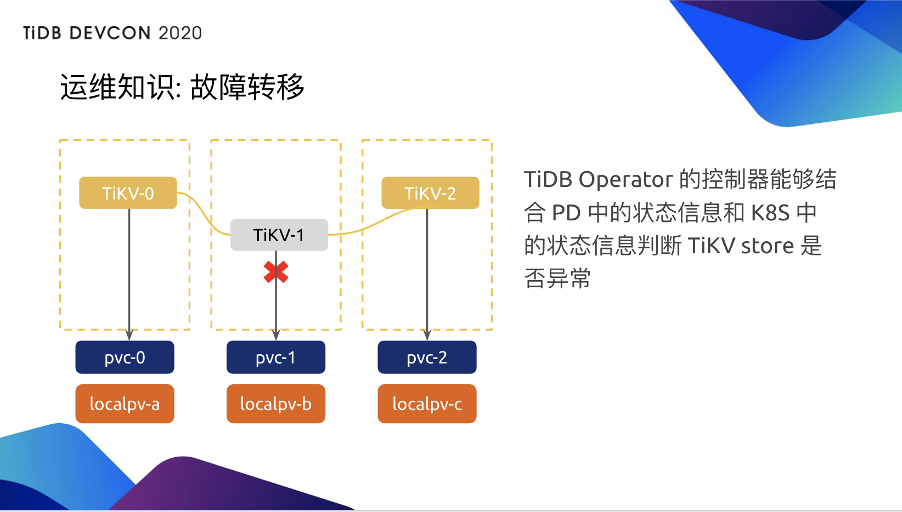
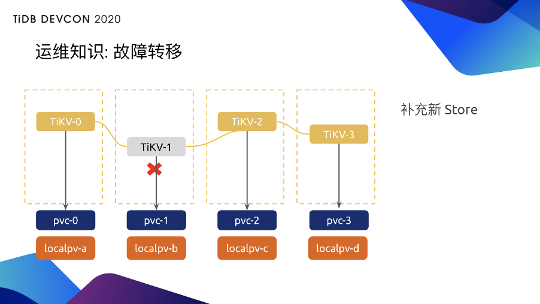
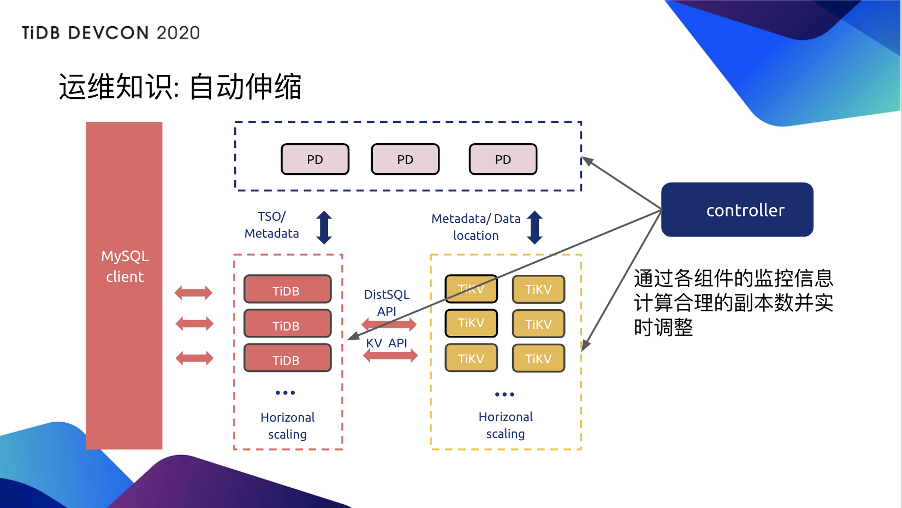

>作者介绍：吴叶磊  PingCAP Cloud 工程师。

随着 Kubernetes（K8s） 的全面成熟，越来越多的组织开始大规模地基于 K8s 构建基础设施层。然而，考虑到数据库在架构中的核心地位与 K8s 在有状态应用编排上的短板，仍有不少组织认为在 K8s 上运行核心数据库会带来颇高的风险。事实上，在 K8s 上运行 TiDB 不仅能实现企业技术栈的统一，降低维护成本，还能带来更高的可用性与安全性。本次分享将介绍 TiDB 在 K8s 上的运维管理系统 TiDB Operator，再从各类故障场景入手剖析 TiDB on K8s 如何实现高效的故障自愈并保障数据安全。最后，我们会分享来自国内外一线公司的 TiDB Operator 生产环境案例，并总结出一套 TiDB on K8s 最佳实践。

## 要不要在 Kubernetes 上运行 TiDB ？

这个问题其实一直以来也有很多的争议。大家都知道，Kubernetes 的很多概念是为无状态应用（比如微服务）所设计的。由于云原生技术的不断普及，Kubernetes 目前在国内外的很多技术领域都得到大规模的落地，有一种全盘上 Kubernetes 的趋势。但在这期间也有不少人提出了质疑，比如：是不是所有的业务场景都适合 Kubernetes ？我们的组织是不是真的需要 Kubernetes？这样的争议，其实这背后的各种声音都有各自的出发点。

首先 Kubernetes 有没有价值？肯定有价值，它的普及度就是很好的证明。那 Kubernetes 有没有问题？当然也有问题，比如， Kubernetes 会增上技术上的复杂度，此外它还有有比较大的迁移成本。

回到 TiDB 要不要在 Kubernetes 上面运行这个问题。答案其实往往来自于你当前的技术栈和技术团队。

举个例子，假如你的大部分应用已经上了 Kubernetes，而且你的工程师也对 Kubernetes 很熟悉，在 Kubernetes 上去做一些业务，他感觉非常舒服，那么 TiDB 就不该成为一个例外。换句话说，如果当前整个组织的业务都已经上 Kubernetes 了，但还需要专门招一个运维团队在虚拟机上运维 TiDB 的话，不仅会增加额外的维护成本，也没办法发挥出技术栈投资的规模优势。

那么，在 K8s 运行 TiDB，我们想要什么呢？**通常，我们想要的是 TiDB 可以和我们在 K8s 上运行的微服务一样，可以做到声明式管理，通过 K8s 实现 TiDB 的自动化运维以及弹性资源配置**。我想扩容的时候，并不需要去专门开新的物理机，专门购买一批机器，而是直接从整个的 K8s 资源池中，弹性的给 TiDB 分配一些资源进行扩容，然后再缩容之后又把这些资源还回去。

可是，现在的情况是，即使很多公司已经上了 K8s，但对于把数据库放在 K8s 上运行还是有一定的担忧，这个担忧主要在哪儿呢？

**从我个人了解到的信息来说，核心是稳定性，稳定性，最后还是稳定性**，因为毕竟我们要上的是数据库。几年前，大家刚开始上 K8s 的时候，会觉得我的业务上在 K8s 上用的很爽，那要不要把数据库也搞上去？那总会有一种声音是，数据库怎么能上 K8s 呢？我们数据库的稳定性要求比 K8s 还要高啊！假如  K8s 挂了，那可能只是线上的微服务无法提供服务，但是假如数据库挂了，我们不仅无法提供服务，还有可能面临数据丢失的风险。所以通常来说，在组织中，数据库可靠性是处于一个核心地位的，也因此在数据库上 K8s 时，一个核心的担忧就是可靠性。

那么，我们在部署传统数据库应用的时候，是怎么保证稳定性的？一般来说，是开几台固定的物理机，然后我们会把数据库的 Binary 传上去运行起来，这时候要点就是，运行起来之后只要不出问题就不要再动它（If it works don't touch it）。即使要动它，也需要经过一个非常严苛的审计流程和预演，保证它最佳的稳定性。听起来，对于传统的关系型数据库而言，高度动态化的 K8s 环境并不是一个很好的解决方案。

**那为什么还会推荐大家把 TiDB 放在 K8S 上运行呢？**

**第一点，TiDB 本身能够适应动态化的 K8S 环境**。

- TiDB 可以多副本做容错，当挂掉一个集群当中的小数节点并不会对整个集群的运行产生影响；

- TiDB 能够很好的借助 K8s 环境做水平伸缩；

- TiDB 提供了开箱自用的可观测性，大家基本上把 TiDB 部署起来，就可以看到 TiDB 的所有指标，即使是在一个动态化混部的环境里面，也能很清楚的明白 TiDB 现在的状态是什么，即使有副本挂掉，也没有问题。

**第二点，反回来，K8s 也能很高效的去撬动 TiDB 的潜力**。

- 声明式 API 简化集群管理，作为一个分布式数据库，TiDB 的管理会比传统的单机数据库相对复杂一点，而在 K8s 上，它的声明是 API，就能把这一点多出来的复杂度很好的消化掉；

- 弹性资源池简化扩容缩与故障转移， TiDB 的故障容忍和无限的水平伸缩都需要额外的资源，比如说，我们去横向扩张 TiDB 集群时，需要申请一部分新的资源进来，在故障容错之后，要做故障转移把故障副本数补齐。那么 K8s 的弹性资源池就能很好的把 TiDB 在水平伸缩和故障容忍上的潜力发挥出来。

因此， TiDB 和 K8s 能够非常好的进行一个结合，并且释放出更大的潜力达成 1+1 大于 2 的效果的。这当然不是一个巧合，这背后的原因是，TiDB 和 K8s 都遵循同样的云原生最佳实践原则。那么假如说我们已经熟悉 TiDB 和 K8s 的知识，只要稍微花费一些工夫，用 K8s 的云原生对象就可以部署一个 TiDB 集群，而且能运行的不错。

但是，TiDB 和 	Kuberentes 都有大量的最佳实践，基本上你想快速看完是有点困难的。 那么，我们在 K8s 上部署 TiDB 的时候，应该怎样去遵守最佳实践呢？一个基本的办法就是把这些坑都了解清楚，并且写非常多的 run book 来告诉 SRE team，怎么去运维好它们。 run book 需要口口相传，需要不断的进行知识的交互、交流。但其实大家都知道，程序员一般不喜欢做这个。

我们更喜欢把这些知识写成代码，做自动化。那么，我们怎么样把这些东西写成代码自动化呢？

## 你的 TiDB on Kubernetes 运维专家：TiDB Operator

答案就是 TiDB Operator 。 TiDB Operator 是什么？本质就是利用 K8s 本身的扩展机制，把领域性的运维知识编写成代码，大家可以把 TiDB Operator 理解为在 K8s 上运行 TiDB 的运维专家，把一个专家型人物对 TiDB 和 K8s 的所有知识都编写成了代码。

TiDB Operator 首先添加了一组自定义类型，比如说 TiDB Cluster，代表一个 TiDB 集群，可以在这些类型里描述你想要的 TiDB 长什么样；第二，TiDB Operator 添加了一组自定义控制器，这组自定义控制器就是这些运维知识的集合，它会用这些代码化的知识帮助你自动化的运维 K8s 上的 TiDB 集群。

看一个例子：首先是自定义类型，当 TiDB Operator 把自定义类型添加到 K8s 中后，作为用户就可以提交资源定义到 K8s 里面，比如我们需要一个 TiDB 集群，这个集群要的版本是什么，要多少 PD，要多少 KV。以及我们可以定义一个 TiDBMonitor 对象，用来监控 TiDB，在对象定义里则只需要定义我们要监控哪一个 TiDB 就可以了。

那么，大家可以发现，我们在做这些资源定义时是遵循 K8s 本身的声明式定义的。那这些的理想状态由谁来实现呢？——由自定义控制器。自定义控制器会把所有的需求和 K8s 集群里的实际状态做一个对比，对比之后就能发现两者的不同，就需要把实际状态向期望状态转移。比如说我们把刚刚的 TiDB 集群对象和 TiDB 监控对象提交到 K8s ，那么 TiDB Operator 的控制器就会帮助我们创建很多的容器以及监控。

当然，仅仅只有创建是不够的，TiDB Operator 中还集成了 TiDB 运维专家的所有的领域知识，下面我分享几个运维知识。

### 运维知识：部署

1. TiDB Operator 会为每个组件选择最佳的 K8s 原生对象；

2. 会自动地引导 PD 做 Peer Discovery，无需手工配置；

3. 最重要的，还会打散 TiKV 容器并自动添加 store-label ，辅助 PD 实现 Region 高可用拓扑。

### 运维知识：升级

滚动升级 TiKV 的时候，给每个 TiKV 实例发个 SIGTEM，这时 TiKV 其实只会做一些基本的 Graceful Shutdown 操作。那就有一个问题，TiKV 退出时并不会主动的把所有的 Raft Leader 都迁移出去。假设我们有比较大的流量，滚动升级时让没有受影响的 Raft Group 被动地去做一个 leader 超时重新选举，那很可能会导致我们的数据库延迟会有一定的抖动。

那么 TiDB Operator 怎么做升级呢？在每次升级一个 TiKV 的容器之前，Operator 会先调用 PD 接口，把 TiKV 上边的 leader 全部迁移完，不接收读写请求后才会去重建 TiKV 的容器。依次往复，比如把 TiKV2 迁完了，就要把 TiKV2 重建， TiKV2 重建后，又可以把 leader 迁上去，接收请求，然后下一个就是把 TiKV1 的 leader 迁完，再往下。实现一个优雅的滚动升级。

### 运维知识：故障转移

比如，现在 TiKV1 运行的不正常，那么 Operator 的控制器就可以结合 PD 里的 TiKV1 对应的 store 状态信息和 K8s 里它所在容器的状态信息，来判断这一个 TiKV 的 store 是否异常。判断逻辑大致是 store 处于异常状态，并且持续超过一定时间。检测到异常后隔多久再做故障恢复以及怎么样判断是否发生异常，本身也是一种运维知识。

那 Operator 有了这些知识并且把它代码化之后，就可以在检测到异常后，过一段合理的时间后再补充新的 store ，把副本数补齐。这样即使我们接下来 TiKV2 再挂，那集群就不会受影响，这就是 Operator 帮助我们做的故障转移。

Operator 在最新版里还提供了 on to scaling 的功能，我们去查看集群当中的所有的组件的监控信息，并且根据这些监控信息，做自动的扩缩容，可想而知就需要更多的支持了。

大家可能会想，尽管 Operator 带来了这么多好处，但我还是担心假如用 Operator 上了 K8s 之后会有一些问题。比如，上 K8s 会带来多少性能损耗？会影响我的稳定性吗？假如 K8s 挂了，我的数据库会不会受影响呢？一个 TiDB 和 K8s 的领域专家是可以解答这些问题的，因此，TiDB Operator 当然也可以。

### 运维知识：性能

1. TiDB Operator 支持独享节点与混部，可以按照优先级权衡性能与成本；

2. 自动化运维知识考虑了本地盘，使用本地盘就可以消除远程存储的损耗；

3. 支持 K8s 的 HostNetwork 部署集群，消除二层网络开销，所以说在一定的配置下，用 TiDB Operator 部署 TiDB 其实是可以做到零 overhead 的。

### 运维知识：稳定性

1. K8s Master 故障不会影响集群，因为只是控制节点故障，跑 TiDB 的节点并没有故障；

2. K8s Node 故障会帮我们做自动故障转移；

3. 假如 K8s 的整个集群所有节点都故障了怎么办？Operator 本身有一个默认配置是在这种情况下会保留所有的存储，首先先保证数据不丢。

4. 假设真的是发生了灾难性的故障，整个机房比如说被水淹了怎么办？Operator 本身也会帮你做周期的备份，至少可以找回最近一次的备份，把你的数据先恢复到某个近期的时间点上。

Operator 开箱即用给我们很多稳定性上的增强，也就是说在稳定性方面， Operator 给了我们一个很好的基石，我们可以继续在基石上再做一些增强，这可以省很多的工夫，并且获得更好的稳定性。

## 最佳实践案例

最后再来看两个案例，第一个案例是日本某领先的在线支付公司。该公司现在是用 Operator 部署了 100 多个数据库节点，生产环境有 30 多个由 Operator 管理的节点。该公司当时在做 PoC 时，做了相当详尽的故障演练，包括各种进程故障、节点故障、以及 AWS 整个可用区故障和还有灾难恢复。比如模拟 AWS 整个全挂了，还能不能通过周期性备份把集群恢复出来，当时也是这些所有的故障演练都很好的通过了该公司的审核，才得以放心把整套集群放到到 TiDB Operator 和 K8s 上来。

第二案例是我们国内的某消费金融公司。上线的是系统归档和跑批业务，整个线上集群是有 60 多个物理节点，他们最显著的一点就是在用了 TiDB Kuberentes 之后，整个混部的硬件成本下降到原来物理机部署的 30% 左右。因此在整体的性价比上是一个巨大的提升。

最后总结一下，什么是 TiDB 在 K8s 上的最佳实践？其实只有一句话，Keep Calm and Use TiDB Operator。当然，用 TiDB Operator 本身还是需要一定的上手成本的，这点我们也在不断的做改进，大家可以参考我们的官网，看一下 TiDB Operator 的 [一系列文档](https://docs.pingcap.com/zh/tidb-in-kubernetes/stable)，让这个运维专家来为你的 TiDB Kuberentes 之旅保驾护航。

