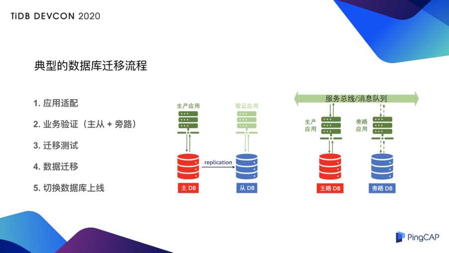
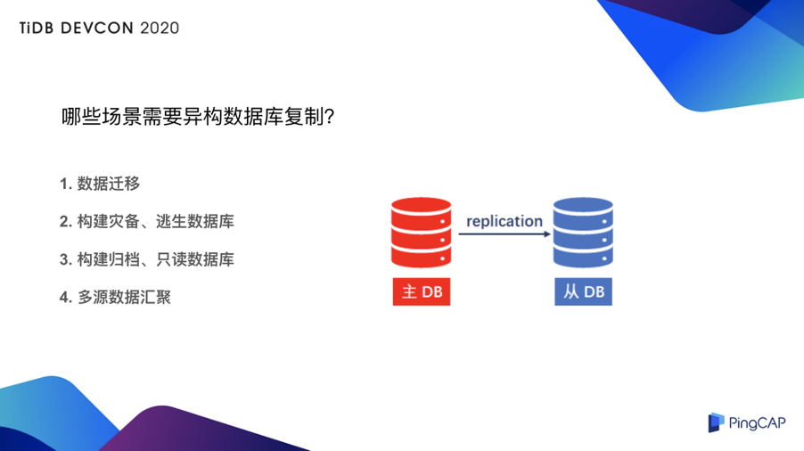
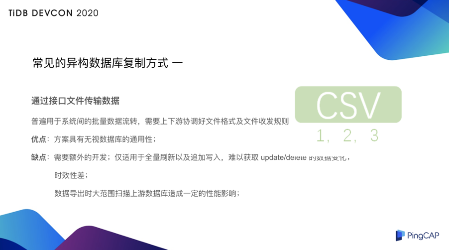
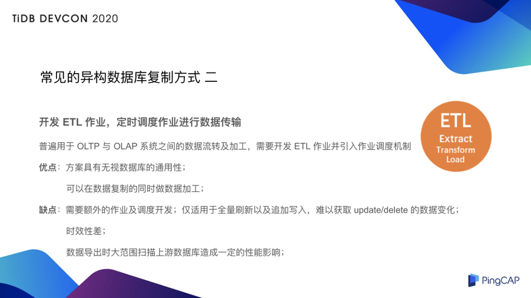
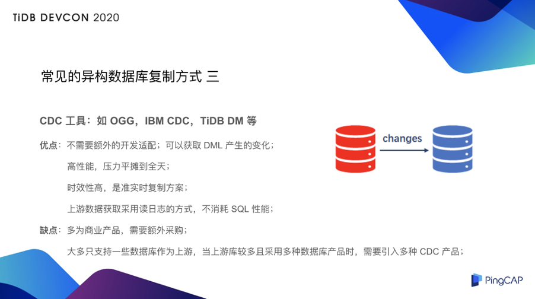
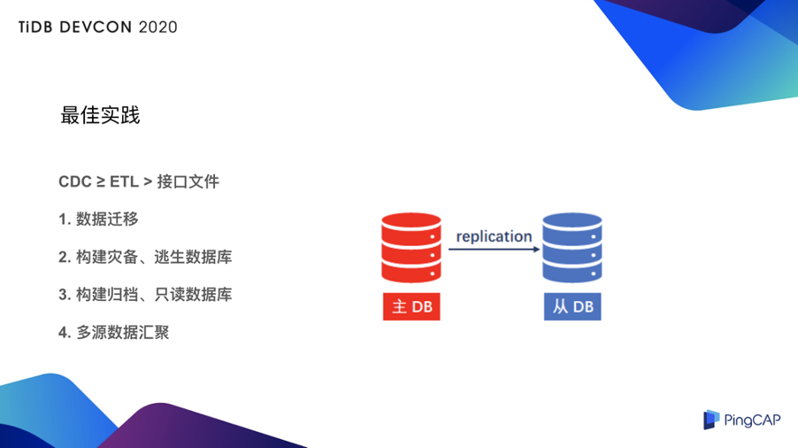

>作者简介：秦天爽，PingCAP 解决方案事业部架构总监。

纵观现有业务系统的分布式改造，其中一个难点在于数据库的迁移：

* 迁移使用全量还是增量？
* 在线还是离线？
* 使用现成的工具还是开发作业？
* ……

用户往往面对多种选择。下面将为大家分享 PingCAP 团队在多年的实践中积攒的大量异构平台迁移经验，以及数据库复制技术的更多应用场景。

## 典型的数据库迁移流程

说到异构数据库复制，没办法避开的一个话题就是异构数据库的迁移，我们先看一下典型的异构数据库迁移的流程：

典型的数据库迁移有以下流程：

### 1. 应用适配开发

早期的 TiDB 用户或多或少都经历过这个过程，比如 TiDB 在比较早期的版本是仅有乐观锁，仅有 RR 隔离级别，事务大小限制大约是 100MB ，在应用适配这方面确实要有一些投入，但是在 [TiDB 4.0 版本](https://pingcap.com/blog-cn/tidb-4.0-the-leading-real-time-htap-database-is-ready-for-cloud/) 中悲观锁也走向了成熟，另外配合 RC 隔离级别的支持，还有大事务的加持，事务量有了 100 倍的扩大，应用适配方面会让用户投入的成本变得更低。

### 2. 业务验证测试

先介绍第一个维度，用生产的数据进行测试。这里需要先用数据库复制的技术（后文会详细介绍）把生产库复制到 TiDB 中之后，在上面加一个测试的应用就可以做一些压测，甚至可以做高于真正的生产流量 10 倍、20 倍的压力对 TiDB 进行压力测试，来确保你上线的时候 TiDB 是稳定的。为什么要一定复制一份到 TiDB 里呢？原因相信很多朋友也碰到过，比如有一条 SQL，在测试环境的时候我把这条 SQL 已经调的非常优化了，但是业务上了线，偏偏这条 SQL 成为了「慢 SQL」，**这是由于测试数据跟生产数据偏差太大所导致的，所以这里我们必须用数据库复制的技术来做。**

第二个维度是使用生产的流量来测，这里就要借助一种类似于银行的 ESB 这种服务总线或者像 MQ 技术，比如使用 Kafka 这样的消息队列的机制来实现生产流量的多路复制，也就是说生产环境的一笔业务的成功与失败，是取决于你现有的生产库，这个我们就叫做生产业务的主路；还有一个生产业务的旁路，我们在旁路上加载了一个适配过 TiDB 的应用，下面挂着 TiDB 来做一个旁路的验证工作。以上两种方式相结合，就可以做一个比较充分的业务验证。

### 3. 迁移测试

这部分可能是更多的验证在停机窗口这段时间里面做的一些操作，要提前走一遍流程来验证一下你的迁移手册是不是可行的、迁移窗口是不是足够，比如迁移的回退测试，假如这次上线由于什么原因失败了，你可能要回退到之前的数据库，这部分也需要做充分的测试准备。

### 4. 数据迁移、切换数据库上线

这两个步骤属于上线的阶段，我们很多用户的业务都是 24×7 运行，或者每年内只有一个很短的停机窗口来允许你进行切库的操作，所以我们的数据迁移要在停机窗口之前来完成，尽早开始来做数据迁移，这里也用到了异构数据库复制的技术。在停机窗口时间段内，我们只要把业务停下来，追平增量的数据，然后进行一个数据的比对，再经过一些测试业务的验证就可以进行切库上线的动作，一旦切库上线成功之后，就进入了一个把 TiDB 切为主库的生产的模式了。

## 数据库复制技术的应用场景

从上面的流程可以看到，异构数据库复制迁移的一个非常重要的场景。还有一些场景也可以用到异构数据库复制的技术，如下图所示：

**比如创建一个异构的灾备库、逃生库**，假设你的主库是 Oracle，然后你想用 TiDB 给这个 Oracle 做一个灾备库是完全可行的，“逃生库”更多的是指我们新上线了 TiDB，我对 TiDB 可能没有过多的验证，可能缺乏一些信心，所以想把 Oracle 接在 TiDB 后面做一个逃生库，就是说当 TiDB 万一由于什么原因崩溃了，我能及时的迁回之前的生产库。这个情况下也要用到异构数据库复制技术。

**另外，就是创建归档库、只读库这种类型的场景**，比如我们有一些银行客户，银行核心是运行在封闭系统，可能短期内是没办法迁移到开放平台、迁移到分布式数据库，但是有一些只读的业务，比如我在手机 App 上去查我个人的流水、个人账单，甚至月度的汇总这些操作，没必要去访问我的生产核心库（生产核心只接着那些真正的交易的流量），这些只读的流量可以通过数据库复制的技术同步到 TiDB 里面，然后在 TiDB 里做只读操作，这个场景也要用到异构数据库复制的技术。

**另外有一些用户是生产库**，由于是传统单机数据库容量是比较有限的，但是用户的业务增量又很大，用户判断短期内没办法迁移到分布式数据库里面，考虑一个方案就是：这么重要的业务，我能不能在我的生产库里只保存一段时间的数据（比如只保存 30 天、40 天），超期的数据就在生产库里面删掉，但是这些数据在后面挂着的 TiDB 里是可以查到的，换句话说，这些删除操作只在生产库中运行，而用 TiDB 来构建一个归档库。

**除此之外，还有一些用户是把 TiDB 作为一个类似于数据中台的角色**，用户可能很多业务的交易系统都是 OLTP 的，希望通过数据库复制的技术来把这些多元的数据汇聚到同一个 TiDB 里面，之后用户可以在 TiDB 的基础上做一些深度分析，或者一些只读查询，最主要是将数据汇聚到 TiDB 之后解决跨库查询的问题。这些数据库可能是异构的，没办法做像 Oracle 那样的 DBLink，因为 DBLink 只能做 Oracle 到 Oracle 的，把这些数据汇总到一起之后，有一种类似于我们传统的 ODS 这样一个角色。

## 异构数据库复制方式

接下来我们看一下常见的异构数据库复制的方式。

### 1. 通过接口文件传输数据

通过接口文件传输数据被大量应用于 OLTP 跟 OLAP 之间的数据流转，也被大量的应用于不同的组织之间的数据传输。比如现在有一种模式，互联网可以作为一个流量的入口，承载了很多针对终端用户的比如贷款之类的应用，这个是批量生成一个文件的方式把这个文件通过定义好的规则，定义好的格式发送给真正承载这些贷款的银行，就是通过接口文件的方式来进行的。因为涉及两个不同的组织之间的数据传输，我们很难打通这两者之间的数据库的网络，而且数据库毕竟还是比较偏后台的系统，从安全上讲也不合适直接打通数据库之间的连接。

CSV 就是一种典型的接口文件，但是我们这里说的并不是数据库本身的 CSV 导入导出功能，比如像 TiDB 4.0 里支持了 select into outfile 这种导出 CSV 的能力。这里面的接口文件实际上指的是通过应用，比如你的 java 代码通过 select 语句把数据读出来，满足按照定义好的格式、定义好的分隔符、定义好的换行来生成一个文件，在接收端因为大家已经协定好了文件的格式，接收端就是根据这个规则来解析这个文件，然后转成 insert 语句来导入到目标数据库里面，可以看出这个方案具有无视数据库的通用性，只要上下游数据库支持标准的 SQL 接口就可以使用接口文件来做数据的传输。

**缺点也显而易见：**

*   需要额外的开发，这个开发是需要一定的工作量在你的应用代码里面的，比如你之前是用 java 开发的，就要增加一部分逻辑，如果上游增加一部分生成这个文件的逻辑，下游就要增加一部分导入这个文件的逻辑，而且为了性能，可能还要考虑怎么去控制并发，以提升性能。

*   接口文件的方式难以获取 update 和 delete 操作的变化，也就是说要不然是全量刷新，要不然就是追加的写操作，比如 append 写这种。

*   时效性比较差，现今时代，尤其是 5G 也逐渐普及，大家的终端设备对于延迟的要求都很高，像我们了解到银行，逐渐从传统的 T+1 的分析方式再往 T+0 甚至准实时分析去靠拢，这种接口文件的方式很难去控制时效性，因为他是通过文件或者通过时间来触发的，频度包括效率都不是特别高。

*   数据导出的时候由于走了 SQL 接口，所以要大范围的扫描上游的数据库造成一定的性能影响，因此一般的做法是上游会从从库上来开放 SQL 接口做只读导出文件传给下游。

### 2. 开发 ETL 作业，定时调度作业进行数据传输

第二种方式是 ETL，比如开发 ETL 作业，定时的调度这个作业来进行数据传输，这个也是普遍应用于 TP 跟 AP 系统之间的一个数据的流转及加工。

如果是需要长时间运行的话，而不只是一次性的把数据库读出来写到一个目标库里，那么就可能需要长时间的去获取一些增量，写到目标库里面，这个时候就需要一个作业调度的能力了，会涉及一些额外的开发。这个方式的优点跟接口文件类似，因为都是 SQL 接口，所以这个方案也具有无视数据库的通用性，只要上下游数据库支持 SQL 就可以用 ETL 方式来开发。另外这个方式有一个独到的地方，因为 ETL 中间有一个 transform，就是说中间可以对这个数据做一些加工，假设你的上游跟你的下游表结构不一样，甚至有一些需要逻辑加工的东西在这里面，这时候可能 ETL 就是一个不二之选了。这个方案的缺点跟前面的接口文件的方式也比较类似：

* **首先是要额外开发**，但大家需要注意的是这其中的开发并不是在你的应用代码里面，而是独立出一套单独的作业，这作业多是以 SQL 形式来体现的，然后要独立完成一个调度系统，相当于对你的系统做了一个外接的东西，架起来这一套外接的东西并让他同时能访问到上游、下游库，才可以运行起来。

* **使用 ETL 的方式也是难以获取 update 和 delete 的数据变化的，另外时效性比接口文件略好，但也不是特别好，这取决于你调度的频率**。而调度的频率实际上也是依赖每一次调度之后这些作业处理的时间，比如这个作业每一次导入数据的时候，可能要处理五分钟，那延迟最高的时候可能要到达 5 分钟甚至 10 分钟。

* **另外通过 SQL 接口去访问数据，会大范围的扫描上游数据库来造成一定的性能影响。**

### 3. CDC 工具

接下来再看看第三种方式，**也是我们比较推荐的方式，就是 CDC 工具**，它的全称是增量数据捕获工具，比如 Oracle  OGG，IBM Inforsphere CDC，还有 [TiDB DM](https://pingcap.com/blog-cn/dm-1.0-ga/) 都是这类产品。

**CDC 工具的原理是通过读取上游的 redo log 来生成 SQL 语句返给下游，他可以获取所有的 DML 的变化，像 delete、update 都是可以获取的，另外他的性能相对于前两种方式会比较高，因为只要上游生成了 redo log 下游就可以进行输出，延迟也是比较低的，具有准实时的特点**。

这种产品多为商业产品，需要额外的采购。另外这些产品大多数只支持单一的数据库作为上游，比如仅支持 Oracle 本身，仅支持 MySQL 或者支持开放平台的 Db2 作为上游，其他类型的数据库可能没办法用 OGG 来传输数据给 TiDB，当用户的上游的数据库种类特别多的时候，就需要引入多种 CDC 产品。

## 最佳实践

最后再来分享一下最佳实践，如下图所示：

实际上，当你需要增量复制的时候，而且需要获得像 delete 和 update 这样的增量数据的时候，CDC 是不二之选；当你仅需要全量复制，那么用 ETL 这种工具，比如 Kettle 或者 DataX 这种专门用于数据迁移的 ETL 工具会轻量很多，因为你不需要去采购 CDC，不需要去搭建其他架构来完成这个复制，只需要让 DataX 等能同时访问上下游的数据库，写好这个作业之后就可以做全量数据传输了。

在“构建灾备、逃生数据库”，“构建归档、只读数据库”、“多源数据汇聚” 的场景下，我们更建议使用 CDC 来做，因为不管是灾备、逃生、归档、只读还是多源数据的汇聚，通过 ETL 作业完成所有 DML 数据的获取，整个开发成本是非常高的。

顺便提一下，TiDB DM 工具可以做到的是：只要你的上游是类 MySQL 的数据库或者基于 MySQL 开发的数据库（比如很多公有云上的 RDS，包括 Aurora，还有一些基于 MySQL 开发的分库分表的产品），都可以使用 TiDB DM 来作为一个数据传输工具，关于 DM 更多详情可以参考这篇文章《[TiDB Data Migration（DM） 架构设计与实现原理](https://pingcap.com/blog-cn/tidb-ecosystem-tools-3/)》

>本文整理自秦天爽在 [TiDB DevCon 2020](https://pingcap.com/community-cn/devcon2020/) 上的演讲，大会相关视频回顾可以关注官方 Bilibili 账号 [TiDB_Robot](https://space.bilibili.com/86485707)。

