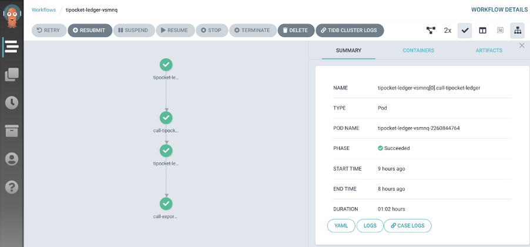
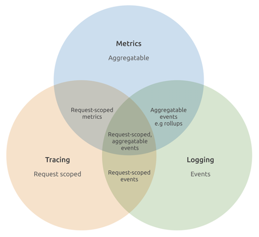
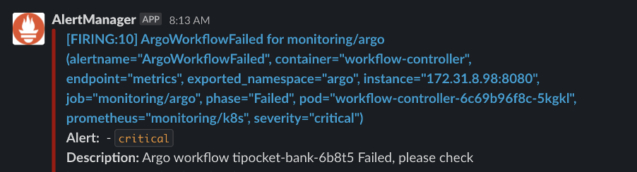
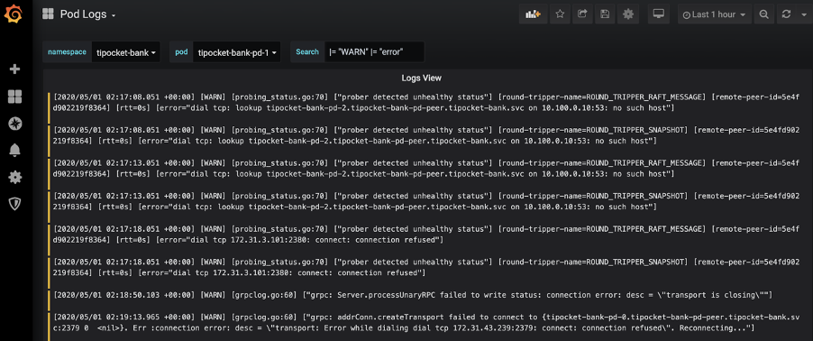

---   
title: 基于 Chaos Mesh® 和 Argo 打造分布式测试平台
author: ['叶奔','殷成文']
date: 2020-06-29
summary:  本文介绍我们是如何在 Chaos Mesh 和 Argo 的基础上打造自己的自动化测试平台 TiPocket]，实现完全自动化的混沌测试，构成混沌测试完整闭环。
tags: ['Chaos Mesh','TiPocket']
---  

不久前我们开源了基于 Kubernetes 的混沌测试工具 [Chaos Mesh®](https://chaos-mesh.org)，Chaos Mesh 提供了模拟系统异常状况的能力，但这只是混沌工程中的一环，完整混沌工程核心原则包含了系统稳定状态的定义，提出假设，运行实验，以及验证和改进。本篇文章主要介绍我们是如何在 Chaos Mesh 和 [Argo](https://argoproj.github.io/) 的基础上打造自己的自动化测试平台 [TiPocket](https://github.com/pingcap/tipocket)，实现完全自动化的混沌测试，构成混沌测试完整闭环。

## 为什么需要 TiPocket? 

为了确保用户的数据安全，我们需要确保给用户提供的每一个 TiDB 版本都已经经过了严格的测试，所以我们为 TiDB 设计了各种异常场景，并实现了数十个测试 Case， 所以在我们的 Kubernetes 集群中，可能同时运行着十几个甚至几十个混沌实验，即使我们拥有了 Chaos Mesh 来帮助我们管理错误注入，但这还远不够，我们还需要去管理 TiDB 集群，需要去收集指标，需要去分析结果，同时进行如此多的混沌实验，另一方面，我们还需要对 TiDB 生态中的其他工具进行混沌测试，这是无法想象的，因此，我们开发了 TiPocket 来解放自己。

**TiPocket 是一个基于 Kubernetes 和 Chaos Mesh 的完全自动化测试框架，目前我们主要使用它用来测试 TiDB 集群，不过由于它 All-in-k8s 的特性以及可扩展的接口，它目前也支持测试 TiDB 生态中的其他组件，只要简单的添加应用在 Kubernetes 中 Create/Delete 的逻辑，就可以很轻松的添加对各种应用的支持。**

## Chaos Mesh 提供故障模拟的能力 

故障注入可以说是混沌测试中重要的一环，并且对于分布式数据库 TiDB 来说，可能遇到的故障又非常的多，不仅仅是节点故障，各种网络故障，文件系统故障，更甚至可能遇到内核故障，如果 TiDB 不能正确的处理这些异常，那么后果是无法想象的，这也是最开始我们开发 Chaos Mesh 的主要原因之一。TiPocket 中很好的结合了 Chaos Mesh，将 Chaos Mesh 作为最基本的依赖之一，以达到混沌测试中故障注入的目的。 


目前我们已经在 TiPocket 提供了多种类型的故障注入： 

*   Network：基于 Chaos Mesh 的 NetworkChaos，提供模拟的网络分区，或者链路随机的丢包，乱序，重复，时延等。

*   Time Skew：基于 TimeChaos，模拟待测试容器发生时间偏移。Time Chaos的实现也是非常有趣，感兴趣的话可以参考我们以前的 [文章](https://pingcap.com/blog/simulating-clock-skew-in-k8s-without-affecting-other-containers-on-node/)。

*   Kill：通过 PodChaos 来 kill 对应的 pod。细分下来我们也实现了多种kill类型，最简单的就是随机删除集群内的任意pod；如果针对各个组件，也有专门的 Chaos 随机 kill 一个或两个 TiKV 节点，或者是专门 kill PD 的leader 节点。

*   IO：基于 IOChaos，我们用的比较多的是给 TiKV 注入 IO Delay，再去看写入的情况。

解决了故障注入的问题，那么接下来我们就需要判断我们的系统在 TiDB 注入了故障后，是否符合预期呢？

## 如何判断 TiDB 是否正常？ 

为了高效的达成这目标，TiPocket 中实现了数十个测试 Case 并结合不同的检查工具来验证 TiDB 是正常。下面会用几个测试 Case 为例，简要介绍 TiPocket 是如何验证 TiDB 的。  

### Fuzz 测试：[SQLsmith](https://github.com/pingcap/tipocket/tree/master/pkg/go-sqlsmith) 

SQLsmith 是一个生成随机 SQL 的工具，TiPocket 分别创建一个 TiDB 集群和一个 MySQL 实例，使用 go-sqlsmith 生成的随机 SQL 分别在 TiDB 和 MySQL 上执行，并对 TiDB 集群注入各种故障，最后对比执行的结果，如果出现结果不一致的情况，那么我们可以判断我们的系统存在问题。

### 事务一致性测试：Bank/Porcupine

#### 1. [Bank](https://github.com/pingcap/tipocket/tree/master/cmd/bank)

银行测试是模拟一个银行系统中的转账流程。在这个测试中，我们创建一系列模拟银行账户，并随时选择两个账户使用事务进行相互转账，一个账户减去一定的金额，另一个账户增加对应的金额，这样的交易不断的并发执行着。在快照隔离下，所有的转账都必须保证每一个时刻所有的账户的总金额是相同的。TiDB 即使在注入各种故障的情况下，依然需要保证这样的约束是成立的，一旦约束被破坏，那么就可以判断此时的系统是不符合预期的。 

#### 2. [Porcupine](https://github.com/anishathalye/porcupine) 

Porcupine 一个用 Go 实现的线性一致性验证工具。是基于 [P-compositionality](http://www.kroening.com/papers/forte2015-li.pdf) 算法，P-compositionality 算法利用了线性一致性的 Locality 原理，即如果一个调用历史的所有子历史都满足线性一致性，那么这个历史本身也满足线性一致性。因此，可以将一些不相关的历史划分开来，形成多个规模更小的子历史，转而验证这些子历史的线性一致性。在 TiPocket  有许多 Case 中使用了 [Pocupine 检查器](https://github.com/pingcap/tipocket/tree/master/pkg/check/porcupine)去检查生成的历史，从而判断 TiDB 是否满足线性一致性的约束。 

### 事务隔离级别测试：[Elle](https://github.com/jepsen-io/elle)

Elle 是用来验证数据库事务隔离级别的检查工具。Elle 是一个纯黑盒的测试工具，巧妙的构造了一个测试场景，通过客户端生成的历史构造出依赖关系图，通过判断依赖图中是否有环以及分析环来确定事务的出现的异常类型，来确定事务的隔离级别。在 TiPocket 中，我们参考 Elle 项目，实现了 Go 版本的 Elle 检查工具 [go-elle](https://github.com/pingcap/tipocket/tree/master/pkg/elle), 并结合 go-elle 工具来验证 TiDB 的隔离级别。

这些只是 TiPocket  中用来验证 TiDB 正确性的一小部分，如果读者有兴趣可以自行阅读相关 [源码](https://github.com/pingcap/tipocket)，查看更多的验证方法。现在我们有了故障注入，有了待测的 TiDB 集群，有了检验 TiDB 的方式，那么我们该如让这些混沌实验自动化的运行起来呢？如何最大化的利用资源呢？在下一小节我们会介绍 TiPocket 中是如何解决这个问题的。

## Argo 让流程自动化起来  

和大多数的工程师一样，我们第一个想法是自己开发，造轮子，让 TiPocket 具备调度的功能和管理的功能，但是考虑到我们目前的人力和时间，并且我们知道目前已经有很多开源的工具可以提供类似的功能，所以最后我们选择让 TiPocket  更加纯粹，将调度和管理交给更加合适的工具去负责。在考虑到我们  All-in-K8s 的特性，[Argo](https://github.com/argoproj/argo) 就成为我们不二的选择。


Argo 是一个为 Kubernetes 而设计的工作流引擎，很早就在社区中开源，并且马上得到了广泛的关注和应用。像在知名的 [kubeflow](https://www.kubeflow.org/) 项目中，就大量使用了 Argo。下面我们首先来介绍下 Argo 的基本概念，再来讲讲如何结合 TiPocket 和 Argo。

Argo 为工作流抽象出了几种 [CRD](https://kubernetes.io/docs/concepts/extend-kubernetes/api-extension/custom-resources/)。最主要的包括了 Workflow Template、Workflow 以及 Cron Workflow。

*   Workflow Template 可以理解成工作流的模版，我们可以为每个不同的测试任务预先定义好模版，实际运行测试时传入不同的参数。

*   Workflow 将多个工作流模版进行编排，以不同的顺序组合起来进行执行，即实际运行的任务。基于 Argo 本身提供的能力，我们还可以在 pipeline 中实现条件判断、循环、DAG 等多种复杂的能力。

*   Cron Workflow 顾名思义，以 cron 的方式运行 Workflow，非常适合我们想要长期运行某些测试任务的情况。 

下面我们看一个简单示例：

```
spec:
  entrypoint: call-tipocket-bank
  arguments:
    parameters:
      - name: ns
        value: tipocket-bank
            - name: nemesis
        value: random_kill,kill_pd_leader_5min,partition_one,subcritical_skews,big_skews,shuffle-leader-scheduler,shuffle-region-scheduler,random-merge-scheduler
  templates:
    - name: call-tipocket-bank
      steps:
        - - name: call-wait-cluster
            templateRef:
              name: wait-cluster
              template: wait-cluster
        - - name: call-tipocket-bank
            templateRef:
              name: tipocket-bank
              template: tipocket-bank
```

上面的示例中是我们定义的 Bank 测试的 Workflow。示例中我们用到了 Workflow template 以及使用参数定义我们需要的故障注入，这样我们就可以重复使用模版，根据不同的测试场景来同时运行多个 Workflow。在 TiPocket 中我们的故障注入是使用 nemesis 参数定义，也就是说我们提供了大量的故障注入，当用户想要使用的时候，只需要设置对应的参数即可，当然用户可以可以自己拓展 TiPocket  去增加更多的故障注入。更多的 Workflow 以及模版的示例，可以在 [TiPocket](https://github.com/pingcap/tipocket/tree/master/argo/workflow) 的仓库中找到。使用 Argo 可以很好的处理各种复杂的逻辑，可以做到以写代码的方式去定义我们 Workflow，这对于开发者来说十分友好, 这也是我们选择 Argo 的重要原因之一。

现在我们的混沌实验自动化跑起来了，这时候如果我们的的结果不符合预期，我们该如何去定位我们的问题呢？幸运的是 TiDB 中会保存丰富的监控信息，但是 Log 也是必不可少的。因此我们需要一个更好的日志收集手段，让我们的系统具有更好的可观测性。

## Loki 提高实验的可观测性  

可观察性，在云原生中系统中是非常重要的一环。通常来说可观察性主要包含 Metrics （指标）， Logging（日志） 和 Tracing（追踪）。由于 TiPocket 中主要运行的 test case，都是针对于测试 tidb 集群，常依靠metrics 和日志就能够定位问题。



Metrics 不用多说，Prometheus 已经成为了在 Kubernetes 监控的事实标准。然而对于日志，却没有一个统一的答案。比如 elasticsearch, fluent-bit 以及 Kibana 的解决方案，尽管这一套系统运行良好，但是却会消耗比较多的资源，并且维护成本太高。最终我们放弃了 EFK 的方案，而是采用了 [Grafana](https://grafana.com/) 开源的 [Loki](https://github.com/grafana/loki) 项目来作为日志的解决方案。

Loki 采用了跟 Prometheus 一样的 label 系统，我们可以很轻松的将 Prometheus 的监控指标与对应 pod 的日志结合起来，并且使用类似的查询语言去查询。另外 Grafana 目前也已经支持了 Loki dashboard，所以只需要使用 Grafana 就同时展示监控指标和日志了，非常方便。另一方面，TiDB 自带的监控系统中也含有 Grafana 组件，这样我就可以直接复用此 Grafana。

## 看一下效果 

上面介绍了这么多，最后让我们看一下在 TiPocket 中一个完整的混沌实验到底是什么样子的呢？

1.  创建 Argo Cron Workflow 任务，在这个 Cron Workflow 中定义待测试的集群，注入的故障，用来检查 TiDB 集群正确性的测试 Case，以及任务的执行时间等。在 Cron Workflow 在运行过程中有需要的话还支持实时查看 case 的日志。

	

2.  集群内部通过 Prometheus-operator 运行了 Prometheus。在 Prometheus 中配置了针对 Argo workflow 的告警规则。如果任务失败，则会发送到 Alertmanager，再由 Alertmanager 发送到 Slack channel 通知结果。

	

3.  警报中包含了对应 Argo Workflow 的地址，在 Workflow 页面中我们可以直接点击链接跳转到 Grafana 查找集群监控及日志。此时就可以进入下图的日志 Dashboard 进行查询了。

	


	不过这个时候也由不太方便的地方。目前在 Grafana logs dashboard 中，没有办法设置日志查询的 step 参数。这个参数用来控制日志查询时的采样，并且为了控制查询的数量，它会随着你查询的总时间而自动调整。比如查询 1 分钟的日志，step 会自动配置成 1s；查询1天的日志，step 可能变成了 30s, 在这个时候就会有部分日志展示不出来。所以一般推荐尽量加入多的过滤条件进行搜索，或者使用 Loki 的命令行工具 logcli 将所有日志下载下来再查询。

4.  如果测试 Case 正常结束，那么集群会正常清理，等待 Argo 调度下一次测试的执行。


**以上就是我们如何利用 Chaos Mesh 和一些开源项目打造自动化混沌测试平台的完整流程。如果你也对混沌工程感兴趣的话，欢迎一起参与 [TiPocket](https://github.com/pingcap/tipocket) 和 [Chaos Mesh](https://github.com/pingcap/chaos-mesh) !**
