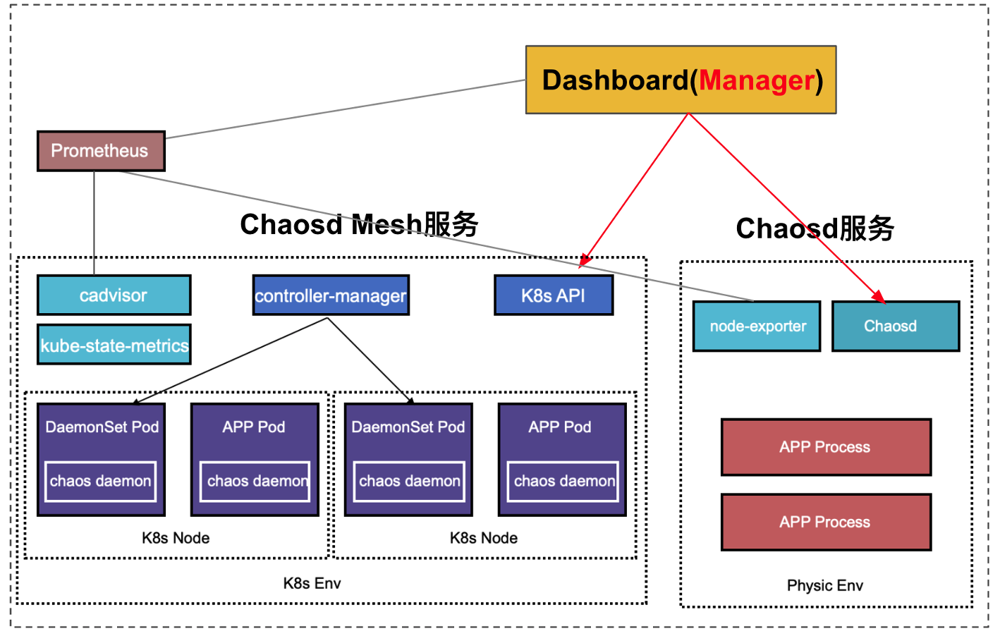

## Chaosd 是什么？

相信大家对 Chaos Mesh 已经比较了解了：支持多种类型的混沌实验，有 Dashboard web 界面直接管理实验，TiDB 使用它保障产品质量，还有小鹏汽车、网易、某银行等众多用户。这么好的工具当然想亲手试一试，动手的时候发现：没有 K8s 环境用不了！

这是因为 Chaos Mesh 是云原生的混沌工程测试平台，专门为 K8s 设计的。然而你的应用还是用物理机环境部署的，太遗憾了，有故障的时候看告警邮件吧。

请留步，试试 Chaosd？

可能你还是第一次听说 Chaosd，它是 Chaos Mesh 提供的一款混沌工程测试工具，用于在物理机环境上注入故障，并提供故障恢复功能。看它的名子是不是和 Chaos Mesh 中的组件 chaos-daemon 比较相似？是的，它正是由 chaos-daemon 演化而来，并针对物理机的特点增加了一些专门的混沌实验功能。

## Chaosd 有什么优势

Chaosd 具有以下这些优点：

- 易用性强：输入简单的 Chaosd 命令即可创建混沌实验，并对实验进行管理。

- 故障类型丰富：在物理机的不同层次、不同类型上都提供了故障注入的功能，包括进程、网络、JVM、压力、磁盘、主机等，且更多的功能在不断扩展中。

- 支持多种模式：Chaosd 既可作为命令行工具使用，也可以作为服务使用，满足不同场景的使用需求。

说了这么多，让我们来试一试。最近我们刚发布了 [v1.0.1](https://github.com/chaos-mesh/chaosd/releases/tag/v1.0.1) 版本，就用这个版本来简单演示一下。

## Chaosd 的使用

### 1. 下载

首先要下载 Chaosd，执行以下命令：

curl -fsSL -o chaosd-v1.0.1-linux-amd64.tar.gz [https://mirrors.chaos-mesh.org/chaosd-v1.0.1-linux-amd64.tar.gz](https://mirrors.chaos-mesh.org/chaosd-v1.0.1-linux-amd64.tar.gz)

解压这个文件，可以看到它包含一个 chaosd 文件和一个 tools 文件夹。chaosd 是工具的入口；tools 文件夹下面包含执行混沌实验所需要的一些工具，包括 stress-ng（压力场景）、byteman（JVM 故障）、PortOccupyTool（网络故障占用端口）等。
 
### 2. 创建实验

我们以创建一个网络类型的混沌实验为例，注入故障，使服务器无法访问 chaos-mesh.org，执行以下命令：

sudo ./chaosd attack network loss --percent 100 --hostname chaos-mesh.org --device ens33
Attack network successfully, uid: c55a84c5-c181-426b-ae31-99c8d4615dbe

简单来说，这个命令的作用是：通过 ens33 网卡向 chaos-mesh.org 发送或者接收的网络包会 100% 丢失。使用 sudo 是因为该实验会修改网络规则， 需要 root 权限。

此外，别忘了保存好这个实验的 uid，用于后续的实验恢复。
 
### 3. 检查实验效果

让我们通过 ping 命令来检查是否可以正常访问 chaos-mesh.org：
ping chaos-mesh.org
PING chaos-mesh.org (185.199.109.153) 56(84) bytes of data.
^C
--- chaos-mesh.org ping statistics ---
2 packets transmitted, 0 received, 100% packet loss, time 1021ms

执行命令后会卡住，迟迟得不到响应，按 CTRL C 退出后可以看到 ping 的统计信息：100% packet loss。说明我们的实验确实生效了。

### 4. 恢复实验

运行以下命令恢复实验：

sudo ./chaosd recover c55a84c5-c181-426b-ae31-99c8d4615dbe
Recover c55a84c5-c181-426b-ae31-99c8d4615dbe successfully

恢复实验时也会修改网络规则，因此也需要使用 sudo。在执行完成后，可以再 ping chaos-mesh.org 确认网络已经恢复。 
 
## 后续的规划

### 提高易用性 & 平台化

从上面的使用示例中可以看到，Chaosd 用起来还是挺简单的，通过命令行就可以创建实验。但是肯定有些人还不太满意：有 Dashboard web 界面能用吗？ 答案是：目前还没有，但是已经在着手开发了。

我们会继续加强它的易用性，提供 Dashboard web 管理功能，不仅可以管理物理机上 Chaosd 的实验，还可以管理 Chaos Mesh 上的实验，这样就把物理机环境和 K8s 环境的混沌实验统一管理起来。在去年的 TiDB Hackathon 中我们简单做了一个 demo，架构如下：

详细介绍可以参考 [Chaos Mesh® 的 Chaos Engineering as a Service 探索之路](https://pingcap.com/blog-cn/chaos-engineering-as-a-service/)。
 
### 更多的故障注入功能

目前 Chaosd 提供了进程、网络、JVM、压力、磁盘、主机总共六大故障注入功能，但是仍然需要继续拓展。后续我们计划将 Chaos Mesh 在 K8s 环境支持的一些故障注入功能在 Chaosd 中实现，包括 HTTP、IO 等。

大家可以通过 Chaosd 的[使用文档](https://chaos-mesh.org/website-zh/docs/chaosd-overview)，尝试创建一些混沌实验来体验一下。在使用过程中遇到什么问题，或者有新的需求，都可以提 [issue](https://github.com/chaos-mesh/chaosd/issues) 来反馈。

