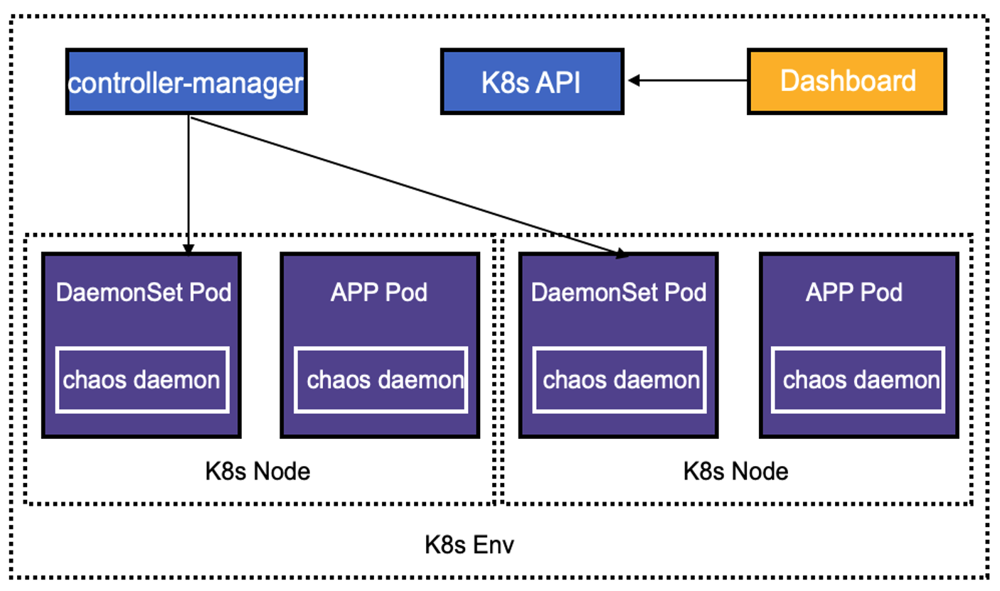
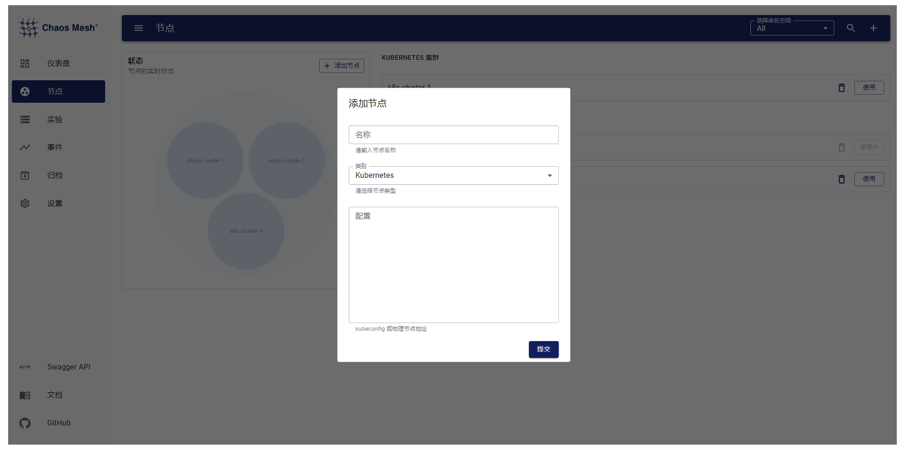
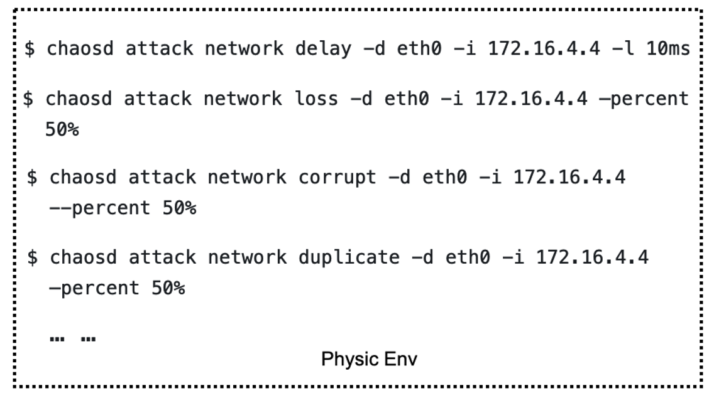
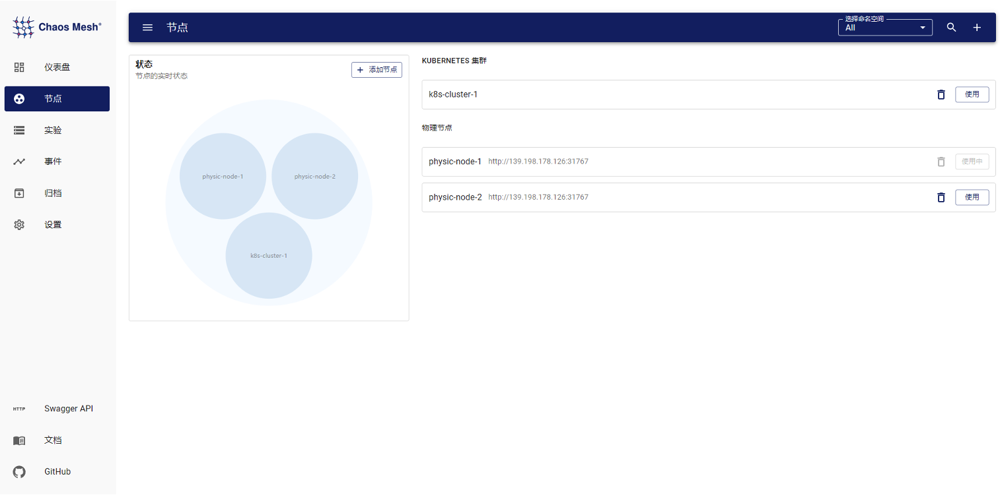
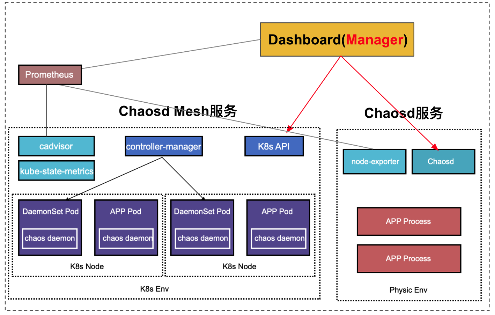
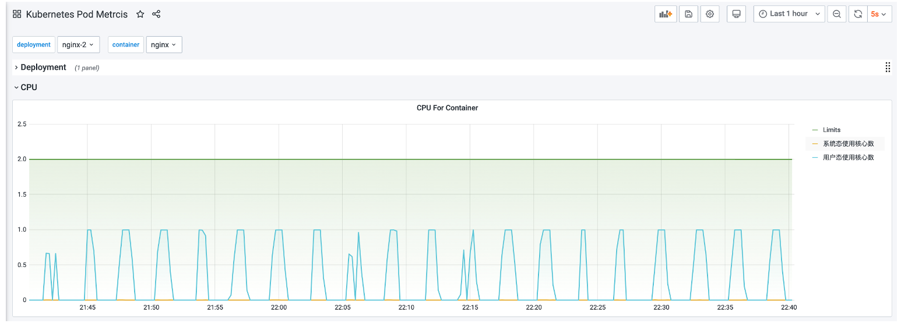
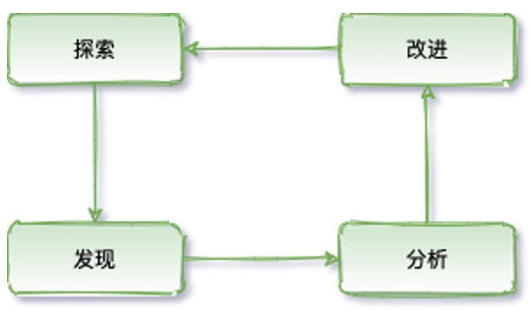
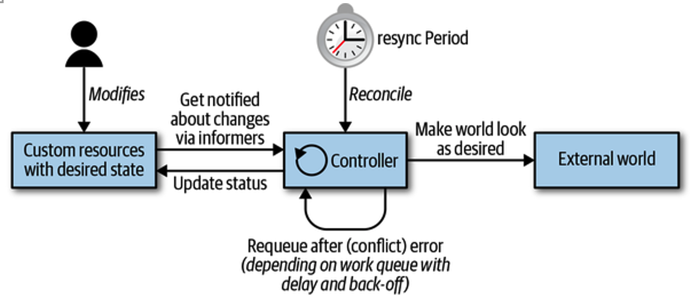

Chaos Mesh 已经开源一周年了，目前是 CNCF 的 sanbox 项目，在国内外发展良好，有了很多的 Contributor 和关注度。

但是目前 Chaos Mesh 仍然存在一些需要继续建设的方面：

1.  不够易用。很多 Chaos 功能较为复杂，用户在创建 Chaos 实验后，往往需要人工确认实验是否生效，缺乏 Metrics 以及与监控系统的联动。

2.  基本上只支持 K8s 环境。每个 K8s 集群都需要部署一个 Chaos Mesh，无法统一进行管理。支持物理机的 Chaosd 较为简陋，只是一个命令行工具，只支持少量的 Chaos 实验。

3.  无法插件化。目前添加自定义 Chaos 只能通过修改源码，暂不支持插件以及 Go 以外的语言。

4.  不支持编排。没有办法对 Chaos 实验进行编排与管理，也无法闭环做一些回调操作。

总体来说，Chaos Mesh 更像一个工具，距离 Chaos Engineering as a Service 还需要继续建设，并且还有很大的想象空间。

## 混沌工程即服务（Chaos Engineering-As-a-Service）

文章 [The benefits of chaos engineering-as-a-service](https://jaxenter.com/chaos-engineering-service-144113.html) 是这么定义的：

CAAS（ChaosEngineering-As-a-Service）意味着可以快速的看到直观的图形化界面，开箱即用的集成一切需要进行实验的东西。业界也有基于 CAAS 提供服务的厂商，比如 [Germlin](https://www.gremlin.com/)。

我的解读，Chaos Engineering as a Service 需要有一个统一的管理入口，可以便捷地通过界面操作，填写配置，创建 Chaos 实验；可以看到实验的状态和一些监控指标数据，对比任务周期的效果；可以做一些暂停、归档等操作管理实验；可以拖拽式编排 Chaos 实验。

目前已经有一些公司基于自己真实的需求对 Chaos Mesh 进行了“魔改”，让它更像 Chaos Engineering as a Service，比如[网易伏羲](https://chaos-mesh.org/blog/how-a-top-game-company-uses-chaos-engineering-to-improve-testing)、[FreeWheel](https://mp.weixin.qq.com/s/0monDPkAlMk7Yhq9swW7gQ)。另外我们也在 TiDB Hackathon 2020 的比赛中做了一个相关的课题，大致有了 Chaos Engineering as a Service 的雏形。

## TiDB Hackathon 2020 的实践

### 架构改造

基于 Chaos Engineering as a Service 的理念，我们对 Chaos Mesh 进行改造。Chaos Mesh 目前的架构比较适合单 K8s 集群使用，而且是只针对 K8s 环境设计的。架构图如下：

我们对 Chaos Mesh 的架构进行了简单的调整，将 Dashboard 独立出来，不再与某个特定的 K8s 环境绑定。如果 Dashboard 部署在 K8s 集群外，则通过界面添加 K8s 集群；如果 Dashboard 部署在集群内，则可以通过环境变量自动获取集群信息。 

可以通过 Dashboard 注册 Chaos Mesh（实际注册的是 K8s 配置），Chaos Mesh 的 Controller Manager 组件也可以通过配置主动向 Dashboard 主动注册。Dashboard 与 Controller Manager 的交互通过 CRD 来完成。Controller Manager 监听到有 chaos-mesh 的 CRD 事件后，会调用 Chaos Daemon 做相应的 chaos 实验操作，因此只要 Dashboard 可以操作 CRD，即可完成对 Chaos 实验的管理。

运行在物理机上的 Chaosd，原本是命令行的形式，而且功能比较单一。

我们改造了 Chaosd，支持 RESTful API。将 Chaosd 的服务模式进行了增强，可以通过解析 CRD 格式的 JSON/YAML 来配置 Chaos 实验。

Chaosd 可以通过配置主动向 Dashboard 注册，增加 heartbeat 机制，在注册到 Dashboard 后，定期向 Dashboard 发送心跳，方便 Dashboard 维护 Chaosd 节点状态。同时，也可以使用 Dashboard 界面添加 Chaosd 节点。

我们也给 Chaosd 增加了定时调度与实验生命周期管理，实现 K8s 环境所具备的功能，统一 K8s 环境与物理机环境。

改造之后的 Chaos Mesh 架构如下：

要解决的另外一个问题是如何判断 Chaos 实验是否生效。以负载实验为例，在注入了 StressChaos 之后，需要进入到实验选取的 Pod 中，查看是否有 stress-ng 的进程，再使用 top 等系统命令查看 CPU 和内存消耗，这样才能确定 Chaos 实验注入成功了。

改造后，在 Chaos Daemon、Chaosd 中集成了 node_exporter，实现节点 Metrics 采集；K8s 集群内部署 kube-state-metrics ，结合 cadvisor，实现 K8s Metrics 采集。配合 Prometheus + Grafana 即可实现对 Metrics 监控，基于 Metrics 监控可以便捷的查看实验结果状态。

### 一些不足之处

Metrics 主要是解决三个问题：

1.  如何观测 Chaos 被成功注入

2.  如何观测 Chaos 注入以后对于服务的影响，并能做周期性的对比

3.  异常 Chaos 事件的相应

综上，可能需要从三个方面入手，实验数据 Metrics、正常指标监控、实验 Event。也就是说，目前还欠缺：

*   实验数据 Metrics，例如注入网络延迟的具体延迟时间、模拟负载的具体模拟值等等。

*   实验 Event，实验创建、删除、运行周期的 K8s Event。

可以参考 [https://github.com/litmuschaos/chaos-exporter#example-metrics](https://github.com/litmuschaos/chaos-exporter#example-metrics)。

## 一些“可用的”工具及设想

### 编排

完整的实验闭环，既需要有对 Chaos 的探索，又需要对实验结果做相应的处理，并反馈给混沌工程系统

目前开源的 Chaos 工具，大多都只做了有限的探索，缺少后续的反馈。基于可观测性组件，可以实时感知 Chaos 实验的结果，基于实验结果数据做对比与分析。

反馈与闭环，另一个重要组件的就是实验的编排与管理。目前社区已经有了相关的 [WorkFlow 提案](https://github.com/chaos-mesh/rfcs/pull/10)，以及基于提案的相应[实现](https://github.com/chaos-mesh/chaos-mesh/pull/1418)。基于 WorkFlow，可以很轻松的实现对 Chaos 实验的编排、回调，也可以很方便的和其他系统进行联动。例如，可以在 CI/CD 阶段跑 Chaos；可以在执行灰度/金丝雀发布后跑 Chaos。

同时，最重要的是可以让 Chaos 实验实现闭环。比如对某个 Pod 进行网络延迟测试，延迟是 100ms。通过可观测性组件可以轻松观测到网络延迟的变化，同时基于编排可以使用 PromQL 或者其他 DSL 查询到这个 Pod 的服务是否可用。假设服务服务不可用，就会得到一个结论，当延迟大于等于 100ms 的时候，服务不可用。但这远远不够，因为 100ms 不是阈值，更需要一个相对准确的阈值来保证服务的 SLO，而恰好可以通过编排修改 Chaos 实验的实验值来反复实验。同时，也需要知道服务在不同网络延迟下的表现，以及是否能达到预期。

#### 通过编排再来看混沌工程

混沌工程和和故障测试类似。故障测试通过对预先设想到的可以破坏系统的点进行测试，但是并没能去探究上述这类更广阔领域里的、不可预知的、但很可能发生的事情。在测试中，要进行断言：即给定一个特定的条件，系统会输出一个特定的结果。

故障测试一般来说只会产生二元的结果，验证一个结果是真还是假，从而判定测试是否通过。严格意义上来说，这个实践过程并不能发掘出系统未知的或尚不明确的认知，它仅仅是对已知的系统属性可能的取值进行测验。

实验可以产生新的认知，而且通常还能开辟出一个更广袤的对复杂系统的认知空间。故障注入则是对一个特定的条件、变量的验证方法。混沌工程是发现新信息的实践过程。

### 数据格式

CRD 其实很好的提供了一种对数据格式定义的方式。基于 chaos-mesh 的 CRD，转换成 JSON，即可实现在组件间通信。

站在数据格式的角度看 Chaosd，其实 Chaosd 只是对 CRD 数据(JSON 格式)的消费与注册。那么，是否有这样一种可能，只要实现对 CRD 数据的消费以及自身状态的注册，即可实现或覆盖不同场景的 Chaos 实验。

### 插件

Chaos Mesh 目前对插件支持比较有限，只能通过扩展 CRD 的形式，具体可见[官方文档](https://chaos-mesh.org/docs/development_guides/develop_a_new_chaos)。

但这样就会有两个问题：

1.  开发者必须使用 Golang 来做扩展开发，对开发者还是有一定要求的，虽然 Golang 是高级 PHP(PHP 是世界上最好的语言)。

2.  扩展的代码需要合进项目，合进主代码又有可能引发额外的风险，毕竟没有 BPF 那种安全机制(是不是文章中包含 BPF 就能蹭一波热度)。

可能需要探索一种魔(ye)幻(lu)的(zi)插件方式。基于 Go 的插件，HashiCorp 出过一个 [go-plugin](https://github.com/hashicorp/go-plugin)，但还是基于 Go。回归本质， Chaos Mesh 其实是基于 CRD 进行 Chaos 实验。也就是说，只要能够生成、监听处理、删除 CRD 就可以完成混沌实验。基于 client-go？开发 Controller、Operator 操作 CRD？不，还有其他好(ye)办(lu)法(zi)。

可以统一处理 CRD 事件，然后通过 HTTP 回调的形式实现对 CRD 的操作，可以不使用 Golang，有 HTTP API 即可。思路略向上文数据格式中提及的部分。开源实现的相关参考 [Whitebox Controller](https://github.com/summerwind/whitebox-controller)。

只是 HTTP Hook 可能还够，还有更好的野路子，比如 Wasm。需要调用 Chaos 实验逻辑的时候调用 Wasm 程序就好啦。业界也基于 Wasm 做插件的例子可以参考，比如 Vector 的 [WASM Transform](https://vector.dev/docs/reference/transforms/wasm/)。BTW，TiDB Hackathon 2020 上的 [TiDB UDF](https://pingcap.com/blog-cn/effective-tidb-udf-through-wasm/) 就是用 Wasm 实现的。

通过命令行、API、面板查看 Chaos 实验的状态太繁琐？试试 SQL？再次回归本质， Chaos Mesh 是基于 CRD 的，那么只要能读取、操作 CRD 即可。使用 SQL 操作 K8s 的开源方案还是有一些的，比如 [Presto 的 connector](https://github.com/xuxinkun/kubesql)，[osquery 的扩展](https://github.com/aquasecurity/kube-query)等等。

业界也有一些基于 SDK 的扩展方式，比如 [Chaos Toolkit](https://docs.chaostoolkit.org/reference/api/experiment/)。

### 融合其他混沌工具

与现有的 Chaos 工具结合会让整体的生态更强大，毕竟用户的 Chaos 场景可能很难穷尽。

例如，Litmus 的 [K8s 实现](https://github.com/litmuschaos/litmus-go/tree/master/chaoslib/powerfulseal)是基于 [PowerfulSeal](https://github.com/powerfulseal/powerfulseal) 的，Litmus 的[容器实现](https://github.com/litmuschaos/litmus-go/tree/master/chaoslib/pumba)是基于 [Pumba](https://github.com/alexei-led/pumba) 的。

当然还有针对 Kubernetes 的 [Kraken](https://github.com/cloud-bulldozer/kraken)、针对 AWS 的 [AWSSSMChaosRunner](https://github.com/amzn/awsssmchaosrunner)、针对 TCP 的 [Toxiproxy](https://github.com/shopify/toxiproxy) 等等。也有比较新潮的，例如基于 [Envoy](https://docs.google.com/presentation/d/1gMlmXqH6ufnb8eNO10WqVjqrPRGAO5-1S1zjcGo1Zr4/edit#slide=id.g58453c664c_2_75) 的、基于 Istio 的。生态还是比较丰富的，暂不一一例举。可能需要一种通用的模式，来管理如此之前的场景。业界也有一些开源的参考，比如 [Chaos Hub](https://hub.litmuschaos.io/)。

## 一些“实践经验”

其实是在 360 的野路子瞎搞。整体架构还是围绕 K8s 的，大部分功能基于 Chaos Mesh 魔改。

物理节点层面：

*   支持执行物理机执行自定义脚本。CRD 配置脚本路径，通过 Chaos Daemon 运行自定义 Shell 脚本，但需要特权模式运行容器，不是很友好。

*   基于自定义 Shell 脚本模拟 reboot、shutdown、Kernel Panic。

*   基于自定义 Shell 脚本将节点网卡 down 掉(随机 down 调节点，可能会造成物理机启动失败)。Shell 脚本内实现 ifdown、ifup 即可。

*   使用 sysbench 制造上下文频繁切换。模拟“吵闹的邻居”。

*   基于 BPF 的 seccomp 实现对容器的系统调用拦截。传递 PID，基于 PID 过滤即可。

容器层面：

*   随机修改 Deployment 的副本数量，测试应用的流量是否有异常。

*   基于 CRD 对象嵌套，在 Chaos CRD 中填写 Ingress 对象，模拟接口限速。

*   基于 CRD 对象嵌套，在 Chaos CRD 中填写 Cilium Network Policy 对象，模拟网络时好时坏。

业务层面：

*   支持自定义 Job。目前 Chaos Mesh 主要是基于 Chaos Daemon 实现注入，不具备调度的公平性以及亲和性，通过 Controller Manager 针对不同的 CRD 类型，直接创建 Job 即可实现。

*   自定义 Job 跑 [Newman](https://github.com/postmanlabs/newman)，随机修改 HTTP 参数。实现 HTTP 接口层面的 Chaos 实验，模拟用户异常行为。

综上，是一些对 Chaos 的个人拙见、对 Chaos Mesh 的胡思乱想、基于 Chaos Mesh 的野路子混沌工程系统落地实践。全文仅供参考，不建议在生产环境模拟使用，如造成混沌状态，纯属巧合。

> “忘记你已经学到的。” — Yoda

## 一些可以阅读的资料

*   [https://principlesofchaos.org/zh/](https://principlesofchaos.org/zh/)

*   [https://netflixtechblog.com/the-netflix-simian-army-16e57fbab116](https://netflixtechblog.com/the-netflix-simian-army-16e57fbab116)

*   [https://medium.com/better-practices/chaos-d3ef238ec328](https://medium.com/better-practices/chaos-d3ef238ec328)

*   [Learning Chaos Engineering: Discovering and Overcoming System Weaknesses through Experimentation](https://www.oreilly.com/library/view/learning-chaos-engineering/9781492050995/)

*   [Chaos Engineering: System Resiliency in Practice](https://www.oreilly.com/library/view/chaos-engineering/9781492043850/)

*   [Chaos Engineering Observability](https://www.oreilly.com/library/view/chaos-engineering-observability/9781492051046/)
