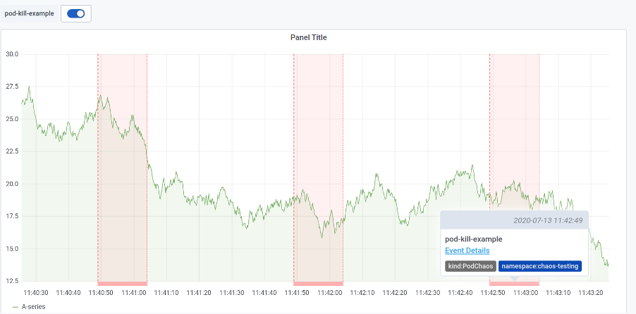

Chaos Mesh 是一个云原生的混沌测试平台，在去年的最后一天，我们开源了这个项目，以帮助大家更好的进行混沌实验。从开源到现在近一年的时间里，Chaos Mesh 在所有贡献者的共同努力下，在不断完善新功能的同时，也在易用性和稳定性上取得了阶段性的成果。今天，我们自豪的宣布 Chaos Mesh 1.0 正式发布！

Chaos Mesh 1.0 是一个里程碑，不仅支持更多混沌注入的类型，提高了框架组件的稳定性，并且增加了 Chaos Dashboard 组件用来改善 Chaos Mesh 的易用性。下面请跟随我们的脚步梳理 Chaos Mesh 1.0 有什么样的惊喜。

## 核心亮点

### 1. 丰富易用的混沌实验类型

混沌实验的核心是注入故障，Chaos Mesh 从分布式系统的出发，充分考虑分布式系统可能出现的故障，提供更加全面、细粒度的故障类型，能全方位的帮用户对网络、磁盘、文件系统、操作系统等进行故障注入。同时，使用 Chaos Mesh，不需要应用做任何修改，做到真正的被测试系统无感知。Chaos Mesh 目前支持的故障注入有：

*   pod-kill：模拟 Kubernetes Pod 被 kill。

*   pod-failure：模拟 Kubernetes Pod 持续不可用，可以用来模拟节点宕机不可用场景。

*   container-kill：模拟 Container 被 kill。

*   network-latency：模拟网络延迟。

*   network-loss：模拟网络丢包。

*   network-duplication：模拟网络包重复。

*   network-corrupt：模拟网络包损坏。

*   network-partition：模拟网络分区。

*   cpu-burn：模拟 CPU 压力。

*   memory-burn：模拟 Memory 压力。

*   clock-skew：模拟时钟偏移。

*   io-latency：模拟文件系统 I/O 延迟。

*   io-fault：模拟文件系统 I/O 错误。

*   io-attribution-override：模拟文件异常。

*   kernel-injection: 模拟内核故障。

### 2. 简单易用的可视化界面

Chaos Mesh 从用户角度出发，不仅可以提供通过 YAML 文件定义混沌实验的方式，还单独开发了 Chaos Dashbaord 组件，提供可视化支持。Chaos Dashboard 极大简化了混沌实验的复杂度，用户可以直接通过可视化界面来管理和监控混沌实验，仅需鼠标点一点就能够定义混沌实验的范围、指定混沌注入类型、定义调度规则，以及在界面上获取到混沌实验的结果等。

### 3. 提供 Grafana 插件支持

Chaos Mesh 为了进一步提高混沌实验的可观测性，单独开发了 [Grafana 插件](https://github.com/chaos-mesh/chaos-mesh-datasource)，方便用户直接将混沌实验的运行信息展示在自己的监控面板上。用户在 Grafana 上安装了此插件后，可以直接在应用的监控面板上开启混沌实验信息按钮，此时混沌实验的相关信息会以 [Annotations](https://grafana.com/docs/grafana/latest/dashboards/annotations/) 的方式在当前的面板上展示出来，这样用户就可以在一个界面上同时观察到应用的运行情况以及当前运行的混沌实验信息。

### 4. 安全可控的混沌实验

当在进行混沌实验的时候，我们需要严格的控制实验范围，只影响需要测试的应用程序，避免导致整体应用的雪崩。Chaos Mesh 在 1.0 版本中不仅提供了丰富的 Selectors 用来控制实验范围，还支持设置被保护的 Namespaces 用来保护重要应用。此外，在 1.0 中 Chaos Mesh 还支持在 Namespace 权限使用，也就是说用户可以在单个 Namespace 下安装 Chaos Mesh 或者是把 Chaos Mesh 的权限范围限制在特定某个 Namespace 下，如此一来可以更大程度控制实验的“爆炸半径”，提供更加安全的混沌实验体现。

## 快速体验

大家通过 install.sh 安装脚本或者是使用 Helm 工具就可以在自己的 Kubernetes 环境下快速的部署 Chaos Mesh，具体安装步骤可以参考 [Chaos Mesh 部署文档](https://chaos-mesh.org/docs/user_guides/installation)。此外社区的小伙伴也贡献了在线 Chaos Mesh 简单教程，想要快速尝试的小伙伴也可以直接按照课程，在线试用，课程地址：[https://chaos-mesh.org/interactiveTutorial](https://chaos-mesh.org/interactiveTutorial)。

对于 1.0 GA 之前版本的用户，请参考 [1.0 Release Note](https://github.com/chaos-mesh/chaos-mesh/releases/tag/v1.0.0) 了解 1.0 的变更内容和升级指南。

## 致谢

感谢所有 Chaos Mesh 的贡献者 （[https://github.com/chaos-mesh/chaos-mesh/graphs/contributors](https://github.com/chaos-mesh/chaos-mesh/graphs/contributors))，Chaos mesh 能够走到 1.0 GA 离不开每一位贡献者的努力！

最后欢迎大家为 Chaos Mesh 提交 issue 或者参考文档开始提交代码，Chaos Mesh 期待大家的参与和反馈！