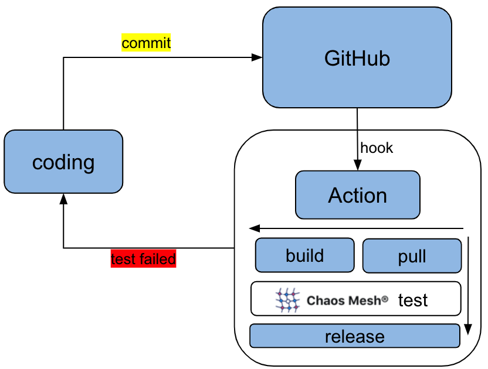
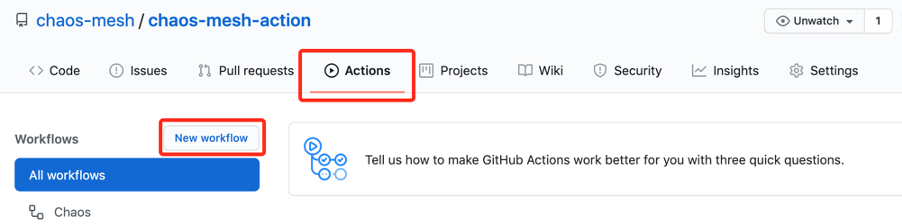

本文将介绍如何在 GitHub Actions 的 workflow 中使用 Chaos Mesh，从而将混沌工程集成到系统开发的 CI 中。

阅读本文前，需要对 Chaos Mesh 和 GitHub Actions 有一定的了解：

- Chaos Mesh 是一个云原生的混沌测试平台，提供在 Kubernetes 上进行混沌测试的能力，可以说 Chaos Mesh 是分布式系统的试金石，可以通过官网 [https://chaos-mesh.org](https://chaos-mesh.org) 了解更多。

- GitHub Actions 是 GitHub 原生支持的 CI/CD 功能，通过它我们可以轻松地在 GitHub 仓库中构建自动化、自定义的软件开发工作流程。可以阅读 [GitHub Actions](https://docs.github.com/en/actions) 了解具体的说明和使用。

那么我们为什么要将 Chaos Mesh 和 GitHub Actions 结合起来呢？原因很简单，在此之前并没有比较好的在 e2e 或者 CI 中使用 Chaos Mesh 的方案，用户往往在系统开发到某一阶段（版本）时才使用 Chaos Mesh 进行一次集中的混沌测试，在漫长的系统开发过程中引入的问题往往不能及时发现。因此我们开发了 [chaos-mesh-action](https://github.com/chaos-mesh/chaos-mesh-action) 这个项目，让 Chaos Mesh 运行在 [GitHub Actions](https://docs.github.com/en/actions) 的 workflow 中，让 Chaos Mesh 可以更方便地集成到系统的日常开发、测试中，为 GitHub 上每一次代码的提交保驾护航。



## chaos-mesh-action 的使用

下面以一个简单的示例来介绍 chaos-mesh-action 在 GitHub Actions 中的使用。

### 设计 workflow

首先我们需要设计整个 workflow，需要考虑的问题：

- 测试系统的哪些功能？

- 在 workflow 中进行哪些 chaos 实验？

- 如何验证系统的正确性？

本文设计一个简单的测试场景：在 Kubernetes 集群中创建两个 Pod，在其中一个 Pod 中 Ping 另外一个 Pod，使用 Chaos Mesh 注入网络延迟的 chaos，测试 Ping 是否受影响。

### 创建 workflow

在你需要测试的 GitHub 的仓库中点击 “Actions”，然后点击按钮 “New workflow” 即可创建 workflow，如下图所示：



### 配置 workflow

#### 设置规则

设置该 workflow 的名称、触发规则等，例如：

```
name: Chaos

on:
 push:
   branches:
     - master
 pull_request:
   branches:
     - master
```

workflow 的名称为 “Chaos”，在有代码 push 到 master 分支或者提交 pull request 到 master 分支时触发。

#### 安装环境

在 workflow 中安装 CI 相关的环境，例如：

```
jobs:
 build:
   runs-on: ubuntu-latest
   steps:

   - name: Creating kind cluster
     uses: helm/kind-action@v1.0.0-rc.1

   - name: Print cluster information
     run: |
       kubectl config view
       kubectl cluster-info
       kubectl get nodes
       kubectl get pods -n kube-system
       helm version
       kubectl version

   - uses: actions/checkout@v2
```

该配置指定该 workflow 运行在 Ubuntu 系统中，使用 Action [helm/kind-action](https://github.com/marketplace/actions/kind-cluster) 创建 Kind 集群，然后输出集群的相关信息；再 checkout 该 GitHub 仓库，这样 workflow 就可以使用仓库中的代码。

#### 部署应用

使用 Chaos Mesh 中提供的一个简单的示例应用：

```
- name: Deploy an application
     run: |
       kubectl apply -f https://raw.githubusercontent.com/chaos-mesh/apps/master/ping/busybox-statefulset.yaml
```

该应用会创建两个 Pod。

#### 使用 chaos-mesh-action 注入 chaos

我们知道 Chaos Mesh 支持的功能较多，如果在 chaos-mesh-action 中支持所有的配置项会比较复杂，且用户使用起来也比较困难，因此 chaos-mesh-action 支持直接设置 chaos 配置文件的 base64 值来简化配置。

首先需要在本地环境中准备好 chaos 的配置文件，例如：

```
apiVersion: chaos-mesh.org/v1alpha1
kind: NetworkChaos
metadata:
 name: network-delay
 namespace: busybox
spec:
 action: delay # the specific chaos action to inject
 mode: all
 selector:
   pods:
     busybox:
       - busybox-0
 delay:
   latency: "10ms"
 duration: "5s"
 scheduler:
   cron: "@every 10s"
 direction: to
 target:
   selector:
     pods:
       busybox:
         - busybox-1
   mode: all
```

该配置将注入 NetworkChaos 类型的 chaos，增加 pod 间的网络延迟，每10s 注入一次，每次持续 5s。更多的 chaos 类型及配置说明参考 [user_guides/run_chaos_experiment](https://chaos-mesh.org/docs/user_guides/run_chaos_experiment)。

然后通过如下命令获取 chaos 配置文件的 base64 值：

```
$ base64 chaos.yaml
YXBpVmVyc2lvbjogY2hhb3MtbWVzaC5vcmcvdjFhbHBoYTEKa2luZDogTmV0d29ya0NoYW9zCm1ldGFkYXRhOgogIG5hbWU6IG5ldHdvcmstZGVsYXkKICBuYW1lc3BhY2U6IGJ1c3lib3gKc3BlYzoKICBhY3Rpb246IGRlbGF5ICMgdGhlIHNwZWNpZmljIGNoYW9zIGFjdGlvbiB0byBpbmplY3QKICBtb2RlOiBhbGwKICBzZWxlY3RvcjoKICAgIHBvZHM6CiAgICAgIGJ1c3lib3g6CiAgICAgICAgLSBidXN5Ym94LTAKICBkZWxheToKICAgIGxhdGVuY3k6ICIxMG1zIgogIGR1cmF0aW9uOiAiNXMiCiAgc2NoZWR1bGVyOgogICAgY3JvbjogIkBldmVyeSAxMHMiCiAgZGlyZWN0aW9uOiB0bwogIHRhcmdldDoKICAgIHNlbGVjdG9yOgogICAgICBwb2RzOgogICAgICAgIGJ1c3lib3g6CiAgICAgICAgICAtIGJ1c3lib3gtMQogICAgbW9kZTogYWxsCg==
```

再使用 chaos-mesh-action 注入该 chaos，配置如下：

```
- name: Run chaos mesh action
     uses: chaos-mesh/chaos-mesh-action@xiang/refine_script
     env:
       CFG_BASE64: YXBpVmVyc2lvbjogY2hhb3MtbWVzaC5vcmcvdjFhbHBoYTEKa2luZDogTmV0d29ya0NoYW9zCm1ldGFkYXRhOgogIG5hbWU6IG5ldHdvcmstZGVsYXkKICBuYW1lc3BhY2U6IGJ1c3lib3gKc3BlYzoKICBhY3Rpb246IGRlbGF5ICMgdGhlIHNwZWNpZmljIGNoYW9zIGFjdGlvbiB0byBpbmplY3QKICBtb2RlOiBhbGwKICBzZWxlY3RvcjoKICAgIHBvZHM6CiAgICAgIGJ1c3lib3g6CiAgICAgICAgLSBidXN5Ym94LTAKICBkZWxheToKICAgIGxhdGVuY3k6ICIxMG1zIgogIGR1cmF0aW9uOiAiNXMiCiAgc2NoZWR1bGVyOgogICAgY3JvbjogIkBldmVyeSAxMHMiCiAgZGlyZWN0aW9uOiB0bwogIHRhcmdldDoKICAgIHNlbGVjdG9yOgogICAgICBwb2RzOgogICAgICAgIGJ1c3lib3g6CiAgICAgICAgICAtIGJ1c3lib3gtMQogICAgbW9kZTogYWxsCg==
```

chaos-mesh-action 中会自动完成 Chaos Mesh 的安装和 chaos 的注入，简化了用户的使用。

#### 测试验证

如上所示的步骤已经安装了环境，部署了应用，并注入了 chaos，接下来就要验证系统的正确性了。本文示例的验证比较简单，仅仅是在一个 Pod 中 Ping 另外一个 Pod，观察网络延迟的变化，配置如下：

```
- name: Verify
     run: |
       echo "do some verify"
       kubectl exec busybox-0 -it -n busybox -- ping -c 30 busybox-1.busybox.busybox.svc
```

这样就完成了 workflow 的配置，以上这些配置的完整内容参见[示例配置文件](https://github.com/chaos-mesh/chaos-mesh-actions/blob/master/.github/workflows/chaos.yml)。

### 运行 workflow

通过提交 pr 到 master 分支来触发该 workflow，然后观察 workflow 的运行结果。其中验证部分的输出如下：

```
do some verify
Unable to use a TTY - input is not a terminal or the right kind of file
PING busybox-1.busybox.busybox.svc (10.244.0.6): 56 data bytes
64 bytes from 10.244.0.6: seq=0 ttl=63 time=0.069 ms
64 bytes from 10.244.0.6: seq=1 ttl=63 time=10.136 ms
64 bytes from 10.244.0.6: seq=2 ttl=63 time=10.192 ms
64 bytes from 10.244.0.6: seq=3 ttl=63 time=10.129 ms
64 bytes from 10.244.0.6: seq=4 ttl=63 time=10.120 ms
64 bytes from 10.244.0.6: seq=5 ttl=63 time=0.070 ms
64 bytes from 10.244.0.6: seq=6 ttl=63 time=0.073 ms
64 bytes from 10.244.0.6: seq=7 ttl=63 time=0.111 ms
64 bytes from 10.244.0.6: seq=8 ttl=63 time=0.070 ms
64 bytes from 10.244.0.6: seq=9 ttl=63 time=0.077 ms
……
```

可以看出，延迟大约会持续 5 次在 10ms 以上，之后又恢复到 0.1 ms 左右，符合 chaos 配置的预期。

## 案例

目前我们已经把 chaos-mesh-action 应用在了 [tidb-operator](https://github.com/pingcap/tidb-operator) 项目中，可以查看 [tidb-operator/actions/workflow/chaos](https://github.com/pingcap/tidb-operator/actions?query=workflow%3Achaos)，该 workflow 注入了 pod-failure 类型的 chaos，来验证 operator 指定实例的重启功能，在 operator 的 pods 被 chaos 随机删除的情况下是否可以正常工作。我们计划将更多的测试迁移到 GitHub Actions 中，并使用 chaos-mesh-action 进行混沌测试，确保我们系统的稳定性。

大家在使用 chaos-mesh-action 或者 Chaos Mesh 的过程中如果遇到问题，欢迎通过 issue 反馈给我们。另外我们即将在 9 月中旬发布 Chaos Mesh 1.0 版本，大家敬请期待！
