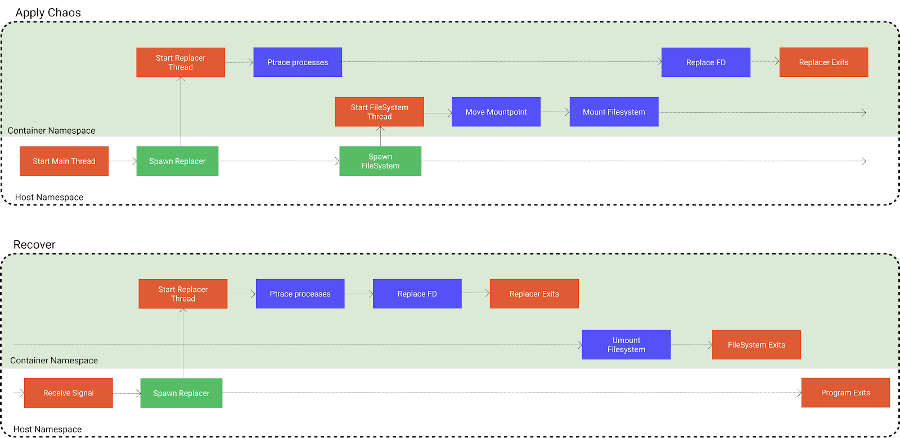

在生产环境中，时常会因为磁盘故障、误操作等原因出现文件系统的错误。Chaos Mesh 很早就提供了注入文件系统错误的能力。用户只需要添加一个 IOChaos 资源，就能够让对指定文件的文件系统操作失败或返回错误的数据。在 Chaos Mesh 1.0 之前，使用 IOChaos 需要对 Pod 注入 sidecar 容器，并且需要改写启动命令；哪怕没有注入错误，被注入 sidecar 的容器也总是有较大的性能开销。随着 Chaos Mesh 1.0 的发布，提供了运行时注入文件系统错误的功能，使得 IOChaos 的使用和其他所有类型的 Chaos 一样简单方便。这篇文章将会介绍它的实现方式。

## 前置

本文的内容假定你已经掌握以下知识。当然，你不必在此时就去阅读；但当遇到没见过的名词的时可以回过头来搜索学习。

我会尽我所能提供相关的学习资料，但我不会将它们提炼和复述，一是因为这些知识通过简单的 Google 就能学到；二是因为大部分时候学习一手的知识效果远比二手要好，学习 n 手的知识效果远比(n+1)手的要好。

1. FUSE. [Wikipedia](https://en.wikipedia.org/wiki/Filesystem_in_Userspace),  [man(4)](https://man7.org/linux/man-pages/man4/fuse.4.html)

2. mount_namespaces. [man](https://man7.org/linux/man-pages/man7/mount_namespaces.7.html), [k8s Mount propagation](https://kubernetes.io/docs/concepts/storage/volumes/#mount-propagation)

3. x86 assembly language. [Wikipedia](https://en.wikipedia.org/wiki/X86_assembly_language)

4. mount. [man(2)](https://man7.org/linux/man-pages/man2/mount.2.html) 特别是 MS_MOVE

5. Mutating admission webhooks. [k8s  Document](https://kubernetes.io/docs/reference/access-authn-authz/extensible-admission-controllers/)

6. syscall. [man(2)](https://man7.org/linux/man-pages/man2/syscall.2.html) 注意浏览一下调用约定

7. ptrace. [man(2)](https://man7.org/linux/man-pages/man2/ptrace.2.html)

8. Device node, char devices [Device names, device nodes, and major/minor numbers](https://www.ibm.com/support/knowledgecenter/linuxonibm/com.ibm.linux.z.lgdd/lgdd_c_udev.html)

阅读与 TimeChaos 相关的 [文章](https://chaos-mesh.org/blog/simulating-clock-skew-in-k8s-without-affecting-other-containers-on-node/) 对理解本文也有很大的帮助，因为它们使用着相似的技术。

此外，我希望在阅读这份文档时，读者能够主动地思考每一步的原因和效果。这之中没有复杂的需要头脑高速运转的知识，只有一步一步的（给计算机的）行动指南。也希望你能够在大脑里不断地构思“如果我自己要实现运行时文件系统注入，应该怎样做？”，这样这篇文章就从单纯的灌输变为了见解的交流，会有趣很多。

## 错误注入

寻找错误注入方式的一个普遍方法就是先观察未注入时的调用路径：我们在 TimeChaos 的实现过程当中，通过观察应用程序获取时间的方式，了解到大部分程序会通过 [vDSO](https://en.wikipedia.org/wiki/VDSO) 访问时间，从而选取了修改目标程序 vDSO 部分内存来修改时间的方式。

那么在应用程序发起 read, write 等系统调用，到这些请求到达目标文件系统，这之间是否存在可供注入的突破口呢？事实上是存在的，你可以使用 bpf 的方式注入相关的系统调用，但它[无法](https://github.com/iovisor/bcc/issues/2336)被用于注入延迟。另一种方式就是在目标文件系统前再加一层文件系统，我们暂且称之为 ChaosFS：

ChaosFS 以本来的目标文件系统作为后端，接受来自操作系统的写入请求，使得整个调用链路变为 Targer Program syscall -> Linux Kernel -> ChaosFS -> Target Filesystem. 由于我们可以自定义 ChaosFS 文件系统的实现，所以可以任意地添加延迟、返回错误。

如果你在此时已经开始构思自己的文件系统错误注入实现，聪明的你一定已经发现了一些问题：

1. ChaosFS 如果也要往目标文件系统里读写文件，这意味着它的挂载路径与目标文件夹不同。因为挂载路径几乎是访问一个文件系统唯一的方式了。

  即，如果目标程序想要写入 `/mnt/a`，于是 ChaosFS 也得挂载于 `/mnt/a`，那么目标文件夹就不能是 `/mnt/a` 了！但是 pod 的配置里写了要把目标文件系统挂载在 `/mnt` 呀，这可怎么办。

2. 这不能满足运行时注入的要求。因为如果目标程序已经打开了一些原目标系统的文件，那么新挂载的文件系统只对新 open 的文件有效。（更何况还有上述文件系统路径覆盖的问题）。想要能够对目标程序注入文件系统错误，必须得在目标进程启动之前将 ChaosFS 挂载好。

3. 还得想办法把文件系统给挂载进目标容器的 mnt namespace 中去。

对于这三个问题，原初的 IOChaos 都是使用 Mutating Webhook 来达成的：

1. 使用 Mutating Webhook 在目标容器中先运行脚本移动目录。比如将 `/mnt/a` 移动至 `/mnt/a_bak`。这样一来 ChaosFS 的存储后端就可以是 `/mnt/a_bak` 目录，而自己挂载在 `/mnt/a` 下了。

2. 使用 Mutating Webhook 修改 Pod 的启动命令，比如本身启动命令是 `/app`，我们要将它修改成 `/waitfs.sh /app`，而我们提供的 `waitfs.sh` 会不断检查文件系统是否已经挂载成功，如果已经成功就再启动 `/app` 。

3. 自然的，我们依旧使用 Mutating Webhook 来在 Pod 中多加入一个容器用于运行 ChaosFS。运行 ChaosFS 的容器需要与目标容器共享某个 volume，比如 `/mnt`。然后将它挂载至目标目录，比如 `/mnt/a`。同时开启适当的 mount propagation ，来让 ChaosFS 容器的 volume 中的挂载穿透（share）至 host，再由 host 穿透（slave）至目标。（如果你了解 mnt namespace 和 mount ，那么一定知道 share 和 slave 是什么意思）。

这样一来，就完成了对目标程序 IO 过程的注入。但它是如此的不好用：

1. 只能对某个 volume 的子目录注入，而无法对整个 volume 注入。

2. 要求 Pod 中明文写有 command，而不能是隐含使用镜像的 command 。因为如果使用镜像隐含的 command 的话，`/waitfs.sh` 就不知道在挂载成功之后应该如何启动应用了。

3. 要求对应容器有足够的 mount propagation 的配置。当然我们可以在 Mutating Webhook 里偷偷摸摸加上，但动用户的容器总是不太妙的（甚至可能引发安全问题）。

4. 注入配置要填的东西太多啦！配置起来真麻烦。而且在配置完成之后还得新建 pod 才能被注入。

5. 无法在运行时撤出 ChaosFS，所以哪怕不施加延迟或错误，仍然对性能有不小的影响。

其中第一个问题是可以克服的，只要用 mount move 来代替 mv（rename），就可以移动目标 volume 的挂载点。而后面几个问题就不那么好克服了。

## 运行时注入错误

结合使用你拥有的其他知识（比如 namespace 的知识和 ptrace 的用法），重新审视这两点，就能找到解决的办法。我们完全依赖 Mutating Webhook 来构造了这个实现，但大部分的糟糕之处也都是由 Mutating Webhook 的方法带来的。（如果你喜欢，可以管这种方法叫做 Sidecar 的方法。很多项目都这么叫，但是这种称呼将实现给隐藏了，也没省太多字，我不是很喜欢）。接下来我们将展示如何不使用 Mutating Webhook 来达到以上目的。

### 侵入命名空间

我们使用 Mutating Webhook 添加一个用于运行 ChaosFS 的容器的目的是为了通过 mount propagation 的机制将文件系统挂载至目标容器内。而要达到这个目的并非只有这一种选择 —— 我们还可以直接使用 Linux 提供的 setns 系统调用来修改当前进程的 namespace。事实上在 Chaos Mesh 的大部分实现中都使用了 nsenter 命令、setns 系统调用等方式来进入目标容器的 namespace，而非向 Pod 中添加容器。这是因为前者在使用时更加方便，开发时也更加灵活。

也就是说可以先通过 setns 来让当前线程进入目标容器的 mnt namespace，然后在这个 namespace 中调用 mount 等系统调用完成 ChaosFS 的挂载。

假定我们需要注入的文件系统是 `/mnt`：

1. 通过 setns 让当前线程进入目标容器的 mnt namespace；

2. 通过 mount --move 将 `/mnt` 移动至 `/mnt_bak`；

3. 将 ChaosFS 挂载至 `/mnt`，并以 `/mnt_bak` 为存储后端。

可以看到，这时注入流程已经大致完成了，目标容器如果再次打开、读写 `/mnt` 中的文件，就会通过 ChaosFS，从而被它注入延迟或错误。

而它还剩下两个问题：

1. 目标进程已经打开的文件该怎么办？

2. 该如何恢复？毕竟在有文件被打开的情况下是无法 umount 的。

后文将用同一个手段解决这两个问题：使用 ptrace 的方法在运行时替换已经打开的 fd。（本文以 fd 为例，事实上除了 fd 还有 cwd，mmap 等需要替换，实现方式是相似的，就不单独描述了）

### 动态替换 fd 

我们主要使用 ptrace 来对 fd 进行动态地替换，在介绍具体的方法之前，不妨先感受一下 ptrace 的威力：

1. 使用 ptrace 能够让 tracee（被 ptrace 的线程） 运行任意系统调用这是怎么做到的呢？综合运用 ptrace 和 x86_64 的知识来看这个问题并不算难。由于 ptrace 可以修改寄存器，同时 x86_64 架构中 rip 寄存器（instruction pointer）总是指向下一个要运行的指令的地址，所以只需要将当前 rip 指向的部分内存修改为 0x050f （对应 syscall 指令），再依照系统调用的[调用约定](https://man7.org/linux/man-pages/man2/syscall.2.html)将各个寄存器的值设为对应的系统调用[编号](https://filippo.io/linux-syscall-table/)或参数，然后使用 ptrace 单步执行，就能从 rax 寄存器中拿到系统调用的返回值。在完成调用之后记得将寄存器和修改的内存都复原。

  在以上过程中使用了 ptrace 的 `POKE_TEXT`，`SETREGS`，`GETREGS`，`SINGLESTEP` 等功能，如果不熟悉可以查阅 ptrace 的手册。

2. 使用 ptrace 能够让 tracee（指 ptrace 的目标进程） 运行任意二进制程序。

    运行任意二进制程序的思路是类似的。可以与运行系统调用一样，将 rip 后一部分的内训修改为自己想要运行的程序，并在程序末尾加上 int3 指令以触发断点。在执行完成之后恢复目标程序的寄存器和内存就好了。

   而事实上我们可以选用一种稍稍干净些的方式：使用 ptrace 在目标程序中调用 mmap，分配出需要的内存，然后将二进制程序写入新分配出的内存区域中，将 rip 指向它。在运行结束之后调用 munmap 就能保持内存区域的干净。

在实践中，我们使用 `process_vm_writev` 代替了使用 ptrace `POKE_TEXT` 写入，在写入大量内容的时候它更加稳定高效一些。

在拥有以上手段之后，如果一个进程自己有办法替换自己的 fd，那么通过 ptrace，就能让它运行同样的一段程序来替换 fd。这样一来问题就简单了：我们只需要找到一个进程自己替换自己的 fd 的方法。如果对 Linux 的系统调用较为熟悉的话，马上就能找到答案：dup2。

#### 使用 dup2 替换 fd

dup2 的函数签名是 `int dup2(int oldfd, int newfd);`，它的作用是创建一份 oldfd 的拷贝，并且这个拷贝的 fd 号是 newfd。如果 newfd 原本就有打开着的 fd ，它会被自动地 close。

假定现在进程正打开着 `/var/run/__chaosfs__test__/a` ，fd 为 1 ，希望替换成 `/var/run/test/a`，那么它需要做的事情有：

1. 使用通过 fcntl 系统调用获取 `/var/run/__chaosfs__test__/a` 的 OFlags（即 open 调用时的参数，比如 O_WRONLY ）；

2. 使用 lseek 系统调用获取当前的 seek 位置；

3. 使用 open 系统调用，以相同的 OFlags 打开 `/var/run/test/a`，假设 fd 为 2；

4. 使用 lseek 改变新打开的 fd 2 的 seek 位置；

5. 使用 dup2(2, 1) 用新打开的 fd 2 来替换 `/var/run/__chaosfs__test__/a` 的 fd 1；

6. 将 fd 2 关掉。

这样之后，当前进程的 fd 1 就会指向 `/var/run/test/a`，任何对于它的操作都会通过 FUSE，能够被注入错误了。

#### 使用 ptrace 让目标进程运行替换 fd 的程序

那么只要结合“使用 ptrace 能够让 tracee 运行任意二进制程序”的知识和“使用dup2替换自己已经打开的fd”的方法，就能够让 tracee 自己把已经打开的 fd 给替换掉啦！

对照前文描述的步骤，结合 syscall 指令的用法，写出对应的汇编代码是容易的，你可以在[这里](https://github.com/chaos-mesh/toda/blob/1d73871d8ab72b8d1eace55f5222b01957193531/src/replacer/fd_replacer.rs#L133)看到对应的源码，使用汇编器可以将它输出为可供使用的二进制程序（我们使用的是 [dynasm-rs](https://github.com/CensoredUsername/dynasm-rs)）。然后用 ptrace 让目标进程运行这段程序，就完成了在运行时对 fd 的替换。

读者可以稍稍思考如何使用类似的方式来改换 cwd，替换 mmap 呢？它们的流程完全是类似的。

**注：实现中假定了目标程序依照 Posix Thread，目标进程与它的线程之间共享打开的文件，即 clone 创建线程时指定了 `CLONE_FILES`。所以将只会对一个线程组的第一个线程进行 fd 替换。**

### 流程总览

在了解了这一切技术之后，实现运行时文件系统的思路应当已经逐渐清晰了起来。在这一节我将直接展示出整个注入实现的流程图：

平行的数条线表示不同的线程，从左至右依照时间先后顺序。可以看到对 “挂载/卸载文件系统 ”和 “进行 fd 等资源的替换” 这两个任务进行了较为精细的时间顺序的安排，这是有必要的。为什么呢？如果读者对整个过程的了解已经足够清晰，不妨试着自己思考它的答案。

## 细枝末节的问题

### mnt namespace 可能引发的 mmap 失效

在 mnt namespace 切换之后，已经创建完成的 mmap 是否还有效呢？比如一个 mmap 指向 `/a/b`，而在切换 mnt namespace 之后 `/a/b` 消失了，再访问这个 mmap 时是否会造成意料之外的崩溃呢？值得注意的是，动态链接库全是通过 mmap 载入进内存的，访问它们是否会有问题呢？

事实上，是不会有问题的。这涉及到 mnt namespace 的方式和目的。mnt namespace 只涉及到对线程可见性的控制，具体的做法，则是在调用 `setns` 时修改内核中某一线程 `task_struct` 内 vfsmount 指针的修改，从而当线程使用任何传入路径的系统调用的时候（比如 open、rename 等）的时候，Linux 内核内通过 vfsmount 从路径名查询到文件（作为 file 结构体），会受到 namespace 的影响。而对于已经打开的 fd（指向一个 file 结构体），它的 open、write、read 等操作直接指向对应文件系统的函数指针，不会受到 namespace 的影响；对于一个已经打开的 mmap （指向一个 `address_space` 结构体），它的 writepage, readpage 等操作也直接指向对应文件系统的函数指针，也不受到 namespace 的影响。

### 注入的范围

由于在注入过程中，不可能将机器上运行的所有进程暂停并检查它们已经打开的 fd 和 mmap 等资源，这样做的开销不可接受。在实践中，我们选择预先进入目标容器的 pid namespace，并对这个 namespace 中能看见的所有进程进行暂停和检查。

所以注入和恢复的范围是全部 pid namespace 中的进程。而切换 pid namespace 意味着需要预先设定子进程的 pid namespace 再 clone（因为 Linux 并不允许切换当前进程的 pid namespace ），这又将带来诸多问题。

### 切换 namespace 对 clone flag 有些限制

切换 mnt namespace 将不允许 clone 时携带参数 `CLONE_FS`。而预先设定好子进程 pid namespace 的情况下，将不允许 clone 时携带参数 `CLONE_THREAD`。为了应对这个问题，我们选择修改 glibc 的源码，能够在 chaos-mesh/toda-glibc 中找到修改后的 glibc 的源码。修改的只有 pthread 部分 clone 时传入的参数。

在去掉 `CLONE_THREAD` 与 `CLONE_FS` 之后，pthread 的表现与原先有较大差异。其中最大的差异便是新建的 pthread 线程不再是原有进程的 tasks，而是一个新的进程，它们的 tgid 是不同的。这样 pthread 线程之间的关系从进程与tasks变成了进程与子进程。这又会带来一些麻烦，比如在退出时可能需要对子进程进行额外的清理。

在更低版本的内核中，也不允许不同 pid namespace 的进程共享 `SIGHAND`，所以还需要把 `CLONE_SIGHAND` 去掉。

### 为什么不使用nsenter

在 chaos-daemon 中，很多需要在目标命名空间中的操作都是通过 nsenter 完成的，比如 nsenter iptables 这样联合使用。而 nsenter 却无法应对 IOChaos 的场景，因为如果在进程启动时就已进入目标 mnt namespace，那将找不到合适的动态链接库（比如 `libfuse.so` 和自制的 `glibc`）。

### 构造 /dev/fuse

由于目标容器中不一定有 `/dev/fuse` （事实上更可能没有），所以在进入目标容器的 mnt namespace 后挂载 FUSE  时会遇到错误。所以在进入目标的 mnt namespace 后需要构造 `/dev/fuse`。这个构造的过程还是很容易的，因为 fuse 的 major number 和 minor number 是固定的 10 和 229。所以只要使用 `makedev` 函数和 `mknod` 系统调用，就能够创造出 /dev/fuse 。

### 去掉 `CLONE_THREAD` 之后等待子进程死亡的问题

在子进程死亡时，会向父进程发送 SIGCHLD 信号通知自己的死亡。如果父进程没有妥善的处理这个信号（显式地忽略或是在信号处理中 wait ），那么子进程就会持续处于 defunct 状态。

而在我们的场景下，这个问题变得更加复杂了：因为当一个进程的父进程死亡之后，它的父进程会被重新置为它所在的 pid namespace 的 1 号进程。通常来说一个好的 init 进程（比如 systemd ）会负责清理这些 defunct 进程，但在容器的场景下，作为 pid 1 的应用通常并没有被设计为一个好的 init 进程，不会负责处理掉这些 defunct 进程。

为了解决这个问题，我们使用 [subreaper](https://man7.org/linux/man-pages/man2/prctl.2.html) 的机制来让一个进程的父进程死亡时并不是直接将父进程置为 1，而是进程树上离得最近的 subreaper。然后使用 wait 来等待所有子进程死亡再退出。

### waitpid 在不同内核版本下表现不一致

waitpid 在不同版本内核下表现不一致，在较低版本的内核中，对一个作为子线程（指并非主线程的线程）的 tracee 使用 waitpid 会返回 ECHILD ，还没有确定这样的原因是什么，也没有找到相关的文档。

## 欢迎贡献

在完成了以上描述的实现之后，运行时文件系统注入的功能就大致实现了，我们的实现在 chaos-mesh/toda 项目里。但是离完美仍然还有很长的路要走：

1. 对 generation number 没有支持；

2. 对 ioctl 等操作没有提供支持；

3. 在挂载文件系统之后没有主动判断它是否完成，而是等待 1s。

如果读者对这项功能的实现感兴趣，或是愿意和我们一同改进它，欢迎加入我们的 slack 频道参与讨论或提交 issue 和 PR 😉

本篇为 Chaos Mesh 技术内幕系列文章的第一篇，如果读者还想了解种种其他错误注入的实现和背后的技术，还请期待同系列之后的文章哟。