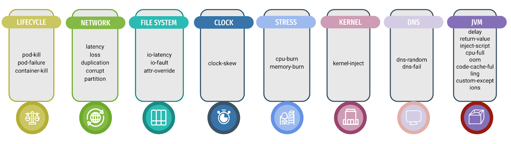
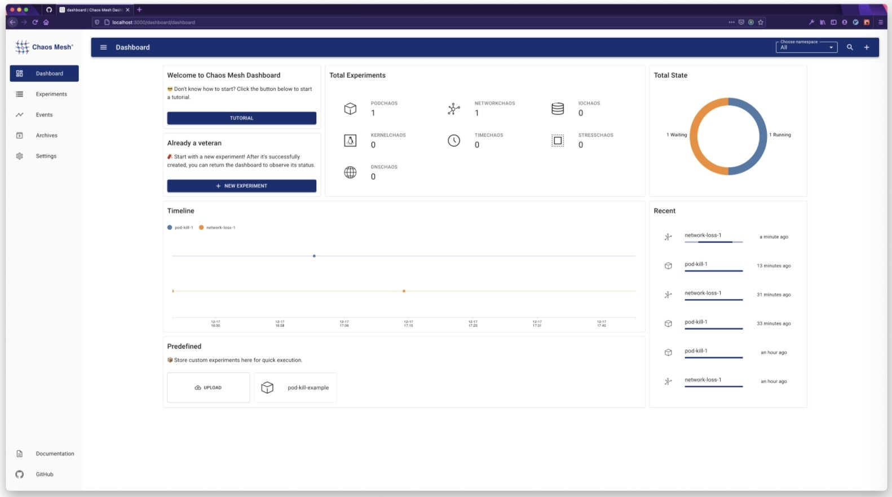
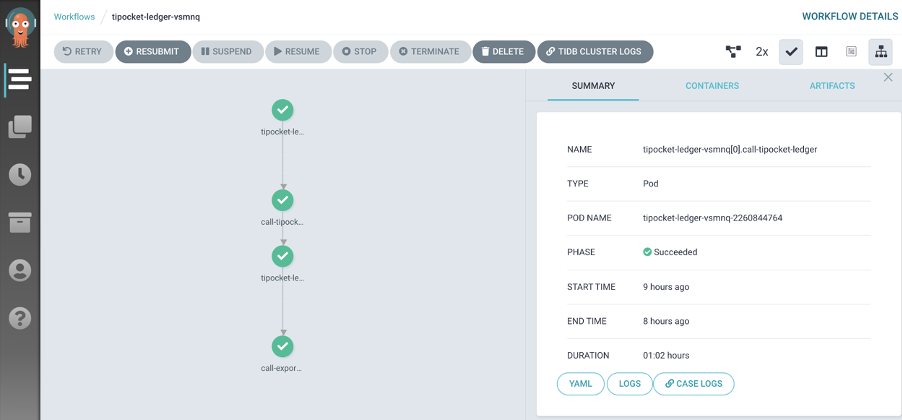
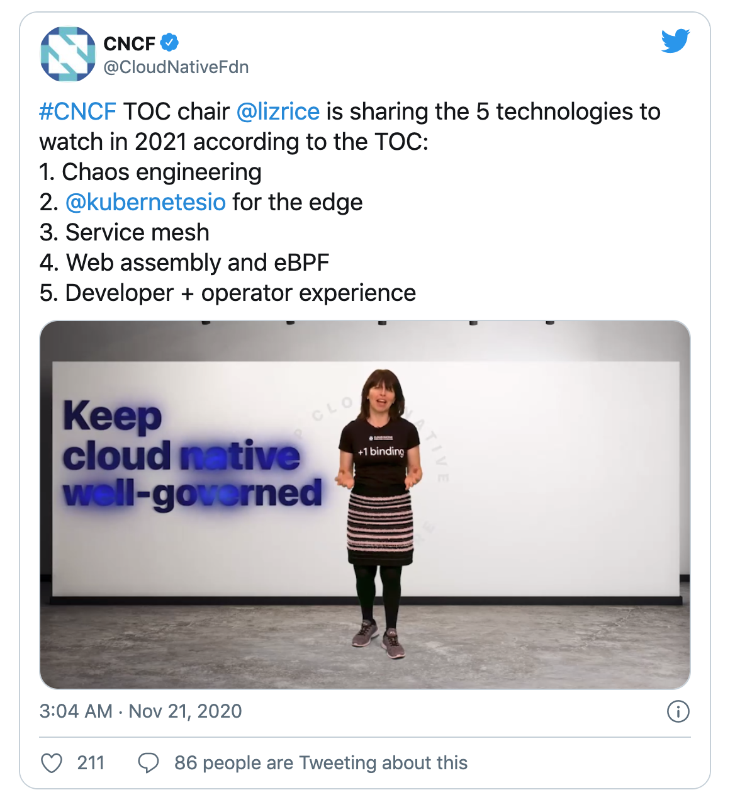

Chaos Mesh 开源刚刚一周年，这一年来，Chaos Mesh 产品不断迭代成长，从单一的故障注入工具到现在以构建完整混沌工程生态为目标持续前进。Chaos Mesh  社区从无到有，不断为 Chaos Mesh 带来新的力量，并成功帮助 Chaos Mesh 加入 CNCF 成为沙箱托管项目。

在这篇文章中，笔者会从多个方面和大家一起回顾 Chaos Mesh 在这一年中的变化与成长，畅谈一些 Chaos Mesh 未来的目标与计划。

## 产品：明确目标，茁壮成长

这一年里， Chaos Mesh 在大家共同的努力下在以肉眼可见的速度成长着。从第一个版本，到最近我们刚刚发布的 [1.1](https://github.com/chaos-mesh/chaos-mesh/releases/tag/v1.1.0) 版本，无论是功能上，还是易用性，安全性等方面，Chaos Mesh 都有了很大的提升。

### 功能方面

刚开源的时候，Chaos Mesh 支持 PodChaos，NetworkChaos 以及 IOChaos，经过这一年的不断丰富，Chaos Mesh 已经能够全方位的对网路、时间、JVM 应用、文件系统、操作系统等进行故障注入。这一年中 Chaos Mesh 共新增 5 类故障类型：

- StressChaos: 模拟 CPU，Memory 压力场景

- TimeChaos：模拟时钟偏移

- DNSChaos：模拟 DNS 服务故障

- KernelChaos：模拟内核故障

- JVMChaos：模拟 JVM 应用异常 (Reviewing)

经过这一年的持续优化，Chaos Mesh 提供了更加灵活的调度机制，可以帮助用户更好的去设计自己的混沌实验，为我们下一步支持混沌编排功能打下基础。

期间，很多用户开始在各大云平台上使用 Chaos Mesh，比如 AWS，GKE，阿里云，腾讯云等。 为了更好的适配各大云平台，我们也不断的进行兼容性测试与适配，以及支持针对特定云平台的故障注入能力。

此外，为了更好的支持 Kubernetes 原生组件以及节点级别故障，Chaos Mesh 单独开发了 [Chaosd](https://github.com/chaos-mesh/chaosd) 组件，Chaosd 主要目的是提供物理节点级别的故障注入能力，Chaosd 组件还在快速开发迭代中，欢迎大家一起参与进来。

### 易用性方面

为了能够让用户快速体验 Chaos Mesh，我们单独提供了一键安装脚本，用户只需要执行一条命令，就可以在本地快速地体验 Chaos Mesh。此外，我们还实现了全新组件 Chaos Dashboard，Chaos Dashboard 极大地简化了管理混沌实验的复杂度，用户可以直接通过可视化界面来管理和监控混沌实验。

此外，很多用户在使用 IoChaos  的时候，经常被各种配置问题阻塞住，这个问题一度困扰了我们好久，经过多次调研和讨论，最后我们放弃 Sidecar 的实现方式，使用 chaos-daemon 动态侵入目标 Pod 命令空间的方式，具体实现细节可以阅读之前分享技术解析[文章](https://pingcap.com/blog-cn/chaos-mesh-internals-how-to-inject-io-faults-during-runtime/#chaos-mesh-%E6%8A%80%E6%9C%AF%E5%86%85%E5%B9%95--%E5%A6%82%E4%BD%95%E6%B3%A8%E5%85%A5-io-%E6%95%85%E9%9A%9C)。经过此次优化，Chaos Mesh 真正实现了动态注入 I/O 故障，用户不再需要额外的配置，只需专注于实验本身。

### 安全性方面

这一年中，Chaos Mesh 在提高安全性方面同样作出了诸多努力。Chaos Mesh 提供更加完善的 Selectors 用来控制实验范围，支持设置特定的 Namespaces 来保护重要应用。此外，Chaos Mesh 还支持在 Namespace 权限使用，用户可以把 Chaos Mesh 的权限范围限制在特定某个 Namespace 下，如此一来可以更大程度控制实验的“爆炸半径”，提供更加安全的混沌实验体现。

此外，Chaos Mesh 直接复用 Kubernetes 的原生权限机制，在 Chaos Dashboard 组件上支持身份验证，以避免其他用户的误操作造成混沌实验的失败或者不可控。

## 生态：不断深入，互帮互助

在这一年，Chaos Mesh 成功进入 CNCF 沙箱托管项目，这意味 Chaos Mesh 得到整个云原生社区的初步认可，这也意味 Chaos Mesh 后续也将承担推动云原生社区发展的责任，以及推动混沌工程在云原生应用领域上落地。在这一年中 Chaos Mesh 和整个云原生生态相互配合，共同成长。

### Grafana

Chaos Mesh 为了进一步提高混沌实验的可观测性，单独开发了 [Grafana 插件](https://github.com/chaos-mesh/chaos-mesh-datasource)，方便用户直接将混沌实验的信息展示在自己的监控面板上。用户在 Grafana 上安装了此插件后，可以直接在应用的监控面板上开启混沌实验信息按钮，混沌实验的相关信息会以 [Annotations](https://grafana.com/docs/grafana/latest/dashboards/annotations/) 的方式在当前的面板上展示出来，这样用户就可以在一个界面上同时观察到应用的运行情况以及当前运行的混沌实验信息。

### Github Action

为了帮助用户在开发阶段就运行混沌实验，我们开发了 [chaos-mesh-action](https://github.com/chaos-mesh/chaos-mesh-action) 这个项目，让 Chaos Mesh 运行在 GitHub Actions 的 workflow 中，让 Chaos Mesh 可以更方便地集成到系统的日常开发、测试中，为 GitHub 上每一次代码的提交保驾护航。

### TiPocket

TiPocket 是一个同时集成 Chaos Mesh 和 Argo 的自动化测试平台，实现完全自动化的混沌实验。通常我们进行混沌实验的时候，存在很多步骤，比如部署待测试应用，运行 workload，以及注入异常，业务检查等等，为了让这些步骤完全的自动化起来，TiPocket 在 Chaos Mesh 的基础上引入了 Argo 工具，一方面 Chaos Mesh 提供丰富的故障注入能力，另一方面 Argo 提供灵活的编排和调度能力。

## 社区：从无到有，共同进步

Chaos Mesh 是社区驱动的项目，项目和生态的迭代和演进离不开一个活跃、友好、开放的社区。开源以来，Chaos Mesh 迅速成为了混沌工程领域最耀眼的开源项目之一，并且在短短的一年中，在 GitHub 上积累了 3k star，吸引了 70+ 贡献者，以及吸引腾讯、小鹏汽车、Dailymotion、网易伏羲实验室、JuiceFS、APISIX、美团等在内的数十家知名用户。回首这一年，Chaos Mesh 社区从无到有，为创建一个透明、开放、友好，自治的开源社区打下了基础。

### 加入 CNCF，借力云原生社区

云原生从 Chaos Mesh 创立之初就写在了项目的 DNA 里。加入 CNCF 也是 Chaos Mesh 社区在这一年里的重要里程碑之一，也是 Chaos Mesh 走向厂商中立、社区自治、开放透明的开源社区的重要一步。除了上文中和云原生的生态的集成，加入 CNCF 对于 Chaos Mesh 社区发展和完善也有很积极的促进作用。

- 更多的社区以及项目曝光。通过生态之间的合作、以及各种云原生社区活动如 Kubernetes Meetup，KubeCon 等，我们也获得了更多与社区分享、交流的机会。社区中不断产生的优质内容也对 Chaos Mesh 的社区品牌传播起到了正面的促进作用。

- 更完善、开放的社区框架。加入 CNCF 的一个重要作用是对开源社区运营的指引和规范。加入 CNCF 时，Chaos Mesh 开源仅半年时间，是一个相对年轻的社区。在 CNCF 的指引下，我们完善了社区的基本框架，如 Code of Conduct, Contributing Guide, 公开的 RoadMap，在 CNCF 的 Slack 下创建了 #project-chaos-mesh 的频道；同时，社区也从初期就提供了逐步完善的用户和开发文档。

### 友好、互助的社区氛围

我们有一个很有潜力的项目，获得 CNCF 的认可，以及一个初步完善的社区框架，这具备了一个有吸引力社区的前提条件。可是，如何让用户、贡献者保持长期、持续参与到社区中，这取决于社区体验和氛围。对于 Chaos Mesh 社区，打造友好、一站式的上手体验，建立快速响应、互助的社区氛围是第一年需要重点关注的目标。具体来说，

- 持续丰富文档内容，优化文档结构，更新文档信息。目前已形成了包含用户文档，开发文档，快速上手、用户案例文档、贡献指南等在内的面向不同人群的文档体系，并随着版本发布保持迭代更新。

- 和社区一起持续发布包含 Chaos Mesh 教程、案例分享、混沌工程实践等主题的博客文章。截止本文发布时间，已累计产生 25 篇 Chaos Mesh 相关文章，以及 1 个发布于 OReilly Katakoda 的[入门互动教程](https://chaos-mesh.org/interactive-tutorial)，为文档提供了有力补充。

- 通过社区阅读会议、以及各种会议、meetup 等形式分享视频教程。

- 作为一个快速迭代的开源项目，Chaos Mesh 社区注重来自社区的反馈、问题的快速响应。

## 未来可期

最近 Google 全球宕机事件再次提醒用户对服务可用性的重视，再次凸显混沌工程的重要性。CNCF 技术委员会主席 Liz Rice 分享 2021 年值得关注的五项技术中，混沌工程赫然在列。大胆预测在未来的一段时间内，混沌工程即将进入一个全新的阶段。

这一年中我们成功发布了 1.1 版本，经过一段时间的积累以及接受用户各种反馈，Chaos Mesh  有了更加明确的目标，朝着构建完善的混沌工程生态不断前行。目前我们正在快速开发 Chaos Mesh 2.0 版本，在 2.0 中， Chaos Mesh 将引入内嵌的 Workflow 引擎，用来支持定义和管理更加灵活的混沌实验场景，以及引入应用状态检查机制和提供更加完善的混沌实验报告。2.0 版本预计会在几个月后发布，并且项目的后续计划安排，我们会及时在项目的 [roadmap](https://github.com/chaos-mesh/chaos-mesh/blob/master/ROADMAP.md) 上持续更新。

## 最后

说了这么多，最后也是最重要的，经过这一年努力，Chaos Mesh 不断成长，但依旧年轻，我们朝着我们的目标，扬帆起航，在成长的过程中，需要大家共同参与，一起打造完善的混沌工程体系生态！

欢迎大家加入 Chaos Mesh 社区，加入 Chaos Mesh [Slack(#project-chaos-mesh)](https://slack.cncf.io/) ，一起参与到项目的讨论与开发中来！大家在使用过程发现 bug 或缺失什么功能，也可以直接在 GitHub 上面提 [issue](https://github.com/pingcap/chaos-mesh/issues) 或 PR。

最后附上 Chaos Mesh 社区调查链接，填写有惊喜哦：[https://bit.ly/2LzES5o](https://bit.ly/2LzES5o)
