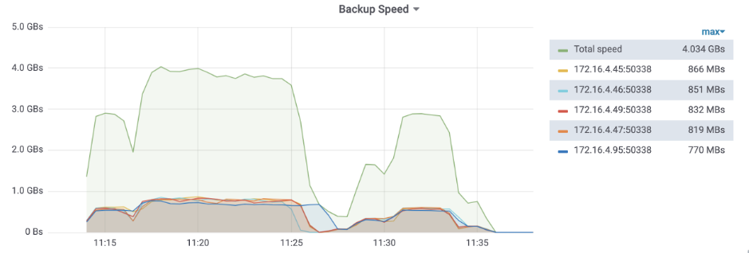
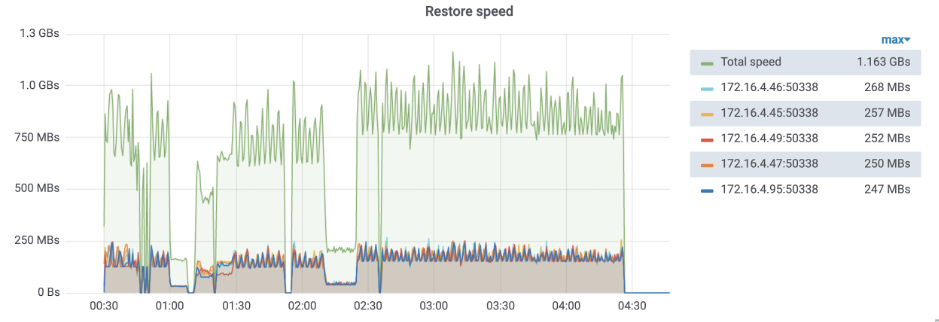
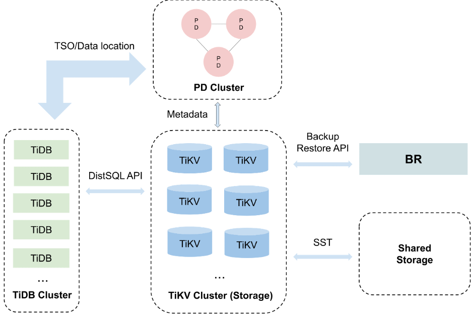

数据库作为基础设施，其安全性不言而明，因此数据安全备份和恢复功能是在严肃使用场景下的标配。TiDB 作为一款分布式数据库，目前可以满足超大集群的备份恢复的需求，经过测试，10T 数据的备份恢复速度可以达到 GB/s 级别。这得益于我们研发的分布式备份恢复工具  **Backup&Restore That Scales**（以下简称 BR）。

**如果你业务产生海量数据，并极度重视数据安全、备份恢复的效率，那么 TiDB + BR 值得一试，从此再也不怕“删库跑路、恢复缓慢”。**

## 一个 10T 集群的测试

让我们先来秀一下肌肉吧！我们使用 BR 备份恢复了一个 10T 数据量的超大集群[1]：

- 备份速度：548MB/s * TiKV 节点数；
- 恢复速度：150MB/s * TiKV 节点数。

光说这两个数字可能不直观，所以我们特地把真实发生的备份恢复过程截了图：

### 备份

图片说明：

- 我们备份了两张表，**绿线是整体的备份速度**，其余线条是各个 TiKV 节点备份速度。
- 11:15 和 11:28 在备份索引数据，由于索引数据内容较短，所以备份速度有些下降。

### 恢复

图片说明：

- 我们恢复了之前备份下来的两张表，同样的，绿线是整体速度，其他线条为各个 TiKV 节点恢复速度。
- 恢复期间的毛刺是因为我们将恢复任务拆分成一个个小任务，各个小任务之间串行执行（潜在优化点）。1:00 和 1:15 恢复速度下降同样也是由于索引内容较短导致。 

## 分布式数据库备份恢复的难点

**备份恢复一直是超大 TiDB 集群的难题：TiDB 存储层的分布式架构实现没有一致的物理快照的概念。**

由于 TiDB 兼容 MySQL 协议，我们曾经考虑过使用  mydumper/myloader 作为备份恢复工具（MySQL 社区常用的备份恢复工具），但是 mydumper 面对超大规模的 TiDB 集群就显得有些捉襟见肘，不仅无法合理利用集群资源来提升备份速度，严重影响业务的请求，还有一定概率造成 TiDB OOM。

我们曾经也针对 TiDB 优化了类似 myloader 的工具：loader。根据之前的测试[2]，loader 恢复 1TB 的数据大概需要 19 个小时。但是这个速度难以满足我们对恢复性能的追求，主要原因是恢复流程走 SQL，流程长，添加了大量没必要的计算，导致资源不能被充分利用。

总之，mydumper 和 loader 虽然能用，但没有完美契合 TiDB。因此，我们决心开发新的备份恢复工具，BR。

## BR 设计与实现

### 水平扩展

是的，BR 让备份和恢复能够水平扩展！

BR 和 mydumper 最大的不同点在于，**它直接从 TiKV（存储层）入手**，“用对的方法做对的事”。BR 将备份和恢复任务下推到各个 TiKV 执行（类似于 Coprocessor 下推），比如一个备份任务可能跨越了多个 Region，BR 只需给每个 TiKV 下发一个请求，就能让各个 TiKV 自行备份它上面的数据。

**BR 将备份恢复带来的 CPU 和 IO 均匀的分散在各个 TiKV 上，轻松备份恢复上百个节点的 TiDB 集群。**

### 强一致性

满足一致性要求是备份恢复工具的及格线。Snapshot Isolation 即是 TiDB 所提供的一致性，也是 BR 的备份恢复所提供的一致性。

数据分散在多台 TiKV 节点，BR 是如何做到 Snapshot Isolation 呢？其实很简单，BR 只需取一个 TiDB 事务的 Timestamp，然后发到所有 TiKV 上。TiKV 将这个 Timestamp 的能看到的数据备份即可，这里的数据不仅包含了用户的数据，也包含了 TiDB 的元数据，比如 Table schema 等，所以 BR 备份在满足存储层（TiKV）一致性的同时也能满足 SQL 层（TiDB）的一致性。

## 体验一下？

如果你手头恰好跑着 TiDB 集群，集群数据恰好上了 TB，又苦于没法快速备份恢复，那么不妨试试 BR。我们已经陆续更新了一些文档，供大家参考：

- **BR 使用手册：**

	<https://pingcap.com/docs-cn/v3.1/reference/tools/br/br/>

- **BR 备份与恢复场景示例：**

	<https://pingcap.com/docs-cn/v3.1/reference/tools/br/use-cases/>

BR 目前还处于 beta 阶段，如果在使用过程中发现了任何问题，欢迎反馈到 ：

<https://github.com/pingcap/br/issues>

## 更多令人期待的新功能

目前 BR 仍在不断的开发完善中，尤其在去年 [PingCAP Q4 Special Week](https://pingcap.com/blog-cn/special-week-tools-matter/) 活动中，富有创造力的 TiDB 社区小伙伴和 PingCAP 工程师为 BR 添了许多令人激动的新功能：

- **[RawKV backup restore](https://github.com/pingcap/br/issues/86)**

	没错，BR 除了支持备份恢复 TiDB 集群之外，还能支持使用 RawKV 的 TiKV 集群，其中 TiKV 这边的 PR 由一位社区小伙伴贡献——感谢来自一点资讯的 **xinhua5**！
	
- **[Incremental backup restore](https://github.com/pingcap/br/issues/90)**

	增量备份不仅解决了全量备份空间占用的大的问题，也能解决了 [TiDB Binlog](https://pingcap.com/blog-cn/tidb-ecosystem-tools-1/) 损坏期间快速恢复的难题！

- **[Backup to common cloud storage](https://github.com/pingcap/br/issues/89)**

	在云的时代，怎么能缺少对云存储的支持？BR 已经支持将备份保存到 AWS S3 上，不久也将支持备份到 Google Cloud Storage。

- **[Online restore](https://github.com/pingcap/br/issues/87)**
	
	最初，BR 恢复的定位和 [TiDB Lightning](https://pingcap.com/blog-cn/tidb-ecosystem-tools-2/) 一样，只支持离线恢复到全新的集群。通过这个功能，BR 即将支持在线恢复，这对 OLAP 场景中的导入数据阶段非常有帮助。
	
**以上新功能还在加速实现过程中，非常欢迎感兴趣的小伙伴们能够参与进来，一起玩转 BR 这个炫酷的分布式备份恢复工具，大家有任何新鲜的点子都可以开 Issue 讨论！**

另外，我们也很重视 TiDB 用户的需求，希望能优先交付用户最需要的功能，**欢迎参与 AskTUG 发起的“ [我最期待 BR 的新功能](https://asktug.com/t/topic/32822) ”投票（投票开放 1 周），我们将根据大家的呼声调整开发优先级～**

>附：  
>[1] 五台 Intel® E5-2630v4, Intel® SSD P4510 4TB 物理机，每台部署一个 TiKV，使用本地模式进行备份恢复。备份数据库逻辑大小 3.34T，三副本物理大小 10.1T。备份并发参数 16，恢复并发参数 128。恢复速度受 Region 调度影响比较大，不包含调度，速度为 279MB/s。  
>[2] [loader 工具的 load 模块性能测试数据。](https://pingcap.com/docs-cn/stable/benchmark/dm-v1.0-ga/#在-load-处理单元使用不同-pool-size-的性能测试对比) 