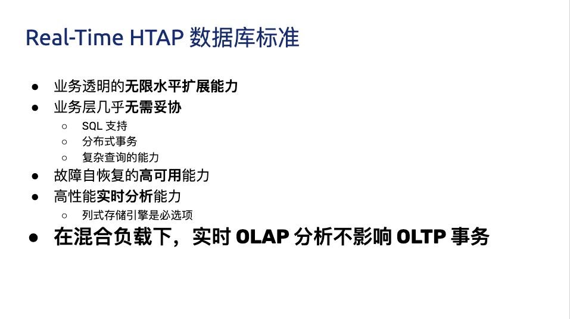
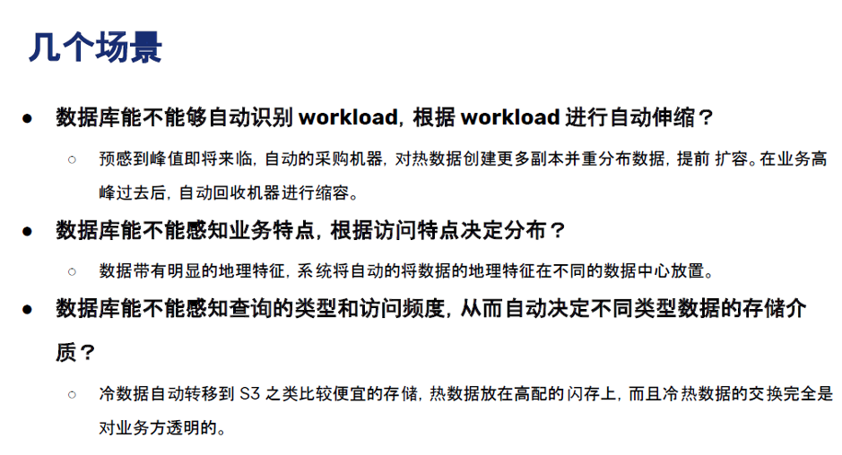

>上周六，我们开启了 The Future of Database 系列 的第一期直播，我司 CTO 黄东旭及 Engineering VP 申砾畅聊了“未来的数据库会是什么样？”这个颇具想象力的话题。
>
>以下是第一期直播的部分文字&视频回顾 Enjoy ~

**视频链接**：<https://www.bilibili.com/video/BV1Ji4y1t7io>

## 目前业界数据存储方案存在的问题？

* 受限的 Scale 能力

	分库分表和一些「伪分库分表」的方案，仍然有天花板，带来了额外的运维和消耗。

* 碎片化

	回想一下最近几年后端的技术栈，有 NoSQL、缓存、Kafka、 离线数据仓库、Hadoop、HBase……**不同的工具可能面对的是某些特定、甚至「狭窄」的场景，为了应对一个复杂的业务，大家必然就要多种技术方案组合来覆盖所有的应用场景。这个过程中自然会产生「数据孤岛」**，打通孤岛的成本也是巨大的，Kafka 最近几年这么火也是正因为存储方案的多样导致的「数据孤岛」的问题正在显现。
	
* 在线业务与分析脱节

	现在大家构建存储系统的时候，默认会让在线业务与离线业务是分开的， 在线业务用 MySQL、MongoDB 等等，离线业务（或者分析系统）用 Hadoop 做数据分析，好像大家都是理所当然的认为：在线和离线就该这样，泾渭分明。
	
	**但目前有个趋势，分析的场景的需求越来越「实时」，或者说高时效的数据分析带来的业务价值受到重视**，这就与大家惯性认知产生了本质的冲突：业务需要当日甚至实时的数据分析结果，但后端只能说今天的数据明天才能导出。还有一个问题是，各个部分维护团队也是分开的，当业务发生变化时，很难灵活地调整和适应。
	
**导致以上这些问题出现的深层共性是：变化永远比计划快**，你永远没法预测未来需要多少机器？业务会膨胀到多大？到底需要多“实时”的数据来做决策？

**有没有可能存在一个应付更多变化、覆盖更多场景的系统？**从前可能是：我的工具箱里装了各种型号的锤子（工具软件），去应对不同场景、形状的钉子，现在可能追求用一个锤子，快速、低成本的解决不同的钉子（问题），**以不变应万变**。

## Real-Time HTAP 是解药吗？

聊到最近几年数据库领域的变化，申砾提到最近两年很多数据库打出了 HTAP 的标签，黄东旭分享了自己对“一个真正的 Real-Time HTAP 数据库”的理解：

**那么 Real-Time HTAP 价值在何处？应该在于它是一个简单、灵活的方案——能够将各个系统/团队集中在一个 Real-Time HTAP 系统上，节省成本并灵活应对业务变化。**

## Real-Time HTAP 之后?

Real-Time HTAP  可能是当下厂商们能够看得到的努力方向，那么在 Real-Time HTAP 之后的未来是什么呢？

或许五年之后有以下场景：

基于这些场景，**未来数据库绕不开的核心能力应该是：智能、弹性调度能力**。

最近有个新概念是 Serverless，Severless 是伴随云（Cloud）诞生的概念。当然 Severless 不是没有服务器，通俗地说，Serverless 就是会根据你的实际需求情况，调整数据库的形态，例如业务流量峰值的时候快速的采购弹性的计算资源进行扩容，低峰的时候自动的释放多余的资源。所以可以把 Severless 当做智能、弹性调度的落地形式来理解，同时未来的数据库一定是跑在云上的。