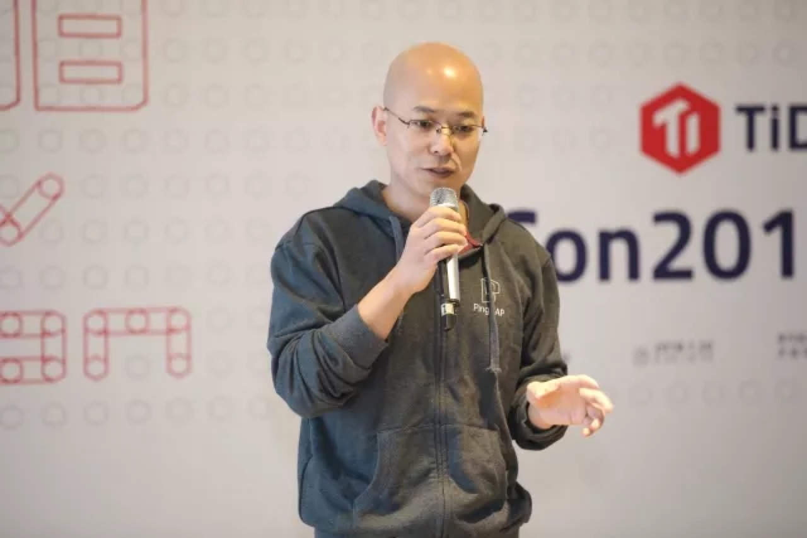
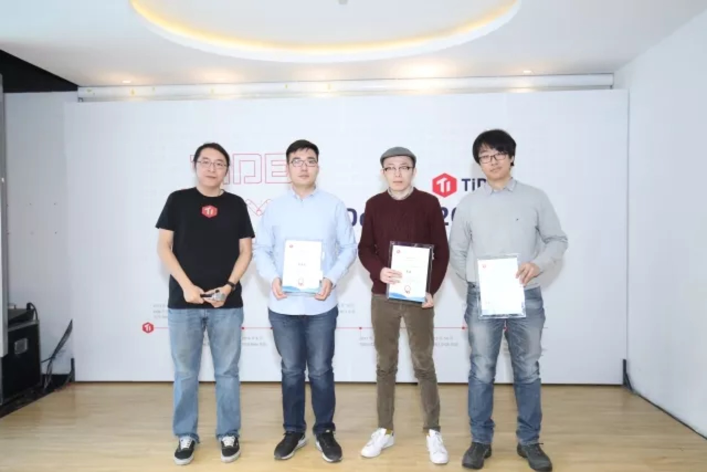
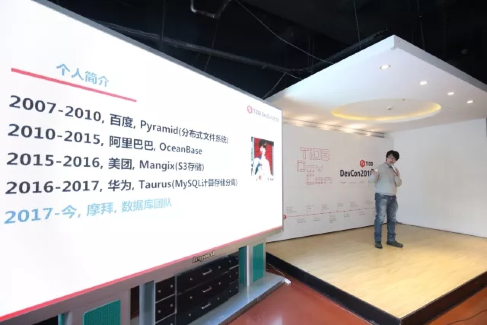
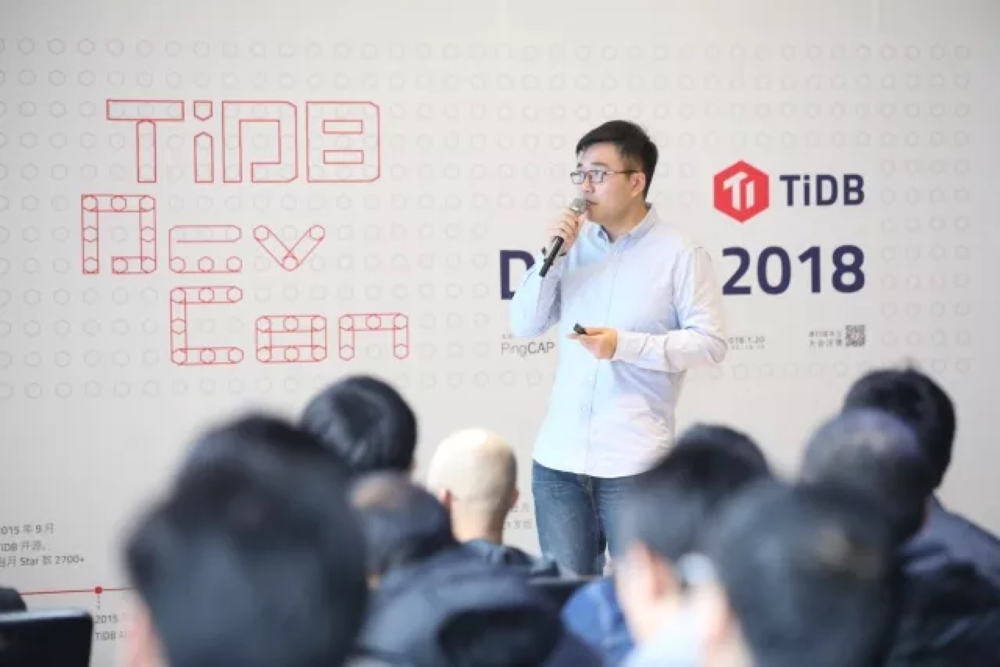
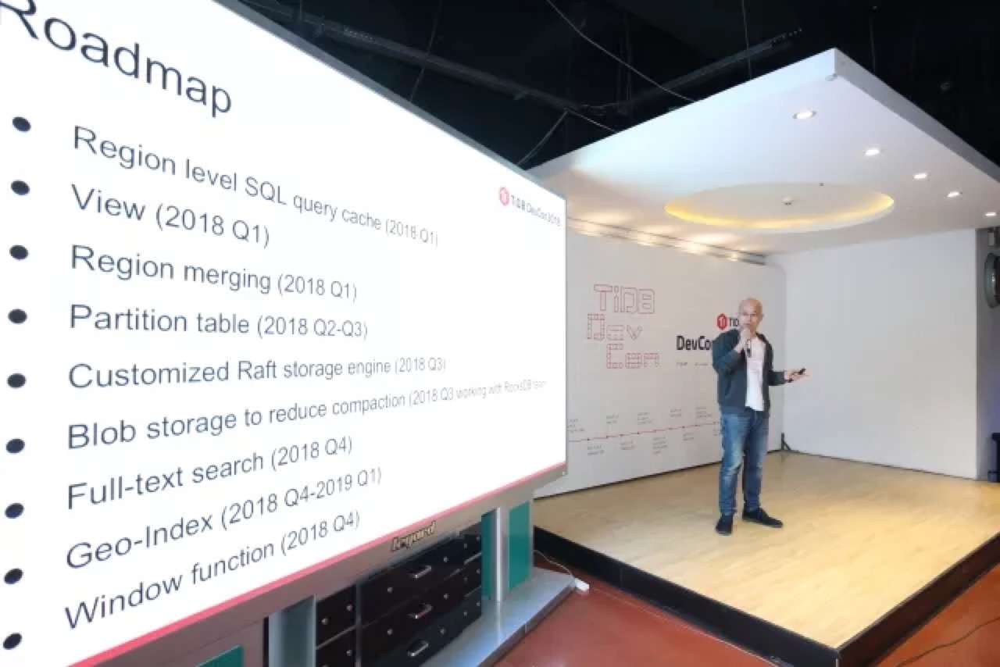
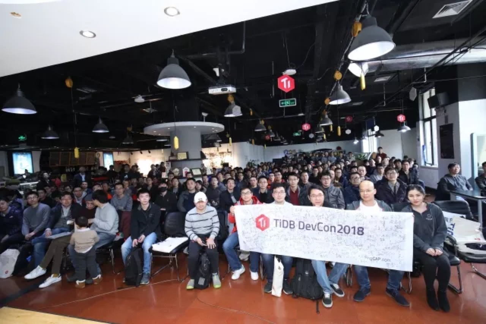

上周六，小伙伴们期待已久的 TiDB DevCon 终于在北京·车库咖啡和大家见面啦~尽管是寒冷的冬天，但丝毫没有影响小伙伴们的参会热情。

在本次活动上，我们为大家分享了 TiDB 最新的项目进展以及 2018 年的 Roadmap。

在过去 2017 年，我们从公司、到社区、再到产品特性，都发生了很大的变化。

2016 年的 PingCAP 只有 35 个小伙伴，到现在PingCAP 团队有 91 人。从人员的规模上面来讲，我们增加了 2.6 倍。

但是其它方面的指标增加了更多~

## 社区

- GitHub 的 Star 数从 2017 年 1 月的 7149 到现在的 14000 多，由下图可见整体呈非常稳定的线性增长；

- Contributor 的数量由 2017 年的 95 个增加到 2018 年的 213 个，总体上增加 126%；

- 实际的用户数量，从 2017 年初的 4 个线上的用户增加到现在可统计到的 200 +，数据增加了 50 倍。

如今，随着 TiDB Community 的不断完善，committer 的晋升机制也在不断优化中，在本次活动上，特设置了 committer 授予环节，3 位新晋 committer 也正式与大家见面啦~

>左二至右一：李雨来、吴镝、李凯

## 合作

目前，PingCAP 已与多家云厂商达成合作，2018 年预计还会增加 2 到 3 个 Cloud 合作伙伴。

活动现场，我们也邀请了来自 Mobike、今日头条、SpeedyCloud、去哪儿、饿了么的小伙伴，为大家分享他们对 TiDB 的实践经验。

>李凯（知乎 ID：郁白），现任摩拜数据库团队资深经理

>吴镝，今日头条数据库中间件/分布式数据库负责人

>李雨来，SpeedyCloud 架构师

>蒲聪 ，去哪儿网资深 DBA

>陈东明，饿了么北京技术中心架构组负责人

## 产品

在产品技术方面，TiDB 整体的性能和延迟也做了非常大的改进。就在活动的前一天，TiDB 发布了 1.1 Alpha 版，在这个版本中：

- QPS 增加了 50%；

- 能够很好的支持 auto-increment id，增速在 16 倍以上；

- TiKV  读的性能，在极限压力下提升了 2 倍；

- 如果我们去 counting 一个 table ，整体的方案提升大概是 60%；

- Hash Join 提升在 3 倍以上；

- 一些复杂 query ，根据现有用户的反馈，在 30T 左右的数据场景下面，一个复杂的查询，如果是使用到更好的 index 算法的话，提升大概在 30 倍左右；

- 同时，在 TiDB 1.1 里，我们完全重写了整个优化器，现在优化器变得更加智能。

## 工具

当然，上面所有的这些优化只有使用上 TiDB 1.1 才能体验到，对于还未使用 TiDB 的用户来说，会面临的一个问题就是：怎样从已有的 MySQL 数据里面重新导入进 TiDB。针对这个问题，我们最近也提供了一个新的工具，用来提升大家在导入数据过程中的体验，速度整体的提升在实测中的表现大概有提升了 15 倍。

同时，我们也专门构建了一个数据导入工具，这个导入工具大概可以在五个小时内导入 1T 的原始数据。相对于大家以往用传统的方式来并发导入，它的速度提升大概是十倍。

为了让大家更好的观察到整个集群的运行状态，我们也做了一个非常炫的图形界面。

+ [视频 | PD 图形界面 Demo 1](https://v.qq.com/x/page/d0536vetmqo.html)

+ [视频 | PD 图形界面 Demo 2](https://v.qq.com/x/page/j0536ndb5np.html)

对于 **2018 年 TiDB 项目的 Roadmap**，重点在以下几个内容：

- 首先是  Region level SQL query cache；

通常情况下面我们在整个集群里面假设有几十 T 的数据，实际上我们随着不断的写入，通常最近的一段时间的写入的数据量都是比较少的。此时，就没有必要用一个 query 把没有变化的数据也计算一遍，特别是没有变化的数据是不需要去查或者重新计算的。而这个特性的好处就是我们不需要去重算，已经算过的就直接把它 SQL 的 query 结果 cache 起来就可以了。这个 query 是以 Region 为基本单位，它在一些场景下面的提升会达到数十倍甚至更高。

- 第二个特性就是 Region merging ；

在 TiDB 现在的版本里面，region 是会随着数据的增长不断分裂的，那么有的时候我们需要去删掉一些以前不再用的数据，这部分数据虽然会被删掉，但是它 region 的元信息还在。此时，如果大家的 SQL 语句没有很好的设定从哪里开始做扫描的话，那有可能会把这些已经删掉的 region  元信息重新过一遍，这是会降低我们查询速度。所以我们在最新的实现里面会把这些已经删掉的这些 region 的元信息重新 merge 到一起，降低我们管理元信息的复杂度，然后同时增加查询的速度。

- 第三个特性就是 Partition table；

我们在很多实际使用场景里面可能会遇到一些特定的分区需求，比如说需要按月去做分区，那么通常查询就只需查询这一个月，其它数据就不碰，或者是按照按照地区等等分区方式，新的实现里面也会去支持 Partition table。

- 第四点是 Full-text search；

大家可能很多用户会放弃到 ES，因为觉得用 MySQL 的界面已经很好用了，查询速度已经够快了，这时候可能唯一的牵绊就是还有没有一个 Full-text search，我们计划是在 2018 年的 Q4 做这个特性。

同时，会在 2018 Q2 提供 window function， 这一点目前社区的呼声也很高。2018 Q3 提供视图功能，另外我们也在和 RocksDB 团队一起开发推进 Blob storage 的实现，这个特性可以显著降低写放大，进一步提升写入性能，并降低写入过程中的 CPU 开销。

最后，就是大家有很多的地理位置相关的查询这种特性，我们计划是在 2018 年的 Q4 到 2019 年的 Q1 来提供。

