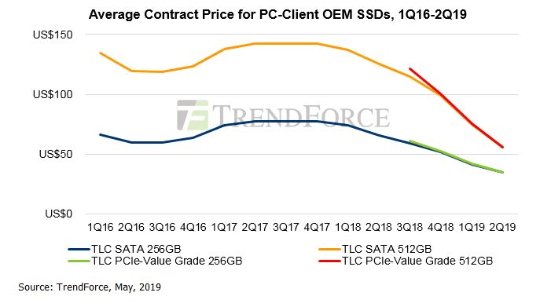
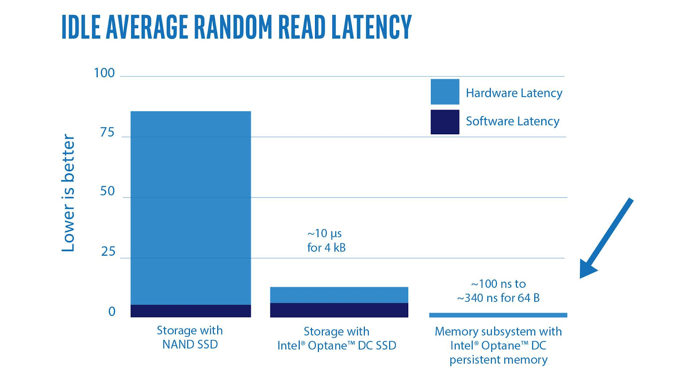
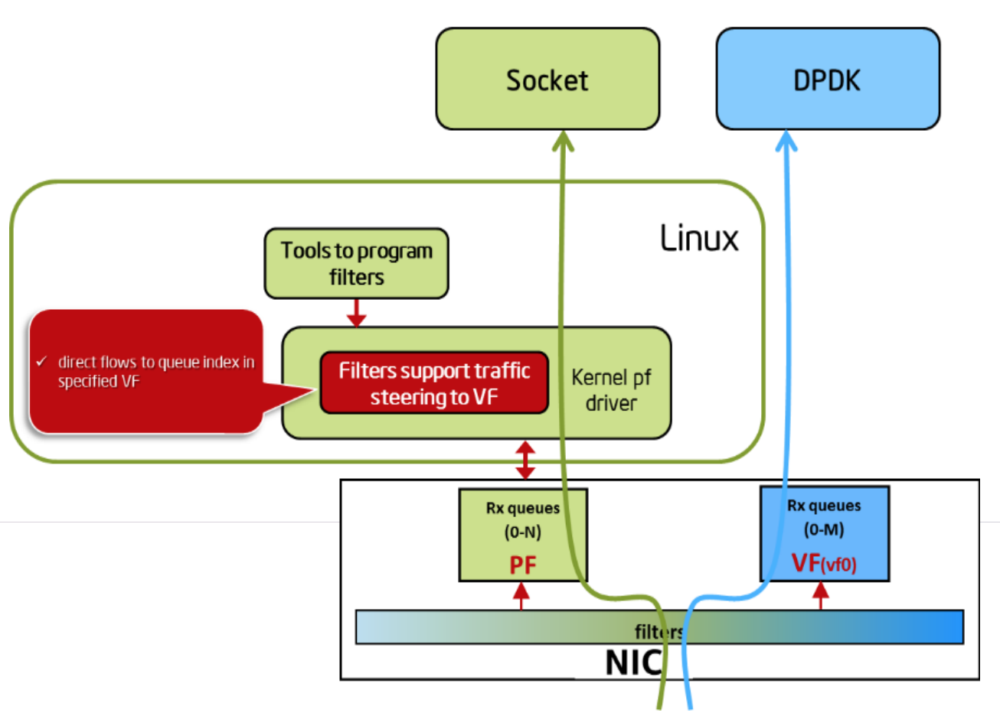

[上篇]([https://pingcap.com/blog-cn/distributed-system-in-2010s-2/](https://pingcap.com/blog-cn/distributed-system-in-2010s-2/)
)我们聊了软件构建方式和演化，今天我们来聊聊硬件吧！

## SSD 普及的深远影响

如果说云的出现是一种商业模式的变化的话，驱动这个商业革命的推手就是最近十年硬件的快速更新。比起 CPU，存储和网络设备的进化速度更加迅速。最近五年，SSD 的价格 (包括 PCIe 接口) 的成本持续下降，批量采购的话已经几乎达到和 HDD 接近的价格。

 图 1 近 5 年 SSD 成本曲线

SSD 的普及，对于存储软件厂商的影响是深远的。

其一，是极大地缓解了 IO 瓶颈。对于数据库厂商来说，可以将更多的精力花在其他事情，而不是优化存储引擎上。最近两年发生了一些更大的变化，NVMe 正在成为主流，我们很早就在 Intel Optane 进行实验和投资，类似这样的非易失内存的技术，正在模糊内存和存储的界限，但是同时对开发者带来挑战也是存在的。举一个简单的例子，对于 Optane 这类的非易失内存，如果你希望能够完全利用它的性能优势，最好使用类似 PMDK 这类基于 Page cache Bypass 的 SDK 针对你的程序进行开发，这类 SDK 的核心思想是将 NVM 设备真正地当做内存使用。如果仅仅将 Optane 挂载成本地磁盘使用，其实很大程度上的瓶颈不一定出现在硬件本身的 IO 上。

下面这张图很有意思，来自 Intel 对于 Optane 的测试，我们可以看见在中间那一列，Storage with Optane SSD，随机读取的硬件延迟已经接近操作系统和文件系统带来的延迟，甚至 Linux VFS 本身会变成 CPU 瓶颈。其实背后的原因也很简单，过去由于 VFS 本身在 CPU 上的开销（比如锁）相比过去的 IO 来说太小了，但是现在这些新硬件本身的 IO 延迟已经低到让文件系统本身开销的比例不容忽视了。

 图 2 Intel 对于 Optane 的测试

其二，这个变化影响了操作系统和文件系统本身。例如针对 Persistent Memory 设计新的文件系统，其中来自 UCSD 的 NVSL 实验室 (名字很厉害， Non-Volatile Systems Laboratory) 的 [NovaFS](https://lwn.net/Articles/749009/) 就是一个很好的例子。简单来说是大量使用了无锁数据结构，减低 CPU 开销，NovaFS 的代码量很小很好读，有兴趣可以看看。另外 Intel 对 Persistent Memory 编程模型有很好的一篇[文章](https://software.intel.com/en-us/articles/introduction-to-programming-with-persistent-memory-from-intel)，感兴趣的话可以从这里开始了解这些新变化。

## 内核开销的挑战

说完了存储设备，我们聊聊网络设备。我还记得我第一份工作的数据中心里甚至还有百兆的网卡，但现在，1GbE 已经都快淘汰光了，主流的数据中心基本上开始提供 10GbE 甚至 25GbE 的网络。为什么会变成这样？我们做一个简单的算术题就知道了。根据 Cisco 的[文档介绍](https://tools.cisco.com/security/center/resources/network_performance_metrics)， 一块千兆网卡的吞吐大概是: [1,000,000,000 b/s / (84 B * 8 b/B)] == 1,488,096 f/s (maximum rate)。

那么万兆网卡的吞吐大概是它的十倍，也就是差不多每秒 1488 万帧，处理一个包的时间在百纳秒的级别，基本相当于一个 L2 Cache Miss 的时间。所以如何减小内核协议栈处理带来的内核-用户态频繁内存拷贝的开销，成为一个很重要的课题，这就是为什么现在很多高性能网络程序开始基于 DPDK 进行开发。

对于不了解 DPDK 的朋友，在这里[简单科普一下](https://www.dpdk.org/wp-content/uploads/sites/35/2016/10/Day02-Session05-JingjingWu-Userspace2016.pdf):

 图 3 DPDK Flow Bifurcation

从上图可以看到，数据包直接从网卡到了 DPDK，绕过了操作系统的内核驱动、协议栈和 Socket Library。DPDK 内部维护了一个叫做 UIO Framework 的用户态驱动 (PMD)，通过 ring queue 等技术实现内核到用户态的 zero-copy 数据交换，避免了 Syscall 和内核切换带来的 cache miss，而且在多核架构上通过多线程和绑核，极大提升了报文处理效率。如果你确定你的网络程序瓶颈在包处理效率上，不妨关注一下 DPDK。

另外 RDMA 对未来体系结构的影响也会很大，它会让一个分布式集群向一个超级 NUMA 的架构演进（它的通信延时/带宽已经跟现在 NUMA 架构中连接不同 socket node 的 QPI 的延时/带宽在一个量级），但是目前受限于成本和开发模型的变化，可能还需要等很长一段时间才能普及。

其实不管是 DPDK，SPDK，PMDK ，背后的主线都是 Bypass kernel，Linux 内核本身带来的开销已经很难适应现代硬件的发展，但是生态和兼容性依然是大的挑战，我对于一言不合就搞个 Bypass Kernel SDK 的做法其实是不太赞同的。大量的基础软件需要适配，甚至整个开发模型都要变化。

我认为有关内核的问题，内核社区从长期来看一定会解决。一个值得关注的技术是 Linux 5.1 内核中引入的 io_uring 系列的新系统调用，io_uring 的原理简单来说就是通过两个内核/用户态共享的 ring buffer 来实现 IO 事件的提交以及收割，避免了 syscall 及内核<->用户态的内存拷贝，同时提供了 poll 的模式， 不用等待硬件中断，而是不断轮询硬件，这极大降低了 IO 延迟，提升了整体吞吐。 我认为 io_uring 的出现也代表了内核社区在各种 Bypass Kernel 技术涌现的当下，正在奋起直追。

>本文是「分布式系统前沿技术」专题文章，目前该专题在持续更新中，欢迎大家保持关注。