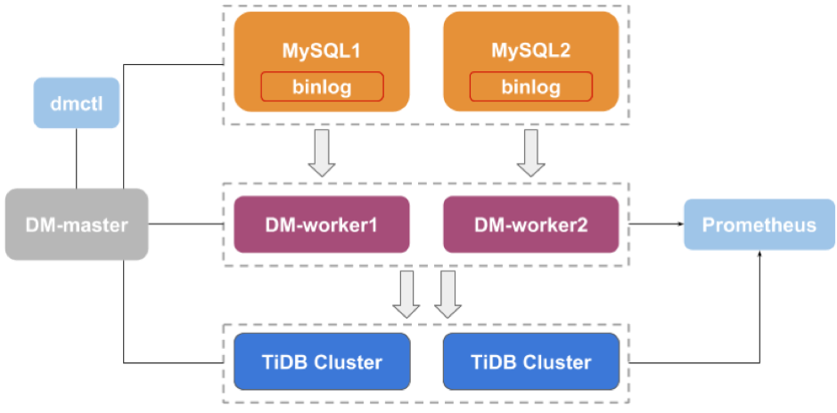

DM（TiDB Data Migration）是由 PingCAP 开发的一体化数据同步平台，支持从 MySQL 或 MariaDB 到 TiDB 的全量数据迁移和增量数据同步。无论是从 MySQL 向 TiDB 进行平滑数据迁移还是用 TiDB 作为多个 MySQL 实例的数据汇总库，都可以通过 DM 来实现。DM 在 [TiDB DevCon 2019](https://pingcap.com/community-cn/devcon2019/) 上正式开源，经过半年多时间在大量用户、开发者的支持和反馈下，其功能和稳定性越来越完善。在今天，我们宣布 DM 1.0 GA 正式发布。

DM Architecture

## 核心特性

### 一体化数据同步

在进行上下游数据同步的时候，一般需要先进行全量数据复制，再进行增量数据同步。DM 同步任务支持配置多个上游 MySQL/MariaDB 实例，并且同时执行全量迁移和增量同步，可以简单稳定地满足用户迁移数据的场景。

### 同步规则可配置

DM 提供了包括库表路由（Table routing）、黑白名单（Black & white table lists）、binlog 过滤（Binlog event filter）在内丰富的数据同步规则，支持在数据同步中进行自定义配置。

### 分库分表自动合并

在使用 MySQL 支撑大量数据时，经常会选择使用分库分表的方案。但当将数据同步到 TiDB 后，通常希望逻辑上进行合库合表。DM 针对合库合表的同步场景，提供了强大的分库分表自动合并机制，能够协调上游各分片之间的 DDL 同步，保证数据同步的正确性。

### 异常任务自动恢复

在数据同步的过程中，上游、下游、DM 自身的问题都有可能导致同步任务的中断。DM 针对常见的异常同步场景进行了优化，支持自动检测相关服务状态并自动尝试恢复大部分的异常同步任务，使得同步任务的运行更加稳定可靠。

## 更多资料

大家可以参考 [DM 使用文档](https://pingcap.com/docs-cn/v3.0/reference/tools/data-migration/deploy/) 来部署并体验，参考 [DM 升级指南](https://pingcap.com/docs-cn/v3.0/reference/tools/data-migration/dm-upgrade/) 更新至 GA 版本。想深入了解 DM 相关实现原理的同学，也可以查看 [DM 源代码](https://github.com/pingcap/dm) 以及配套的 [DM 源码阅读系列](https://pingcap.com/blog-cn/#DM-%E6%BA%90%E7%A0%81%E9%98%85%E8%AF%BB) 文章。如果有相关的问题，欢迎在 Github 上提 issue 或者是在 [AskTUG 问答社区](https://asktug.com/) 中讨论。

## 下一步计划

最后再次感谢各位用户、开发者对 DM 提供的支持和帮助。在 DM 1.0 GA 发布之后，我们会持续打磨优化 DM，在接下来的版本中，提供 DM 组件高可用、优化分库分表合并机制、支持同步过程在线校验等新特性，向更加完善的数据同步平台方向持续演进。

