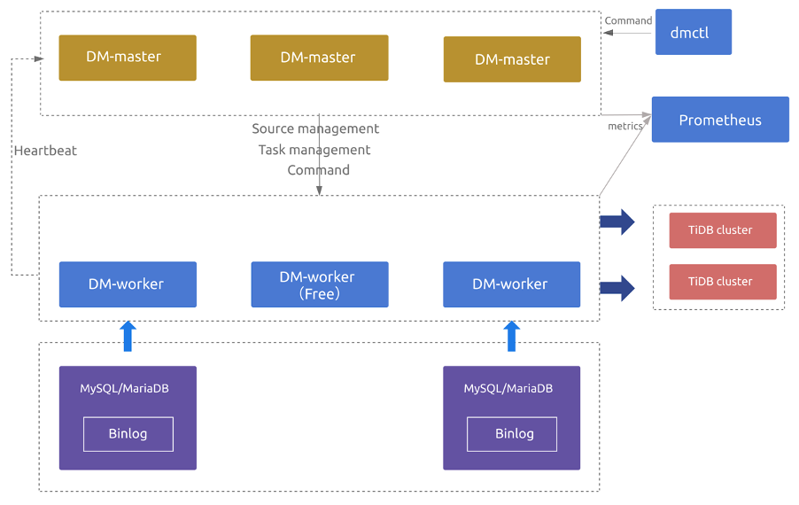
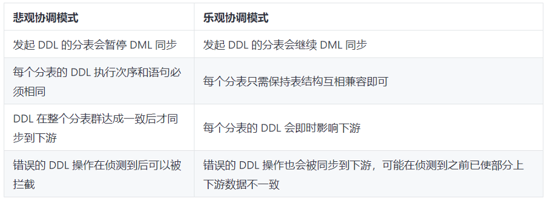
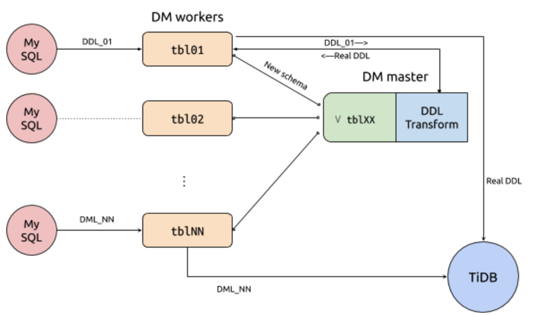

社会数字化、智能化的发展进程中，海量的数据带来巨大挑战，各行各业都在加速数字化转型，越来越多的企业意识到数据基础设施是成功的关键。然而，作为数据基础设施的核心，传统数据库例如 MySQL 面临性能和容量瓶颈，通过中间件实现的分库分表方案复杂度高，同时带来高昂的运维成本。

作为一款企业级 NewSQL 数据库，TiDB 采用计算、存储分离的架构，可以根据业务需要进行弹性的扩展，应对更加实时和智能的数据应用需求。TiDB 提供 Data Migration (DM) 生态工具，帮助用户实现从 MySQL 到 TiDB 数据迁移，有效降低迁移成本和风险。

DM 是由 PingCAP 研发的一体化的数据迁移任务管理平台，支持从 MySQL、Aurora或 MariaDB 到 TiDB 的全量数据迁移和增量数据复制。DM 2.0 版本现已正式发布，新增高可用、乐观协调模式下的分库分表合并迁移等企业级特性，同时带来一系列易用性的提升，确保用户的原数据库可以平滑地切换到 TiDB，完全不用担心迁移带来的故障与数据丢失。

## DM 2.0 新特性

### 数据迁移任务的高可用

DM 2.0 提供数据迁移任务的高可用，部分 DM-master、DM-worker 节点异常后仍能保证数据迁移任务的正常运行。

当部署多个 DM-master 节点时，所有 DM-master 节点将使用内部嵌入的 etcd 组成集群。该 DM-master 集群用于存储集群节点信息、任务配置等元数据，同时通过 etcd 选举出 leader 节点，该 leader 节点用于提供集群管理、数据迁移任务管理相关的各类服务。若可用的 DM-master 节点数超过部署节点的半数，即可正常提供服务。

当部署的 DM-worker 节点数超过上游 MySQL/MariaDB 节点数时，超出上游节点数的相关 DM-worker 节点默认将处于空闲状态。若某个 DM-worker 节点下线或与 DM-master 发生网络隔离，DM-master 能自动将与原 DM-worker 节点相关的数据迁移任务调度到其他空闲的 DM-worker 节点上并继续运行。

DM 2.0 高可用架构示意图

### 乐观协调模式下的分库分表合并迁移

DM 1.0 版本支持在线上执行分库分表的 DDL 语句（通称 Sharding DDL），通过使用悲观模式，即当上游一个分表执行某一 DDL 后，这个分表的迁移会暂停，等待其他所有分表都执行了同样的 DDL 才在下游执行该 DDL 并继续数据迁移。悲观协调模式的优点是可以保证迁移到下游的数据不会出错，缺点是会暂停数据迁移而不利于对上游进行灰度变更、并显著地增加增量数据复制的延迟。

DM 2.0 版本提供新的乐观协调模式，在一个分表上执行的 DDL，自动修改成兼容其他分表的语句后立即应用到下游，不会阻挡任何分表执行的 DML 的迁移。乐观协调模式适用于上游灰度更新、发布的场景，或者是对上游数据库表结构变更过程中同步延迟比较敏感的场景。

Sharding DDL 悲观协调模式 V.S. 乐观协调模式

在乐观协调模式下，DM-worker 接收到来自上游的 DDL 后，会把更新后的表结构转送给 DM-master。DM-worker 会追踪各分表当前的表结构，DM-master 合并成可兼容来自每个分表 DML 的合成结构，然后通知相应的 DM-worker 把与此对应的 DDL 迁移到下游；对于 DML 会直接迁移到下游。

乐观协调模式下的 Sharding DDL 流程示意图

DM 2.0 版本试验性的支持从 MySQL 8.0 迁移数据到 TiDB，同时提供 TLS 支持，构建立体的数据安全体系，保障 DM 组件之间以及 DM 组件与上下游数据库之间的连接与传输的安全与合规，帮助企业实现数据在全生命周期过程中的不丢失、不泄露、不被篡改和隐私合规。

### 易用性全面提升

在新特性之外，DM 2.0 版本带来易用性的全面提升。用户可以[通过 TiUP 进行 DM 2.0 的部署和运维](https://docs.pingcap.com/zh/tidb-data-migration/v2.0/maintain-dm-using-tiup) ，同时[支持使用 TiUP 把 1.0 版本的 DM 导入升级为 2.0 版本](https://docs.pingcap.com/zh/tidb-data-migration/v2.0/maintain-dm-using-tiup#%E5%AF%BC%E5%85%A5-dm-ansible-%E9%83%A8%E7%BD%B2%E7%9A%84-dm-10-%E9%9B%86%E7%BE%A4%E5%B9%B6%E5%8D%87%E7%BA%A7)。在 DM 2.0 中，DM-worker 使用 DM-master 提供的 API 动态进行注册，在扩容和缩容 DM-worker 时，不再需要重启 DM-master 组件，有效地提升业务连续性。

对于 AWS Aurora、阿里云 RDS 等由云厂商提供的托管式 MySQL，用户通常无法获取 SUPER 权限因而无法在全量数据导出时获取一致性快照。在 DM 2.0 中，通过记录全量导出过程开始至结束区间的 binlog position 范围并在增量阶段自动保证 [safe-mode](https://docs.pingcap.com/zh/tidb-data-migration/v2.0/glossary#safe-mode) 的开启，在无需用户手动处理的情况下即保证了数据的最终一致性。对于 Aurora 中如 “SELECT INTO S3” 等特有权限，DM 2.0 在权限检查过程中也提供了更好的兼容支持。

在 DM 2.0 中 [query-status](https://docs.pingcap.com/zh/tidb-data-migration/v2.0/query-status) 命令除了能查询到可能的数据迁移异常外，对于部分常见异常，提供 "Workaround" 信息来指导用户如何进行处理。DM 2.0 引入 [handle-error](https://docs.pingcap.com/zh/tidb-data-migration/v2.0/handle-failed-sql-statements) 命令来替换 DM 1.0 中的 sql-skip 与 sql-replace 命令，简化了处理数据迁移过程中出错 SQL 语句的流程。

此外，DM 2.0 加入对全量导出数据及增量 binlog 数据中对应的 sql_mode 的自动处理，确保尽可能地减少手动的配置和干预。DM 2.0 也对一系列功能进行了易用性增强，包括全量导出文件的自动清理、配置参数优化、监控面板优化、log 展示优化等。

## 用户实践

### 微众银行

微众银行于 2014 年 12 月获得由深圳银监局颁发的金融许可证，是由腾讯等知名企业发起设立、国内首家开业的民营银行，致力于为普罗大众、微小企业提供差异化、有特色、优质便捷的金融服务。

微众银行在多个业务场景中使用 TiDB，其中批量任务、流水日志归档这两类场景高度依赖 DM 的分表合表功能。在批量任务场景中，使用 DM 把上游多个 MySQL 实例的同构分表汇总合表到下游 TiDB 中，再借助 TiDB 的水平扩展能力来提升批量效率。在流水日志归档场景，同样使用 DM 把上游多个 MySQL 实例的同构分表进行合表汇总到 TiDB 中，借助 TiDB 的水平扩展能力来提供理论无上限的存储容量能力。

原先的 DM 1.0 版本在使用过程中遇到一些问题：DM 的 Worker 组件发生异常挂掉后，会导致数据同步暂停，需要人工干预进行恢复，操作较为繁琐且会影响数据同步的时效性。其次，在金融场景下，一般使用灰度策略进行表结构变更，即对于上游多个 MySQL 实例的同构分表，一般会灰度变更其中一个实例，观察几天无异常后，才会继续对剩下的其他同构分表进行表结构变更，这种场景在 DM 1.0 下会导致数据同步 block 住，同样会影响数据同步的时效性。

针对 DM 1.0 在实际场景中部分功能的缺失，微众银行数据库团队通过业务 POC 测试，挖掘和细化了需求，协同 PingCAP 进行了深度的方案讨论，并进行了一系列功能的开发和优化工作。DM 2.0 的版本已经涵盖了组件高可用、支持灰度变更等企业级特性，能够满足金融级的数据同步需求。此外，DM 2.0 在易用性上也有大量的优化，比如使用 TiUP 更方便地来部署和维护多套 DM 集群 、Worker 上游 source 配置信息更加简化、错误信息更加清晰易读等。

### 理想汽车

理想汽车致力于研发比燃油车更好的智能电动车，首台理想 ONE 自 2019 年 11 月正式下线以来，理想汽车仅用 10 个月交付 20,000 辆，创中国造车新势力最快交付记录。
微服务已经成为云原生时代企业数字化转型升级的基础，目前理想汽车累计 99% 以上，超过 400+ 的业务应用都构建在微服务之上，覆盖车联网、订单商城、车辆生产、售后、物流等业务流程。在微服务架构中，每个单独的微服务都对应独立的 MySQL 数据库（基于公有云 RDS），理想汽车采用 DM 工具实现把多个 MySQL 库的数据实时同步到一套 TiDB 集群，来解决两个业务场景的应用需求。

一方面，TiDB 满足跨多个 MySQL 数据库进行实时数据联查的需求，利用 TiFlash 的 HTAP 能力，提供实时的业务分析报表。另一方面，利用 TiDB 对公有云的多个 MySQL 数据库做实时的数据备份，在提升业务可用性的同时降低了公有云 RDS 在读写分离场景下，实现负载均衡所需要额外使用的从库资源成本。

基于业务对 DM 工具的强依赖，理想汽车通过 TiUP 把原先 DM 1.0 集群升级到 DM 2.0 ，并对 DM 2.0 的高可用特性进行了深入测试，包括 DM-master 与 DM-worker 节点的高可用、数据迁移任务的自动调度与正确性保证，以及从 1.0 升级到 2.0 后的 DM-master 扩容等。总体来讲，DM 2.0 降低了从 MySQL 向 TiDB 进行数据实时同步的风险，保障了同步过程中的数据不丢失与服务高可用。

## 体验 DM 2.0

大家可以[通过 TiUP 快速部署体验 DM 2.0](https://docs.pingcap.com/zh/tidb-data-migration/v2.0/deploy-a-dm-cluster-using-tiup)，参照[创建数据迁移任务](https://docs.pingcap.com/zh/tidb-data-migration/v2.0/quick-start-create-task)开始将数据从 MySQL 迁移到 TiDB。对于 DM 1.0 集群，则可以[使用 TiUP 导入并升级到 DM 2.0 集群](https://docs.pingcap.com/zh/tidb-data-migration/v2.0/maintain-dm-using-tiup#导入-dm-ansible-部署的-dm-10-集群并升级)。

另外，如果对 DM 后续的开发计划感兴趣，可以查看 GitHub repo 上的 [roadmap](https://github.com/pingcap/dm/blob/master/roadmap.md)。同时，也非常欢迎大家来为 DM 贡献 PR、issue 以及使用反馈。
