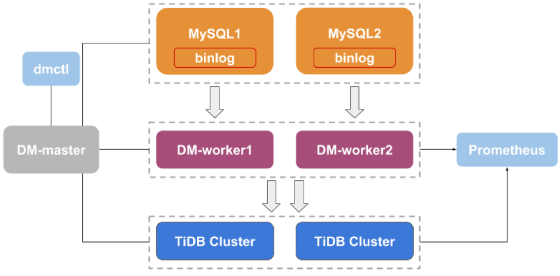

本文为 DM 源码阅读系列文章的第二篇，[第一篇](https://www.pingcap.com/blog-cn/dm-source-code-reading-1/) 文章简单介绍了 DM 源码阅读的目的和源码阅读的规划、介绍了 DM 的源码结构以及工具链。

从本篇文章开始，我们会正式开始阅读 DM 的源码。本篇文章主要介绍 DM 的整体架构，包括 DM 有哪些组件、各组件分别实现什么功能、组件之间交互的数据模型和 RPC 实现。

## 整体架构

通过上面的 DM 架构图，我们可以看出，除上下游数据库及 Prometheus 监控组件外，DM 自身有 DM-master、DM-worker 及 dmctl 这 3 个组件。其中，DM-master 负责管理和调度数据同步任务的各项操作，DM-worker 负责执行具体的数据同步任务，dmctl 提供用于管理 DM 集群与数据同步任务的各项命令。

## DM-master

DM-master 的入口代码在 [`cmd/dm-master/main.go`](https://github.com/pingcap/dm/blob/3fcf24daa5/cmd/dm-master/main.go)，其中主要操作包括：

1.  调用 `cfg.Parse` 解析命令行参数与参数配置文件

2.  调用 `log.SetLevelByString` 设置进程的 log 输出级别

3.  调用 `signal.Notify` 注册系统 signal 通知，用于接受到指定信号时退出进程等

4.  调用 `server.Start` 启动 RPC server，用于响应来自 dmctl 与 DM-worker 的请求

在上面的操作中，可以看出其中最关键的是步骤 4，其对应的实现代码在 [`dm/master/server.go`](https://github.com/pingcap/dm/blob/3fcf24daa5/dm/master/server.go) 中，其核心为 [`Server`](https://github.com/pingcap/dm/blob/3fcf24daa5/dm/master/server.go#L46) 这个 struct，其中的主要 fields 包括：

*   `rootLis, svr`：监听网络连接，分发 RPC 请求给对应的 handler。

*   `workerClients`：维护集群各 DM-worker ID 到对应的 RPC client 的映射关系。

*   `taskWorkers`：维护用于执行各同步（子）任务的 DM-worker ID 列表。

*   `lockKeeper`：管理在协调处理 sharding DDL 时的 lock 信息。

*   `sqlOperatorHolder`：管理手动 skip/replace 指定 sharding DDL 时的 SQL operator 信息。

在本篇文章中，我们暂时不会关注 `lockKeeper` 与 `sqlOperatorHolder`，其具体的功能与代码实现会在后续相关文章中进行介绍。

在 DM-master Server 的入口方法 [`Start`](https://github.com/pingcap/dm/blob/3fcf24daa5/dm/master/server.go#L82) 中：

1.  通过 `net.Listen` 初始化 `rootLis` 并用于监听 TCP 连接（借助 [soheilhy/cmux](https://github.com/soheilhy/cmux)，我们在同一个 port 同时提供 gRPC 与 HTTP 服务）。

2.  根据读取的配置信息（`DeployMap`），初始化用于连接到各 DM-worker 的 RPC client 并保存在 `workerClients` 中。

3.  通过 `pb.RegisterMasterServer` 注册 gRPC server（`svr`），并将该 `Server` 作为各 services 的 implementation。

4.  调用 `m.Serve` 开始提供服务。

DM-master 提供的 RPC 服务包括 DM 集群管理、同步任务管理等，对应的 service 以 Protocol Buffers 格式定义在 [`dm/proto/dmmaster.proto`](https://github.com/pingcap/dm/blob/3fcf24daa5/dm/proto/dmmaster.proto) 中，对应的 generated 代码在 [`dm/pb/dmmaster.pb.go`](https://github.com/pingcap/dm/blob/3fcf24daa5/dm/pb/dmmaster.pb.go) 中。各 service 的具体实现在 [`dm/master/server.go`](https://github.com/pingcap/dm/blob/3fcf24daa5/dm/master/server.go) 中（`*Server`）。

## DM-worker

DM-worker 的结构与 DM-master 类似，其入口代码在 [`cmd/dm-worker/main.go`](https://github.com/pingcap/dm/blob/3fcf24daa5/cmd/dm-worker/main.go) 中。各 RPC services 的 Protocol Buffers 格式定义在 [`dm/proto/dmworker.proto`](https://github.com/pingcap/dm/blob/3fcf24daa5/dm/proto/dmworker.proto) 中，对应的 generated 代码在 [`dm/pb/dmworker.pb.go`](https://github.com/pingcap/dm/blob/3fcf24daa5/dm/pb/dmworker.pb.go) 中，对应的实现代码在 [`dm/worker/server.go`](https://github.com/pingcap/dm/blob/3fcf24daa5/dm/worker/server.go) 中（`*Server`）。DM-worker 的启动流程与 DM-master 类似，在此不再额外说明。

[`Server`](https://github.com/pingcap/dm/blob/3fcf24daa5/dm/worker/server.go#L42) 这个 struct 的主要 fields 除用于处理 RPC 的 `rootLis` 与 `svr` 外，另一个是用于管理同步任务与 relay log 的 `worker`（相关代码在 [`dm/worker/worker.go`](https://github.com/pingcap/dm/blob/3fcf24daa5/dm/worker/worker.go) 中）。

在 [`Worker`](https://github.com/pingcap/dm/blob/3fcf24daa5/dm/worker/worker.go#L43) 这个 struct 中，主要 fields 包括：

*   `subTasks`：维护该 DM-worker 上的所有同步子任务信息。

*   `relayHolder`：对 relay 处理单元相关操作进行简单封装，转发相关操作请求给 relay 处理单元，获取 relay 处理单元的状态信息。

*   `relayPurger`：根据用户配置及相关策略，尝试定期对 relay log 进行 purge 操作。

数据同步子任务管理的代码实现主要在 [`dm/worker/subtask.go`](https://github.com/pingcap/dm/blob/3fcf24daa5/dm/worker/subtask.go) 中， relay 处理单元管理的代码实现主要在 [`dm/worker/relay.go`](https://github.com/pingcap/dm/blob/3fcf24daa5/relay/purger/) 中，对 relay log 进行 purge 操作的代码实现主要在 [`relay/purger`](https://github.com/pingcap/dm/blob/3fcf24daa5/relay/purger/) pkg 中。在本篇文章中，我们暂时只关注 DM 架构相关的实现，上述各功能的具体实现将在后续的相关文章中展开介绍。

`Worker` 的入口方法为 [`Start`](https://github.com/pingcap/dm/blob/3fcf24daa5/dm/worker/worker.go#L93)，其中的主要操作包括：

1.  通过 `w.relayHolder.Start` 启动 relay 处理单元，开始从上游拉取 binlog。

2.  通过 `w.relayPurger.Start` 启动后台 purge 线程，尝试对 relay log 进行定期 purge。

其他的操作主要还包括处理 `Server` 转发而来的同步任务管理、relay 处理单元管理、状态信息查询等。

## dmctl

dmctl 的入口代码在 [`cmd/dm-ctl/main.go`](https://github.com/pingcap/dm/blob/3fcf24daa5/cmd/dm-ctl/main.go)，其操作除参数解析与 signal 处理外，主要为调用 [`loop`](https://github.com/pingcap/dm/blob/3fcf24daa5/cmd/dm-ctl/main.go#L83) 进入命令处理循环、等待用户输入操作命令。

在 `loop` 中，我们借助 [chzyer/readline](https://github.com/chzyer/readline) 提供命令行交互环境，读取用户输入的命令并输出命令执行结果。一个命令的处理流程为：

1.  调用 `l.Readline` 读取用户输入的命令

2.  判断是否需要退出命令行交互环境（exit 命令）或需要进行处理

3.  调用 `ctl.Start` 进行命令分发与处理

dmctl 的具体命令处理实现在 [`dm/ctl`](https://github.com/pingcap/dm/blob/3fcf24daa5/dm/ctl/) pkg 中，入口为 [`dm/ctl/ctl.go`](https://github.com/pingcap/dm/blob/3fcf24daa5/dm/ctl/ctl.go) 中的 [`Start`](https://github.com/pingcap/dm/blob/3fcf24daa5/dm/ctl/ctl.go#L46) 方法，命令的分发与参数解析借助于 [spf13/cobra](https://github.com/spf13/cobra)。命令的具体功能实现在相应的子 pkg 中：

*   `master`：dmctl 与 DM-master 交互的命令，是当前 DM 推荐的命令交互方式。

*   `worker`：dmctl 与 DM-worker 交互的命令，主要用于开发过程中进行 debug，当前并没有实际所有 DM-worker 支持的命令，未来可能废弃。

*   `common`：多个命令依赖的通用操作及 dmctl 依赖的配置信息等。

每个 dmctl 命令，其主要对应的实现包括 3 个部分：

1.  在各命令对应的实现源文件中，通过方法名为 `New***Cmd` 形式的方法创建 `cobra.Command` 对象。

2.  在 `dm/ctl/ctl.go` 中通过调用 `rootCmd.AddCommand` 添加该命令。

3.  在各命令对应的实现源文件中，通过方法名为 `***Func` 形式的方法实现参数验证、RPC 调用等具体功能。

## 任务管理调用链示例

让我们用一个启动数据同步任务的操作示例来说明 DM 中的组件交互与 RPC 调用流程。

1.  用户在 dmctl 命令行交互环境中输入 start-task 命令及相应参数。

2.  dmctl 在 `dm/ctl/ctl.go` 的 [`Start`](https://github.com/pingcap/dm/blob/3fcf24daa5/dm/ctl/ctl.go#L46) 方法中进行命令分发，请求 `dm/ctl/master/start_task.go` 中的 [`startTaskFunc`](https://github.com/pingcap/dm/blob/3fcf24daa5/dm/ctl/master/start_task.go#L39) 处理命令。

3.  `startTaskFunc` 通过 [`cli.StartTask`](https://github.com/pingcap/dm/blob/3fcf24daa5/dm/ctl/master/start_task.go#L61) 调用 DM-master 上的 RPC 方法。

4.  DM-master 中的 [`Server.StartTask`](https://github.com/pingcap/dm/blob/3fcf24daa5/dm/master/server.go#L182) 方法（`dm/master/server.go`）响应来自 dmctl 的 RPC 请求。

5.  `Server.Start` 从 `workerClients` 中获取任务对应 DM-worker 的 RPC client，并通过 [`cli.StartSubTask`](https://github.com/pingcap/dm/blob/3fcf24daa5/dm/master/server.go#L243) 调用 DM-worker 上的 RPC 方法。

6.  DM-worker 中的 [`Server.StartSubTask`](https://github.com/pingcap/dm/blob/3fcf24daa5/dm/worker/server.go#L139) 方法（`dm/worker/server.go`）响应来自 DM-master 的 RPC 请求。

7.  `Server.StartSubTask` 中将任务管理请求转发给 [`Worker.StartSubTask`](https://github.com/pingcap/dm/blob/3fcf24daa5/dm/worker/worker.go#L144)（`dm/worker/worker.go`），并将处理结果通过 RPC 返回给 DM-master。

8.  DM-master 将 DM-worker 返回的 RPC 响应重新封装后通过 RPC 返回给 dmctl。

9.  dmctl 通过 [`common.PrettyPrintResponse`](https://github.com/pingcap/dm/blob/3fcf24daa5/dm/ctl/common/util.go#L69) 输出命令操作的 RPC 响应。

## 小结

在本篇文章中，我们主要介绍了 DM 的各个组件的入口函数，最后以 dmctl 的 start-task 为例介绍了交互的调用流程细节。下一篇文章我们会开始介绍 DM-worker 组件内各数据同步处理单元（relay-unit, dump-unit, load-unit, sync-unit）的设计原理与具体实现。
