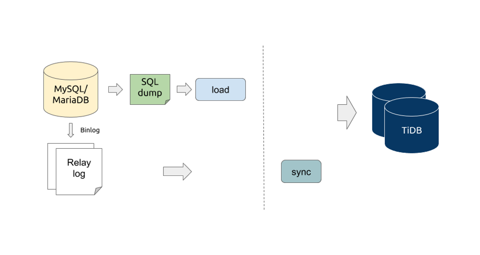

本文为 DM 源码阅读系列文章的第三篇，[上篇文章](https://pingcap.com/blog-cn/dm-source-code-reading-2/) 介绍了 DM 的整体架构，DM 组件 DM-master 和 DM-worker 的入口代码，以及两者之间的数据交互模型。本篇文章详细地介绍 DM 数据同步处理单元，包括 DM-worker 内部用来同步数据的逻辑单元，数据同步处理单元实现了什么功能，数据同步流程、运行逻辑，以及数据同步处理单元的 interface 设计。

## 数据同步处理单元

从上图可以了解到目前 DM 包含 relay log、dump、load、binlog replication（sync） 4 个数据同步处理单元，涵盖了以下数据同步处理的功能：

| 处理单元 | 功能 |
|:------|:--------------------|
| relay log | 持久化 MySQL/MariaDB Binlog 到磁盘 |
| dump | 从 MySQL/MariaDB dump 全量数据 |
| load | 加载全量数据到 TiDB cluster |
| binlog replication（sync） | 复制 relay log 存储的 Binlog 到 TiDB cluster |

## 数据同步流程

Task 数据同步流程初始化操作步骤：

1. DM-master 接收到 task，[将 task 拆分成 subtask](https://github.com/pingcap/dm/blob/6855ea4e40bb5e3775709054a59a55c628a0922f/dm/master/server.go#L190) 后 [分发给对应的各个 DM-worker](https://github.com/pingcap/dm/blob/6855ea4e40bb5e3775709054a59a55c628a0922f/dm/master/server.go#L248)；

2. DM-worker 接收到 subtask 后 [创建一个 subtask 对象](https://github.com/pingcap/dm/blob/6855ea4e40bb5e3775709054a59a55c628a0922f/dm/worker/server.go#L160)，然后 [初始化数据同步流程](https://github.com/pingcap/dm/blob/6855ea4e40bb5e3775709054a59a55c628a0922f/dm/worker/subtask.go#L84)。

从 [初始化数据同步流程](https://github.com/pingcap/dm/blob/6855ea4e40bb5e3775709054a59a55c628a0922f/dm/worker/subtask.go#L84) 的代码中我们可以看到，根据 task 配置项 [task-mode](https://github.com/pingcap/dm/blob/6855ea4e40bb5e3775709054a59a55c628a0922f/dm/config/task.go#L220) 的不同，DM-worker 会初始化不同的数据同步流程：

| task-mode | 同步流程 | 需要的数据同步处理单元 |
|:----------|:----------------|:------------------|
| all | 全量同步 -> 增量数据同步 | relay log、dump、load、binlog replication（sync） |
| full | 全量同步 | dump、load |
| incremental | 增量同步 | relay log，binlog replication（sync） |

## 运行逻辑

DM 数据同步处理单元 interface 定义在 [`dm/unit`](https://github.com/pingcap/dm/blob/6855ea4e40bb5e3775709054a59a55c628a0922f/dm/unit/unit.go)，relay log、dump、load、binlog replication（sync）都实现了该 interface（[golang interface 介绍](https://golang.org/doc/effective_go.html#interfaces)）。

实际上 DM-worker 中的数据同步处理单元分为两类：

* 全局共享单例。dm-worker 启动的时候只初始化一次这类数据同步处理单元，所有的 subtask 都可以使用这类数据同步处理单元的服务；relay log 属于这种类型。

* subtask 独享。dm-worker 会为每个 subtask 初始化一系列的数据同步处理单元；dump、load、binlog replication（sync）属于这种类型。

两类数据同步处理单元的使用逻辑不同，这篇文档会着重讲一下 subtask 独享的数据同步处理单元的使用逻辑，不会囊括更多的 relay log 相关的内容，后面会有单独一篇文章详细介绍它。

relay log 相关使用代码在 [`dm/worker/relay.go`](https://github.com/pingcap/dm/blob/6855ea4e40bb5e3775709054a59a55c628a0922f/dm/worker/relay.go) 、具体功能实现代码在 [`relay/relay.go`](https://github.com/pingcap/dm/blob/6855ea4e40bb5e3775709054a59a55c628a0922f/relay/relay.go)，有兴趣的同学也可以先行阅读一下相关代码，relay log 的代码注释也是比较丰富，并且简单易懂。

subtask 独享数据同步处理单元使用逻辑相关代码在 [`dm/worker/subtask.go`](https://github.com/pingcap/dm/blob/6855ea4e40bb5e3775709054a59a55c628a0922f/dm/worker/subtask.go)。subtask 对象包含的主要属性有：

* units：初始化后要运行的数据同步处理单元。

* currUnit：当前正在运行的数据同步处理单元。

* prevUnit：上一个运行的数据同步处理单元。

* stage：subtask 的运行阶段状态， 包含 `New`、`Running`、`Paused`，`Stopped`，`Finished`，具体定义的代码在 [`dm/proto/dmworker.proto`](https://github.com/pingcap/dm/blob/6855ea4e40bb5e3775709054a59a55c628a0922f/dm/proto/dmworker.proto#L129)。

* result：subtask 当前数据同步处理单元的运行结果，对应着 stage = `Paused/Stopped/Finished` 的详细信息。

主要的逻辑有：

* 初始化 subtask 对象实例的时候会 [编排数据同步处理单元的运行先后顺序](https://github.com/pingcap/dm/blob/6855ea4e40bb5e3775709054a59a55c628a0922f/dm/worker/subtask.go#L39)。所有的数据同步处理单元都实现了 [`dm/unit`](https://github.com/pingcap/dm/blob/6855ea4e40bb5e3775709054a59a55c628a0922f/dm/unit/unit.go) interface，所以接下来的运行中就不需要关心具体的数据同步处理单元的类型，可以按照统一的 interface 方法来运行数据同步处理单元，以及对其进行状态监控。

* [初始化各个数据同步处理单元](https://github.com/pingcap/dm/blob/6855ea4e40bb5e3775709054a59a55c628a0922f/dm/worker/subtask.go#L93)。subtask 在运行前集中地初始化所有的数据同步处理单元，我们计划之后优化成在各个数据同步处理单元运行前再进行初始化，这样子减少资源的提前或者无效的占用。

* [数据同步处理单元运行状态监控](https://github.com/pingcap/dm/blob/6855ea4e40bb5e3775709054a59a55c628a0922f/dm/worker/subtask.go#L167)。通过监控当前运行的数据同步处理单元的结果，将 subtask 的 stage 设置为 `Paused/Stopped/Finished`。

    * 如果 [当前的数据同步处理单元工作已经完成](https://github.com/pingcap/dm/blob/6855ea4e40bb5e3775709054a59a55c628a0922f/dm/worker/subtask.go#L190)，则会根据 units 来 [选取下一个需要运行的数据处理单元](https://github.com/pingcap/dm/blob/6855ea4e40bb5e3775709054a59a55c628a0922f/dm/worker/subtask.go#L216)，如果没有需要的数据同步处理单元，那么会将 subtask 的 stage 设置为 `Finished`。这里有个注意点，因为 binlog replication 单元永远不会结束，所以不会进入 `Finished` 的状态。

    * 如果 [返回的 result 里面包含有错误信息](https://github.com/pingcap/dm/blob/6855ea4e40bb5e3775709054a59a55c628a0922f/dm/worker/subtask.go#L192)，则会将 subtask 的 stage 设置为 `Paused`，并且打印具体的错误信息。

   * 如果是用户手动暂停或者停止，则会将 subtask 的 stage 设置为 `Paused/Stopped`。这里有个注意点，这个时候 stage=`Paused` 是没有错误信息的。

* [数据同步处理单元之间的运行交接处理逻辑](https://github.com/pingcap/dm/blob/6855ea4e40bb5e3775709054a59a55c628a0922f/dm/worker/subtask.go#L606)。部分数据同步处理单元在开始工作的时候需要满足一些前置条件，例如 binlog replication（sync）的运行需要等待 relay log 处理单元已经储存下来其开始同步需要的 binlog 文件，否则 subtask 将处于 stage=`Paused` 的暂停等待状态。

## 小结

本篇文章主要介绍了数据同步处理单元实现了什么功能，数据同步流程、运行逻辑，以及数据同步处理单元的 interface 设计。后续会分三篇文章详细地介绍数据同步处理单元的实现，包括：

* dump/load 全量同步实现
* binlog replication 增量同步实现
* relay log 实现
