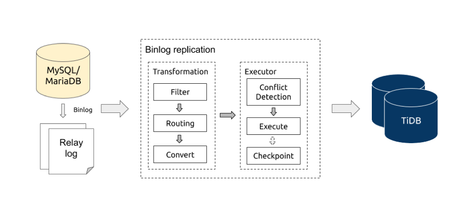

本文为 DM 源码阅读系列文章的第五篇。[上篇文章](https://pingcap.com/blog-cn/dm-source-code-reading-4/) 介绍了 dump 和 load 两个数据同步处理单元的设计实现，对核心 interface 实现、数据导入并发模型、数据导入暂停或中断的恢复进行了分析。**本篇文章将详细地介绍 DM 核心处理单元 Binlog replication，内容包含 binlog 读取、过滤、路由、转换，以及执行等逻辑。**文内涉及到 shard merge 相关逻辑功能，如 column mapping、shard DDL 同步处理，会在 shard merge 篇单独详细讲解，这里就不赘述了。

## Binlog replication 处理流程

从上图可以大致了解到 Binlog replication 的逻辑处理流程，对应的 [逻辑入口代码](https://github.com/pingcap/dm/blob/8bfa3e0e99b1bb1d59d9efd6320d9a86fa468217/syncer/syncer.go#L886)。

1.  从 relay log 或者 MySQL/MariaDB 读取 binlog events。

2.  对 binlog events 进行处理转换（transformation），这里可以做三类操作：
	
	| 操作 | 说明 |
	|:-------|:-----------------|
	| Filter | 根据 [库/表同步黑白名单](https://pingcap.com/docs-cn/dev/reference/tools/data-migration/features/overview/#black-white-table-lists) 对库/表进行过滤；根据 [binlog event 类型过滤](https://pingcap.com/docs-cn/dev/reference/tools/data-migration/features/overview/#binlog-event-filter)。|
	| Routing | 根据 [库/表 路由规则](https://pingcap.com/docs-cn/dev/reference/tools/data-migration/features/overview/#table-routing) 对库/表名进行转换，用于合库合表。 |
	| Convert | 将  binlog 转换为 [job 对象](https://github.com/pingcap/dm/blob/8bfa3e0e99b1bb1d59d9efd6320d9a86fa468217/syncer/job.go)，发送到 executor。 |
	
3.  executor 对 job 进行冲突检测，然后根据固定规则分发给对应的 worker 执行。

4.  定期保存 binlog position/gtid 到 checkpoint。

## Binlog 读取

Binlog replication 支持两种方式读取 binlog events:

+ [从远程的 MySQL/MariaDB](https://github.com/pingcap/dm/blob/8bfa3e0e99b1bb1d59d9efd6320d9a86fa468217/syncer/syncer.go#L1032)
+ [从 DM-worker 的本地 relay log](https://github.com/pingcap/dm/blob/8bfa3e0e99b1bb1d59d9efd6320d9a86fa468217/syncer/syncer.go#L1036)

两种方式都提供了同样的读取方法，处理核心都是 [go-mysql](https://github.com/siddontang/go-mysql)。该库主要提供了两个功能：

+ 注册为 MySQL/MariaDB 的 slave server ，从 MySQL/MariaDB 顺序读取 raw binlog events。
+ 解析 raw binlog events。

更多的处理细节会在下篇关于 relay log 的文章中进行介绍，迫不及待的小伙伴可以先翻阅一下相关代码实现。

## Binlog 转换

处理程序拿到解析好的 binlog event 后，[根据 binlog 的类型来对 binlog 进行分类处理](https://github.com/pingcap/dm/blob/8bfa3e0e99b1bb1d59d9efd6320d9a86fa468217/syncer/syncer.go#L1133)。Binlog replication 主要关心以下类型的 binlog event ：

| 类型 | 说明 |
|:------------------|:---------------------|
| `rotate event` | 消费完一个 binlog 文件，开始消费下一个 binlog 文件，用于更新 checkpoint 的 binlog position。 |
| `row event` | 包含  insert/update/delete DML 数据。 |
| `query event` | 包含 DDL 或者 statement DML 等数据。 |
| `xid event` | 代表一个 transaction 的 commit，经过  [go-mysql 的处理后带有对应 transaction     结束位置的  binlog position 和 gtid](https://github.com/siddontang/go-mysql/blob/b3fc2b70c8a8ea9128d51c968bcab03802d95343/replication/binlogsyncer.go#L751) ，可以用来保存 checkpoint。 |

Binlog replication 数据处理单元会对每一类 binlog event 进行以下的处理步骤，具体实现的处理顺序可能略有差异，以代码实现为准。

### 过滤

Binlog replication 会从两个维度对 binlog event 来进行过滤：

+ 根据 [同步库/表黑白名单](https://github.com/pingcap/dm/blob/8bfa3e0e99b1bb1d59d9efd6320d9a86fa468217/syncer/syncer.go#L119)，过滤掉对应库/表的所有 binlog event。
+ 根据 [binlog event 过滤规则](https://github.com/pingcap/dm/blob/8bfa3e0e99b1bb1d59d9efd6320d9a86fa468217/syncer/syncer.go#L117)，过滤掉对应库/表指定的 binlog event。

[`row event` 过滤处理](https://github.com/pingcap/dm/blob/8bfa3e0e99b1bb1d59d9efd6320d9a86fa468217/syncer/filter.go#L147) 和 [`query event` 过滤处理](https://github.com/pingcap/dm/blob/8bfa3e0e99b1bb1d59d9efd6320d9a86fa468217/syncer/filter.go#L96) 的实现在逻辑上面存在一些差异：

+ `row event` 包含 [库名和表名](https://github.com/pingcap/dm/blob/8bfa3e0e99b1bb1d59d9efd6320d9a86fa468217/syncer/syncer.go#L1167) 信息；`query event` 需要通过 [tidb parser](https://github.com/pingcap/parser) [解析 event 里面包含的 query statement 来获取需要的库名，表名以及其他信息](https://github.com/pingcap/dm/blob/8bfa3e0e99b1bb1d59d9efd6320d9a86fa468217/syncer/syncer.go#L1365)。
+ tidb parser 不是完全 100% 兼容 MySQL 语法，当遇到 parser 不支持的 query statement 时候，解析就会报错，从而无法获取到对应的库名和表名信息。Binlog replication 提供了一些 [内置的不支持的 query statement 正则表达式](https://github.com/pingcap/dm/blob/8bfa3e0e99b1bb1d59d9efd6320d9a86fa468217/syncer/filter.go#L32)，配合 [使用 `[schema-pattern: *, table-pattern: *] `的 binlog event 过滤规则](https://github.com/pingcap/dm/blob/8bfa3e0e99b1bb1d59d9efd6320d9a86fa468217/syncer/filter.go#L123)，来跳过 parser 不支持的 query statement。
+ `query event` 里面也会包含 statement format binlog event，此时 Binlog replication 就可以利用 parser 解析出来具体的 statement 类型，对不支持的 statement format binlog event 作出相应的处理： [对于需要同步的表，进行报错处理](https://github.com/pingcap/dm/blob/8bfa3e0e99b1bb1d59d9efd6320d9a86fa468217/syncer/ddl.go#L117)；[不需要同步的表，忽略继续同步](https://github.com/pingcap/dm/blob/8bfa3e0e99b1bb1d59d9efd6320d9a86fa468217/syncer/ddl.go#L108)。

### 路由

binlog 过滤完成之后，对于需要同步的表就会根据过滤步骤获得的库名和表名，通过 [路由规则](https://github.com/pingcap/dm/blob/8bfa3e0e99b1bb1d59d9efd6320d9a86fa468217/syncer/syncer.go#L116) [转换得到需要同步到的目标库名和表名](https://github.com/pingcap/dm/blob/8bfa3e0e99b1bb1d59d9efd6320d9a86fa468217/syncer/syncer.go#L1960)，在接下来的转换步骤来使用目标库名和表名来转换出正确的 DML 和 DDL statement。

### 转换

`row event` 转换处理和 `query event` 转换处理的实现存在一些差异，这里分开来讲述。

`row event` 转换处理通过三个转换函数生成对应的 statements：

+ [`generate insert sqls`](https://github.com/pingcap/dm/blob/8bfa3e0e99b1bb1d59d9efd6320d9a86fa468217/syncer/syncer.go#L1261) ：将 `write rows event` 转换为 `replace into statements`。
+ [`generate update sqls`](https://github.com/pingcap/dm/blob/8bfa3e0e99b1bb1d59d9efd6320d9a86fa468217/syncer/syncer.go#L1294)：
    - `safe mode = true`，[将 update rows event 转换为 delete + replace statements](https://github.com/pingcap/dm/blob/8bfa3e0e99b1bb1d59d9efd6320d9a86fa468217/syncer/dml.go#L193)。
    - `safe mode = false`，[将 update row event 转换为 update statements](https://github.com/pingcap/dm/blob/8bfa3e0e99b1bb1d59d9efd6320d9a86fa468217/syncer/dml.go#L231)。
+ [`generate delete sqls`](https://github.com/pingcap/dm/blob/8bfa3e0e99b1bb1d59d9efd6320d9a86fa468217/syncer/syncer.go#L1327)：将 delete rows event 转换为 delete statements。

`query event` 转换处理：

+ 因为 TiDB 目前不支持一条 DDL 语句包含多个 DDL 操作，query event 转换处理会首先尝试将 **包含多个 DDL 变更操作的单条 DDL 语句** 拆分成 **只包含一个 DDL 操作的多条 DDL 语句**（[具体代码实现](https://github.com/pingcap/dm/blob/8bfa3e0e99b1bb1d59d9efd6320d9a86fa468217/syncer/syncer.go#L1411)）。

+ 使用 parser 将 DDL statement 对应的 ast 结构里面的库名和表名替换成对应的目标库名和表名（[具体代码实现](https://github.com/pingcap/dm/blob/8bfa3e0e99b1bb1d59d9efd6320d9a86fa468217/syncer/syncer.go#L1442)）。

通过转换处理之后，将不同的 binlog event 包装成不同的 job 发送到 executor 执行：

+ [`row event -> insert/update/delete job`](https://github.com/pingcap/dm/blob/8bfa3e0e99b1bb1d59d9efd6320d9a86fa468217/syncer/syncer.go#L1353)
+ [`query event -> ddl job`](https://github.com/pingcap/dm/blob/8bfa3e0e99b1bb1d59d9efd6320d9a86fa468217/syncer/syncer.go#L1529)
+ [`xid event -> xid job`](https://github.com/pingcap/dm/blob/8bfa3e0e99b1bb1d59d9efd6320d9a86fa468217/syncer/syncer.go#L1702)

## Job 执行

### 冲突检测

binlog 顺序同步模型要求按照 binlog 顺序一个一个来同步 binlog event，这样的顺序同步势必不能满足高 QPS 低同步延迟的同步需求，并且不是所有的 binlog 涉及到的操作都存在冲突。Binlog replication 采用冲突检测机制，鉴别出来需要顺序执行的 jobs，在确保这些 jobs 的顺序执行的基础上，最大程度地保持其他 job 的并发执行来满足性能方面的要求。

冲突检测流程如下：

+ 遇到 DDL job，[等待前面已经分发出来的所有 DML jobs 执行完成后](https://github.com/pingcap/dm/blob/8bfa3e0e99b1bb1d59d9efd6320d9a86fa468217/syncer/syncer.go#L642)，然后单独执行该 DDL job，执行完成之后保存 checkpoint 信息。
+ 遇到 DML job，会 [先检测并且尝试解决冲突](https://github.com/pingcap/dm/blob/8bfa3e0e99b1bb1d59d9efd6320d9a86fa468217/syncer/syncer.go#L1712)。如果检测到冲突（即存在两个 executor  的 worker 的 jobs 都需要与当前的 job 保持顺序执行），[会发送一个 flush job 来等待已经分发的所有 DML jobs 执行完成](https://github.com/pingcap/dm/blob/8bfa3e0e99b1bb1d59d9efd6320d9a86fa468217/syncer/syncer.go#L1730)，然后再将  job 分发到对应的 worker，[并且记录该分发信息到内存](https://github.com/pingcap/dm/blob/8bfa3e0e99b1bb1d59d9efd6320d9a86fa468217/syncer/syncer.go#L1735)。在没有冲突的情况下，如果不需要与已经分发出去的 job 保持顺序的话，发送 job 到任意 worker 上；如果需要保持顺序的话，那么根据内存储存的历史分发信息，发送 job 到对应的 worker 上。

冲突检测实现比较简单，根据转换步骤获得每条 statement 对应的 `primary/unique key` 信息，来进行交集检测，如果存在交集那么认定是需要顺序的执行两条 statement，请参考 [具体实现代码](https://github.com/pingcap/dm/blob/8bfa3e0e99b1bb1d59d9efd6320d9a86fa468217/syncer/causality.go)。

### 执行

job 分发到对应的 worker 后，worker 根据一定的规则来批量执行这些 job，如下：

+ [遇到 DDL 立即执行](https://github.com/pingcap/dm/blob/8bfa3e0e99b1bb1d59d9efd6320d9a86fa468217/syncer/syncer.go#L804)。
+ [遇到 flush](https://github.com/pingcap/dm/blob/8bfa3e0e99b1bb1d59d9efd6320d9a86fa468217/syncer/syncer.go#L861) 或者积累的 job 数量超过 [配置的 batch 数量](https://github.com/pingcap/dm/blob/8bfa3e0e99b1bb1d59d9efd6320d9a86fa468217/dm/config/task.go#L183) 立即执行。
+ [没有新的 job 分发进来，清空当前已经积累的 jobs 或者 sleep 10 ms](https://github.com/pingcap/dm/blob/8bfa3e0e99b1bb1d59d9efd6320d9a86fa468217/syncer/syncer.go#L871)。

根据上面三个规则可以很快地将已经分发的 jobs 应用到下游 TiDB。

## 小结

本篇文章详细地介绍 DM 核心处理单元 Binlog replication，内容包含 binlog 读取、过滤、路由、转换，以及执行等逻辑。下一篇我们会对 relay log 数据处理单元的设计进行详细的讲解。
