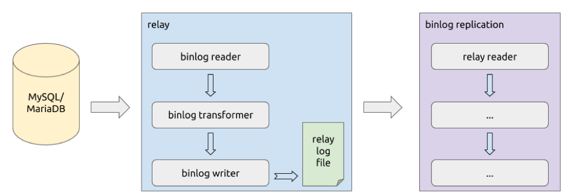

本文为 DM 源码阅读系列文章的第六篇，在 [上篇文章](https://pingcap.com/blog-cn/dm-source-code-reading-5/) 中我们介绍了 binlog replication 处理单元的实现，对在增量复制过程中 binlog event 的读取、过滤、路由、转换以及执行等逻辑进行了分析。

本篇文章我们将会对 relay 数据处理单元的实现进行详细的讲解。这个单元的作用是从上游 MySQL/MariaDB 读取 binlog event 并写入到本地的 relay log file 中；当执行增量复制任务时，binlog replication 处理单元将读取 relay log file 中的 event 并在进行解析后复制到下游的 TiDB 中。本篇文章的内容包括 relay log 目录结构定义、relay log 数据的处理流程、主从切换支持、relay log 的读取等逻辑。

值得注意的是，由于我们近期正在对 relay 处理单元进行重构，因此源码中会同时包含重构前后的相关代码实现。

## relay log 目录结构


一个已经进行过一次主从切换的 relay log 目录结构大致如下：

```
<deploy_dir>/relay_log/
|-- 7e427cc0-091c-11e9-9e45-72b7c59d52d7.000001
|   |-- mysql-bin.000001
|   |-- mysql-bin.000002
|   |-- mysql-bin.000003
|   |-- mysql-bin.000004
|   `-- relay.meta
|-- 842965eb-091c-11e9-9e45-9a3bff03fa39.000002
|   |-- mysql-bin.000001
|   `-- relay.meta
`--  server-uuid.index
```

在 relay log 目录下，主要包含以下几类文件或文件夹数据：

| 类别 | 作用 | 文件（夹）名示例 |
| :-------| :-------------| :------------|
| relay log 子目录 | 以单次主从切换发生时对应于某个 MySQL/MariaDB server 为单位组织 relay log 数据及 meta 信息 | 7e427cc0-091c-11e9-9e45-72b7c59d52d7.000001 |
| relay log 数据文件 | 存储实际的 binlog event 数据 | mysql-bin.000001 |
| relay meta 信息 | 存储当前已从上游读取并写入为 relay log 的 binlog event 对应于上游的 binlog position/GTID sets 信息 | relay.meta |
| relay log 子目录索引 | 索引各有效的 relay log 子目录列表 | server-uuid.index |

## relay log 处理流程




从上图大致可以了解 relay log 的逻辑处理流程，对应的入口代码为 [`Relay.Process`](https://github.com/pingcap/dm/blob/f6f0566424/relay/relay.go#L168)，主要步骤包括：

1. 使用 [binlog reader](https://github.com/pingcap/dm/blob/f6f0566424/relay/reader/reader.go#L30) 从上游 MySQL/MariaDB 读取 binlog event。

2. 将读取到的 binlog event 使用 [binlog transformer](https://github.com/pingcap/dm/blob/f6f0566424/relay/transformer/transformer.go#L37) 进行转换。

3. 将转换后的 binlog event 使用 [binlog writer](https://github.com/pingcap/dm/blob/f6f0566424/relay/writer/writer.go#L39) 以 relay log file 的形式存储在本地。

4. 当需要将数据以增量的方式同步到下游 TiDB 时，binlog replication 通过使用 [`relay reader`](https://github.com/pingcap/dm/blob/f6f0566424/pkg/streamer/reader.go#L55) 从 relay log file 中读取 binlog event。

## 读取 binlog event


relay 处理单元通过 [Reader interface](https://github.com/pingcap/dm/blob/f6f0566424/relay/reader/reader.go#L30) 从上游读取 binlog event，其中最重要的方法为读取 binlog event 对象的 [`GetEvent`](https://github.com/pingcap/dm/blob/f6f0566424/relay/reader/reader.go#L43)。

当前对 Reader interface 的实现为 [`reader`](https://github.com/pingcap/dm/blob/f6f0566424/relay/reader/reader.go#L57)，它最终通过 [`in`](https://github.com/pingcap/dm/blob/f6f0566424/relay/reader/reader.go#L64) 这个 [`br.Reader interface`](https://github.com/pingcap/dm/blob/f6f0566424/pkg/binlog/reader/reader.go#L25) 从上游读取 binlog event。reader 的使用流程为：

1.  调用 [`Start`](https://github.com/pingcap/dm/blob/f6f0566424/relay/reader/reader.go#L77) 启动读取流程，并根据配置中是否启用了 GTID 模式分别调用 [`setUpReaderByGTID`](https://github.com/pingcap/dm/blob/f6f0566424/relay/reader/reader.go#L94) 或 [`setUpReaderByPos`](https://github.com/pingcap/dm/blob/f6f0566424/relay/reader/reader.go#L96) 来启动下层的 [`br.Reader`](https://github.com/pingcap/dm/blob/f6f0566424/pkg/binlog/reader/reader.go#L25) 对象。

2.  调用 [`GetEvent`](https://github.com/pingcap/dm/blob/f6f0566424/relay/reader/reader.go#L116) 读取 binlog event，具体为 [调用下层的 `GetEvent` 方法](https://github.com/pingcap/dm/blob/f6f0566424/relay/reader/reader.go#L128) 获取 binlog event。

3.  当不再需要读取 binlog event 时，调用 [`Close`](https://github.com/pingcap/dm/blob/f6f0566424/relay/reader/reader.go#L102) 关闭读取操作。

从上面的流程可以看出，具体的 binlog event 读取操作使用的是另一个下层的 [`br.Reader interface`](https://github.com/pingcap/dm/blob/f6f0566424/pkg/binlog/reader/reader.go#L25)，[当前选择的具体实现](https://github.com/pingcap/dm/blob/f6f0566424/relay/reader/reader.go#L72) 为通过 TCP 连接进行读取的 [`TCPReader`](https://github.com/pingcap/dm/blob/f6f0566424/pkg/binlog/reader/tcp.go#L33)。在 [`TCPReader`](https://github.com/pingcap/dm/blob/f6f0566424/pkg/binlog/reader/tcp.go#L33) 中，使用了 [go-mysql](https://github.com/siddontang/go-mysql) 提供的 [`BinglogSyncer.StartSync`](https://github.com/pingcap/dm/blob/f6f0566424/pkg/binlog/reader/tcp.go#L76) 和 [`BinlogSyncer.StartSyncGTID`](https://github.com/pingcap/dm/blob/f6f0566424/pkg/binlog/reader/tcp.go#L99) 来启动以 binlog position 模式或 GTID sets 模式读取 binlog event，并通过 [`BinlogStreamer.GetEvent`](https://github.com/pingcap/dm/blob/f6f0566424/pkg/binlog/reader/tcp.go#L147) 读取来自 TCP 的 binlog event。

## 转换 binlog event

在 relay 处理单元中，对于从上游读取到的 binlog event，我们需要判断是否需要写进 relay log file 及是否需要更新对应的 `relay.meta` 内的断点信息。因此在通过 [Reader interface](https://github.com/pingcap/dm/blob/f6f0566424/relay/reader/reader.go#L30) 读取到 binlog event 后，通过调用 [Transformer interface](https://github.com/pingcap/dm/blob/f6f0566424/relay/transformer/transformer.go#L37) 来对 binlog event 进行相关的转换处理。

当前对 Transformer interface 的实现为 [transformer](https://github.com/pingcap/dm/blob/f6f0566424/relay/transformer/transformer.go#L49)，其主要通过在 [`Transform`](https://github.com/pingcap/dm/blob/f6f0566424/relay/transformer/transformer.go#L61) 方法中 [对 binlog event 的类型进行判断](https://github.com/pingcap/dm/blob/f6f0566424/relay/transformer/transformer.go#L67) 后再进行相应处理，包括：

| binlog event 类型 | 是否过滤 | 是否需要更新 relay.meta |
|:-----------|:------------|:------------|
| [`RotateEvent`](https://github.com/pingcap/dm/blob/f6f0566424/relay/transformer/transformer.go#L68) | 当是 fake RotateEvent 时过滤 | 否 |
| [`QueryEvent`](https://github.com/pingcap/dm/blob/f6f0566424/relay/transformer/transformer.go#L74) | 否 | 当是 DDL 时更新 |
| [`XIDEvent`](https://github.com/pingcap/dm/blob/f6f0566424/relay/transformer/transformer.go#L82) | 否 | 是 |
| [`GenericEvent`](https://github.com/pingcap/dm/blob/f6f0566424/relay/transformer/transformer.go#L86) | 当是 Heartbeat Event 时过滤 | 否 |
| [其他类型](https://github.com/pingcap/dm/blob/f6f0566424/relay/transformer/transformer.go#L94) | 当 ARTIFICIAL flag 被设置时过滤 | 否 |

在 Transformer 中，我们期望能达到以下目标：

1. 过滤上游 master server 上的 binlog file 中不存在的 binlog event，即期望 relay log file 中最终保存的 binlog event 与上游 master server 上的 binlog file 一致。

2. 仅在 DDL QueryEvent 时或 DML 事务完成时更新 `relay.meta` 以确保中断恢复时能避免从 DML 事务进行中的 binlog event 处开始从上游请求 binlog event（对于 DML 相关的 binlog event，如果希望解析 `INSERT`/`UPDATE`/`DELETE` 等操作，则需要先获取到对应的 TableMap event）。

## 写入 relay log

在从上游读取到 binlog event 并对其进行了相关转换后，我们就可以尝试将其写入到本地的 relay log file 中。在 relay 处理单元中，用于将 binlog event 写入 relay log file 的是 [Writer interface](https://github.com/pingcap/dm/blob/f6f0566424/relay/writer/writer.go#L39)，当前对应的实现为 [`FileWriter`](https://github.com/pingcap/dm/blob/f6f0566424/relay/writer/file.go#L41)，其内部会使用 [`out`](https://github.com/pingcap/dm/blob/f6f0566424/relay/writer/file.go#L48) 这个 [`bw.FileWriter`](https://github.com/pingcap/dm/blob/f6f0566424/pkg/binlog/writer/file.go#L29) 来执行文件写入操作，具体对 binlog event 执行写入操作的是 [`WriteEvent`](https://github.com/pingcap/dm/blob/f6f0566424/relay/writer/file.go#L111) 方法。

### 1. 各类型 binlog event 的判断处理

在尝试对 binlog event 进行写入时，对于不同类型的 binlog event，需要 [进行不同的判断处理](https://github.com/pingcap/dm/blob/f6f0566424/relay/writer/file.go#L120)。

#### RotateEvent

在从上游读取 binlog event 时，主要在以下情况下可能会读取到 `RotateEvent`：

1. 连接到上游 master server 开始读取 binlog event 时，master 会发送一个 fake RotateEvent 告知 slave 后续 binlog event 对应的起始 binlog position。

2. 一个 master server 上的 binlog file 将要被读取完成时，可能会包含一个 RotateEvent 以指示下一个 binlog file 的 filename 与起始 position。

因此，在处理 `RotateEvent` 写入的 [`handleRotateEvent`](https://github.com/pingcap/dm/blob/f6f0566424/relay/writer/file.go#L216) 方法中，主要包含以下操作：

1.  [尝试更新 `FileWriter` 内部记录的当前 binlog 文件名为 `RotateEvent` 内包含的文件名](https://github.com/pingcap/dm/blob/f6f0566424/relay/writer/file.go#L240)。

2.  [判断是否是 `fake RotateEvent`](https://github.com/pingcap/dm/blob/f6f0566424/relay/writer/file.go#L246)，如果是则跳过后续处理。

3.  与当前 relay log file 的 size 及内部 event 进行比较，[判断如果将当前 event 写入到文件后是否会造成文件存在 hole 及该 event 是否在 relay log file 中已经存在](https://github.com/pingcap/dm/blob/f6f0566424/relay/writer/file.go#L256)，如果会造成 hole 则需要填充该 hole，如果已经存在则跳过后续的处理。

4.  [将 event 写入到 relay log file 中](https://github.com/pingcap/dm/blob/f6f0566424/relay/writer/file.go#L263)。

需要注意的是，我们不能确保 master server 会将其 binlog file 中的所有 event 都发送给 slave（如当 MariaDB 未设置 [`BINLOG_SEND_ANNOTATE_ROWS_EVENT`](https://mariadb.com/kb/en/library/com_binlog_dump/) flag 时，master 就不会向 slave 发送 [`ANNOTATE_ROWS_EVENT`](https://mariadb.com/kb/en/library/annotate_rows_event/)），因此在写入 event 到文件前，需要通过 [`handleFileHoleExist`](https://github.com/pingcap/dm/blob/f6f0566424/relay/writer/file.go#L319) 判断如果将 event 写入到文件是否会存在 hole。如果存在 hode，则通过 [`event.GenDummyEvent`](https://github.com/pingcap/dm/blob/f6f0566424/relay/writer/file.go#L347) 生成相应 size 的 dummy event [对 hole 进行填充](https://github.com/pingcap/dm/blob/f6f0566424/relay/writer/file.go#L353)。

另外需要注意的是，我们不能确保 master server 不会将其已经发送给 slave 并写入到了 relay log file 的 event 再次发送给 slave（如 master 在开始发送 slave 请求的 binlog event 前，会先发送 `FormatDescriptionEvent` 与 `PreviousGTIDsEvent` 等给 slave），因此在写入 event 到文件前，需要通过 [`handleDuplicateEventsExist`](https://github.com/pingcap/dm/blob/f6f0566424/relay/writer/file.go#L357) 判断该 event 是否已经存在于 relay log file 中。

#### FormatDescriptionEvent

在从上游读取 binlog event 时，主要在以下情况下可能会读取到 `FormatDescriptionEvent`：

1.  上游 master server 在发送除 RotateEvent 外的其他 binlog event 之前，会发送一个 `FormatDescriptionEvent` 以使 slave 能正确 decode 后续的 binlog event。

2.  上游 master server 会将自身 binlog file 中存在的 `FormatDescriptionEvent` 发送给 slave，且这个 `FormatDescriptionEvent` 总是 binlog file 中的第 1 个 event。

因此，在处理 `FormatDescriptionEvent` 的 [`handleFormatDescriptionEvent`](https://github.com/pingcap/dm/blob/f6f0566424/relay/writer/file.go#L155) 方法中，主要包含以下操作：

1.  [关闭之前可能已经打开的 relay log file](https://github.com/pingcap/dm/blob/f6f0566424/relay/writer/file.go#L164)。

2.  [打开该 event 需要写入到的 relay log file](https://github.com/pingcap/dm/blob/f6f0566424/relay/writer/file.go#L182) 作为当前活跃的 relay log file。

3.  [检查当前 relay log file 中是否存在 binlog file header](https://github.com/pingcap/dm/blob/f6f0566424/relay/writer/file.go#L190)（``` fe `bin` ```），如果不存在则为其 [写入 binlog file header](https://github.com/pingcap/dm/blob/f6f0566424/relay/writer/file.go#L194)。

4.  [检查当前 relay log file 中是否存在 `FormatDescriptionEvent`](https://github.com/pingcap/dm/blob/f6f0566424/relay/writer/file.go#L201)，如果不存在则为其 [写入该 FormatDescriptionEvent](https://github.com/pingcap/dm/blob/f6f0566424/relay/writer/file.go#L205)。

#### 其他类型 event

对于其他类型的 binlog event，写入操作由 [`handleEventDefault`](https://github.com/pingcap/dm/blob/f6f0566424/relay/writer/file.go#L273) 进行处理，主要包含以下操作：

1.  与当前 relay log file 的 size 及内部 event 进行比较，[判断如果将当前 event 写入到文件后是否会造成文件存在 hole 及该 event 是否在 relay log file 中已经存在](https://github.com/pingcap/dm/blob/f6f0566424/relay/writer/file.go#L278)，如果会造成 hole 则需要填充该 hole，如果已经存在则跳过后续的处理。

2.  [将 event 写入到 relay log file 中](https://github.com/pingcap/dm/blob/f6f0566424/relay/writer/file.go#L286)。

### 2. Recover relay log file

在写入 binlog event 到 relay log file 时，尽管可以通过 [`Flush`](https://github.com/pingcap/dm/blob/f6f0566424/relay/writer/file.go#L130) 方法强制将缓冲中的数据刷新到磁盘文件中，但仍然可能出现 DM-worker 进程异常退出时部分数据未能刷新到磁盘文件中的情况，造成 relay log file 内部分 event 数据缺失。

另外，对于一个事务对应的多个 binlog event，可能出现仅写入了其中一部分 event 时 DM-worker 发生退出的情况，造成 relay log file 中部分事务缺失部分 event。

因此，在 relay 处理单元中，我们引入了对 relay log file 执行 Recover 的机制，用于将 relay log file 尾部不完整的 event 及事务进行踢除，对应的方法为 [`FileWrite.Recover`](https://github.com/pingcap/dm/blob/f6f0566424/relay/writer/file.go#L99)，具体实现在 [`doRecovering`](https://github.com/pingcap/dm/blob/f6f0566424/relay/writer/file.go#L372) 方法中，主要操作包括：

1. [获取 relay log file 中直到最后一个完整事务对应的 binlog position 与 GTID sets](https://github.com/pingcap/dm/blob/f6f0566424/relay/writer/file.go#L383)。

2. 比较 relay log file 的 size 与获取到的 binlog position，[如果相等则说明这个 relay log file 中包含的事务都是完整的](https://github.com/pingcap/dm/blob/f6f0566424/relay/writer/file.go#L393)，跳过后续的处理。

3. [如果 relay log file 的 size 比 binlog position 更小](https://github.com/pingcap/dm/blob/f6f0566424/relay/writer/file.go#L399)，则向外部报告错误并跳过后续的处理。

4. 如果 relay log file 的 size 比 binlog position 大，则 [将 relay log file 中超出 binlog position 的部分执行 Truncate 进行截断](https://github.com/pingcap/dm/blob/f6f0566424/relay/writer/file.go#L409)。

## 主从切换支持

为支持将 relay 处理单元连接的上游 master server 在 replica group 内的不同 server 间进行切换（也包括 relay 处理单元连接的上游 VIP 指向的实际 server 发生了改变），relay 处理单元会尝试将从不同上游 server 读取到的 binlog event 保存到不同的 relay log 子目录中，目录与文件结构可以参考前文的 [relay log 目录结构](https://docs.google.com/document/d/14Aj9IwsaWcMgYmdaqYSzeChdM6MxbuT3npWZZ4gAJis/edit#heading=h.fkyotsq7d5sh)。

为支持上述功能，relay 处理单元在读取 binlog event 前主要执行以下操作：

1.  [比较当前上游 server 的 UUID 信息与 `relay.meta` 信息，判断当前连接到的是否是前一次连接过的 server](https://github.com/pingcap/dm/blob/f6f0566424/relay/relay.go#L220)。

2.  [如果不是前一次连接过的 server，则说明切换到了新的 server，因此创建新的 relay log 子目录并更新对应的 meta 信息](https://github.com/pingcap/dm/blob/f6f0566424/relay/relay.go#L226)。

## 读取 relay log

relay 处理单元用于从上游读取 binlog event 并将其写入到本地的 relay log file 中。当执行增量数据复制时，binlog replication 处理单元需要通过 [`streamer pkg`](https://github.com/pingcap/dm/blob/f6f0566424/pkg/streamer/) 读取 relay log file 并从中解析获取需要同步的数据，其中执行读取的对象为 [`BinlogReader`](https://github.com/pingcap/dm/blob/f6f0566424/pkg/streamer/reader.go#L55)。

由前文介绍过的主从切换支持可知我们会将具体的 relay log 数据存储在可能的多个子目录中，因此在读取 relay log 时，我们也 需要考虑按序依次读取，主要操作包括：

1.  [调用 `parseRelay`](https://github.com/pingcap/dm/blob/f6f0566424/pkg/streamer/reader.go#L114) 开始从 relay log 的根目录执行解析读取。

2.  [调用 `parseDirAsPossible`](https://github.com/pingcap/dm/blob/f6f0566424/pkg/streamer/reader.go#L141) 开始从外部指定的或上一次调用返回的子目录、文件及 offset 处开始读取，并返回下一次调用时需要的子目录、文件及 offset（即可实现切换到新的 relay log 子目录）。

3.  对于当前需要读取的子目录，[调用 `CollectBinlogFilesCmp`](https://github.com/pingcap/dm/blob/f6f0566424/pkg/streamer/reader.go#L184) 收集该目录内指定 relay log 文件及其之后的所有 relay log 文件。

4.  对于每一个收集到的 relay log 文件，[调用 `parseFileAsPossible`](https://github.com/pingcap/dm/blob/f6f0566424/pkg/streamer/reader.go#L212) 尝试对其进行解析读取。

5.  在 `parseFileAsPossible` 中，反复返回 [调用 `parseFile`](https://github.com/pingcap/dm/blob/f6f0566424/pkg/streamer/reader.go#L244) 进行 binlog event 的读取，直到 [发生错误](https://github.com/pingcap/dm/blob/f6f0566424/pkg/streamer/reader.go#L246) 或 [检测到需要切换到新的 relay log 文件或子目录](https://github.com/pingcap/dm/blob/f6f0566424/pkg/streamer/reader.go#L253)。

6.  对于是否需要切换到新的 relay log 文件或子目录的检测通过在 parseFile 内 [调用 `needSwitchSubDir`](https://github.com/pingcap/dm/blob/f6f0566424/pkg/streamer/reader.go#L345) 与 [调用 `relaySubDirUpdated`](https://github.com/pingcap/dm/blob/f6f0566424/pkg/streamer/reader.go#L356) 实现。

## 小结

本篇文章详细地介绍了 relay 处理单元的实现，内容包括了 relay log 的目录结构、如何从上游 server 读取 binlog event 并写入到本地的 relay log file 中，以及 binlog replication 处理单元将如何读取本地的 relay log file。到本篇文章为止，我们完成了对 DM 中的数据处理单元的介绍。从下一篇文章开始，我们将开始详细介绍 DM 内部主要功能的设计与实现原理。
