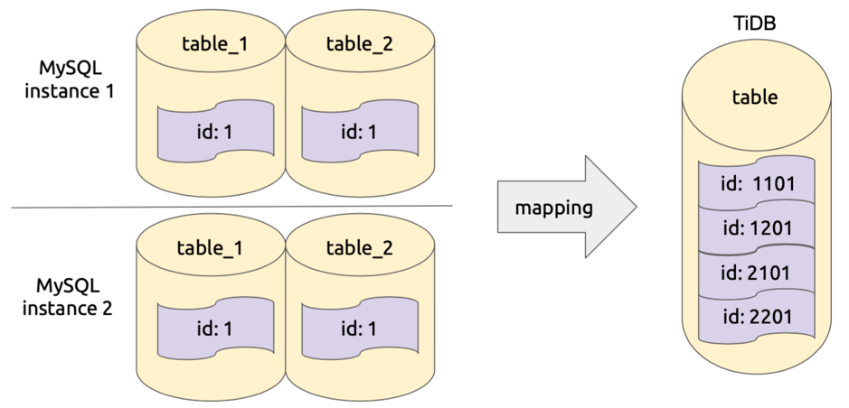

本文为 DM 源码阅读系列文章的第七篇，在 [上篇文章](https://pingcap.com/blog-cn/dm-source-code-reading-6/) 中我们介绍了 relay log 的实现，主要包括 relay log 目录结构定义、relay log 数据的处理流程、主从切换支持、relay log 的读取等逻辑。**本篇文章我们将会对 DM 的定制化数据同步功能进行详细的讲解。** 

在一般的数据同步中，上下游的数据是一一对应的，即上下游的库名、表名、列名以及每一列的值都是相同的，但是很多用户因为业务的原因希望 DM 在同步数据到 TiDB 时进行一些定制化的转化。下面我们将主要介绍数据同步定制化中的库表路由（Table routing）、黑白名单（Black & white table lists）、列值转化（Column mapping）、binlog 过滤（Binlog event filter）四个主要功能的实现。值得注意的是，由于其他一些工具（例如 TiDB Lightning 和 TiDB Binlog）也需要类似的功能，所以这四个功能都以 package 的形式维护在 [tidb-tools](https://github.com/pingcap/tidb-tools/tree/f5fc4cb670ced38fb362eda0766a9db1c1856a0a/pkg) 项目下，这样方便使用和维护。

## 库表路由（[Table routing](https://github.com/pingcap/dm/blob/8bfa3e0e99b1bb1d59d9efd6320d9a86fa468217/syncer/syncer.go#L116)）

库表路由顾名思义就是对库名和表名根据一定的路由规则进行转换。比如用户在上游多个 MySQL 实例或者 schema 有多个逻辑上相同的表，需要把这些表的数据同步到 TiDB 集群的同一个表中，这个时候就可以使用 table-router 功能，如下图所示：


该功能实现在 [`pkg/table-router`](https://github.com/pingcap/tidb-tools/tree/f5fc4cb670ced38fb362eda0766a9db1c1856a0a/pkg/table-router) 中，库表路由的规则定义在结构 [`TableRule`](https://github.com/pingcap/tidb-tools/blob/f5fc4cb670ced38fb362eda0766a9db1c1856a0a/pkg/table-router/router.go#L25) 中，其中的属性 [`SchemaPattern`](https://github.com/pingcap/tidb-tools/blob/f5fc4cb670ced38fb362eda0766a9db1c1856a0a/pkg/table-router/router.go#L26) 和 [`TablePattern`](https://github.com/pingcap/tidb-tools/blob/f5fc4cb670ced38fb362eda0766a9db1c1856a0a/pkg/table-router/router.go#L27) 用于配置原库名和表名的模式，[`TargetSchema`](https://github.com/pingcap/tidb-tools/blob/f5fc4cb670ced38fb362eda0766a9db1c1856a0a/pkg/table-router/router.go#L28) 和 [`TargetTable`](https://github.com/pingcap/tidb-tools/blob/f5fc4cb670ced38fb362eda0766a9db1c1856a0a/pkg/table-router/router.go#L29) 用于配置目标库和表名，即符合指定 pattern 的库和表名都将转化成目标库名和表名。

使用结构 [Table](https://github.com/pingcap/tidb-tools/blob/f5fc4cb670ced38fb362eda0766a9db1c1856a0a/pkg/table-router/router.go#L52) 对路由规则进行维护，Table 提供了如下方法：


| 方法 | 说明 |
|:-------------|:--------|
| [`AddRule`](https://github.com/pingcap/tidb-tools/blob/f5fc4cb670ced38fb362eda0766a9db1c1856a0a/pkg/table-router/router.go#L75) | 增加规则 |
| [`UpdateRule`](https://github.com/pingcap/tidb-tools/blob/f5fc4cb670ced38fb362eda0766a9db1c1856a0a/pkg/table-router/router.go#L93) | 修改规则 |
| [`RemoveRule`](https://github.com/pingcap/tidb-tools/blob/f5fc4cb670ced38fb362eda0766a9db1c1856a0a/pkg/table-router/router.go#L111) | 删除规则 |
| [`Route`](https://github.com/pingcap/tidb-tools/blob/f5fc4cb670ced38fb362eda0766a9db1c1856a0a/pkg/table-router/router.go#L126) | 获取路由后的结果 |

Table 结构中组合了 [`Selector`](https://github.com/pingcap/tidb-tools/blob/f5fc4cb670ced38fb362eda0766a9db1c1856a0a/pkg/table-router/router.go#L53)，`Selector` 用于管理指定模式的库、表的规则，提供如下方法：

| 方法 | 说明 |
|:-------------|:--------|
| [`Insert`](https://github.com/pingcap/tidb-tools/blob/f5fc4cb670ced38fb362eda0766a9db1c1856a0a/pkg/table-rule-selector/trie_selector.go#L41) | 增加规则 |
| [`Match`](https://github.com/pingcap/tidb-tools/blob/f5fc4cb670ced38fb362eda0766a9db1c1856a0a/pkg/table-rule-selector/trie_selector.go#L43) | 查找指定的库、表匹配到的规则 |
| [`Remove`](https://github.com/pingcap/tidb-tools/blob/f5fc4cb670ced38fb362eda0766a9db1c1856a0a/pkg/table-rule-selector/trie_selector.go#L45) | 删除规则 |
| [`AllRules`](https://github.com/pingcap/tidb-tools/blob/f5fc4cb670ced38fb362eda0766a9db1c1856a0a/pkg/table-rule-selector/trie_selector.go#L47) | 返回所有的规则 |

Selector 的底层实现是 [`trieSelector`](https://github.com/pingcap/tidb-tools/blob/f5fc4cb670ced38fb362eda0766a9db1c1856a0a/pkg/table-rule-selector/trie_selector.go#L71)，使用了单词查找树的结构来维护库、表与规则的对应关系，感兴趣的同学可以阅读代码深入了解一下。 trieSelector 中使用 [cache](https://github.com/pingcap/tidb-tools/blob/f5fc4cb670ced38fb362eda0766a9db1c1856a0a/pkg/table-rule-selector/trie_selector.go#L74) 缓存了库、表到规则的映射关系，这样可以减少相同库、表匹配规则的资源消耗。除了 table routing，以下的列值转化和 binlog 过滤功能也都使用了 Selector，在下面的介绍中就不再赘述。

## 黑白名单（[black & white table lists](https://github.com/pingcap/dm/blob/8bfa3e0e99b1bb1d59d9efd6320d9a86fa468217/syncer/syncer.go#L119)）

黑白名单功能用来选择同步哪些库和表，以及不同步哪些库和表，这部分代码维护在 [`pkg/filter`](https://github.com/pingcap/tidb-tools/tree/f5fc4cb670ced38fb362eda0766a9db1c1856a0a/pkg/filter) 中。

黑白名单规则配置在 [`Rules`](https://github.com/pingcap/tidb-tools/blob/f5fc4cb670ced38fb362eda0766a9db1c1856a0a/pkg/filter/filter.go#L66) 结构中，该结构包括 [`DoTables`](https://github.com/pingcap/tidb-tools/blob/f5fc4cb670ced38fb362eda0766a9db1c1856a0a/pkg/filter/filter.go#L67)、[`DoDBs`](https://github.com/pingcap/tidb-tools/blob/f5fc4cb670ced38fb362eda0766a9db1c1856a0a/pkg/filter/filter.go#L68)、[`IgnoreTables`](https://github.com/pingcap/tidb-tools/blob/f5fc4cb670ced38fb362eda0766a9db1c1856a0a/pkg/filter/filter.go#L70) 和 [`IgnoreDBs`](https://github.com/pingcap/tidb-tools/blob/f5fc4cb670ced38fb362eda0766a9db1c1856a0a/pkg/filter/filter.go#L71) 四个属性，下面以判断表 `test.t` 是否应该被过滤的例子说明配置的作用：

1. 首先 schema 过滤判断。
	+ 如果 `do-dbs` 不为空，则判断 `do-dbs` 中是否存在一个匹配的 schema。
	    - 如果存在，则进入 table 过滤判断。
	    - 如果不存在，则过滤 `test.t`。
   + 如果 `do-dbs` 为空并且 `ignore-dbs` 不为空，则判断 `ignore-dbs` 中是否存在一个匹配的 schema。
       - 如果存在，则过滤 `test.t`。
       - 如果不存在，则进入 table 过滤判断。
    + 如果 `do-dbs` 和 `ignore-dbs` 都为空，则进入 table 过滤判断。

2. 进行 table 过滤判断。
    + 如果 `do-tables` 不为空，则判断 `do-tables` 中是否存在一个匹配的 table。
        - 如果存在，则同步 `test.t`。
        - 如果不存在，则过滤 `test.t`。
    + 如果 `ignore-tables` 不为空，则判断 `ignore-tables` 中是否存在一个匹配的 table。
        - 如果存在，则过滤 `test.t`。
        - 如果不存在，则同步 `test.t`。
    + 如果 `do-tables` 和 `ignore-tables` 都为空，则同步 `test.t`。

使用 [Filter](https://github.com/pingcap/tidb-tools/blob/f5fc4cb670ced38fb362eda0766a9db1c1856a0a/pkg/filter/filter.go#L97) 对黑白名单进行管理，Filter 提供了 [`ApplyOn`](https://github.com/pingcap/tidb-tools/blob/f5fc4cb670ced38fb362eda0766a9db1c1856a0a/pkg/filter/filter.go#L164) 方法来判断一组 table 中哪些表可以同步。

## 列值转化（[Column mapping](https://github.com/pingcap/dm/blob/8bfa3e0e99b1bb1d59d9efd6320d9a86fa468217/syncer/syncer.go#L118)）

列值转化功能用于对指定列的值做一些转化，主要用于分库分表的同步场景。比较典型的场景是：在上游分表中使用自增列作为主键，这样数据在同步到 TiDB 的一个表时会出现主键冲突，因此我们需要根据一定规则对主键做转化，保证每个主键在全局仍然是唯一的。

该功能实现在 [`pkg/column-mapping`](https://github.com/pingcap/tidb-tools/tree/f5fc4cb670ced38fb362eda0766a9db1c1856a0a/pkg/column-mapping) 中的 [`PartitionID`](https://github.com/pingcap/tidb-tools/blob/f5fc4cb670ced38fb362eda0766a9db1c1856a0a/pkg/column-mapping/column.go#L438)：修改列的值的最高几位为 `PartitionID` 的值（只能作用于 Int64 类型的列）。

代码中使用 [Rule](https://github.com/pingcap/tidb-tools/blob/f5fc4cb670ced38fb362eda0766a9db1c1856a0a/pkg/column-mapping/column.go#L77) 来设置 column mapping 的规则，Rule 的属性及说明如下表所示：

| 属性 | 说明 | 值 |
|:-------------|:--------------|:----------------|
| [`PatternSchema`](https://github.com/pingcap/tidb-tools/blob/f5fc4cb670ced38fb362eda0766a9db1c1856a0a/pkg/column-mapping/column.go#L78) | 匹配规则的库的模式 | 可以设置为指定的库名，也可以使用通配符 “\*” 和 “?” |
| [`PatternTable`](https://github.com/pingcap/tidb-tools/blob/f5fc4cb670ced38fb362eda0766a9db1c1856a0a/pkg/column-mapping/column.go#L79) | 匹配规则的表的模式 | 可以设置为指定的表名，也可以使用通配符 “\*” 和 “?” |
| [`SourceColumn`](https://github.com/pingcap/tidb-tools/blob/f5fc4cb670ced38fb362eda0766a9db1c1856a0a/pkg/column-mapping/column.go#L80) | 需要转化的列 | 列名 |
| [`TargetColumn`](https://github.com/pingcap/tidb-tools/blob/f5fc4cb670ced38fb362eda0766a9db1c1856a0a/pkg/column-mapping/column.go#L81) | 转化后的值保存到哪个列 | 列名 |
| [`Expression`](https://github.com/pingcap/tidb-tools/blob/f5fc4cb670ced38fb362eda0766a9db1c1856a0a/pkg/column-mapping/column.go#L82) | 转化表达式 | 目前只支持 [`PartitionID`](https://github.com/pingcap/tidb-tools/blob/f5fc4cb670ced38fb362eda0766a9db1c1856a0a/pkg/column-mapping/column.go#L49) |
| [`Arguments`](https://github.com/pingcap/tidb-tools/blob/f5fc4cb670ced38fb362eda0766a9db1c1856a0a/pkg/column-mapping/column.go#L83) | 转化所需要的参数 | Expression 为 `PartitionID`，参数为 `InstanceID`、schema 名称前缀、table 名称前缀以及前缀与 ID 的分割符号 |

Expression 为 `PartitionID` 的配置和转化的计算方式都较为复杂，下面举个例子说明。

例如 Arguments 为 `[1, “test”, “t”, “_”]`，`1` 表示数据库实例的 `InstanceID`，`“test”` 为库名称的前缀，`“t”` 为表名称的前缀，`“_”` 为前缀与 ID 的分隔符，则表 `test_1.t_2` 的 `SchemaID` 为 `1`，`TableID` 为 `2`。转化列值时需要对 `InstanceID`、`SchemaID`、`TableID` 进行一定的位移计算，然后与原始的值进行或运算得出一个新的值。对于具体的计算方式，可以查看代码 [`partitionID`](https://github.com/pingcap/tidb-tools/blob/f5fc4cb670ced38fb362eda0766a9db1c1856a0a/pkg/column-mapping/column.go#L438) 和 [`computePartitionID`](https://github.com/pingcap/tidb-tools/blob/f5fc4cb670ced38fb362eda0766a9db1c1856a0a/pkg/column-mapping/column.go#L487)。下面是一个 `PartitionID` 逻辑简化后的示意图：



使用 [Mapping](https://github.com/pingcap/tidb-tools/blob/f5fc4cb670ced38fb362eda0766a9db1c1856a0a/pkg/column-mapping/column.go#L153) 结构对 column mapping 的规则进行管理，Mapping 提供列如下方法：

| 方法 | 说明 |
|:--------------|:--------|
| [`AddRole`](https://github.com/pingcap/tidb-tools/blob/f5fc4cb670ced38fb362eda0766a9db1c1856a0a/pkg/column-mapping/column.go#L211)| 增加规则 |
| [`UpdateRule`](https://github.com/pingcap/tidb-tools/blob/f5fc4cb670ced38fb362eda0766a9db1c1856a0a/pkg/column-mapping/column.go#L216)| 修改规则 |
| [`RemoveRule`](https://github.com/pingcap/tidb-tools/blob/f5fc4cb670ced38fb362eda0766a9db1c1856a0a/pkg/column-mapping/column.go#L221) | 删除规则 |
| [`HandleRowValue`](https://github.com/pingcap/tidb-tools/blob/f5fc4cb670ced38fb362eda0766a9db1c1856a0a/pkg/column-mapping/column.go#L239) | 获取转化结果 |

## binlog 过滤（[binlog event filter](https://github.com/pingcap/dm/blob/8bfa3e0e99b1bb1d59d9efd6320d9a86fa468217/syncer/syncer.go#L117)）

binlog 过滤功能支持过滤指定类型的 binlog，或者指定模式的 query，该功能维护在 [pkg/binlog-filter](https://github.com/pingcap/tidb-tools/tree/f5fc4cb670ced38fb362eda0766a9db1c1856a0a/pkg/binlog-filter) 中。某些用户不希望同步一些指定类型的 binlog，例如 drop table 和 truncate table，这样就可以在下游仍然保存这些表的数据作为备份，或者某些 SQL 语句在 TiDB 中不兼容，希望可以在同步中过滤掉，都可以通过配置 binlog event filter 功能来实现。


首先需要对 binlog 进行分类，可以查看代码 [`Event Type List`](https://github.com/pingcap/tidb-tools/blob/f5fc4cb670ced38fb362eda0766a9db1c1856a0a/pkg/binlog-filter/filter.go#L42)。然后再定义过滤规则 [`BinlogEventRule`](https://github.com/pingcap/tidb-tools/blob/f5fc4cb670ced38fb362eda0766a9db1c1856a0a/pkg/binlog-filter/filter.go#L85)，包括以下属性：

| 属性 | 说明 | 值 |
|:--------------|:---------|:---------|
| [`SchemaPattern`](https://github.com/pingcap/tidb-tools/blob/f5fc4cb670ced38fb362eda0766a9db1c1856a0a/pkg/binlog-filter/filter.go#L86) | 匹配规则的库的模式 | 可以设置为指定的库名，也可以使用通配符 “\*” 和 “?” |
| [`TablePattern`](https://github.com/pingcap/tidb-tools/blob/f5fc4cb670ced38fb362eda0766a9db1c1856a0a/pkg/binlog-filter/filter.go#L87) | 匹配规则的表的模式 | 可以设置为指定的表名，也可以使用通配符 “\*” 和 “?” |
| [`Events`](https://github.com/pingcap/tidb-tools/blob/f5fc4cb670ced38fb362eda0766a9db1c1856a0a/pkg/binlog-filter/filter.go#L88) | 规则适用于哪些类型的 binlog | binlog event 的类型 |
| [`SQLPattern`](https://github.com/pingcap/tidb-tools/blob/f5fc4cb670ced38fb362eda0766a9db1c1856a0a/pkg/binlog-filter/filter.go#L89) | 匹配的 SQL 的模式 | SQL 语句的模式，支持适用正则表达式 |
| [`Action`](https://github.com/pingcap/tidb-tools/blob/f5fc4cb670ced38fb362eda0766a9db1c1856a0a/pkg/binlog-filter/filter.go#L92) | 是否对符合上面要求的 binlog 进行过滤 | [`Ignore`](https://github.com/pingcap/tidb-tools/blob/f5fc4cb670ced38fb362eda0766a9db1c1856a0a/pkg/binlog-filter/filter.go#L29) 或者 [`Do`](https://github.com/pingcap/tidb-tools/blob/f5fc4cb670ced38fb362eda0766a9db1c1856a0a/pkg/binlog-filter/filter.go#L30) |

例如，TiDB 对 `ADD PARTITION` 和 `DROP PARTITION` 语句不兼容，在同步时需要过滤掉相关的 SQL 语句，就可以在 DM 中使用如下配置：

```
filter-partition-rule:
    schema-pattern: "*"
    sql-pattern: ["ALTER\\s+TABLE[\\s\\S]*ADD\\s+PARTITION", "ALTER\\s+TABLE[\\s\\S]*DROP\\s+PARTITION"]
    action: Ignore
```

如果需要过滤掉所有的 `DROP DATABASE` 语句，则可以在 DM 中使用如下配置：

```
 filter-schema-rule:
    schema-pattern: "*"
    events: ["drop database"]
    action: Ignore

```

代码中通过 [`BinlogEvent`](https://github.com/pingcap/tidb-tools/blob/f5fc4cb670ced38fb362eda0766a9db1c1856a0a/pkg/binlog-filter/filter.go#L120) 结构对 binlog event 过滤规则做统一的管理，`BinlogEvent` 提供了如下的方法：


| 方法 | 说明 |
|:--------------|:--------|
| [`AddRule`](https://github.com/pingcap/tidb-tools/blob/f5fc4cb670ced38fb362eda0766a9db1c1856a0a/pkg/binlog-filter/filter.go#L143) | 增加规则 |
| [`UpdateRule`](https://github.com/pingcap/tidb-tools/blob/f5fc4cb670ced38fb362eda0766a9db1c1856a0a/pkg/binlog-filter/filter.go#L164) | 修改规则 |
| [`RemoveRule`](https://github.com/pingcap/tidb-tools/blob/f5fc4cb670ced38fb362eda0766a9db1c1856a0a/pkg/binlog-filter/filter.go#L185) | 删除规则 |
| [`Filter`](https://github.com/pingcap/tidb-tools/blob/f5fc4cb670ced38fb362eda0766a9db1c1856a0a/pkg/binlog-filter/filter.go#L203) | 判断指定的 binlog 是否应该过滤 |

## 小结

以上就是定制化数据同步功能中库表路由（Table routing）、黑白名单（Black & white table lists）、列值转化（Column mapping）、binlog 过滤（Binlog event filter）的实现介绍。欢迎大家阅读相关代码深入了解，也欢迎给我们提 pr 优化代码。下一篇我们将介绍 DM 是如何支持上游 online DDL 工具（pt-osc，gh-ost）的 DDL 同步场景的。
