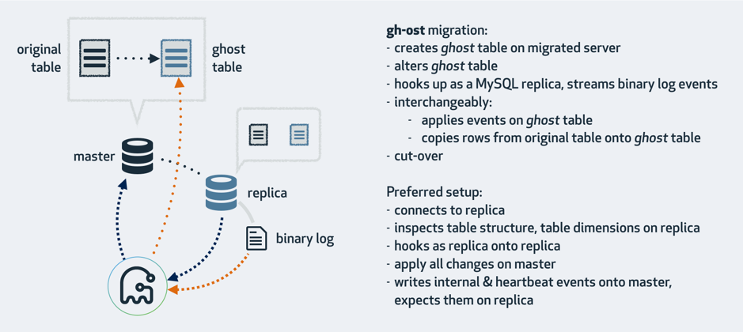
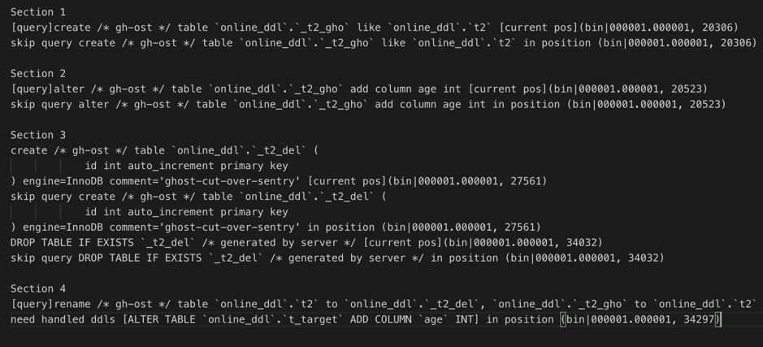

本文为 DM 源码阅读系列文章的第八篇，[上篇文章](https://pingcap.com/blog-cn/dm-source-code-reading-7/) 对 DM 中的定制化数据同步功能进行详细的讲解，包括库表路由（Table routing）、黑白名单（Black & white table lists）、列值转化（Column mapping）、binlog 过滤（Binlog event filter）四个主要功能的实现。

本篇文章将会以 gh-ost 为例，详细地介绍 DM 是如何支持一些 MySQL 上的第三方 online schema change 方案同步，内容包括 online schema change 方案的简单介绍，online schema change 同步方案，以及同步实现细节。

## MySQL 的 Online Schema Change 方案

目前有一些第三方工具支持在 MySQL 上面进行 Online Schema Change，比较主流的包括 [pt-online-schema-change](https://www.percona.com/doc/percona-toolkit/LATEST/pt-online-schema-change.html) 和 [gh-ost](https://github.com/github/gh-ost)。

这些工具的实现原理比较类似，本文会以 gh-ost 为例来进行分析讲解。

从上图可以大致了解到 gh-ost 的逻辑处理流程：

1. 在操作目标数据库上使用 `create table ghost table like origin table` 来创建 ghost 表；
2. 按照需求变更表结构，比如 `add column/index`；
3. gh-ost 自身变为 MySQL replica slave，将原表的全量数据和 binlog 增量变更数据同步到 ghost 表；
4. 数据同步完成之后执行 `rename origin table to table_del, table_gho to origin table` 完成 ghost 表和原始表的切换 

pt-online-schema-change 通过 trigger 的方式来实现数据同步，剩余流程类似。

在 DM 的 task 配置中可以通过设置 [`online-ddl-scheme`](https://github.com/pingcap/dm/blob/25f95ee08d008fb6469f0b172e432270aaa6be52/dm/config/task.go#L244) 来配置的 online schema change 方案，目前仅支持 [gh-ost/pt](https://github.com/pingcap/dm/blob/25f95ee08d008fb6469f0b172e432270aaa6be52/dm/config/task.go#L32) 两个配置选项。

## DM Online Schema Change 同步方案

根据上个章节介绍的流程，pt 和 gh-ost 除了 replicate 数据的方式不一样之外，其他流程都类似，并且这种 native 的模式可以使得 binlog replication 几乎不需要修改就可以同步数据。但是 DM 为了减少同步的数据量，简化一些场景（如 shard tables merge）下的处理流程，并做了额外的优化，即，不同步 ghost 表的数据。

继续分析 online schema change 的流程，从数据同步的角度看有下面这些需要关注的点：

* 原始表的增量数据同步模式有没有变化
* ghost 表会产生跟原始表几乎一样的冗余 binlog events
* 通过  `rename origin table to table_del, table_gho to origin table` 完成 ghost 表和原始表的切换

如果使用 ghost 表的 `alter DDL` 替换掉  `rename origin table to table_del, table_gho to origin table` ，那么就可以实现我们的不同步 ghost 表数据的目的。

## DM Online Schema Change 同步实现细节

Online schema change 模块代码实现如下：

* [gh-ost 同步代码实现](https://github.com/pingcap/dm/blob/25f95ee08d008fb6469f0b172e432270aaa6be52/syncer/ghost.go)
* [pt-online-schema-change 同步代码实现](https://github.com/pingcap/dm/blob/25f95ee08d008fb6469f0b172e432270aaa6be52/syncer/pt_osc.go)

DM 将 [同步的表分为三类](https://github.com/pingcap/dm/blob/25f95ee08d008fb6469f0b172e432270aaa6be52/syncer/online_ddl.go#L62)：

* real table - 原始表
* trash table - online schema change 过程中产生的非关键数据表，比如以 `_ghc`, `_del` 为后缀的表
* ghost table - 与原始表对应的经过 DDL 变更的数据表，比如以 `_gho` 为后缀的表

当 DM 遇到 DDL 的时候，都会 [调用 online schema change 模块的代码进行处理](https://github.com/pingcap/dm/blob/25f95ee08d008fb6469f0b172e432270aaa6be52/syncer/ddl.go#L210)，首先判断表的类型，接着针对不同类型作出不同的处理：

* real table - [对 rename table statement 进行模式检查，直接返回执行](https://github.com/pingcap/dm/blob/25f95ee08d008fb6469f0b172e432270aaa6be52/syncer/ghost.go#L55)
* trash table - [对 rename table statement 做一些模式检查，直接忽略同步](https://github.com/pingcap/dm/blob/25f95ee08d008fb6469f0b172e432270aaa6be52/syncer/ghost.go#L70)
* ghost table
    * 如果 DDL 是 [create/drop table statement](https://github.com/pingcap/dm/blob/25f95ee08d008fb6469f0b172e432270aaa6be52/syncer/ghost.go#L86) ，则 [清空内存中的残余信息后忽略这个 DDL 继续同步](https://github.com/pingcap/dm/blob/25f95ee08d008fb6469f0b172e432270aaa6be52/syncer/ghost.go#L87)
    * 如果 DDL 是 [rename table statement](https://github.com/pingcap/dm/blob/25f95ee08d008fb6469f0b172e432270aaa6be52/syncer/ghost.go#L96) ，则 [返回内存中保存的 ghost table 的 DDLs](https://github.com/pingcap/dm/blob/25f95ee08d008fb6469f0b172e432270aaa6be52/syncer/ghost.go#L103)
    * 如果是其他类型 DDL，[则把这些 DDL 保存在内存中](https://github.com/pingcap/dm/blob/25f95ee08d008fb6469f0b172e432270aaa6be52/syncer/ghost.go#L119)

下面是一个执行示例，方便大家对照着来理解上面的代码逻辑：

1. Section 1： 使用 create table like statement 创建 ghost table，DM 会清空内存中 `online_ddl`.`_t2_gho` 对应的 DDL 信息
2. Section 2： 执行 alter table statement，DM 会保存 DDL 到内存中
3. Section 3：trash table 的 DDLs 会被忽略
4. Section 4：遇到 ghost table 的 rename table statement 会替换成 Section 2 的 DDL, 并且将该 DDL 的 table name 更换成对应 real table name 去执行

注意： rename table statement 模式检查主要是为了确保在 online schema change 变更过程中除了  `rename origin table to table_del, table_gho to origin table` 之外没有其他 rename table statement，避免同步状态的复杂化。

## 小结

本篇文章详细地介绍 DM 对 online schema change 方案的同步支持，内容包含 online schema change 方案的简单介绍， online schema change 同步方案，以及同步实现细节。下一章会对 DM 的 shard DDL merge 方案进行详细的讲解，敬请期待。
