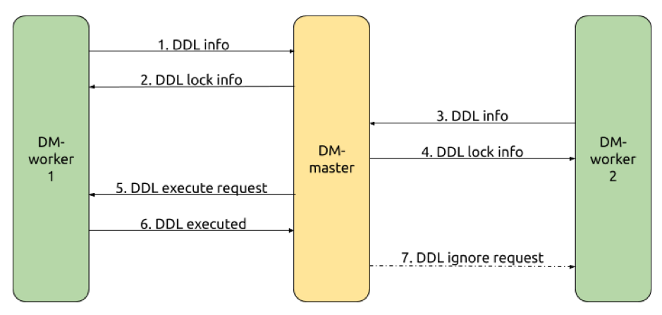

本文为 DM 源码阅读系列文章的第九篇，在 [上篇文章](https://pingcap.com/blog-cn/dm-source-code-reading-8/) 中我们详细介绍了 DM 对 online schema change 方案的同步支持，对 online schema change 同步方案以及实现细节等逻辑进行了分析。

在本篇文章中，我们将对 shard DDL 同步机制以及 checkpoint 机制等进行详细的介绍，内容包括 shard group 的定义、shard DDL 的同步协调处理流程、checkpoint 机制以及与之相关的 safe mode 机制。

## shard DDL 机制的实现

DM 中通过 [库表路由与列值转换](https://pingcap.com/blog-cn/dm-source-code-reading-7/) 功能，实现了对分库分表合并场景下 DML 的同步支持。但当需要同步的各分表存在 DDL 变更时，还需要对 DDL 的同步进行更多额外的处理。有关分表合并时 shard DDL 同步需要处理的问题以及 DM 中的同步支持原理，请先阅读 [TiDB Ecosystem Tools 原理解读系列（三）TiDB-DM 架构设计与实现原理](https://pingcap.com/blog-cn/tidb-ecosystem-tools-3/)。

### shard group

在 [这篇文章](https://pingcap.com/blog-cn/tidb-ecosystem-tools-3/) 中，我们介绍了 DM 在处理 shard DDL 同步时引入了两级 shard group 的概念，即用于执行分表合并同步任务的各 DM-worker 组成的 shard group、每个 DM-worker 内需要进行合表同步的各上游分表组成的 shard group。

#### DM-worker 组成的 shard group

由 DM-worker 组成的 shard group 是由集群部署拓扑及同步任务配置决定的，即任务配置文件中定义的需要进行合表同步的所有上游 MySQL 实例对应的所有 DM-worker 实例即组成了一个 shard group。为了表示同步过程中的相关动态信息，DM-master 内部引入了两个概念：

*   [Lock](https://github.com/pingcap/dm/blob/369933f31b/dm/master/lock.go#L24)：对于每组需要进行合并的表，其中每一条需要进行同步协调的 shard DDL，由一个 Lock 实例进行表示；每个 Lock 实例在有 shard DDL 需要协调同步时被创建、在协调同步完成后被销毁；在 dmctl 中使用 show-ddl-locks 命令查看到的每一个 Lock 信息即对应一个该实例

*   [LockKeeper](https://github.com/pingcap/dm/blob/369933f31b/dm/master/ddl_lock.go#L91)：维护所有的 Lock 实例信息并提供相关的操作接口

Lock 中各主要成员变量的作用如下：

| 成员变量 | 作用 |
|:-------------|:--------|
| [`ID`](https://github.com/pingcap/dm/blob/369933f31b/dm/master/lock.go#L27) | 用于标识一个 lock，由同步任务名、合并后同步到的目标表对应的 schema 及 table 名构造得到 |
| [`Task`](https://github.com/pingcap/dm/blob/369933f31b/dm/master/lock.go#L28) | 该 lock 所对应的同步任务名 |
| [`Owner`](https://github.com/pingcap/dm/blob/369933f31b/dm/master/lock.go#L29) | 该 lock 的 owner 对应的 ID，即第一个向 DM-master 上报 shard DDL 信息的 DM-worker 对应的 ID |
| [`remain`](https://github.com/pingcap/dm/blob/369933f31b/dm/master/lock.go#L31) | 尚未上报待同步 shard DDL 信息的 DM-worker 数量 |
| [`ready`](https://github.com/pingcap/dm/blob/369933f31b/dm/master/lock.go#L32) | 标识各 DM-worker 是否已上报过待同步 shard DDL 信息 |
| [`ddls`](https://github.com/pingcap/dm/blob/369933f31b/dm/master/lock.go#L33) | 该 lock 对应的需要进行协调同步到下游的 DDL statements（[shard DDL 通过 TiDB parser 转换后可能会被分拆为多条 DDL](https://github.com/pingcap/dm/blob/369933f31b/syncer/syncer.go#L1491)） |

#### DM-worker 内分表组成的 shard group

每个 DM-worker 内的 shard group 是由对应上游 MySQL 实例内分表及同步任务配置决定的，即任务配置文件中定义的对应 MySQL 实例内需要进行合并同步到同一个下游目标表的所有分表组成一个 shard group。在 DM-worker 内部，我们维护了下面两个对象：

*   [ShardingGroup](https://github.com/pingcap/dm/blob/369933f31b/syncer/sharding_group.go#L87)：对于每一组需要进行合并的表，由一个 ShardingGroup 实例进行表示；每个 ShardGroup 实例在同步任务启动阶段被创建，在任务停止时被销毁

*   [ShardingGroupKeeper](https://github.com/pingcap/dm/blob/369933f31b/syncer/sharding_group.go#L395)：维护所有的 ShardingGroup 实例信息并提供相关的操作接口

ShardingGroup 中各主要成员变量的作用如下：

| 成员变量 | 作用 |
|:-------------|:--------|
| [`sourceID`](https://github.com/pingcap/dm/blob/369933f31b/syncer/sharding_group.go#L99) | 当前 DM-worker 对应于上游 MySQL 的 source-id |
| [`remain`](https://github.com/pingcap/dm/blob/369933f31b/syncer/sharding_group.go#L95) | 尚未收到对应 shard DDL 的分表数量 |
| [`sources`](https://github.com/pingcap/dm/blob/369933f31b/syncer/sharding_group.go#L96) | 标识是否已收到各上游分表对应的 shard DDL 信息 |
| [`meta`](https://github.com/pingcap/dm/blob/369933f31b/syncer/sharding_group.go#L100) | 当前 shard group 内各分表收到的 DDL 相关信息 |

### shard DDL 同步流程

对于两级 shard group，DM 内部在依次完成两个级别的 相应的 shard DDL 同步协调。

1.  对于 DM-worker 内由各分表组成的 shard group，其 shard DDL 的同步在对应 DM-worker 内部进行协调

2.  对于由各 DM-worker 组成的 shard group，其 shard DDL 的同步由 DM-master 进行协调

#### DM-worker 间 shard DDL 协调流程

我们基于在 [这篇文章](https://pingcap.com/blog-cn/tidb-ecosystem-tools-3/) 中展示过的仅包含两个 DM-worker 的 shard DDL 协调流程示例（如下图）来了解 DM 内部的具体实现。

1.  DM-worker-1 将 shard DDL 信息发送给 DM-master

    a. 当 DM-worker-1 内部 shard DDL 协调完成时，[DM-worker-1 将对应的 shard DDL 信息保存在 channel 中](https://github.com/pingcap/dm/blob/369933f31b/syncer/syncer.go#L1727)供 DM-master 通过 gRPC 获取

    b. DM-master 在 [fetchWorkerDDLInfo](https://github.com/pingcap/dm/blob/369933f31b/dm/master/server.go#L1243) 方法中[以 gRPC streaming 的方式读取到 DM-worker-1 的 shard DDL 信息](https://github.com/pingcap/dm/blob/369933f31b/dm/master/server.go#L1277)

    c. [DM-master 调用 ShardingGroupKeeper 的 TrySync 方法创建对应的 lock 信息](https://github.com/pingcap/dm/blob/369933f31b/dm/master/server.go#L1308)，[并在 lock 中标记已收到 DM-worker-1 的 shard DDL 信息](https://github.com/pingcap/dm/blob/369933f31b/dm/master/lock.go#L77)

2.  DM-master 将 lock 信息发回给 DM-worker-1

    a. [DM-master 以 gRPC streaming 的方式将 lock 信息发送给 DM-worker-1](https://github.com/pingcap/dm/blob/369933f31b/dm/master/server.go#L1319)

    b. [DM-worker-1 将来自 DM-master 的 lock 信息保存在内存中](https://github.com/pingcap/dm/blob/369933f31b/dm/worker/subtask.go#L535)用于在 DM-master 请求 DM-worker 执行/跳过 shard DDL 时进行验证

3. DM-worker-2 将 shard DDL 信息发送给 DM-master（流程与 step.1 一致）

4. DM-master 将 lock 信息发回给 DM-worker-2（流程与 step.2 一致）

5. DM-master 协调 DM-worker-1 向下游同步 shard DDL

    a. DM-master 根据 step.1 与 step.3 时收到的 shard DDL 信息[判定已经收到 shard group 内所有 DM-worker 的 shard DDL 信息](https://github.com/pingcap/dm/blob/369933f31b/dm/master/lock.go#L80)

    b. DM-master 在 [resolveDDLLock](https://github.com/pingcap/dm/blob/369933f31b/dm/master/server.go#L1360) 方法中[向 DM-worker-1 发送向下游同步 shard DDL 的请求](https://github.com/pingcap/dm/blob/369933f31b/dm/master/server.go#L1431)（[Exec 参数为 true](https://github.com/pingcap/dm/blob/369933f31b/dm/master/server.go#L1427)）

6. DM-worker-1 向下游同步 shard DDL

    a. [DM-worker-1 接收到来自 DM-master 的向下游执行 shard DDL 的请求](https://github.com/pingcap/dm/blob/369933f31b/syncer/syncer.go#L1732)

    b. [DM-worker-1 构造 DDL job 并添加到 DDL 执行队列中](https://github.com/pingcap/dm/blob/369933f31b/syncer/syncer.go#L1773)

    c. [DM-worker-1 将 shard DDL 执行结果保存在 channel 中](https://github.com/pingcap/dm/blob/369933f31b/syncer/syncer.go#L874)供 DM-master 通过 gRPC 获取

7. DM-worker-2 忽略向下游同步 shard DDL

    a. [DM-master 获取 DM-worker-1 向下游同步 shard DDL 的结果](https://github.com/pingcap/dm/blob/369933f31b/dm/master/server.go#L1436)判断得知 DM-worker-1 同步 shard DDL 成功

    b. [DM-master 向 DM-worker-2 发送忽略向下游同步 shard DDL 的请求](https://github.com/pingcap/dm/blob/369933f31b/dm/master/server.go#L1486)（[Exec 参数为 false](https://github.com/pingcap/dm/blob/369933f31b/dm/master/server.go#L1461)）

    c. [DM-worker-2 根据 DM-master 请求忽略向下游同步 shard DDL](https://github.com/pingcap/dm/blob/369933f31b/syncer/syncer.go#L843)
  
#### DM-worker 内 shard DDL 同步流程

我们基于在 [实现原理文章](https://pingcap.com/blog-cn/tidb-ecosystem-tools-3/) 中展示过的一个 DM-worker 内仅包含两个分表 `（table_1，table_2）` 的 shard DDL（仅一条 DDL）协调处理流程示例来了解 DM 内部的具体实现。

1. DM-worker 收到 `table_1` 的 DDL

    a. [根据 DDL 及 binlog event position 等信息更新对应的 shard group](https://github.com/pingcap/dm/blob/369933f31b/syncer/syncer.go#L1659)

    b. [确保 binlog replication 过程已进入 safe mode](https://github.com/pingcap/dm/blob/369933f31b/syncer/syncer.go#L1675)（后文介绍 checkpoint 机制时会再介绍 safe mode）

    c. [更新 `table_1` 的 checkpoint](https://github.com/pingcap/dm/blob/369933f31b/syncer/syncer.go#L1683)（后文会详细介绍 checkpoint 机制）

2. DM-worker 继续解析后续的 binlog event

    根据 step.1 时返回的更新后的 shard group 信息得知还[未收到 shard group 内所有分表对应的 shard DDL](https://github.com/pingcap/dm/blob/369933f31b/syncer/syncer.go#L1684)，不向下游同步 shard DDL 并[继续后续解析](https://github.com/pingcap/dm/blob/369933f31b/syncer/syncer.go#L1686)

3. 忽略 `table_1` 的 DML 并同步 `table_2` 的 DML

    [由于 `table_1` 已收到 shard DDL 但 shard DDL 自身还未完成同步](https://github.com/pingcap/dm/blob/369933f31b/syncer/syncer.go#L1331)，[忽略对 `table_1` 相关 DML 的同步](https://github.com/pingcap/dm/blob/369933f31b/syncer/syncer.go#L1335)

4. DM-worker 收到 `table_2` 的 DDL（流程与 step.1 一致）

5. DM-worker 向下游同步 shard DDL

    a. 根据 step.4 时返回的更新后的 shard group 信息得知已经收到 shard group 内所有分表对应的 shard DDL

    b. [尝试让 binlog replication 过程退出 safe mode](https://github.com/pingcap/dm/blob/369933f31b/syncer/syncer.go#L1690)

    c. [将当前 shard DDL 同步完成后 re-sync 时重新同步 step.3 忽略的 DML 所需的相关信息保存在 channel 中](https://github.com/pingcap/dm/blob/369933f31b/syncer/syncer.go#L1707)

    d. [等待已分发的所有 DML 同步完成](https://github.com/pingcap/dm/blob/369933f31b/syncer/syncer.go#L1716)（确保等待并发同步的 DML 都同步到下游后再对下游 schema 进行变更）

    e. [将 shard DDL 相关信息保存在 channel 中以进行 DM-worker 间的同步](https://github.com/pingcap/dm/blob/369933f31b/syncer/syncer.go#L1727)（见前文[DM-worker 间 shard DDL 协调流程](#dm-worker-间-shard-ddl-协调流程)）

    f. 待 DM-worker 间协调完成后，[向下游同步 shard DDL](https://github.com/pingcap/dm/blob/369933f31b/syncer/syncer.go#L846)

6. 将 binlog 的解析位置重定向回 step.1 对应 DDL 后的 binlog event position 进入 re-sync 阶段

    [根据 step.5 中保存的信息](https://github.com/pingcap/dm/blob/369933f31b/syncer/syncer.go#L1074)，[将 binlog 的解析位置重定向回 step.1 对应的 DDL 后的 binlog event position](https://github.com/pingcap/dm/blob/369933f31b/syncer/syncer.go#L1080)

7. 重新解析 binlog event

8. 对于不同表的 DML 做不同的处理

    a. 对于 `table_1` 在 step.3 时忽略的 DML，解析后向下游同步

    b. [对于 `table_2` 的 DML，根据 checkpoint 信息忽略向下游同步](https://github.com/pingcap/dm/blob/369933f31b/syncer/syncer.go#L1310)

9. 解析到达 step.4 时 DDL 对应的 binlog position，re-sync 阶段完成

    a. [解析 binlog position 到达 step.4 的 DDL](https://github.com/pingcap/dm/blob/369933f31b/syncer/syncer.go#L1296)

    b. [结束 re-sync 过程](https://github.com/pingcap/dm/blob/369933f31b/syncer/syncer.go#L1298)

10. 继续进行后续的 DDL 与 DML 的同步

需要注意的是，在上述 step.1 与 step.4 之间，如果有收到 `table_1` 的其他 DDL，则对于该 shard group，需要协调同步由一组 shard DDL 组成的 [ShardingSequence](https://github.com/pingcap/dm/blob/369933f31b/syncer/sharding-meta/shardmeta.go#L53)。当在 step.9 对其中某一条 shard DDL 同步完成后，[如果有更多的未同步的 shard DDL 需要协调处理](https://github.com/pingcap/dm/blob/369933f31b/syncer/syncer.go#L1051)，则会[重定向到待处理的下一条 shard DDL 对应的位置重新开始解析 binlog event](https://github.com/pingcap/dm/blob/369933f31b/syncer/syncer.go#L1057)。

## checkpoint 机制的实现

DM 中通过 checkpoint 机制来实现同步任务中断后恢复时的续传功能。对于 load 阶段，其 checkpoint 机制的实现在 [DM 源码阅读系列文章（四）dump/load 全量同步的实现](https://pingcap.com/blog-cn/dm-source-code-reading-4/) 文章中我们已经进行了介绍，本文不再赘述。在本文中，我们将介绍 binlog replication 增量同步阶段的 checkpoint 机制的实现及与之相关的 safe mode 机制的实现。

### checkpoint 机制

DM 在 binlog replication 阶段以 binlog event 对应的 position 为 checkpoint，包括两类：

1.  全局 checkpiont：对应已成功解析并同步到下游的 binlog event 的 position，同步任务中断恢复后将从该位置重新进行解析与同步

2.  每个需要同步 table 的 checkpoint：对应该 table 已成功解析并同步到下游的 binlog event 的 position，主要用于在 re-sync 过程中避免对已同步的数据进行重复同步

DM 的 checkpoint 信息保存在下游数据库中，通过 [`RemoteCheckPoint`](https://github.com/pingcap/dm/blob/369933f31b/syncer/checkpoint.go#L174) 对象进行读写，其主要成员变量包括：

*   [`globalPoint`](https://github.com/pingcap/dm/blob/369933f31b/syncer/checkpoint.go#L197)：用于保存全局 checkpoint

*   [`points`](https://github.com/pingcap/dm/blob/369933f31b/syncer/checkpoint.go#L189)：用于保存各 table 的 checkpoint

checkpoint 信息在下游数据库中对应的 schema 通过 [`createTable`](https://github.com/pingcap/dm/blob/369933f31b/syncer/checkpoint.go#L453) 方法进行创建，其中各主要字段的含义为：

| 字段 | 含义 |
|:-------------|:--------|
| [`id`](https://github.com/pingcap/dm/blob/369933f31b/syncer/checkpoint.go#L456) | 标识待同步数据对应的上游数据源，当前该字段值对应为 source-id |
| [`cp_schema`](https://github.com/pingcap/dm/blob/369933f31b/syncer/checkpoint.go#L457) | checkpoint 信息所属 table 对应的 schema 名称，[对于全局 checkpoint 该字段值为空字符串](https://github.com/pingcap/dm/blob/369933f31b/syncer/checkpoint.go#L40) |
| [`cp_table`](https://github.com/pingcap/dm/blob/369933f31b/syncer/checkpoint.go#L458) | checkpoint 信息所属 table 的名称，[对于全局 checkpoint 该字段值为空字符串](https://github.com/pingcap/dm/blob/369933f31b/syncer/checkpoint.go#L41) |
| [`binlog_name`](https://github.com/pingcap/dm/blob/369933f31b/syncer/checkpoint.go#L459) | checkpoint 信息的 binlog filename |
| [`binlog_pos`](https://github.com/pingcap/dm/blob/369933f31b/syncer/checkpoint.go#L460) | checkpoint 信息的 binlog event position |
| [`is_global`](https://github.com/pingcap/dm/blob/369933f31b/syncer/checkpoint.go#L461) |标识该条 checkpoint 信息是否是全局 checkpoint |

对于全局 checkpoint，在以下情况下会更新内存中的信息：

*   [收到 XID event 时](https://github.com/pingcap/dm/blob/369933f31b/syncer/syncer.go#L652)（表示一个 DML 事务的结束）

*   [DDL 向下游同步成功后](https://github.com/pingcap/dm/blob/369933f31b/syncer/syncer.go#L696)

对于各 table checkpoint，在以下情况下会更新内存中的信息：

*   [DML 向下游同步成功后](https://github.com/pingcap/dm/blob/369933f31b/syncer/syncer.go#L705)

*   [DDL 向下游同步成功后](https://github.com/pingcap/dm/blob/369933f31b/syncer/syncer.go#L696)

*   [收到 shard DDL 且成功更新了 shard group，但未向下游同步 shard DDL 时](https://github.com/pingcap/dm/blob/369933f31b/syncer/syncer.go#L1683)

对于全局与 table 的 checkpoint，会在以下情况下 flush 到下游数据库中：

*   [收到 flush 通知](https://github.com/pingcap/dm/blob/369933f31b/syncer/syncer.go#L663)（如同步任务将暂停或停止时）

*   [已分发的任务成功同步到下游](https://github.com/pingcap/dm/blob/369933f31b/syncer/syncer.go#L710)（[DDL 同步到下游](https://github.com/pingcap/dm/blob/369933f31b/syncer/syncer.go#L635)，[超过指定时间阈值 flush](https://github.com/pingcap/dm/blob/369933f31b/syncer/syncer.go#L639)）

值得注意的是，在 shard DDL 未同步到下游之前，为确保中断恢复后仍能继续整个 shard DDL 的协调过程，[DM 不会将全局 checkpoint 更新为比 shard DDL 起始 position 更大的 position](https://github.com/pingcap/dm/blob/369933f31b/syncer/syncer.go#L718)，[DM 也不会将 shard DDL 协调过程中对应 table 的 checkpoint flush 到下游](https://github.com/pingcap/dm/blob/369933f31b/syncer/syncer.go#L757)。

### safe mode 机制

当同步任务中断恢复后，DM 在 binlog replication 阶段通过 checkpoint 机制保证了重新开始同步的起始点前的数据都已经成功同步到了下游数据库中，即保证了 at-least-once 语义。但由于 flush checkpoint 与同步 DDL、DML 到下游不是在同一个事务中完成的，因此从 checkpoint 开始重新同步时，可能存在部分数据被重复同步的可能，即不能保证 at-most-once 。

在 DM 的 binlog replication 阶段，通过增加 safe mode 机制确保了重复同步数据时的可重入，即：

*   [将 `INSERT` 操作转为 `REPLACE` 操作](https://github.com/pingcap/dm/blob/369933f31b/syncer/dml.go#L132)

*   [将 `UPDATE` 操作转为 `DELETE` 操作](https://github.com/pingcap/dm/blob/369933f31b/syncer/dml.go#L195)和 [`REPLACE` 操作](https://github.com/pingcap/dm/blob/369933f31b/syncer/dml.go#L200)

*   [对 `DELETE` 操作不进行转换仍保持为 `DELETE`](https://github.com/pingcap/dm/blob/369933f31b/syncer/dml.go#L265)

目前，safe mode 会在以下情况时启用：

*   [启动或恢复任务时的前 5 分钟](https://github.com/pingcap/dm/blob/369933f31b/syncer/syncer.go#L1023)，确保从 checkpoint 位置开始被重复同步的部分数据最终一致

*   [DM-worker 内进行 shard DDL 同步协调时](https://github.com/pingcap/dm/blob/369933f31b/syncer/syncer.go#L1675)（见前文 [DM-worker 内 shard DDL 同步流程](#dm-worker-内-shard-ddl-同步流程)），确保即使 shard DDL 协调过程中异常重启且 5 分钟内无法重复同步完之前已同步数据也能最终一致

*   [用户在同步任务配置文件中指定了启用 safe mode](https://github.com/pingcap/dm/blob/369933f31b/syncer/mode.go#L33)，用于其他需要以 safe mode 同步超 5 分钟的场景

## 小结

本篇文章详细地介绍了 shard DDL 机制与 checkpoint 机制的实现，内容包括了两级 shard group 的定义与 DM-worker 间及 DM-worker 内的 shard DDL 同步协调处理流程、checkpoint 机制及与之相关的 safe mode 机制。下一篇文章中，我们将介绍用于保证 DM 正确性与稳定性的测试框架的实现，敬请期待。

