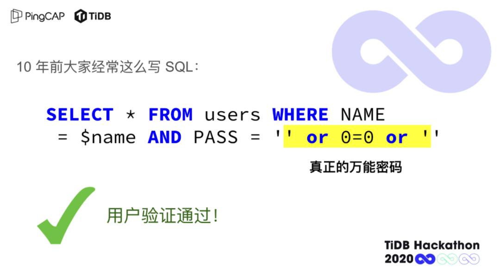
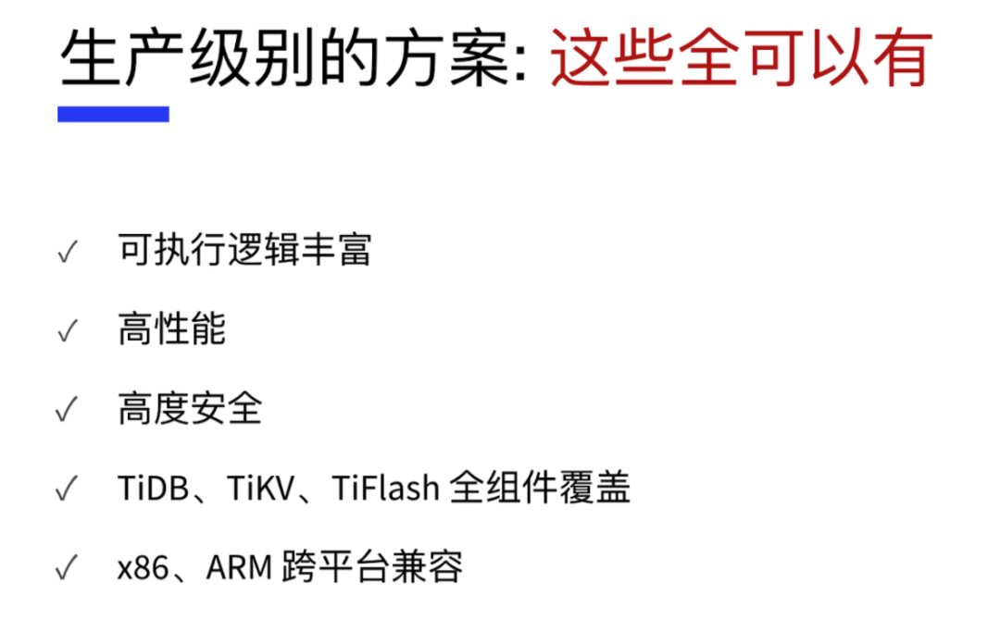
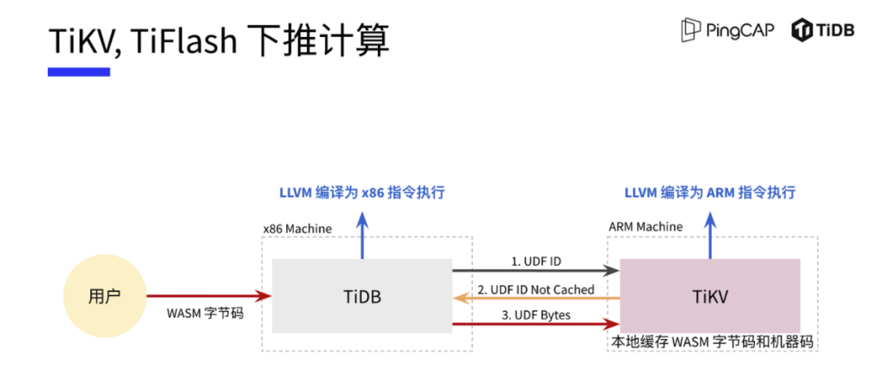
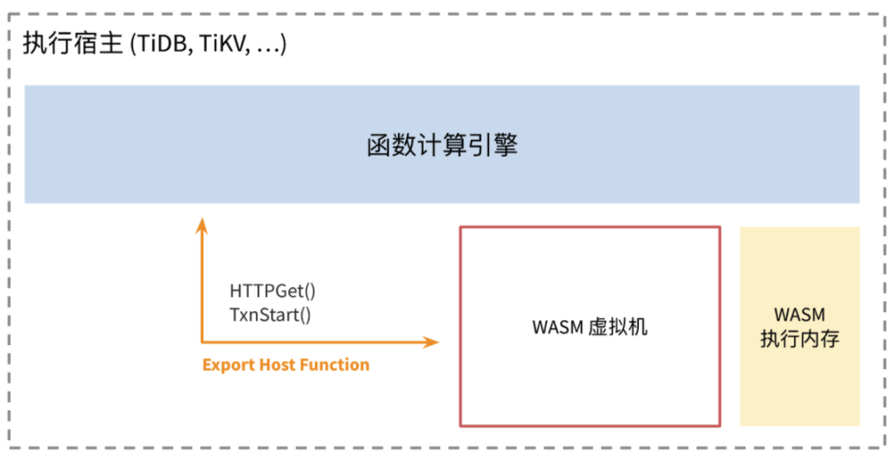

**本次大赛上， ' or 0=0 or ' 团队非常优雅高效地基于 WASM 实现了 TiDB 的用户自定义函数（UDF，User Defined Function）引擎，获得评委老师的一致高分，一举夺得本届大赛冠军，揽获 10 万元比赛奖金。** 为了给其他开发者们未来基于 TiDB 开发自己的应用和项目带来一些启示，我们在赛后采访了 ' or 0=0 or ' 团队与评委张东晖老师，邀请他们分享自己的 Hackathon 经验。

## Hacker 精神的完美诠释

如果不是技术极客的话，第一次见到 ' or 0=0 or ' 团队名（包含引号）肯定会比较懵。实际上，这个队名源自于 ' or 0=0 or ' 队员们一个恶搞的想法：想看看都 2021 年了，当这个名字被录入到各个系统时能不能搞点事情出来~

这个极富极客精神的团队有着 4 名队员，分别是庄天翼、朱贺天、王维真、施闻轩。他们分别是 TiKV 的 Committer、Reviewer、Active Contributor、Tech Leader，平常都是网友关系，通过参与 TiKV 或 TiDB 社区开发彼此相识。

大赛评委之一的 TiDB 产品顾问张东晖老师对 ' or 0=0 or ' 的印象极深，给出了近乎满分的高分：“ ' or 0=0 or ' 在 Demo Show 的过程中给我留下两个特别深的印象：**一是队名本身就是 Hacker 精神的一种体现。同时，这个名字也点到了该项目最大的价值——安全，我认为这也是最难的地方；另一个是 Demo 的设计很漂亮，他们用讲故事的技巧，从一个最简单的事情到一个很惊人的性能，将观众一步步带到最高峰。**”

作为参与过三届 TiDB Hackathon 的老队员，施闻轩认为 Hackathon 可以将平时一些不是特别成熟，甚至是不太靠谱的的设计和实践想法拿出来实现。如果放在平时，这些想法可能比较难以推进，但在 Hackathon 上可以自己组队拉人，通过代码证明它的价值，这也是 Hackathon 活动最有意思的地方。

对于新人，闻轩建议创意其实可以不仅仅限于 TiDB、TiKV 内核产品，如调试工具、开发工具、可视化工具、与大数据方案的整合等周边生态工具，可以给大家发挥更广阔的想象空间。在最近两届 Hackathon 上，我们已经可以看到有越来越多高质量的周边生态项目出现，本届大赛中就涌现出不少基于 Flink 的项目。

## 24 小时极限开发交付的完美 UDF

**UDF 作为一款用户自定义函数引擎，可以让用户编写复杂的自定义函数执行逻辑，并在数据库上直接进行计算。** 这个能力可以使用户在 TiDB 平台上实现更多扩展，对一个平台产品而言，这是一个非常重要的事情。此前由于安全性等挑战， TiDB 一直没有推出 UDF 。而安全问题其实是一个特别困难的事情，可能投入研发一两年都搞不定。

**令人惊讶的是， ' or 0=0 or ' 的 4 名队员在短短 24 小时之内，就将 UDF 这个项目做到了近乎落地产品的程度，包括整个下推、环境的准备、界面的接口设计都想得非常清楚，可以说已经是一个相当完美的项目。**

以前 TiDB 不支持某些函数（如 bcrypt），通过 UDF 实现后，不需要将原始数据从 TiDB 捞回客户端计算。通过数据库本地分布式计算，可以显著提升性能，并无缝兼容 JOIN 等数据库功能。同时，通过 UDF 还可以请求云服务上的计算资源直接计算，例如执行云端人脸识别，执行 Serverless 负载实现无限伸缩等。

闻轩在采访中透露， ' or 0=0 or ' 之所以选择 UDF 这个方向。一方面是看到各种标准化测试都有 UDF 需求，但 TiDB 一直没有做，这被看作是一件非常困难的事情；另一方面，在 TiDB Cloud 的产品路线图上本就有一些对 UDF 的需求。两方面原因促使 ' or 0=0 or ' 选择这个非常具有挑战性的项目，最终，他们选择基于 WASM 来实现 UDF 。

WASM 全称 WebAssembly ，是一个可移植、体积小、加载快并且兼容 Web 的全新格式。它最核心的能力就是安全，可以在一个平台上运行不可信任的代码，在经过互联网最严酷的安全环境考验后，WASM 已经是一个足够安全的技术。此外，WASM 还有一个特点是跨语言、跨平台，可以在浏览器、操作系统、云服务等平台运行，这使得开发者编程变得更容易，不受语言的限制。

**对于 ' or 0=0 or ' 开发的这款 UDF ，东晖老师认为这个项目实际上是打开了一扇门，它让 TiDB 变成一个平台式的产品，让我们可以看到很多可能性。** 比如说通过这个项目可以进一步挖掘支持 TiDB 做 Machine Learning ，让 TiDB 支持 trigger 等等。未来甚至可以将其作为 TiDB 的核心功能，支持广泛的商业场景。

## 遗憾

24 小时的时间对于任何一个软件开发项目而言都是一种极限挑战，今年加上疫情原因， ' or 0=0 or ' 团队队员分散在北京、杭州等全国各地，项目推进全在线上展开，这也成为本届 Hackathon 面临的最大挑战。前几届比赛，队友们可以一起坐在办公室里，面对面进行沟通讨论。而通过远程方式协作是一种全新的体验，如何适应远程环境对所有队员来说都是一种新的考验。通过远程协作，4 名队员将要做的功能点进行切分，有的去负责 TiDB 侧的 WASM 怎么跑起来，有的负责 TiKV 侧的 WASM ，还有人研究 MySQL 兼容性，最后还要有人将这些代码合并连接起来。但在第一天各自分工写了一部分后，第二天在尝试合并的时候却发现怎么都合不起来。幸好在答辩前，在大家的通力合作下没有现场翻车。

在谈及本次比赛有没有遗憾时，闻轩表示由于时间有限确实踩了不少坑。比如在规划中，他们本想在 UDF 中实现网络访问，但这个功能只在 TiKV 实现了，在 TiDB 却遇到了麻烦。由于在 TiDB 侧和 TiKV 侧调用的库不一样，在 TiKV 工作的部分 API 到了 TiDB 侧不能工作，网络访问这个功能最终没能跑起来；第二个遗憾是最初有一个同学安排了一整天时间尝试将 Java 跑在 WASM 上，将 Java 写的程序在这上面跑起来。但在研究了各种 Java 到 WASM 的方案后，都没有折腾出来，这个尝试也很可惜没有搞定。

## 收获

尝试并非毫无意义，通过各种尝试，他们已经基本探明可行性方案，只要再稍加时间就可以继续补充这些能力。对于 UDF 项目的未来，闻轩也充满期待：“除了我们自身的 24 小时高强度 Hacking 以外，UDF 项目的诞生也离不开辛苦筹备本次活动的 PingCAP 同事们的支持，以及连续十几小时倾听各组答辩的评委们的认可。Hackathon 已经结束了，**对于我们来说，如果未来我们设计实现的 WASM UDF 能合入 TiDB 产品主干分支，并成为一个真正能给用户使用的功能，将是对我们的设计和代码实现的最高认可**。”

在采访的结尾，我们也想搞点事情——请 ' or 0=0 or ' 谈一谈本届大赛除自己之外有没有其他最喜欢的队伍，闻轩给出了森海飞霞的名字。他们做的项目是 dynamic copysets，解决了在比较大规模集群的情况下，如何显著提升整个集群的数据可靠性。这个项目本身来源于一篇论文，但在该论文中只提供了一种静态方案，如果要应用于 TiDB 的话，还需要做成一种 dynamic 的方案。这在学术界目前还没有解法，森海飞霞可能填补了学术界的空白，探索出一条证明确实可行的新方向。
