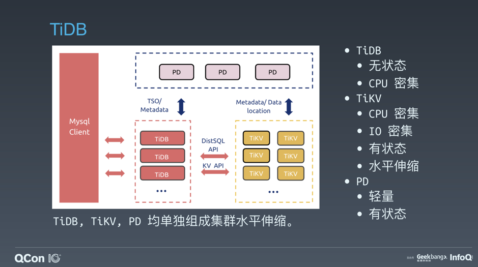
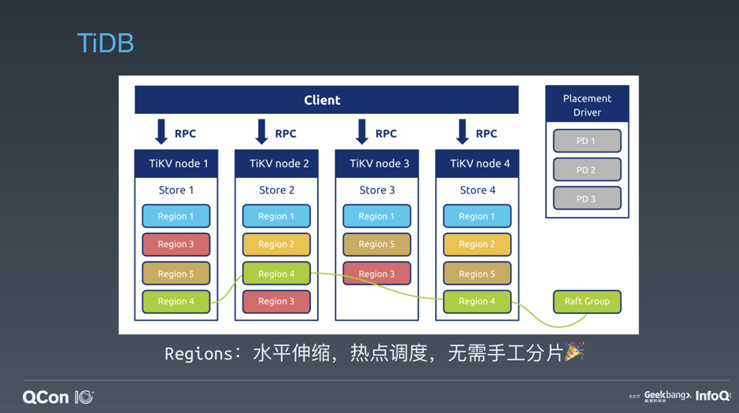
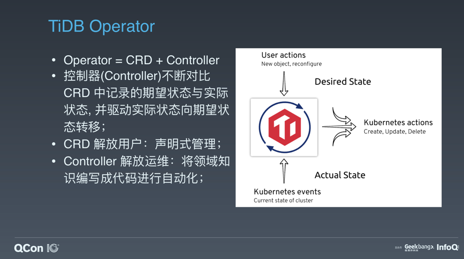
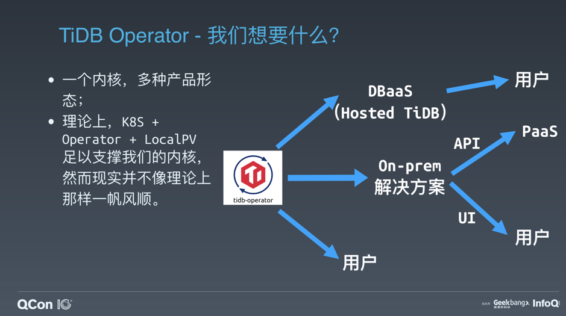
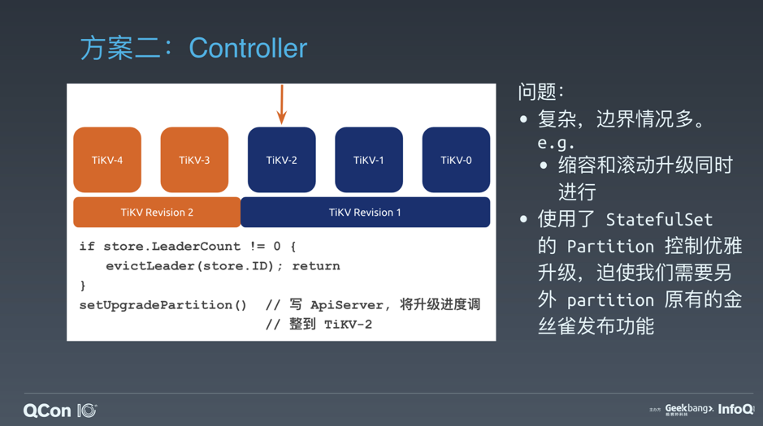
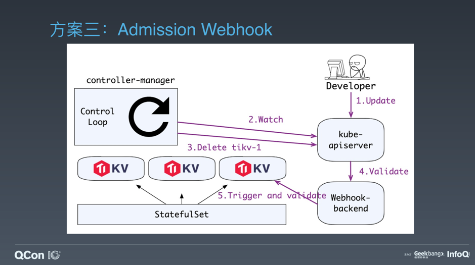
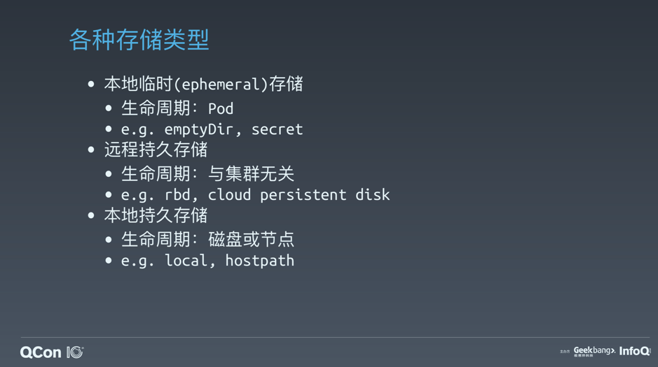
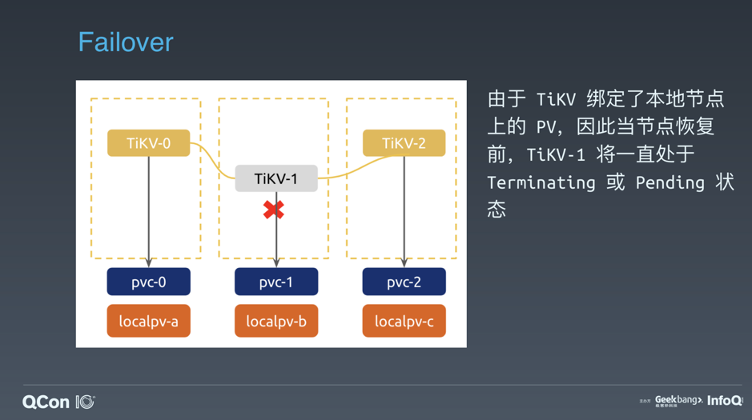
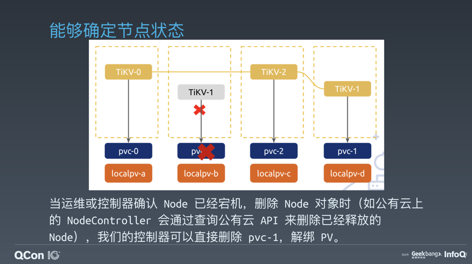
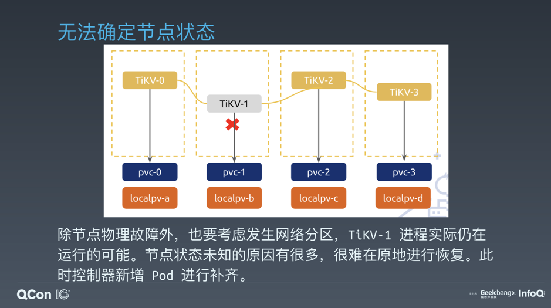

## 导语

云原生时代以降，无状态应用以其天生的可替换性率先成为各类编排系统的宠儿。以 Kubernetes 为代表的编排系统能够充分利用云上的可编程基础设施，实现无状态应用的弹性伸缩与自动故障转移。这种基础能力的下沉无疑是对应用开发者生产力的又一次解放。 然而，在轻松地交付无状态应用时，我们应当注意到，状态本身并没有消失，而是按照各类最佳实践下推到了底层的数据库、对象存储等有状态应用上。那么，“负重前行”的有状态应用是否能充分利云与 Kubernetes 的潜力，复制无状态应用的成功呢？

或许你已经知道，Operator 模式已经成为社区在 Kubernetes 上编排有状态应用的最佳实践，脚手架项目 KubeBuilder 和 operator-sdk 也已经愈发成熟，而对磁盘 IO 有严苛要求的数据库等应用所必须的 Local PV（本地持久卷）也已经在 1.14 中 GA。这些积木似乎已经足够搭建出有状态应用在平稳运行在 Kubernetes 之上这一和谐景象。然而，书面上的最佳实践与生产环境之间还有无数工程细节造就的鸿沟，要在 Kubernetes 上可靠地运行有状态应用仍需要相当多的努力。下面我将以 TiDB 与 Kubernetes 的“爱恨情仇”为例，总结有状态应用走向云原生的工程最佳实践。

## TiDB 简介

首先让我们先熟悉熟悉研究对象。TiDB 是一个分布式的关系型数据库，它采用了存储和计算分离的架构，并且分层十分清晰：

图 1 TiDB 架构

其中 TiDB 是 SQL 计算层，TiDB 进程接收 SQL 请求，计算查询计划，再根据查询计划去查询存储层完成查询。

存储层就是图中的 TiKV，TiKV 会将数据拆分为一个个小的数据块，比如一张 1000000 行的表，在 TiKV 中就有可能被拆分为 200 个 5000 行的数据块。这些数据块在 TiKV 中叫做 Region，而为了确保可用性， 每个 Region 都对应一个 Raft Group，通过 Raft Log 复制实现每个 Region 至少有三副本。

图 2 TiKV Region 分布

而 PD 则是集群的大脑，它接收 TiKV 进程上报的存储信息，并计算出整个集群中的 Region 分布。借由此，TiDB 便能通过 PD 获知该如何访问某块数据。更重要的是，PD 还会基于集群 Region 分布与负载情况进行数据调度。比如，将过大的 Region 拆分为两个小 Region，避免 Region 大小由于写入而无限扩张；将部分 Leader 或数据副本从负载较高的 TiKV 实例迁移到负载较低的 TiKV 实例上，以最大化集群性能。这引出 了一个很有趣的事实，也就是 TiKV 虽然是存储层，但它可以非常简单地进行水平伸缩。这有点意思对吧？在传统的存储中，假如我们通过分片打散数据，那么加减节点数往往需要重新分片或手工迁移大量的数据。而在 TiKV 中，以 Region 为抽象的数据块迁移能够在 PD 的调度下完全自动化地进行，而对于运维而言，只管加机器就行了。

**了解有状态应用本身的架构与特性是进行编排的前提，比如通过前面的介绍我们就可以归纳出，TiDB 是无状态的，PD 和 TiKV 是有状态的，它们三者均能独立进行水平伸缩。我们也能看到，TiDB 本身的设计就是云原生的——它的容错能力和水平伸缩能力能够充分发挥云基础设施提供的弹性，既然如此，云原生“操作系统” Kubernetes 不正是云原生数据库 TiDB 的最佳载体吗？TiDB Operator 应运而生。**

## TiDB Operator 简介

Operator 大家都很熟悉了，目前几乎每个开源的存储项目都有自己的 Operator，比如鼻祖 etcd-operator 以及后来的 prometheus-operator、postgres-operator。Operator 的灵感很简单，Kubernetes 自身就用 Deployment、DaemonSet 等 API 对象来记录用户的意图，并通过 control loop 控制集群状态向目标状态收敛，那么我们当然也可以定义自己的 API 对象，记录自身领域中的特定意图，并通过自定义的 control loop 完成状态收敛。

在 Kubernetes 中，添加自定义 API 对象的最简单方式就是 CustomResourceDefinition（CRD），而添加自定义 control loop 的最简单方式则是部署一个自定义控制器。自定义控制器 + CRD 就是 Operator。具体到 TiDB 上，用户可以向 Kubernetes 提交一个 TidbCluster 对象来描述 TiDB 集群定义，假设我们这里描述说“集群有 3 个 PD 节点、3 个 TiDB 节点和 3 个 TiKV 节点”，这是我们的意图。 而 TiDB Operator 中的自定义控制器则会进行一系列的 Kubernetes 集群操作，比如分别创建 3 个 TiKV、TiDB、PD Pod，来让真实的集群符合我们的意图。

图 3 TiDB Operator

TiDB Operator 的意义在于让 TiDB 能够无缝运行在 Kubernetes 上，而 Kubernetes 又为我们抽象了基础设施。因此，TiDB Operator 也是 TiDB 多种产品形态的内核。对于希望直接使用 TiDB Operator 的用户， TiDB Operator 能做到在既有 Kubernetes 集群或公有云上开箱即用；而对于不希望有太大运维负载，又需求一套完整的分布式数据库解决方案的用户，我们则提供了打包 Kubernetes 的 on-premise 部署解决方案，用户可以直接通过方案中打包的 GUI 操作 TiDB 集群，也能通过 OpenAPI 将集群管理能力接入到自己现有的 PaaS 平台中；另外，对于完全不想运维数据库，只希望购买 SQL 计算与存储能力的用户，我们则基于 TiDB Operator 提供托管的 TiDB 服务，也即 DBaaS（Database as a Service）。

图 4 TiDB Operator 的多种上层产品形态

多样的产品形态对作为内核的 TiDB Operator 提出了更高的要求与挑战——事实上，由于数据资产的宝贵性和引入状态后带来的复杂性，有状态应用的可靠性要求与运维复杂度往往远高于无状态应用，这从 TiDB Operator 所面临的挑战中就可见一斑。

## 挑战

描绘架构总是让人觉得美好，而生产中的实际挑战则将我们拖回现实。

**TiDB Operator 的最大挑战就是数据库的场景极其严苛，大量用户的期盼都是我的数据库能够“永不停机”，对于数据不一致或丢失更是零容忍**。很多时候大家对于数据库等有状态应用的可用性要求甚至是高于承载线上服务的 Kubernetes 集群的，至少线上集群宕机还能补救，而数据一旦出问题，往往意味着巨大的损失和补救成本，甚至有可能“回天乏术”。这本身也会在很大程度上影响大家把有状态应用推上 Kubernetes 的信心。

**第二个挑战是编排分布式系统这件事情本身的复杂性**。Kubernetes 主导的 level driven 状态收敛模式虽然很好地解决了命令式编排在一致性、事务性上的种种问题，但它本身的心智模型是更为抽象的，我们需要考虑每一种 可能的状态并针对性地设计收敛策略，而最后的实际状态收敛路径是随着环境而变化的，我们很难对整个过程进行准确的预测和验证。假如我们不能有效地控制编排层面的复杂度，最后的结果就是没有人能拍胸脯保证 TiDB Operator 能够满足上面提到的严苛挑战，那么走向生产也就无从谈起了。

**第三个挑战是存储**。数据库对于磁盘和网络的 IO 性能相当敏感，而在 Kubernetes 上，最主流的各类网络存储很难满足 TiDB 对磁盘 IO 性能的要求。假如我们使用本地存储，则不得不面对本地存储的易失性问题——磁盘故障或节点故障都会导致某块存储不可用，而这两种故障在分布式系统中是家常便饭。

**最后的问题是，尽管 Kubernetes 成功抽象了基础设施的计算能力与存储能力，但在实际场景的成本优化上考虑得很少**。对于公有云、私有云、裸金属等不同的基础设施环境，TiDB Operator 需要更高级、特化的调度策略来做成本优化。大家也知道，成本优化是没有尽头的，并且往往伴随着一些牺牲，怎么找到优化过程中边际收益最大化的点，同样也是非常有意思的问题之一。

其中，场景严苛可以作为一个前提条件，而针对性的成本优化则不够有普适性。我们接下来就从编排和存储两块入手，从实际例子来看 TiDB 与 TiDB Operator 如何解决这些问题，并推广到一般的有状态应用上。

## 控制器——剪不断，理还乱

TiDB Operator 需要驱动集群向期望状态收敛，而最简单的驱动方式就是创建一组 Pod 来组成 TiDB 集群。通过直接操作 Pod，我们可以自由地控制所有编排细节。举例来说，我们可以：

*   通过替换 Pod 中容器的 image 字段完成原地升级。

*   自由决定一组 Pod 的升级顺序。

*   自由下线任意 Pod。

事实上我们也确实采用过完全操作 Pod 的方案，但是当真正推进该方案时我们才发现，这种完全“自己造轮子”的方案不仅开发复杂，而且验证成本非常高。试想，为什么大家对 Kubernetes 的接受度越来越高， 即使是传统上较为保守的公司现在也敢于拥抱 Kuberentes？除了 Kubernetes 本身项目素质过硬之外，更重要的是有整个社区为它背书。我们知道 Kubernetes 已经在各种场景下经受过大量的生产环境考验， 这种信心是各类测试手段都没法给到我们的。回到 TiDB Operator 上，选择直接操作 Pod 就意味着我们抛弃了社区在 StatefulSet、Deployment 等对象中沉淀的编排经验，随之带来的巨大验证成本大大影响了整个项目的开发效率。

因此，在目前的 TiDB Operator 项目中，大家可以看到控制器的主要操作对象是 StatefulSet。StatefulSet 能够满足有状态应用的大部分通用编排需求。当然，StatefulSet 为了做到通用化，做了很多 不必要的假设，比如高序号的 Pod 是隐式依赖低序号 Pod 的，这会给我们带来一些额外的限制，比如：

+  无法指定 Pod 进行下线缩容。
+  滚动更新顺序固定。
+  滚动更新需要后驱 Pod 全部 Ready。

StatefulSet 和 Pod 的抉择，最终是灵活性和可靠性的权衡，而在 TiDB 面临的严苛场景下，我们只有先做到可靠，才能做开发、敢做开发。最后的选择自然就呼之欲出——StatefulSet。当然，这里并不是说，使用基于高级对象进行编排的方案要比基于 Pod 进行编排的方案更好，只是说我们在当时认为选择 StatefulSet 是一个更好的权衡。当然这个故事还没有结束，当我们基于 StatefulSet 把第一版 TiDB Operator 做稳定后，我们正在接下来的版本中开发一个新的对象来水平替换 StatefulSet，这个对象可以使用社区积累的 StatefulSet 测试用例进行验证，同时又可以解除上面提到的额外限制，给我们提供更好的灵活性。 假如你也在考虑从零开始搭建一个 Operator，或许也可以参考“先基于成熟的原生对象快速迭代，在验证了价值后再增强或替换原生对象来解决高级需求”这条落地路径。

接下来的问题是控制器如何协调基础设施层的状态与应用层的状态。举个例子，在滚动升级 TiKV 时，每次重启 TiKV 实例前，都要先驱逐该实例上的所有 Region Leader；而在缩容 TiKV 时，则要先在 PD 中将 待缩容的 TiKV 下线，等待待缩容的 TiKV 实例上的 Region 全部迁移走，PD 认为 TiKV 下线完成时，再真正执行缩容操作调整 Pod 个数。这些都是在编排中协调应用层状态的例子，我们可以怎么做自动化呢？

大家也注意到了，上面的例子都和 Pod 下线挂钩，因此一个简单的方案就通过 container lifecycle hook，在 preStop 时执行一个脚本进行协调。这个方案碰到的第一个问题是缺乏全局信息，脚本中无法区分当前是在滚动升级还是缩容。当然，这可以通过在脚本中查询 apiserver 来绕过。更大的问题是 preStop hook 存在 grace period，kubelet 最多等待 .spec.terminationGracePeriodSeconds 这么长的 时间，就会强制删除 Pod。对于 TiDB 的场景而言，我们更希望在自动的下线逻辑失败时进行等待并报警，通知运维人员介入，以便于最小化影响，因此基于 container hook 来做是不可接受的。

第二种方案是在控制循环中来协调应用层的状态。比如，我们可以通过 partition 字段来控制 StatefulSet 升级进度，并在升级前确保 leader 迁移完毕，如下图所示：

图 5 在控制循环中协调状态

在伪代码中，每次我们因为要将所有 Pod 收敛到新版本而进入这段控制逻辑时，都会先检查下一个要待升级的 TiKV 实例上 leader 是否迁移完毕，直到迁移完毕才会继续往下走，调整 partition 参数，开始升级 对应的 TiKV 实例。缩容也是类似的逻辑。但你可能已经意识到，缩容和滚动更新两个操作是有可能同时出现在状态收敛的过程中的，也就是同时修改 replicas 和 image 字段。这时候由于控制器需要区分缩容与滚动更新，诸如此类的边界条件会让控制器越来越复杂。

第三种方案是使用 Kubernetes 的 Admission Webhook 将一部分协调逻辑从控制器中拆出来，放到更纯粹的切面当中。针对这个例子，我们可以拦截 Pod 的 Delete 请求和针对上层对象的 Update 请求，检查缩容或滚动升级的前置条件，假如不满足，则拒绝请求并触发指令进行协调，比如驱逐 leader，假如满足，那么就放行请求。控制循环会不断下发指令直到状态收敛，因此 webhook 就相应地会不断进行检查直到条件满足，如下图所示：

图 6 在 Webhook 中协调状态

这种方案的好处是我们把逻辑拆分到了一个与控制器垂直的单元中，从而可以更容易地编写业务代码和单元测试。当然，这个方案也有缺点，一是引入了新的错误模式，处理 webhook 的 server 假如宕机，会造成集群功能降级；二是该方案适用面并不广，只能用于状态协调与特定的 Kubernetes API 操作强相关的场景。在实际的代码实践中，我们会按照具体场景选择方案二或方案三，大家也可以到项目中一探究竟。

上面的的两个例子都是关于如何控制编排逻辑复杂度的，关于 Operator 的各类科普文中都会用一句“在自定义控制器中编写领域特定的运维知识”将这一部分轻描淡写地一笔带过，而我们的实践告诉我们，真正编写生产级 的自定义控制器充满挑战与抉择。

## Local PV —— 想说爱你不容易

接下来是存储的问题。我们不妨看看 Kubernetes 为我们提供了哪些存储方案：

图 7 存储方案

其中，本地临时存储中的数据会随着 Pod 被删除而清空，因此不适用于持久存储。

远程存储则面临两个问题：

+ 通常来说，远程存储的性能较差，这尤其体现在 IOPS 不够稳定上，因此对于磁盘性能有严格要求的有状态应用，大多数远程存储是不适用的。

+ 通常来说，远程存储本身会做三副本，因此单位成本较高，这对于在存储层已经实现三副本的 TiDB 来说是不必要的成本开销。

因此，最适用于 TiDB 的是本地持久存储。这其中，hostPath 的生命周期又不被 Kubernetes 管理，需要付出额外的维护成本，最终的选项就只剩下了 Local PV。

Local PV 并非免费的午餐，所有的文档都会告诉我们 Local PV 有以下限制：

+ 数据易失（相比于远程存储的三副本）。

+ 节点故障会影响数据访问。

+ 难以垂直扩展容量（相当一部分远程存储可以直接调整 volume 大小）。

这些问题同样也是在传统的虚拟机运维场景下的痛点，因此 TiDB 本身设计就充分考虑了这些问题：

+ 本地存储的易失性要求应用自身实现数据冗余。
   - TiDB 的存储层 TiKV 默认就为每个 Region 维护至少三副本。
   - 当副本缺失时，TiKV 能自动补齐副本数。
+ 节点故障会影响本地存储的数据访问。
    - 节点故障后，相关 Region 会重新进行 leader 选举，将读写自动迁移到健康节点上。
+ 本地存储的容量难以垂直扩展。
    - TiKV 的自动数据切分与调度能够实现水平伸缩。

存储层的这些关键特性是 TiDB 高效使用 Local PV 的前提条件，也是 TiDB 水平伸缩的关键所在。当然，在发生节点故障或磁盘故障时，由于旧 Pod 无法正常运行，我们需要自定义控制器 帮助我们进行恢复，及时补齐实例数，确保有足够的健康实例来提供整个集群所需的存储空间、计算能力与 IO 能力。这也就是自动故障转移。

我们先看一看为什么 TiDB 的存储层不能像无状态应用或者使用远程存储的 Pod 那样自动进行故障转移。假设下图中的节点发生了故障，由于 TiKV-1 绑定了节点上的 PV，只能运行在该节点上，因此 在节点恢复前，TiKV-1 将一直处于 Pending 状态：

图 8 节点故障

此时，假如我们能够确认 Node 已经宕机并且短期无法恢复，那么就可以删除 Node 对象（比如 NodeController 在公有上会查询公有云的 API 来删除已经释放的 Node）。此时，控制器通过 Node 对象不存在 这一事实理解了 Node 已经无法恢复，就可以直接删除 pvc-1 来解绑 PV，并强制删除 TiKV-1，最终让 TiKV-1 调度到其它节点上。当然，我们同时也要做应用层状态的协调，也就是先在 PD 中下线 TiKV-1，再将 新的 TiKV-1 作为一个新成员加入集群，此时，PD 就会通知 TiKV-1 创建 Region 副本来补齐集群中的 Region 副本数。

图 9 能够确定节点状态时的故障转移

当然，更多的情况下，我们是无法在自定义控制器中确定节点状态的，此时就很难针对性地进行原地恢复，因此我们通过向集群中添加新 Pod 来进行故障转移：

图 10 无法确定节点状态时的故障转移

上面讲的是 TiDB 特有的故障转移策略，但其实可以类推到大部分的有状态应用上。比如对于 MySQL 的 slave，我们同样可以通过新增 slave 来做 failover，而在 failover 时，我们同样也要做应用层的一些事情， 比如说去 S3 上拉一个全量备份，再通过 binlog 把增量数据补上，当 lag 达到可接受的程度之后开始对外提供读服务。因此大家就可以发现，对于有状态应用的 failover 策略是共通的，也都需要应用本身支持某种 failover 形式。比如对于 MySQL 的 master，我们只能通过 M-M 模式做一定程度上的 failover，而且还会损失数据一致性。这当然不是 Kubernetes 或云原生本身有什么问题，而是说 Kubernetes 只是改变了应用的运维模式，但并不能影响应用本身的架构特性。假如应用本身的设计就不是云原生的，那只能从应用本身去解决。

## 总结

通过 TiDB Operator 的实践，我们有以下几条总结：

* Operator 本身的复杂度不可忽视。

* Local PV 能满足高 IO 性能需求，代价则是编排上额外的复杂度。

* 应用本身必须迈向云原生（meets kubernetes part way）。

最后，言语的描述总是不如代码本身来得简洁有力，TiDB Operator 是一个完全开源的项目，眼见为实，大家可以尽情到 [项目仓库](https://github.com/pingcap/tidb-operator) 中拍砖，也欢迎大家加入社区一起玩起来，期待你的 issue 和 PR！

假如你对于文章有任何问题或建议，或是想直接加入 PingCAP 鼓捣相关项目，欢迎通过我的邮箱 wuyelei@pingcap.com 联系我。

>本文为吴叶磊在 2019 QCon 全球软件开发大会（上海）上的专题演讲实录，Slides [下载地址](https://github.com/pingcap/presentations/blob/master/conference/%E5%90%B4%E5%8F%B6%E7%A3%8A-QCon-2019-%E9%AB%98%E6%95%88%E7%BC%96%E6%8E%92%E6%9C%89%E7%8A%B6%E6%80%81%E5%BA%94%E7%94%A8-TiDB%E7%9A%84%E4%BA%91%E5%8E%9F%E7%94%9F%E5%AE%9E%E8%B7%B5%E4%B8%8E%E6%80%9D%E8%80%83.pdf)。
