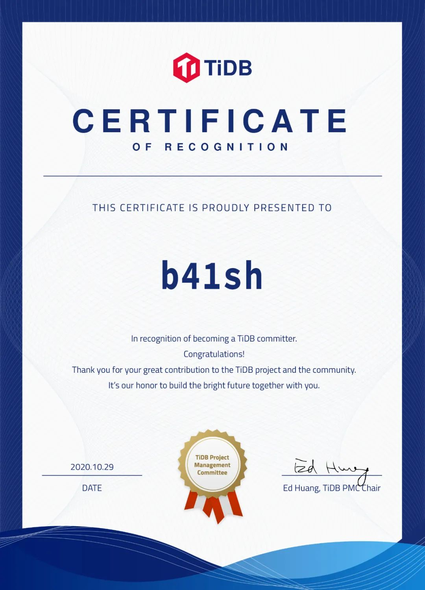
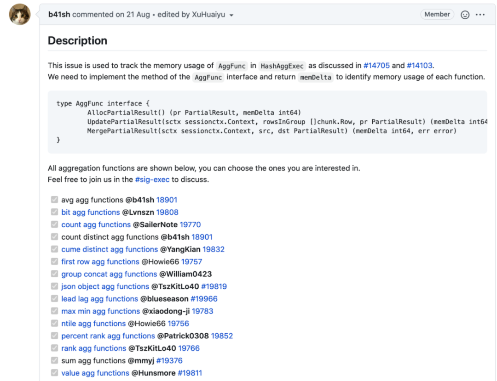
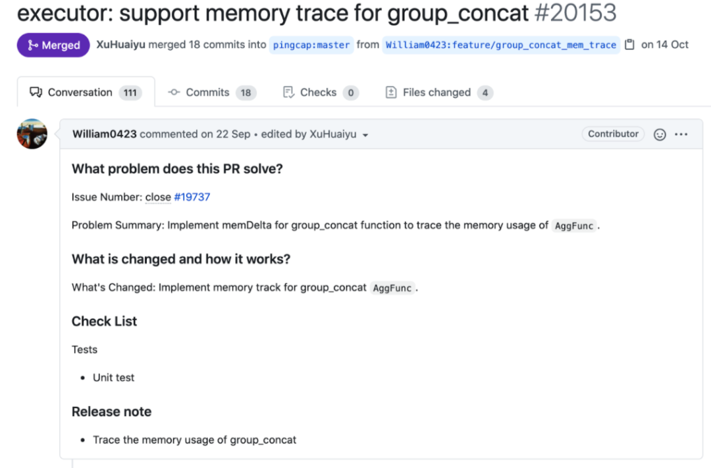

**Execution SIG 近日又喜提 Committer 一枚，他就是 b41sh 白珅。** 白珅同学毕业于上海交通大学电子与通信工程专业，曾就职于新浪、百度、爱奇艺等公司做视频系统和广告系统，现在在一家创业公司做多方安全计算，他的工作是开发存储引擎。在谈到是如何从业务开发转化为数据库开发，他说数据库一直是他想研究的方向，成为 TiDB Contributor 之后他对数据库和存储有了更多了解，正好面试官也了解 TiDB，从此便开启了数据库的探索之路。今天我们就来看看 TiDB Committer 白珅的贡献历程吧~

## 什么时候开始接触编程，有没有写过好玩的项目？

我大概从 2010 年开始接触编程，后来写过一些小项目，主要在我们团队内部使用，是一个类似 Review Board 的 Code Review 系统，可以帮助你在提交代码之前进行 Review。

## 如何了解到 TiDB？贡献 TiDB 感受如何？

我比较喜欢关注知乎上的文章，有一次看到 TiDB 发了很多技术博客和源码阅读，觉得有很多干货内容，于是便关注了。后来也陆续参与了一些社区活动，像 TiDB Hackathon，可惜那时候对 TiDB 了解不多，所以没有做出比较满意的作品。

我最早一次给 TiDB 提 PR 是 2019 年 3 月，当时改了一个小 bug，是 Executor 下面的时间处理函数，我觉得对新人很友好，上手比较简单。我和 PingCAP 的小伙伴张原嘉在 slack 上沟通比较多，他回复很及时，帮助我解决了很多问题，非常感谢他的帮助~

## 贡献 TiDB 的动力是什么？

我觉得数据库比较好玩，很有意思，贡献 TiDB 对我的就业和技术上都有比较大的帮助。虽然我用了很多年数据库，但不知道底层怎么实现的，之前对于数据库的了解都是浅层次的，在贡献 TiDB 之后解开了我很多疑惑。并且我看了很多业内 Paper 发现 NewSQL 是发展趋势，未来很多年内应该都会备受大家的关注，所以我也想多学习一些。

## 贡献中遇到最大的困难是什么？

数据库需要一些知识储备，当我做一些复杂的设计时会觉得知识储备不足，所以最近自己也在看一些数据库相关的书和 Paper，希望自己的知识积累更丰富一些，可以解决复杂并且有难度的 Issue。

我遇到过最难的 Issue 是最近的 AggFunc Memory Trace， 需要追踪内存使用情况。

这个 Issue 我做了实现方案的设计，具体功能由社区的同学完成，我和 mmyj 做了 Code Review，也是一件让我比较有成就感的事情。

## 是否是个开源爱好者，有没有给其他项目贡献过？

是的，我会留意和我工作相关的项目，最近比较关注 Apache Impala，也是一个数据库，还有像 CockroachDB、ClickHouse，但主要贡献还是在 TiDB。

## 贡献中最有成就感的事是什么？

最近性能竞赛 Review 了很多代码，帮助很多社区同学第一次做了贡献，尤其是有一个改了挺久才合并进去的 PR，挺有成就感的。看到他们就像感觉看到了当年的自己。

## 你认为开源是什么？

我认为开源是一种生产关系，比较理想主义，**让很多不认识的人一起做一个产品，这种协作方式在其他地方是非常少见的，我很喜欢。**

**随着 TiDB 社区逐渐壮大，TiDB repo 的 Contributor 也刚刚突破了 500 人，白珅同学在此送上他对社区的一段寄语：**

很荣幸能够成为 TiDB 社区的 Committer 成员，在过去的一年多时间里，通过不断的为社区贡献代码，我学习到了很多前沿的数据库知识，也见证了 TiDB 社区的蓬勃发展。感谢社区小伙伴对我的帮助和指导，让我充分感受到了开源社区的魅力。希望未来有更多的人参与到社区的建设中，一起成长进步。
