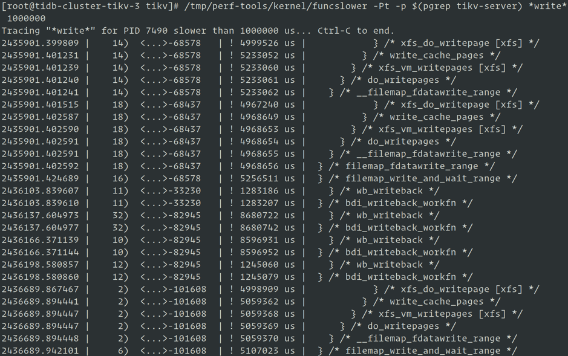
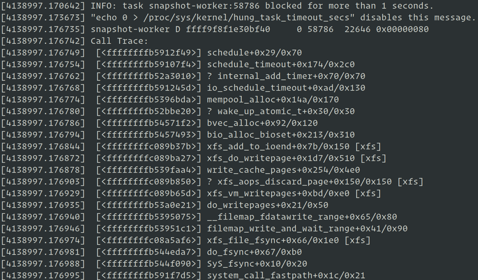

[Kubernetes](https://en.wikipedia.org/wiki/Kubernetes)（K8s）是一个开源容器编排系统，可自动执行应用程序部署、扩展和管理。它是云原生世界的操作系统。 K8s 或操作系统中的任何缺陷都可能使用户进程存在风险。作为 PingCAP EE（效率工程）团队，我们在 K8s 中测试 [TiDB Operator](https://pingcap.com/blog-cn/tidb-operator-introduction/)（一个创建和管理 TiDB 集群的工具）时，发现了两个 Linux 内核错误。这些错误已经困扰我们很长一段时间，并没有在整个 K8s 社区中彻底修复。

经过广泛的调查和诊断，我们已经确定了处理这些问题的方法。在这篇文章中，我们将与大家分享这些解决方法。不过，尽管这些方法很有用，但我们认为这只是权宜之策，相信未来会有更优雅的解决方案，也期望 K8s 社区、RHEL 和 CentOS 可以在不久的将来彻底修复这些问题。

## Bug #1: 诊断修复不稳定的 Kmem Accounting

关键词：SLUB: Unable to allocate memory on node -1

社区相关 Issue:

+ [https://github.com/kubernetes/kubernetes/issues/61937](https://github.com/kubernetes/kubernetes/issues/61937)
+ [https://github.com/opencontainers/runc/issues/1725](https://github.com/opencontainers/runc/issues/1725)
+ [https://support.mesosphere.com/s/article/Critical-Issue-KMEM-MSPH-2018-0006](https://support.mesosphere.com/s/article/Critical-Issue-KMEM-MSPH-2018-0006)

### 问题起源

薛定谔平台是我司开发的基于 K8s 建立的一套自动化测试框架，提供各种 Chaos 能力，同时也提供自动化的 Bench 测试，各类异常监控、告警以及自动输出测试报告等功能。我们发现 [TiKV](https://github.com/tikv/tikv) 在薛定谔平台上做 [OLTP](https://en.wikipedia.org/wiki/Online_transaction_processing) 测试时偶尔会发生 I/O 性能抖动，但从下面几项来看未发现异常：

+ TiKV 和 RocksDB 的日志
+ CPU 使用率
+ 内存和磁盘等负载信息

只能偶尔看到 dmesg 命令执行的结果中包含一些 “SLUB: Unable to allocate memory on node -1” 信息。

### 问题分析

我们使用 [perf-tools](http://github.com/brendangregg/perf-tools) 中的 [funcslower](https://github.com/brendangregg/perf-tools/blob/master/bin/funcslower) trace 来执行较慢的内核函数并调整内核参数 `hung_task_timeout_secs` 阈值，抓取到了一些 TiKV 执行写操作时的内核路径信息：





从上图的信息中可以看到 I/O 抖动和文件系统执行 writepage 有关。同时捕获到性能抖动的前后，在 node 内存资源充足的情况下，`dmesg` 返回的结果也会出现大量 “SLUB: Unable to allocate memory on node -1” 的信息。

从 `hung_task` 输出的 call stack 信息结合内核代码发现，内核在执行 `bvec_alloc` 函数分配 `bio_vec` 对象时，会先尝试通过 `kmem_cache_alloc` 进行分配，`kmem_cache_alloc` 失败后，再进行 fallback 尝试从 mempool 中进行分配，而在 mempool 内部会先尝试执行 `pool->alloc` 回调进行分配，`pool->alloc` 分配失败后，内核会将进程设置为不可中断状态并放入等待队列中进行等待，当其他进程向 mempool 归还内存或定时器超时（5s） 后，进程调度器会唤醒该进程进行重试 ，这个等待时间和我们业务监控的抖动延迟相符。

但是我们在创建 Docker 容器时，并没有设置 kmem limit，为什么还会有 kmem 不足的问题呢？为了确定 kmem limit 是否被设置，我们进入 cgroup memory controller 对容器的 kmem 信息进行查看，发现 kmem 的统计信息被开启了,  但 limit 值设置的非常大。

我们已知 kmem accounting 在 RHEL 3.10 版本内核上是不稳定的，因此怀疑 SLUB 分配失败是由内核 bug 引起的，搜索 kernel patch 信息我们发现确实是内核 bug, 在社区高版本内核中已修复：

[slub: make dead caches discard free slabs immediately](https://github.com/torvalds/linux/commit/d6e0b7fa11862433773d986b5f995ffdf47ce672)

同时还有一个 namespace 泄漏问题也和 kmem accounting 有关：

[mm: memcontrol: fix cgroup creation failure after many small jobs](https://github.com/torvalds/linux/commit/73f576c04b9410ed19660f74f97521bee6e1c546)

那么是谁开启了 kmem accounting 功能呢？我们使用 [bcc](http://github.com/iovisor/bcc) 中的 [opensnoop](https://github.com/iovisor/bcc/blob/master/tools/opensnoop.py) 工具对 kmem 配置文件进行监控，捕获到修改者 runc 。从 K8s 代码上可以确认是 K8s 依赖的 runc 项目默认开启了 kmem accounting。

### 解决方案

通过上述分析，我们要么升级到高版本内核，要么在启动容器的时候禁用 kmem accounting 功能，目前 runc 已提供条件编译选项，可以通过 [Build Tags](https://github.com/opencontainers/runc#build-tags) 来禁用 kmem accounting，关闭后我们测试发现抖动情况消失了，namespace 泄漏问题和 SLUB 分配失败的问题也消失了。

### 操作步骤

我们需要在 kubelet 和 docker 上都将 kmem account 功能关闭。

1. kubelet 需要重新编译，不同的版本有不同的方式。

	如果 kubelet 版本是 v1.14 及以上，则可以通过在编译 kubelet 的时候加上 [Build Tags](https://github.com/kubernetes/kubernetes/blob/release-1.14/vendor/github.com/opencontainers/runc/libcontainer/cgroups/fs/kmem_disabled.go#L1) 来关闭 kmem account：
	
	```
	$ git clone --branch v1.14.1 --single-branch --depth 1 [https://github.com/kubernetes/kubernetes](https://github.com/kubernetes/kubernetes) 
	$ cd kubernetes
	
	$ KUBE_GIT_VERSION=v1.14.1 ./build/run.sh make kubelet GOFLAGS="-tags=nokmem"
	```
	
	但如果 kubelet 版本是 v1.13 及以下，则无法通过在编译 kubelet 的时候加 Build Tags 来关闭，需要重新编译 kubelet，步骤如下。
	
	首先下载 Kubernetes 代码：
	
	```
	$ git clone --branch v1.12.8 --single-branch --depth 1 https://github.com/kubernetes/kubernetes
	$ cd kubernetes
	```
	
	然后手动将开启 kmem account 功能的 [两个函数](https://github.com/kubernetes/kubernetes/blob/release-1.12/vendor/github.com/opencontainers/runc/libcontainer/cgroups/fs/memory.go#L70-L106) 替换成 [下面这样](https://github.com/kubernetes/kubernetes/blob/release-1.14/vendor/github.com/opencontainers/runc/libcontainer/cgroups/fs/kmem_disabled.go#L5-L11)：
	
	```
	func EnableKernelMemoryAccounting(path string) error {
		return nil
	}
	
	func setKernelMemory(path string, kernelMemoryLimit int64) error {
		return nil
	}
	
	```
	
	之后重新编译 kubelet：
	
	```
	$ KUBE_GIT_VERSION=v1.12.8 ./build/run.sh make kubelet
	```
	
	编译好的 kubelet 在 `./_output/dockerized/bin/$GOOS/$GOARCH/kubelet` 中。

2. 同时需要升级 docker-ce 到 18.09.1 以上，此版本 docker 已经将 runc 的 kmem account 功能关闭。

3. 最后需要重启机器。

验证方法是查看新创建的 pod 的所有 container 已关闭 kmem，如果为下面结果则已关闭：

```
$ cat /sys/fs/cgroup/memory/kubepods/burstable/pod<pod-uid>/<container-id>/memory.kmem.slabinfo
cat: memory.kmem.slabinfo: Input/output error

```

## Bug #2：诊断修复网络设备引用计数泄漏问题

关键词：kernel:unregister_netdevice: waiting for eth0 to become free. Usage count = 1

社区相关 Issue:

+ [https://github.com/kubernetes/kubernetes/issues/64743](https://github.com/kubernetes/kubernetes/issues/64743)
+ [https://github.com/projectcalico/calico/issues/1109](https://github.com/projectcalico/calico/issues/1109)
+ [https://github.com/moby/moby/issues/5618](https://github.com/moby/moby/issues/5618)

### 问题起源

我们的薛定谔分布式测试集群运行一段时间后，经常会持续出现“kernel:unregister_netdevice: waiting for eth0 to become free. Usage count = 1” 问题，并会导致多个进程进入不可中断状态，只能通过重启服务器来解决。

### 问题分析

通过使用 crash 工具对 vmcore 进行分析，我们发现内核线程阻塞在 `netdev_wait_allrefs` 函数，无限循环等待 `dev->refcnt` 降为 0。由于 pod 已经释放了，因此怀疑是引用计数泄漏问题。我们查找 K8s issue 后发现问题出在内核上，但这个问题没有简单的稳定可靠复现方法，且在社区高版本内核上依然会出现这个问题。

为避免每次出现问题都需要重启服务器，我们开发一个内核模块，当发现 `net_device` 引用计数已泄漏时，将引用计数清 0 后移除此内核模块（避免误删除其他非引用计数泄漏的网卡）。为了避免每次手动清理，我们写了一个监控脚本，周期性自动执行这个操作。但此方案仍然存在缺陷：

+ 引用计数的泄漏和监控发现之间存在一定的延迟，在这段延迟中 K8s 系统可能会出现其他问题；
+ 在内核模块中很难判断是否是引用计数泄漏，`netdev_wait_allrefs` 会通过 Notification Chains 向所有的消息订阅者不断重试发布 `NETDEV_UNREGISTER` 和 `NETDEV_UNREGISTER_FINAL` 消息，而经过 trace 发现消息的订阅者多达 22 个，而去弄清这 22 个订阅者注册的每个回调函数的处理逻辑来判断是否有办法避免误判也不是一件简单的事。

### 解决方案

在我们准备深入到每个订阅者注册的回调函数逻辑的同时，我们也在持续关注 kernel patch 和 RHEL 的进展，发现 RHEL 的 [solutions:3659011](https://access.redhat.com/solutions/3659011) 有了一个更新，提到 upstream 提交的一个 patch:

[`route: set the deleted fnhe fnhe_daddr to 0 in ip_del_fnhe to fix a race`](https://github.com/torvalds/linux/commit/ee60ad219f5c7c4fb2f047f88037770063ef785f)

在尝试以 hotfix 的方式为内核打上此补丁后，我们持续测试了 1 周，问题没有再复现。我们向 RHEL 反馈测试信息，得知他们已经开始对此 patch 进行 backport。

### 操作步骤

推荐内核版本 Centos 7.6 kernel-3.10.0-957 及以上。

1.  安装 [kpatch](https://github.com/dynup/kpatch) 及 kpatch-build 依赖：

	```
	UNAME=$(uname -r)
	sudo yum install gcc kernel-devel-${UNAME%.*} elfutils elfutils-devel
	sudo yum install pesign yum-utils zlib-devel \
	  binutils-devel newt-devel python-devel perl-ExtUtils-Embed \
	  audit-libs audit-libs-devel numactl-devel pciutils-devel bison
	
	# enable CentOS 7 debug repo
	sudo yum-config-manager --enable debug
	
	sudo yum-builddep kernel-${UNAME%.*}
	sudo debuginfo-install kernel-${UNAME%.*}
	
	# optional, but highly recommended - enable EPEL 7
	sudo yum install ccache
	ccache --max-size=5G
	
	```

2. 安装 [kpatch](https://github.com/dynup/kpatch) 及 kpatch-build：

	```
	git clone https://github.com/dynup/kpatch && cd kpatch
	make 
	sudo make install
	systemctl enable kpatch
	```

3.  下载并构建热补丁内核模块：

	```
	curl -SOL  https://raw.githubusercontent.com/pingcap/kdt/master/kpatchs/route.patch
	kpatch-build -t vmlinux route.patch （编译生成内核模块）
	mkdir -p /var/lib/kpatch/${UNAME} 
	cp -a livepatch-route.ko /var/lib/kpatch/${UNAME}
	systemctl restart kpatch (Loads the kernel module)
	kpatch list (Checks the loaded module)
	```

## 总结

虽然我们修复了这些内核错误，但是未来应该会有更好的解决方案。对于 Bug＃1，我们希望 K8s 社区可以为 kubelet 提供一个参数，以允许用户禁用或启用 kmem account 功能。对于 Bug＃2，最佳解决方案是由 RHEL 和 CentOS 修复内核错误，希望 TiDB 用户将 CentOS 升级到新版后，不必再担心这个问题。
