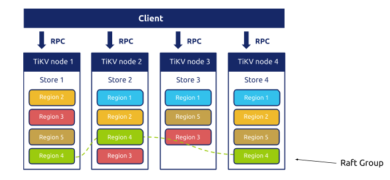

很久没有写文章了，正好今天有一些闲暇的时间，写写最近的一些 Update。关注 TiDB 的同学，最近可能注意到 TiKV 这边合并了一个不大不小的 PR [#5051](https://github.com/tikv/tikv/pull/5051) ，支持了一个特性叫做 Follower Read，看到这个功能被合并进主干我确实有点百感交集，还发了条朋友圈庆祝，因为我实在很喜欢这个特性，可能有同学不太理解，今天就写一写和这个 PR 相关的一些事情。

大家知道，TiDB 的存储层 TiKV 使用的是 Multi-Raft 的架构：

数据在 TiKV 内部按照一个个名为 Region 的逻辑概念切分，每一个 Region 是一个独立的 Raft 复制小组，默认状态下是 3 个副本，多个 Region 自动的动态分裂，合并，移动，在整个集群内部尽可能均匀分布。使用 Raft 主要是为了实现高可用（数据冗余），但是对于 Raft 比较熟悉的朋友一定知道标准的 Raft 是一个有 Strong Leader 的，读写流量都会经过 Leader。细心的朋友这个时候可能发现问题了，虽然 TiKV 能够很均匀的将 Region 分散在各个节点上，但是对于每一个 Region 来说，只有 Leader 副本能够对外提供服务，另外两个 Follower 除了时刻同步数据，准备着 Failover 时候投票切换成 Leader 外，并没有干其他的活。

>只有 Region Leader 在干活，其他 Followers 冷眼旁观👆

所以有些时候用户会注意到，对于一些热点数据，可能会将这块数据的 Region Leader 所在的机器的资源打满，虽然此时可以强行 Split，然后移动数据到其他机器上，但是这个操作总是滞后的，另外 Follower 的计算资源没有用上也比较可惜。

**所以优化就很直接了：能不能在 Follower 上也处理客户端的读请求呢，这样不就分担了 Leader 的压力了吗？这个就是 Follower Read 了。**

## ReadIndex

对于熟悉 Raft 的同学来说，沿着这个方向往下想，下一个问题一定就是：如何保证在 Follower 上读到最新的数据呢？如果只是无脑的将 Follower 上最近的 Committed Index 上的数据返回给客户端可以吗？答案是不行的（这里留个悬念，后面会再返回来讨论这个问题），原因显而易见，Raft 是一个 Quorum-based 的算法，一条 log 的写入成功，并不需要所有的 peers 都写入成功，只需要多数派同意就够了，所以有可能某个 Follower 上的本地数据还是老数据，这样一来就破坏线性一致性了。

其实在 trivial 的 Raft 实现中，即使所有的 Workload 都走 Leader，也仍然在一些极端场景下会出现上面提到的问题。举个例子，当出现网络隔离，原来的 Leader 被隔离在了少数派这边，多数派那边选举出了新的 Leader，但是老的 Leader 并没有感知，在任期内他可能会给客户端返回老的数据。

但是对于每次读请求都走一次 Quorum Read 虽然能解决问题，但是有点太重了，能不能做得更高效点？根本问题其实就在于老的 Leader 不确定自己是不是最新的 Leader，所以优化也很直接，只要想办法让 Leader 在处理读请求时确认自己是 Leader 就好了，这个就是所谓的 ReadIndex 算法。简单来说，就是在处理读请求的时候记录当前 Leader 的最新 Commit index，然后通过一次给 Quorum 的心跳确保自己仍然是 Leader，确认后返回这条记录就好，这样就能保证不破坏线性一致性。尽管 ReadIndex 仍然需要进行一次多数派的网络通信，但是这些通信只是传输元信息，能极大减少网络 IO，进而提升吞吐。

**在 TiKV 这边比标准的 ReadIndex 更进一步，实现了 LeaseRead。其实 LeaseRead 的思想也很好理解，只需要保证 Leader 的租约比重选新的 Leader 的 Election Timeout 短就行，这里就不展开了。**

## Follower Read

说到今天的主角，Follower Read，如何保证 Follower 上读到最新的数据呢？最土的办法就是将请求转发给 Leader，然后 Leader 返回最新的 Committed 的数据就好了嘛，Follower 当做 Proxy 来用。这个思路没有任何问题，而且实现起来也很简单还安全。但是，很明显这个地方可以优化成：Leader 只要告诉 Follower 当前最新的 Commit Index 就够了，因为无论如何，即使这个 Follower 本地没有这条日志，最终这条日志迟早都会在本地 Apply。

**TiDB 目前的 Follower Read 正是如此实现的，当客户端对一个 Follower 发起读请求的时候，这个 Follower 会请求此时 Leader 的 Commit Index，拿到 Leader 的最新的 Commit Index 后，等本地 Apply 到 Leader 最新的 Commit Index 后，然后将这条数据返回给客户端，非常简洁。**

但是这个方案可能会引入两个问题：

1. 因为 TiKV 的异步 Apply 机制，可能会出现一个比较诡异的情况：破坏线性一致性，本质原因是由于 Leader 虽然告诉了 Follower 最新的 Commit Index，但是 Leader 对这条 Log 的 Apply 是异步进行的，在 Follower 那边可能在 Leader Apply 前已经将这条记录 Apply 了，这样在 Follower 上就能读到这条记录，但是在 Leader 上可能过一会才能读取到。
2. 这种 Follower Read 的实现方式仍然会有一次到 Leader 请求 Commit Index 的 RPC，所以目前的 Follower read 实现在降低延迟上不会有太多的效果。

对于第一点，虽然确实不满足线性一致性了，但是好在是永远返回最新的数据，另外我们也证明了这种情况并不会破坏我们的事务隔离级别（Snapshot Isolation），证明的过程在这里就不展开了，有兴趣的读者可以自己想想。

对于第二个问题，虽然对于延迟来说，不会有太多的提升，但是对于提升读的吞吐，减轻 Leader 的负担还是很有帮助的。总体来说是一个很好的优化。

## 未来？

如果只是一个简单的性能优化的话，我其实也没有太多兴趣单独为它写一个 Blog，虽然简单，但是 Follower Read 确实是一个对未来很重要的功能。

我们经常被问到的一个问题是：如果我在一个表上跑一个大查询，会不会影响正在进行的 OLTP 事务？虽然我们在 TiKV 里面内置了一个 IO 优先级队列，会优先处理重要的 OLTP 请求，但是仍然还是消耗了 Leader 所在机器的资源，甚至更极端一点的例子，有一个热点小表，读远大于写，尽管对于热数据来说，肯定 Cache 在内存里面了，但是在一些极端热的情况下仍然会出现 CPU 瓶颈，网络 IO 瓶颈。

熟悉 TiDB 架构的朋友一定知道，从一开始调度模块 PD 就是一个独立的组件，目前的调度还仅限于 Region 的分裂、合并、移动，Leader transfer 之类，但是能做的肯定不止于此，**TiDB 很快就会做的事情是，针对不同热度的数据，动态采用不同的副本策略。举个例子，如果发现一张小表巨热，PD 可以快速让 TiKV 对这块数据动态创建多个只读副本（大于 3），通过 Follower Read 来分摊 Leader 的压力，当压力下来后，再销毁这些副本，因为 TiKV 中每个 Region 足够小（默认 96MB） 所以 TiDB 做这个事情的时候可以非常灵活和轻量，这个功能和 Kubernetes 结合在云端上能非常有想象力**。

**另外一个很重要的功能也需要 Follower Read 作为基础，就是 Geo-Replication 后的 Local Read**。现在 TiDB 即使跨数据中心部署，虽然 TiDB 会将副本分散在各个数据中心，但是对于每块数据仍然是 Leader 提供服务，这就意味着，业务需要尽可能的接近 Leader，所以我们经常会推荐用户将应用程序部署在一个数据中心，然后告诉 PD 将 Leaders 都集中在这个数据中心以加速读写请求，Raft 只用来做跨数据中心高可用。 

但是对于部分的读请求，如果能就近读，总是能极大的降低延迟，提升吞吐。但是细心的朋友肯定能注意到，目前这个 Follower Read 对于降低延迟来说，并不明显，因为仍然要去 Leader 那边通信一下。不过仍然是有办法的，还记得上面留给大家的悬念嘛？能不能不问 Leader 就返回本地的 committed log？其实有些情况下是可以的。**大家知道 TiDB 是基于 MVCC 的，每条记录都会一个全局唯一单调递增的版本号，下一步 Follower Read 会和数据本身的 MVCC 结合起来，如果客户端这边发起的事务的版本号，本地最新的提交日志中的数据的版本大于这个版本，那么其实是可以安全的直接返回，不会破坏 ACID 的语义。另外对于一些对一致性要求不高的场景，未来直接支持低隔离级别的读，也未尝不可。到那时候，TiDB 的跨数据中心的性能将会又有一个飞跃。**

所以，Follower Read 是让上面这些吸引人的特性变为现实的第一步，我们仍然秉承着先做稳再做快的原则，一步步来，有兴趣的朋友自己也可以测试起来，也希望更多小伙伴能参与相关特性的贡献。