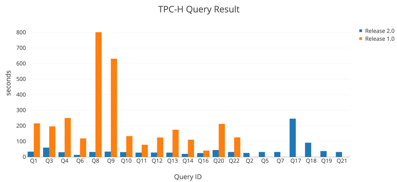
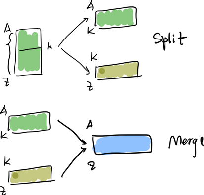
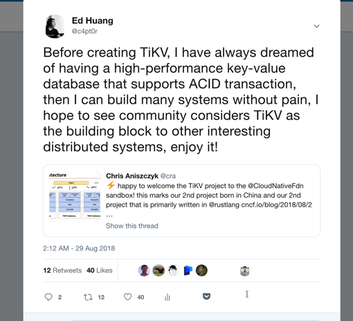
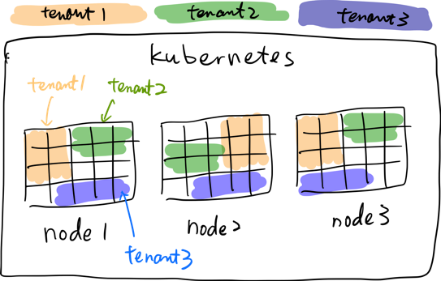
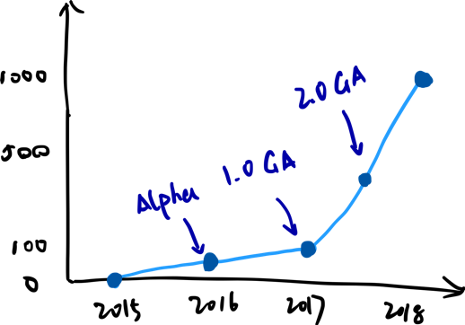
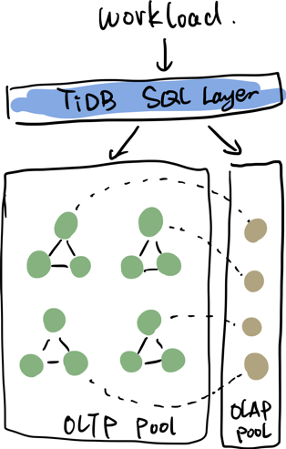
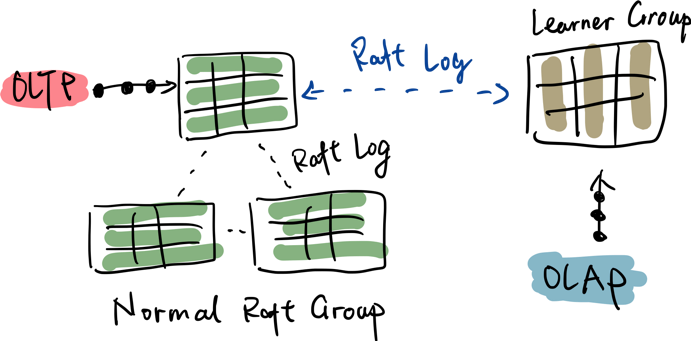
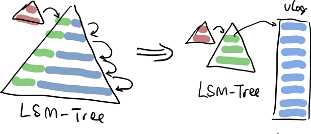

**2018 年对于 TiDB 和 PingCAP 来说是一个由少年向成年的转换的一年，如果用一个关键字来概括就是「蜕变」**。在这一年很欣喜的看到 TiDB 和 TiKV 在越来越多的用户使用在了越来越广泛的场景中，作为一个刚刚 3 岁多的开源项目，没有背后强大的社区的话，是没有办法取得这样的进展的。
同时在技术上，2018 年我觉得也交出了一份令人满意的答卷，TiDB 的几个主要项目今年一共合并了 4380 个提交，这几天在整理 2018 年的 Change Log 时候，对比了一下年初的版本，这 4380 个 Commits 背后代表了什么，这里简单写一个文章总结一下。

回想起来，TiDB 是最早定位为 HTAP 的通用分布式数据库之一，如果熟悉我们的老朋友一定知道，我们最早时候一直都是定位 NewSQL，当然现在也是。但是 NewSQL 这个词有个问题，到底 New 在哪，解决了哪些问题，很难一目了然，其实一开始我们就想解决一个 MySQL 分库分表的问题，但是后来慢慢随着我们的用户越来越多，使用的场景也越来越清晰，很多用户的场景已经开始超出了一个「更大的 MySQL 」的使用范围，于是我们从实验室和学术界找到了我们觉得更加清晰的定义：HTAP，希望能构建一个融合 OLTP 和 OLAP 通用型分布式数据库。但是要达成这个目标非常复杂，我们的判断是如果不是从最底层重新设计，很难达到我们的目标，**我们认为这是一条更困难但是正确的路，现在看来，这条路是走对了，而且未来会越走越快，越走越稳。**

在 SQL 层这边，TiDB 选择了 MySQL 的协议兼容，一方面持续的加强语法兼容性，另一方面选择自研优化器和执行器，带来的好处就是没有任何历史负担持续优化。回顾今年最大的一个工作应该是重构了执行器框架，TiDB的 SQL 层还是经典的 Volcano 模型，我们引入了新的内存数据结构 Chunk 来批量处理多行数据，并对各个算子都实现了基于 Chunk 的迭代器接口，这个改进对于 OLAP 请求的改进非常明显，在 TiDB 的 TPC-H 测试集上能看出来（[TiDB TPC-H 50G 性能测试报告](https://github.com/pingcap/docs-cn/blob/master/v2.1/benchmark/tpch-v2.md)），Chunk 的引入为我们全面的向量化执行和 CodeGen 支持打下了基础。目前在 TiKV 内部对于下推算子的执行还没有使用 Chunk 改造，不过这个已经在计划中，在 TiKV 中这个改进，预期对查询性能的提升也将非常显著。

另一方面，一个数据库查询引擎最核心的组件之一：优化器，在今年也有长足的进步。我们在 2017 年就已经全面引入了基于代价的 SQL 优化（CBO，Cost-Based Optimization），我们在今年改进了我们的代价评估模型，加入了一些新的优化规则，同时实现了 Join Re-Order 等一系列优化，从结果上来看，目前在 TPC-H 的测试集上，对于所有 Query，TiDB 的 SQL 优化器大多已给出了最优的执行计划。CBO 的另一个关键模块是统计信息收集，在今年，我们引入了自动的统计信息收集算法，使优化器的适应性更强。另外针对 OLTP 的场景 TiDB 仍然保留了轻量的 RBO 甚至直接 Bypass 优化器，以提升 OLTP 性能。另外，感谢三星韩国研究院的几位工程师的贡献，他们给 TiDB 引入了 Query Plan Cache，对高并发场景下查询性能的提升也很明显。另外在功能上，我们引入了 Partition Table 的支持，对于一些 Partition 特性很明显的业务，TiDB 能够更加高效的调度数据的写入读取和更新。

一直以来，TiDB 的 SQL 层作为纯 Go 语言实现的最完备的 MySQL 语法兼容层，很多第三方的 MySQL 工具在使用着 TiDB 的 SQL Parser，其中的优秀代表比如 [**小米的 Soar**](https://www.pingcap.com/cases-cn/user-case-xiaomi/)（[https://github.com/XiaoMi/soar](https://github.com/XiaoMi/soar)）。为了方便第三方更好的复用 TiDB Parser，我们在 2018 年将 Parser 从主项目中剥离了出来，成为了一个独立的项目：pingcap/parser，希望能帮到更多的人。

说到 TiDB 的底层存储 TiKV 今年也有很多让人眼前一亮的更新。在 TiKV 的基石——一致性算法 Raft 这边，大家知道 TiKV 采用的是 Multi-Raft 的架构，内部通过无数个 Raft Group 动态的分裂、合并、移动以达到动态伸缩和动态负载均衡。我们在今年仍然持续在扩展 Multi-Raft 的边界，我们今年加入了动态的 Raft Group 合并，以减轻元信息存储和心跳通信的负担；给 Raft 扩展了 Learner 角色（只同步 Log 不投票的角色） 为 OLAP Read 打下基础；给 Raft 的基础算法加入了 Pre-Vote 的阶段，让整个系统在异常网络状态下可靠性更高。

Raft Group Merge

在性能方面，我们花了很大的精力重构了我们单机上多 Raft Group 的线程模型（[https://github.com/tikv/tikv/pull/3568](https://github.com/tikv/tikv/pull/3568)）， 虽然还没有合并到 master 分支，在我们测试中，这个优化带来了两倍以上的吞吐提升，同时写入延迟降低至现在的版本的 1/2 ，预计在这两周我们会完成这个巨大的 PR 的 Code Review，各位同学可以期待一下 :)

第三件事情是我们开始将 TiKV 的本地存储引擎的接口彻底抽象出来，目标是能做到对 RocksDB 的弱耦合，这点的意义很大，不管是社区还是我们自己，对新的单机存储引擎支持将变得更加方便。

**在 TiKV 社区这边，今年的另外一件大事是加入了 CNCF，变成了 CNCF 的托管项目，也是 CNCF 基金会第一个非结构化数据库项目。** 后来很多朋友问我，为什么捐赠的是 TiKV 而不是 TiDB，其实主要的原因就像我在当天的一条 Tweet 说的，TiKV 更像是的一个更加通用的组件，当你有一个可以弹性伸缩的，支持跨行 ACID 事务的 Key-Value 数据库时，你会发现构建其他很多可靠的分布式系统会容易很多，这在我们之后的 [TiDB Hackathon](https://mp.weixin.qq.com/s/mKygN5EQoaaeFMDIFeAzsw)
中得到了很好的体现。另外社区已经开始出现基于 TiKV 构建的 Redis 协议支持，以及分布式队列系统，例如 [meitu/titan](https://mp.weixin.qq.com/s/2tyAtcmKUU2L1yoE_V3SsA) 项目。作为一个基金会项目，社区不仅仅可以直接使用，更能够将它作为构建其他系统的基石，我觉得更加有意义。类似的，今年我们将我们的 Raft 实现从主项目中独立了出来（pingcap/raft-rs），也是希望更多的人能从中受益。

>*“……其 KV与 SQL分层的方式，刚好符合我们提供 NoSQL 存储和关系型存储的需求，另外，PingCAP 的文档齐全，社区活跃，也已经在实际应用场景有大规模的应用，公司在北京，技术交流也非常方便，事实证明，后面提到的这几个优势都是对的……”*
>
>*——美图公司 Titan 项目负责人任勇全对 TiKV 的评论*

在 TiDB 的设计之初，我们坚定将调度和元信息从存储层剥离出来（PD），现在看来，好处正渐渐开始显示出来。今年在 PD 上我们花了很大精力在处理热点探测和快速热点调度，调度和存储分离的架构让我们不管是在开发，测试还是上线新的调度策略时效率很高。瞬时热点一直是分布式存储的最大敌人，如何快速发现和处理，我们也有计划尝试将机器学习引入 PD 的调度中，这是 2019 会尝试的一个事情。总体来说，这个是一个长期的课题。

我在几个月前的一篇文章提到过 TiDB 为什么从 Day-1 起就 All-in Kubernetes （《[十问 TiDB：关于架构设计的一些思考](https://pingcap.com/blog-cn/10-questions-tidb-structure/)》），今年很欣喜的看到，Kubernetes 及其周边生态已经渐渐成熟，已经开始有很多公司用 Kubernetes 来运行 Mission-critical 的系统，这也佐证了我们当年的判断。2018 年下半年，我们也开源了我们的 [TiDB Operator](https://pingcap.com/blog-cn/tidb-operator-introduction/)（[https://github.com/pingcap/tidb-operator](https://github.com/pingcap/tidb-operator)），这个项目并不止是一个简单的在 K8s 上自动化运维 TiDB 的工具，在我们的战略里面，是作为 Cloud TiDB 的重要基座，过去设计一个完善的多租户系统是一件非常困难的事情，同时调度对象是数据库这种带状态服务，更是难上加难，TiDB-Operator 的开源也是希望能够借助社区的力量，一起将它做好。

多租户 TiDB

今年还做了一件很大的事情，我们成立了一个新的部门 TEP（TiDB Enterprise Platform）专注于商业化组件及相关的交付质量控制。作为一个企业级的分布式数据库，TiDB 今年完成了商业化从0到1的跨越，越来越多的付费客户证明 TiDB 的核心的成熟度已经可以委以重任，成立 TEP 小组也是希望在企业级产品方向上继续发力。从 [TiDB-Lightning](https://pingcap.com/blog-cn/tidb-ecosystem-tools-2/)（MySQL 到 TiDB 高速离线数据导入工具）到 [TiDB-DM](https://pingcap.com/blog-cn/tidb-ecosystem-tools-3/)（TiDB-DataMigration，端到端的数据迁移-同步工具）能看到发力的重点在让用户无缝的从上游迁移到 TiDB 上。另一方面，[TiDB-Binlog](https://pingcap.com/blog-cn/tidb-ecosystem-tools-1/) 虽然不是今年的新东西，但是今年这一年在无数个社区用户的场景中锻炼，越来越稳定。做工具可能在很多人看来并不是那么「高科技」， 很多时候也确实是脏活累活，但是这些经过无数用户场景打磨的周边工具和生态才是一个成熟的基础软件的护城河和竞争壁垒，在 PingCAP 内部，负责工具和外围系统研发的团队规模几乎和内核团队是 1:1 的配比，重要性可见一斑。

在使用场景上，TiDB 的使用规模也越来越大，下面这张图是我们统计的我们已知 TiDB 的用户，包括上线和准上线的用户，**从 1.0 GA 后，几乎是以一个指数函数的曲线在增长，应用的场景也从简单的 MySQL Sharding 替代方案变成横跨 OLTP 到实时数据中台的通用数据平台组件。**

TiDB 的用户数统计

今年几个比较典型的 [用户案例](https://pingcap.com/cases-cn/)，从 [美团](https://pingcap.com/cases-cn/user-case-meituan/) 的横跨 OLTP 和实时数仓的深度实践，到 [转转](https://pingcap.com/cases-cn/user-case-zhuanzhuan/) 的 All-in TiDB 的体验，再到 TiDB 支撑的北京银行的核心交易系统。可以看到，这些案例从互联网公司的离线线数据存储到要求极端 SLA 的传统银行核心交易系统，TiDB 在这些场景里面都发光发热，甚至有互联网公司（转转）都喊出了 All-in TiDB 的口号，我们非常珍视这份信任，一定尽全力做出漂亮的产品，高质量的服务好我们的用户和客户。另一方面，TiDB 也慢慢开始产生国际影响力的，在线视频巨头葫芦软件（Hulu.com），印度最大的在线票务网站 BookMyShow，东南亚最大的电商之一 [Shopee](https://pingcap.com/cases-cn/user-case-shopee/) 等等都在大规模的使用 TiDB，在北美和欧洲也已经不少准上线和测试中的的巨头互联网公司。

**简单回顾了一下过去的 2018 年，我们看看未来在哪里。**

其实从我们在 2018 年做的几个比较大的技术决策就能看到，2019 年将是上面几个方向的延续。大的方向的几个指导思想是：

1. **Predicable.** （靠谱，在更广泛的场景中，做到行为可预测。）

2. **Make it right before making it fast.**（稳定，先做稳，再做快。）

3. **Ease of use.** （好用，简单交给用户，复杂留给自己。）

对于真正的 HTAP 场景来说，最大的挑战的是如何很好的做不同类型的 workload 隔离和数据结构根据访问特性自适应。我们在这个问题上给出了自己的答案：通过拓展 Raft 的算法，将不同的副本存储成异构的数据结构以适应不同类型的查询。

这个方法有以下好处：

1. 本身在 Multi-Raft 的层面上修改，不会出现由数据传输组件造成的瓶颈（类似 Kafka 或者 DTS），因为 Multi-Raft 本身就是可扩展的，数据同步的单位从 binlog，变成 Raft log，这个效率会更高，进一步降低了同步的延迟。

2. 更好的资源隔离，通过 PD 的调度，可以真正将不同的副本调度到隔离的物理机器上，真正做到互不影响。

TiDB 2019 年会变成这个样子

Learner 在 HTAP 中的应用

在执行器方面，我们会继续推进向量化，不出意外的话，今年会完成所有算子的全路径的向量化执行。

这个 HTAP 方案的另一个关键是存储引擎本身。2019 年，我们会引入新的存储引擎，当然第一阶段仍然会继续在 RocksDB 上改进，改进的目标仍然是减小 LSM-Tree 本身的写放大问题。选用的模型是 [WiscKey（FAST16）](https://www.usenix.org/system/files/conference/fast16/fast16-papers-lu.pdf)，WiscKey 的核心思想是将 Value 从 LSM-Tree 中剥离出来，以减少写放大，如果关注 TiKV 的朋友，已经能注意到我们已经在前几天将一个**新存储引擎 Titan**（PingCAP 的 Titan，很遗憾和美图那个项目重名了）合并到了 TiKV 的主干分支，这个 Titan 是我们在 RocksDB 上的 WiscKey 模型的一个实现，除了 WiscKey 的核心本身，我们还加入了对小 KV 的 inline 等优化，Titan 在我们的内部测试中效果很好，对长度随机的 key-value 写入的吞吐基本能达到原生 RocksDB 的 2 - 3 倍，当然性能提升并不是我最关注的，这个引擎对于 TiDB 最大的意义就是，这个引擎将让 TiDB 适应性更强，做到更加稳定，更加「可预测」。

TiKV 新的本地存储引擎 Titan

在 Titan 走向稳定的同时，我们也在调研从头构建一个更适合 TiDB 的 OLTP workload 的存储引擎，前面说到 2018 年做了抽象 TiKV 的本地存储引擎的事情就是为了这个打基础，当然我们仍然会走 LSM-Tree 的路线。这里多提一句，其实很多人都误解了 LSM-Tree 模型的真正优势，在我看来并不是性能，而是：做到可接受的性能的同时，LSM-Tree 的实现非常简单可维护，只有简单的东西才可以依赖，这个决定和我们在 Raft 与 Paxos 之间的选择偏好也是一致的。另外 LSM-Tree 的设计从宏观上来说，更加符合「冷热分层」以适配异构存储介质的想法，这个我相信是未来在存储硬件上的大趋势。

**至于在 OLAP 的存储引擎这边，我们走的就是纯列式存储的路线了，但是会和传统的 Columnar 数据结构的设计不太一样，这块的进展，我们会在 1 月 19 号的 [TiDB DevCon](https://pingcap.com/community/devcon2019/) 上首秀，这里先卖个关子。**

另一个大的方向是事务模型，目前来说，TiDB 从诞生起，事务模型就没有改变过，走的是传统的 Percolator 的 2PC。这个模型的好处是简单，吞吐也不是瓶颈，但是一个比较大的问题是延迟，尤其在跨数据中心的场景中，这里的延迟主要表现在往 TSO 拿时间戳的网络 roundtrip 上，当然了，我目前仍然认为时钟（TSO）是一个必不可少组件，在不降低一致性和隔离级别的大前提下也是目前我们的最好选择，另外 Percolator 的模型也不是没有办法对延迟进行优化，我们其实在 2018 年，针对 Percolator 本身做了一些理论上的改进，减少了几次网络的 roundtrip，也在年中书写了新的 2PC 改进的 [完整的 TLA+ 的证明](https://github.com/pingcap/tla-plus/blob/master/OptimizedCommitTS/OptimizedCommitTS.tla)，证明了这个新算法的正确性，2019 年在这块还会有比较多的改进，其实我们一直在思考，怎么样能够做得更好，选择合适的时机做合适的优化。另外一方面，在事务模型这方面，2PC 在理论和工程上还有很多可以改进的空间，但是现在的当务之急继续的优化代码结构和整体的稳定性，这部分的工作在未来一段时间还是会专注在理论和证明上。另外一点大家可以期待的是，2019 年我们会引入安全的 Follower/Learner Read，这对保持一致性的前提下读的吞吐会提升，另外在跨数据中心的场景，读的延迟会更小。

差不多就这些吧，最后放一句我特别喜欢的丘吉尔的一句名言作为结尾。

Success is not final, failure is not fatal: it is the courage to continue that counts.

成功不是终点，失败也并非终结，最重要的是继续前进的勇气。

