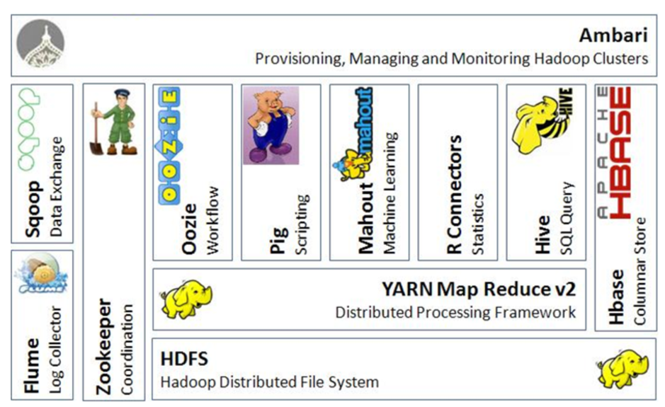

作为一个从大数据转行做数据库的人，我自以为能感受到两个世界的异同。在这里，斗胆聊下这个话题，以及对未来的看法。

## 大数据兴起

从 70 年代关系型数据库进入历史舞台，很长一段时间它几乎是包打天下的选择。你很可能可以用一套数据库玩转所有业务，你也不需要一个连的工程师来维护她。哪怕你也许业务复杂，需要不同的数据库，但她们终究是还是数据库，温柔体贴。

这个黄金时代整整延续了 20 多年。

上世纪 90 年代人们开始讨论「Big Data」。SGI 首席科学家 John Mashey 在一个名为「[Big Data… and the Next Wave of Infrastress](https://static.usenix.org/event/usenix99/invited_talks/mashey.pdf)」让这个词汇变得流行。那个时候，人们讨论着硬盘容量和网络带宽，在未来数据爆炸的阴影下瑟瑟发抖。那个时候，互联网公司是第一批真正尝试解决大数据问题的先行者。有别传统的运营方式让它们率先面对了大数据时代[著名的 3V 问题](https://blogs.gartner.com/doug-laney/files/2012/01/ad949-3D-Data-Management-Controlling-Data-Volume-Velocity-and-Variety.pdf)（By Gartner）。

* 容量（Volumn）：爆炸性的交易量带来爆炸性的数据容量。

* 速度（Velocity）：和在这个规模下仍提供高速的数据应用。

* 多样性（Variety）: 以及为了支持业务变更和复杂性所造成的数据多样性。

与传统公司不同，互联网公司的数据单位价值偏低，但数据量极其庞大。而且它们并不一定是结构化的，并非完全能用 SQL 来处理。简而言之，它们已经超出了当时数据库的能力边界。而当时的互联网公司巨头们如 Google 和 Amazon，纷纷选择抛弃了传统手段，重起炉灶，由此拉开了「大数据」时代的大幕。

有兴趣的童鞋，可以翻翻下面的论文：

* [The Google File System](https://static.googleusercontent.com/media/research.google.com/en//archive/gfs-sosp2003.pdf) - 2003

* [MapReduce: Simplified Data Processing on Large Clusters](https://static.googleusercontent.com/media/research.google.com/en//archive/mapreduce-osdi04.pdf) - 2004

* [Bigtable: A Distributed Storage System for Structured Data](https://static.googleusercontent.com/media/research.google.com/en//archive/bigtable-osdi06.pdf) - 2006

* [Dynamo: Amazon’s Highly Available Key-value Store](https://www.allthingsdistributed.com/files/amazon-dynamo-sosp2007.pdf) - 2007

也许你并不了解 GFS，Google 内的 MapReduce 或者 BigTable 具体是什么样子的。不过相信既然你看到了这里，你一定听说过 Apache Hadoop 和 NoSQL。Hadoop 加上属于 NoSQL 的 HBase，就是以上面 Google 的几篇论文为基础开发而成的。这是一个真正现象级的开源通用大规模分布式数据存储和处理套件。它的影响力是巨大的，稍具规模的互联网公司就不得不用，稍有经验的从业者就可以领取不菲的薪水，人人都以能向其提交一个补丁为荣，更不用提一个实打实的 Committer，你都可以从他脑后看到光环。不管现在多少人宣称 Hadoop 已死，XXX 是真理，但是以 Hadoop + NoSQL 为基础，所谓大数据基础架构所带来的想法变迁，一直延续到了今天，且并没有太大变化：

* 选用白菜价的硬件组成集群，突出 Scale Out 而非 Scale Up。

* 极度简化和粗暴的计算模型。

* 几乎不经整理的存储格式，在多种引擎之间共享，所谓数据湖。

* 忽略 / 弱化一致性，抛弃关系模型，简化甚至无视事务，所谓 NoSQL。

你可以说这是开源社区的威力，但追根究底还是 Google，Amazon 这些先行者卓有远见的工作为大家铺平了道路。不过，有些反直觉的是：这些引用数几千几万的论文其实并没有提出巧夺天工的设计；相反，它们本质上是告诉了业界，把数据库换成设计如此粗糙狂野的架构，仍然可以解决问题：就算你没钱买超高端的软硬件，只要你放宽心，告诉自己，无视一致性，忘掉精巧的优化执行器和存储结构，忽略半结构化带来的混乱，干掉 SQL 语言，多雇几个码农，你仍然活的下去，而且可以活的还不错。

这些到底为我们带来了什么？且看曾经非常著名的 Sort Benchmark。

* 2004 年，NEC Express 5800 / 1320 Xd 单机，价格可能介于 200-600 万 USD 之间，1 分钟排序 34G。

* 2006 年，Fujitsu PrimeQuest 480 单机，2 年将结果推高 6G，1 分钟排序 40G 数据；机器价格不可考。

* 2007 年，麻省理工林肯国防实验室，Bradley C. Kuszmaul 使用 TX-2500 磁盘集群（550 万 + USD），440 节点用 Infiband 串联，使用了自制系统（文件系统，通信模块），在经历了无数硬件软件故障之后，一分钟内排序了 214GB 数据；该试验相比之前的超豪华服务器，已经开始使用「便宜硬件」，但是使用自制软件系统。

* 2009年，Yahoo! 使用 Hadoop 以近似的总价（500 万 USD，以单价反推）但近 1/3 的单价串联了 1400 个白菜价节点集群，得到了一倍多的速度，排序了 500G。而这里 1400 的节点数是为了凑整 500G / 1 分钟，而非只能这么多或者必须这么多。

请允许我用一句诗来总结它的意义：「旧时王谢堂前燕，飞入寻常百姓家」。

## 王之蔑视

与业界的欢腾不同，当时数据库研究者圈子对此的反应已经不是嗤之以鼻，而是痛心疾首了。这有点像，老师傅练了一辈子武艺，你突然告诉他，打架只要抡大锤就行了。

[MapReduce: A major step backwards](https://homes.cs.washington.edu/~billhowe/mapreduce_a_major_step_backwards.html) by David DeWitt & Michael Stonebraker

上面这篇文章是 DeWitt 和 Stonebraker 大神合写的对 MapReduce 的批评。这两尊是真神，DeWitt 是美国工程院院士，微软 Jim Gray 实验室老大，而石破天，则是图灵奖获得者。在他们看来，这破玩意抛弃了数据库所有美好的特点，实现也丑陋，还接不上数据库工具，简直臭不可闻。文末，老人家们「酸酸」地说，我们很高兴看到社区对这些技术感兴趣，但是也别把我们几十年的研究成果当 X 啊。

两位的评论，哪怕延伸到整个大数据生态，就算放到时隔多年的今天，也还是套的上去。但这套糙快猛的理念催生的技术栈，已经无需赘述获得了多大的成功。哪怕是数据库圈内的人，也时有抱怨：老一辈的人有时候不够 Open-Minded。所以，他们说错了么？

也许他们对业界面临的困扰不够感同身受，也许他们不够有包容心。不过，他们对技术的判断着实是精准到位的。

事实上，没过多久，人们在大数据体系中引入了 SQL、MPP 引擎、列存，加入了向量化、JIT，实现了 CBO。对于数据库圈外的童鞋们，有时你看社区兴高采烈地宣称，他们实现了多么神奇的技术，仿佛普罗米修斯从天上带来了火种，其实他们只是从十几甚至几十年前的故纸堆中汲取了养分。

是大数据社区的人无知无能因此重新「发明」数据库界玩烂的技术么？不，只是因为业界等不了数据库圈子慢慢悠悠匠心打磨：没有合适的工具，他们每分每秒都在损失 $。且不说大规模分布式交易型数据库一直是老大难，就算脱开交易型场景不谈，分布式的分析型数据库早已有之，却也因为包袱沉重，还没来得及跟上时代的步伐，就被大数据的浪头打的狼狈不堪。Pivotal 先是由 Greenplum 折腾了对接 Hadoop 的 HAWQ ，继而被迫双双开源；就连 Teradata 这样的巨擘也不得不支持 Hadoop。

只是，一旦社区步入小康，虽是野蛮生长的生态，也还是阻挡不了人们追求小资生活的决心：用户希望友好、快速、高效、稳定的数据存储和处理手段，这是亘古不变的需求。而这些，恰恰是数据库领域多年积累所在。

摘自 pramodgampa.blogspot.com

现今的大数据生态，如同哥斯拉，强大而难以驯服。不管什么场景，似乎都经不起它尾巴一扫。但若说干净灵巧地解决问题，却是难如登天。毕竟狂野粗放基因的产物，不管如何演化，都很难优雅起来。对数据湖而言，开放形态加上公共存储格式，能轻易串联多种引擎，但也几乎抹杀了精细整理数据的可能；而混沌的存储体系和不受控的数据入口，也限制了整个体系可以伸展腾挪的空间。对 NoSQL 而言，孱弱或者干脆不存在的事务，所谓最终一致性，小儿科的 SQL 支持，也都成为人们诟病的理由。而整个圈子野蛮生长的开放体系，在得到巨大动能的同时，也使得用户体验几乎不可能良好。这些种种，使得大数据生态很大程度上都只服务于工程师，而你需要一大票专家才能真的驯服大数据平台。从这个角度看，MapR 变卖家当给 HP，Hortonworks 被收购，Cloudera 巨亏股价狂泻，都是必然的：大数据生态基本不可能做成类似 Oracle 这样的标准件生意。

也许，更偏向于数据库形态的方案，才是更友善的方案；也许，随着技术的成熟，我们还有机会回到黄金时代。

## 回归数据库

随着时间的推进，Google 这样的巨人自己也忍受不了自己创造的怪物，又开始了新的探索：哪怕是 Google 这样聪明脑袋汇聚的地方，也不想总是需要自己花心思处理一致性，或者用繁琐的代码实现 SQL 逻辑。

[Spanner: Google’s Globally-Distributed Database](https://static.googleusercontent.com/media/research.google.com/en//archive/spanner-osdi2012.pdf) - 2012

Spanner 是一个能像 NoSQL 一样延展（甚至横跨多个大陆），但却支持传统数据库事务的分布式交易型数据库。它创造性地用原子钟解决了以往分布式事务一致性需要依赖中心节点，因而无法大规模扩展的问题。这算是拉开了所谓 NewSQL 的大幕。这启发了很多项目，比如小强，比如我们的 TiDB。她们拥有对业务透明的 Sharding 设计和分布式事务，良好的可扩容性，又兼顾了一致性，这让分布式体系很大程度上拥有单机数据库近似的用户体验。不过有意思的是，哪怕论文最创新的点是基于原子钟的分布式事务，但是对很多人来说，它更大的意义仍然是：证明给一个类似 NoSQL 架构加上传统数据库特性，用来做传统数据库业务，是可行的（当然共识算法 Paxos / Raft 的应用也很重要）。天知道这背后经历了多少试错，这就是先行者的伟大。

至此，业界也许可以说解决了整个体系中最难啃的问题：分布式交易型数据库。而随着技术不断成熟，人们也逐渐开始接受这个新鲜事物：光就 TiDB 而言，从第一个用户拿来做并不那么 TP 的边缘业务，到现在登上银行核心系统。也许你在刷二维码付费的时候，背后支撑你这笔交易的数据库就是 TiDB。

对我们来说，现有的 Multi-Raft 体系，提供了可自由伸缩，对用户透明的分片体系，以及可均衡的并行复制机制。以这些为基础，通过 Raft Learner 将数据从 TP 行存到 AP 列存进行异步异构复制但提供一致性读取，我们得以整合了 TP 和 ODS 层，而且互相之间不影响，这就是今年我们折腾的 TiFlash。希望明年能尝试进一步同样通过 Raft 协议将列存引擎延伸到传统的数仓业务，而统一更多场景。很多人不相信最终数据库能做到一站式服务（Silver Bullet），能简化到一个产品，去除平台间数据的迁移。毕竟，有些设计的取舍很难兼顾。我个人的看法是，也许，但通过小心的设计，我们现在已经可以做到将不同的引擎无缝地整合到一个产品中。毕竟，经过这十多年的大数据浪潮，哪怕浪不再那么高，社区终究沉淀下了宝贵的财富，前人设计的得失也好，强大的开源引擎如 Spark 也好（Spark 已经慢慢脱离野蛮生态直通云霄了），甚至更多有经验的小伙伴也好，这都成为我们能借力的抓手，让我们能有勇气挑战似乎不切实际的目标：让用户从大数据生态复杂的技术栈解放出来，让数据平台收敛到单一一个产品，因为这才是数据处理应有的模样，哪怕这是一条很长很长的路。
