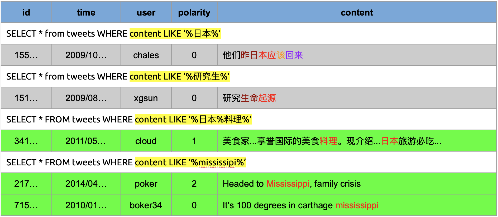
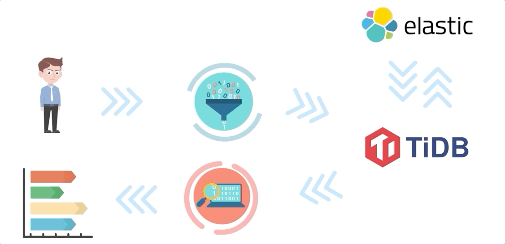

> 作者介绍：孙晓光，知乎技术平台负责人，与薛宁（@Inke）、黄梦龙（@PingCAP）、冯博（@知乎）组队参加了 TiDB Hackathon 2019，他们的项目 TiSearch 获得了 CTO 特别奖。

“搜索”是大家在使用各种 APP 中非常重要的一个行为，例如对于知乎这样以海量优质内容为特色的产品来说，借助搜索帮助用户准确、快速地触达想要寻找的内容更是至关重要。而“全文检索”则是隐藏在简单的搜索框背后不可或缺的一项基本能力。

当前我们正逐步将越来越多的业务数据向 TiDB 迁移，目前在 TiDB 上我们只能使用 SQL Like 对内容进行简单的检索。但即便不考虑性能问题， SQL Like 仍然无法实现一些在搜索场景下常见的信息检索需求，例如下图所示的几种场景，单纯使用 Like 会导致查询到有歧义的结果或满足搜索条件的结果无法返回。

当前 TiDB 全文检索能力的缺失使得我们依旧需要使用传统的方式将数据同步到搜索引擎，在过程中需要根据业务特点做大量繁琐的数据流水线工作维护业务数据的全文索引。为了减少这样的重复劳动，在今年 TiDB Hackathon 中我们尝试为 TiDB 引入“全文检索”功能，为存储在 TiDB 中的文本数据提供随时随地搜索的能力。以下是最终的效果展示：

## 方案设计

要在短短一天的 Hackathon 时间内让 TiDB 中支持全文检索，难度还是非常大的，于是在最开始的时候，我们就选择了一条非常稳妥的设计方案 - 采用整合 [Elasticsearch](https://www.elastic.co/)（后续简称 ES） 的方式为 TiDB 扩展全文检索能力。

为什么选择 ES？一方面我们可以充分利用 ES 成熟的生态直接获得中文分词和 query 理解能力。另外生态融合所带来的强强联合效应，也符合 TiDB 崇尚社区合作的价值观。

考虑到工作量，对于全文索引的数据同步方案我们没有采用 TiKV [Raft Learner](https://github.com/tikv/tikv/issues/2475) 机制，也没有使用 [TiDB Binlog](https://github.com/pingcap/tidb-binlog) 的方式进行同步，而是采用了最保守的双写机制直接在 TiDB 的写入流程中增加了全文索引更新的流程。

架构如上图所示，TiDB 作为 ES 和 TiKV 之间的桥梁，所有同 ES 的交互操作都嵌入在 TiDB 内部直接完成。

在 TiDB 内部，我们将表额外增加了支持 FULLTEXT 索引的元数据记录，并且在 ES 上面创建了对应的索引和 [Mapping](https://www.elastic.co/cn/blog/found-elasticsearch-mapping-introduction)，对于 FULLTEXT 索引中的每一个文本列，我们都将它添加到 Mapping 中并指定好需要的 [Analyzer](https://www.elastic.co/cn/blog/found-text-analysis-part-1)，这样就可以在索引上对这些文本列进行全文检索了。

在 ES 的索引的帮助下，我们只需要在写入数据或者对数据进行更新的时候在 ES 的索引上进行对应的更新操作，就保持 TiDB 和 ES 数据的同步。而对于查询，现在流程如下：

1. TiDB 解析用户发送的 Query。
2. 如果发现该 Query 带有全文检索的 hint，TiDB 则会将请求发给 ES，使用 ES 索引查询到记录主键。
3. TiDB 拿到所有记录主键之后，在 TiDB 内部获取实际的数据，完成最终的数据读取。
4. TiDB 将结果返回给用户。

## 未来规划

Hackathon 短短的 24 小时，让我们验证了整合 TiDB 和 ES 的可能性，当然，我们不会满足于这套双写的方案。未来我们会参考 [TiFlash](https://medium.com/@PingCAP/delivering-real-time-analytics-and-true-htap-by-combining-columnstore-and-rowstore-1e006d3c3ef5)，基于 Raft Learner 实时将数据变更同步给 ES，将 TiDB 打造成一个真正的能支持实时全文检索的 HTAP 数据库，如下图所示：

使用 Raft Learner，对于写流程：

* TiDB 会直接将数据写给底层的 TiKV。
* TiKV 会通过 Raft 协议将写入数据同步到 ES Learner 节点，通过该 Learner 节点写入到 ES。

对于读流程：

* TiDB 解析到用户发过来的 Query 带有全文检索的 hint。
* TiDB 将请求发给 ES Learner 节点。
* ES Learner 节点首先通过 Raft 协议来确保节点上面有了最新的数据，并且最新的数据已经写入到 ES。
* ES Learner 节点通过 ES 的索引读取到对应的记录主键，返回给 TiDB。
* TiDB 使用记录主键获取到完整的数据，并返回给客户端

可以看到，相比于之前让 TiDB 双写到 ES 和 TiKV 的方案，在写入上面，TiDB 并不需要跟 ES 进行交互，而在读取方面，通过 Raft 协议，TiDB 也能保证从 ES 读取到最新的数据，保证了数据的一致性。

当然，要实现上面的功能，我们也需要更多的帮助，我们希望能够跟社区小伙伴一起，一起完成这个非常酷的特性。

## 写在最后

得益于个人在知乎搜索团队的短暂经历，对搜索的价值和业务接入搜索的工作量有过很直观的感受。在越来越多的数据存在于 TiDB 的时代，随时可以对业务数据的某些字段进行全文检索的价值很大。这个价值不但体现在能够实现以往 SQL 难以做好的一些事情，更大的意义是将全文检索的能力以接近 free 的方式提供给业务方，给用户搭建起一座连接关系型数据库与搜索引擎的桥梁，做到随时写入，随时搜索。如果你也有这方面的想法，欢迎邮件联系我 sunxiaoguang@zhihu.com。
