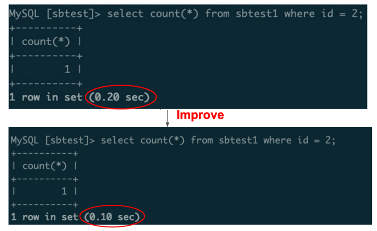
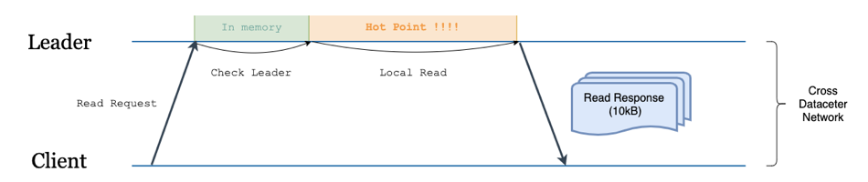
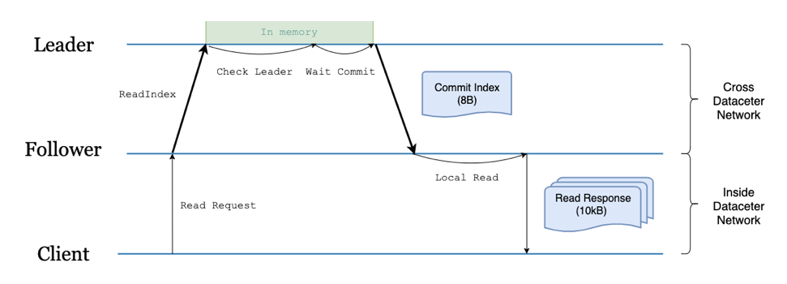
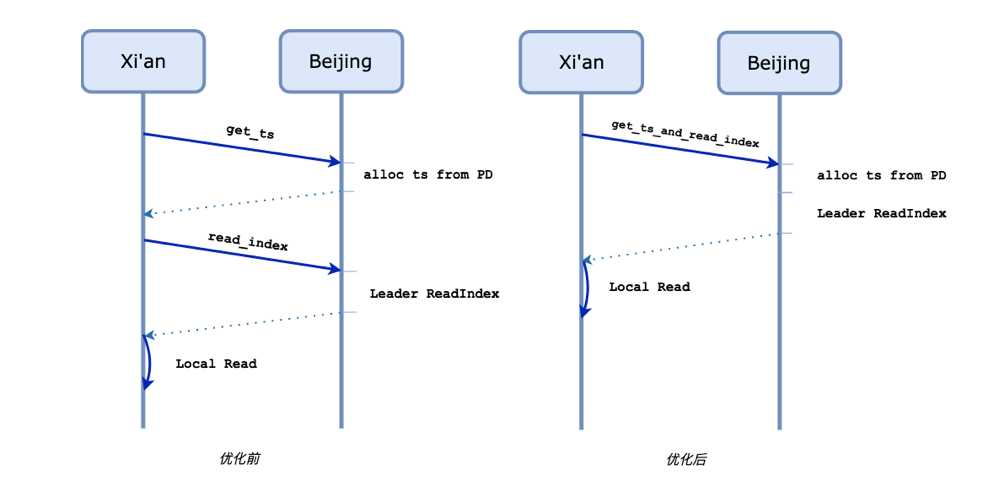
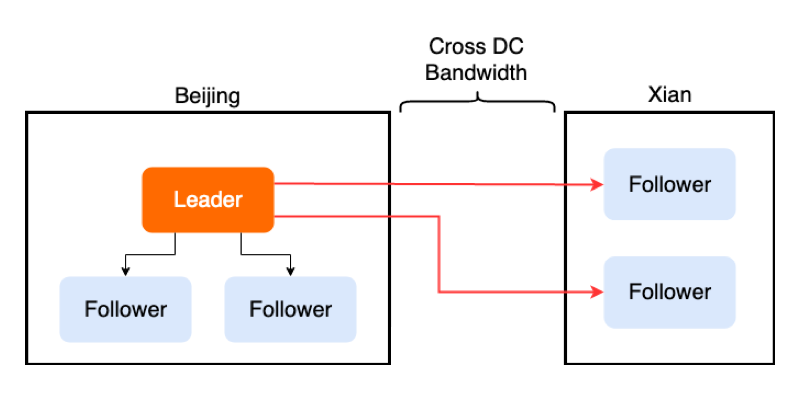
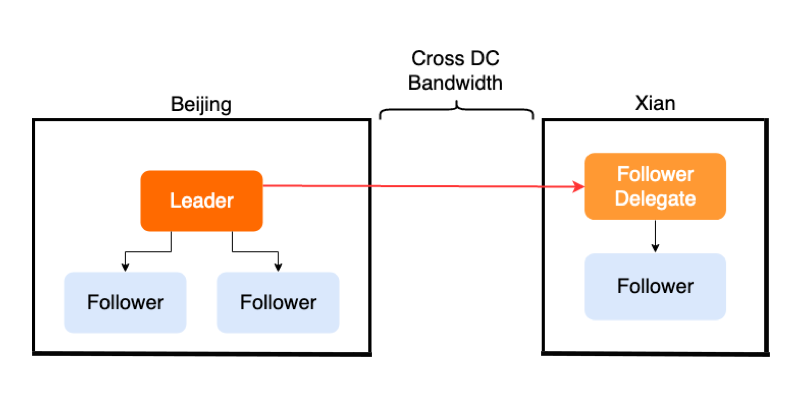

>作者介绍：.* team（成员：庄天翼、朱贺天、屈鹏、林豪翔）参加了 [TiDB Hackathon 2019](https://pingcap.com/community-cn/hackathon2019/)，他们项目「TiDB 跨数据中心方案的优化」斩获了二等奖。

众所周知，在对可用性要求极高的行业领域（比如金融、通信），分布式数据库需要跨地域的在多个数据中心之间建立容灾以及多活的系统架构，同时需要保持数据完整可用。但这种方式同时也带来了一些问题：

1. 跨地域的网络延迟非常高，通常在几十毫秒左右，洲际间更能达到几百毫秒。
2. 跨地域的网络专线带宽昂贵、有限，且难于扩展。

在今年 TiDB Hackathon 的比赛过程中，我们针对以上问题做了一些有趣的事情，并获得如下优化成果：

1. 跨地域 SQL 查询，延迟下降 50%（图 1）。
2. 跨节点消息数减半，即网络流量减半（图 2）。

图 1 延迟对比

图 2 网络流量对比

>“Google Spanner 高性能事务和强一致特性（跨区域甚至跨洲），是每一个做多数据中心架构设计的工程师心中所向往的目标。虽然当前 TiDB 在多数据中心部署时的表现同 Google Spanner 还有明显的差距，但我们很高兴的看到“多数据中心读写优化”项目让 TiDB 向 Spanner 级别多数据中心能力迈出了坚实的一步。相信在社区小伙伴们的共同努力下，假以时日 TiDB 一定能够为大家带来 Google Spanner 级别的体验。”
>
>—— 孙晓光（知乎｜技术平台负责人）
>
>“在官方推荐的具备同城多活能力的同城三中心五副本，以及两地三中心五副本的部署方案中，三个数据中心按照 2:2:1 的方式分配副本，网络租用成本是该架构的主要投入，我们在一次压力测试过程中，曾遇到过在极致的压力下占满网络带宽的情况。这个项目显著优化了两机房之间的带宽占用，可以为客户节约更多的成本。”
>
>—— 秦天爽（PingCAP｜技术支持总监）

接下来我们将从技术原理分析是如何做到以上优化效果的。以下内容需要读者具备 [Raft 一致性协议](https://raft.github.io/) 的一些预备知识，如果大家准备好了，就继续往下看吧～

## 技术原理

考虑一个两数据中心的部署方案（如图 3 所示），左半部分为主数据中心（Master DC，假设在北京）TiKV 和 PD 的多数副本都部署在这里，并且很重要的是 Leader 会被固定在这里；图 3 右半部分为从数据中心（Slave DC，假设在西安）里面有 TiKV 和 TiDB。用户只会在主数据中心进行数据写入，但会在两边都进行数据读取。

图 3 主数据中心 & 从数据中心部署

### Follower Read Improvement

在 TiDB 里面，当我们需要从西安这边读取数据的时候，一个典型的流程如下：

1. 西安的 TiDB 向北京的 PD 发起获取 TSO 请求，得到一个 `start_ts`（事务开始阶段的 ID）。（1 RTT）

2. 西安的 TiDB 为涉及到的每个 Region 向北京的 TiKV Leader 节点发起多个（并行）读请求（如图 4）。（1 RTT）

>名词解释：
>
>* RTT（Round-Trip Time），可以简单理解为发送消息方从发送消息到得知消息到达所经过的时间。
>* TSO（Timestamp Oracle），用于表示分布式事务开始阶段的 ID。

图 4 不启用 Follower Read 的读流程

可以看到，虽然西安本地也有 TiKV 副本数据，但完全没有参与这个过程。该实现存在两个问题：

* 跨地域网络宽带占用大。

* 延迟高（2 RTT）。

下面我们分别阐述对这两个问题的优化思路。

#### 1. 跨地域网络宽带占用大

其实针对这个问题，TiDB 已经在 3.1 版本引入了 [Follower Read](https://pingcap.com/blog-cn/follower-read-the-new-features-of-tidb/) 特性。开启该特性后，TiKV Leader 上的节点从必须处理整个读请求改为只用处理一次 read_index 请求（一次 read_index 通常只是位置信息的交互，不涉及数据，所以轻量很多），负载压力大幅降低，是一个很大的优化，如下图所示。

图 5 开启 Follower Read 的读流程

#### 2. 延迟高

在读延迟上，TiDB 仍然需要 2 个跨地域的 RTT。这两个 RTT 的延迟是由一次获取 TSO 请求和多次（并行的）`read_index` 带来的。简单观察后，我们不难发现，我们完全可以将上面两个操作并行一起处理，如下图所示。

图 6 Follower Read 流程优化

通过这种优化方式，我们实现了跨数据中心读请求 2RTT -> 1RTT 的提升，并且我们在模拟的高延迟网络环境中的 benchmark 证实了这一点：

图 7 benchmark

考虑到没有原子钟的情况下想要保证线性一致性，一次获取 TSO 的请求是无法避免的，因此可以认为 1RTT 已经是在目前的架构下最优的解决方案了。

### 用 Follower Replication 减少带宽成本

接下来谈一谈如何用 Follower Replication 这种方式，减少跨数据中心的带宽成本。

众所周知 TiKV 集群中的一致性是依靠 Raft 协议来保证的。在 Raft 协议中，所需要被共识一致的数据可以用 Entry 来表示。一个 Entry 被共识，需要 Leader 在接收到请求之后，广播给其他 Follower 节点，之后通过不断的消息交互来使这个 Entry 被 commit。这里可能会遇到一个问题：有些时候 TiKV 被部署在世界各地不同的数据中心中，数据中心之间的网络传输成本和延迟比较高，然而 Leader 只有一个，可想而知会发生很多次跨数据中心的消息传输。

举个例子，生产环境中可能需要 5 个副本来保证可用性，假设 3 个副本在北京分别是 A B C，2 个在西安分别是 D E，同时 Leader 为 A，那么一条 Entry 需要北京的 Leader A，广播给西安的 DE，那么这次广播至少需要两次跨数据中心的网络传输，如下图所示。

图 8 正常的消息广播

Follower Replication 的目标是将这个多次的跨数据中心传输尽量减少。要实现 Follower Replication，最关键的是需要让 Leader 节点知道所有 Raft 节点与它所在的 数据中心的信息。这里我们引入了一个新概念 Group，每一个 Raft 节点都有一个对应的 Group ID，拥有相同 Group ID 的节点即在同一个数据中心中。既然有了每个 Raft 节点的 Group 信息，Leader 就可以在广播消息时在每一个 Group 中选择一个代理人节点（我们称为 Follower  Delegate），将整个 Group 成员所需要的信息发给这个代理人，代理人负责将数据同步给 Group 内的其他成员，如下图所示。

图 9 选择代理人之后的消息广播

通过使用 Follower Replication，Leader 减少了一半的数据发送，既大大降低了跨数据中心带宽的压力，同时也减少了 Leader 在发送网络消息上的开销。当然，实际 Follower Replication 的实现还是很复杂的，我们后续会专门写一篇详细的文章来介绍。

关于这个对 Raft 实现的改进，我们已经提交了 RFC 和实现的 PR，后续也会贡献给 etcd，感兴趣的同学可以参考：

* [https://github.com/tikv/rfcs/pull/33](https://github.com/tikv/rfcs/pull/33)

* [https://github.com/tikv/raft-rs/pull/249/](https://github.com/tikv/raft-rs/pull/249/)

* [https://github.com/etcd-io/etcd/issues/11357](https://github.com/etcd-io/etcd/issues/11357)

## 总结

除了我们在 Hackathon 做的两个优化，跨数据中心的场景有更多需要解决的问题和可以优化的点，我们的优化也远非最终实现，一些不难想到的优化还有：

1. Follower Read Improvement 能将一个非交互式的读事务从 2RTT 降到 1RTT，但对于交互式的读事务，由于事先不知道涉及到事务的 Region，无法预读整个读请求中所有 Region `read_index`，因此只有第一次读请求和 `get_tso` 可以并行，将 n+1 RTT 优化到了 n RTT（n 为交互式事务中读语句的数量），而如果我们能将 ts 和 committed index 的对应关系找到，并且定期维护每个 Region 的 safe ts（小于该 ts 的事务一定已经 committed or aborted），那么我们就可以将交互式读事务的延迟也降低到 1RTT。

2. 跨数据中心的读请求一个很常见的场景是并不需要是最新的数据，应该提供怎么样的语义来让这种场景下的读请求完全在本地 0RTT 地读取数据，真正做到对主数据中心无依赖，做到数据中心级别的 scalability。

有句话是这样说的，“对于基础架构方向的软硬件工程师而言，世界上最远的距离，是你在联通，我在电信 :D”软件工程师做得越好，秃顶的硬件工程师就越少。希望我们的项目在切实落地之后，能够大幅优化 TiDB 跨地域数据中心的延迟和网络流量，让 TiDB 能够满足更多用户的需求，成为分布式数据库领域的事实标准。
