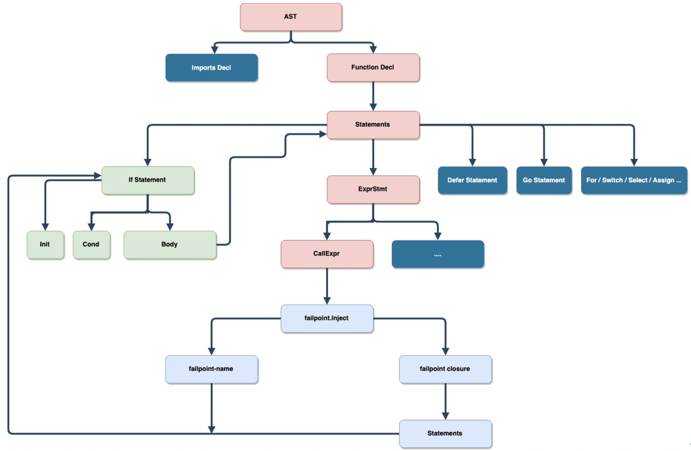

对于一个大型复杂的系统来说，通常包含多个模块或多个组件构成，模拟各个子系统的故障是测试中必不可少的环节，并且这些故障模拟必须做到无侵入地集成到自动化测试系统中，通过在自动化测试中自动激活这些故障点来模拟故障，并观测最终结果是否符合预期结果来判断系统的正确性和稳定性。如果在一个分布式系统中需要专门请一位同事来插拔网线来模拟网络异常，一个存储系统中需要通过破坏硬盘来模拟磁盘损坏，昂贵的测试成本会让测试成为一场灾难，并且难以模拟一些需要精细化控制的的测试。所以我们需要一些自动化的方式来进行确定性的故障测试。

**[Failpoint 项目](https://github.com/pingcap/failpoint) 就是为此而生，它是 FreeBSD [failpoints](http://www.freebsd.org/cgi/man.cgi?query=fail) 的 Golang 实现，允许在代码中注入错误或异常行为， 并由环境变量或代码动态激活来触发这些异常行为。Failpoint 能用于各种复杂系统中模拟错误处理来提高系统的容错性、正确性和稳定性，比如：**

* 微服务中某个服务出现随机延迟、某个服务不可用。
* 存储系统磁盘 I/O 延迟增加、I/O 吞吐量过低、落盘时间长。
* 调度系统中出现热点，某个调度指令失败。
* 充值系统中模拟第三方重复请求充值成功回调接口。
* 游戏开发中模拟玩家网络不稳定、掉帧、延迟过大等，以及各种异常输入（外挂请求）情况下系统是否正确工作。
* ……

## 为什么要重复造轮子？

etcd 团队在 2016 年开发了 [gofail](https://github.com/etcd-io/gofail/) 极大地简化了错误注入，为 Golang 生态做出了巨大贡献。我们在 2018 年已经引入了 gofail 进行错误注入测试，但是我们在使用中发现了一些功能性以及便利性的问题，所以我们决定造一个更好的「轮子」。

### 如何使用 gofail

* 使用注释在程序中注入一个 failpoint：

	```go
	// gofail: var FailIfImportedChunk int
	// if merger, ok := scp.merger.(*ChunkCheckpointMerger); ok && merger.Checksum.SumKVS() >= uint64(FailIfImportedChunk) {
	// rc.checkpointsWg.Done()
	// rc.checkpointsWg.Wait()
	// panic("forcing failure due to FailIfImportedChunk")
	// }
	// goto RETURN1
	
	// gofail: RETURN1:
	
	// gofail: var FailIfStatusBecomes int
	// if merger, ok := scp.merger.(*StatusCheckpointMerger); ok && merger.EngineID >= 0 && int(merger.Status) == FailIfStatusBecomes {
	// rc.checkpointsWg.Done()
	// rc.checkpointsWg.Wait()
	// panic("forcing failure due to FailIfStatusBecomes")
	// }
	// goto RETURN2
	
	// gofail: RETURN2:
	```

* 使用 `gofail enable` 命令将注释转换为代码：

	```go
	if vFailIfImportedChunk, __fpErr := __fp_FailIfImportedChunk.Acquire(); __fpErr == nil { defer __fp_FailIfImportedChunk.Release(); FailIfImportedChunk, __fpTypeOK := vFailIfImportedChunk.(int); if !__fpTypeOK { goto __badTypeFailIfImportedChunk} 
	    if merger, ok := scp.merger.(*ChunkCheckpointMerger); ok && merger.Checksum.SumKVS() >= uint64(FailIfImportedChunk) {
	        rc.checkpointsWg.Done()
	        rc.checkpointsWg.Wait()
	        panic("forcing failure due to FailIfImportedChunk")
	    }
	    goto RETURN1; __badTypeFailIfImportedChunk: __fp_FailIfImportedChunk.BadType(vFailIfImportedChunk, "int"); };
	
	/* gofail-label */ RETURN1:
	
	if vFailIfStatusBecomes, __fpErr := __fp_FailIfStatusBecomes.Acquire(); __fpErr == nil { defer __fp_FailIfStatusBecomes.Release(); FailIfStatusBecomes, __fpTypeOK := vFailIfStatusBecomes.(int); if !__fpTypeOK { goto __badTypeFailIfStatusBecomes} 
	    if merger, ok := scp.merger.(*StatusCheckpointMerger); ok && merger.EngineID >= 0 && int(merger.Status) == FailIfStatusBecomes {
	        rc.checkpointsWg.Done()
	        rc.checkpointsWg.Wait()
	        panic("forcing failure due to FailIfStatusBecomes")
	    }
	    goto RETURN2; __badTypeFailIfStatusBecomes: __fp_FailIfStatusBecomes.BadType(vFailIfStatusBecomes, "int"); };
	
	/* gofail-label */ RETURN2:
	```
 
### gofail 使用中遇到的问题

* 使用注释的方式在代码中注入 failpoint，代码容易出错，并且没有编译器检测。
* 只能全局生效，大型项目为了缩短自动化测试的时间会引入并行测试，不同并行任务之间会存在干扰。
* 需要写一些 hack 代码来避免一些不必要的错误日志，比如如上代码，必须要写 `// goto RETURN2` 和 `// gofail: RETURN2:`，并且中间必须添加一个空行，至于原因可以看 generated code 逻辑。

## 我们要设计一个什么样子的 failpoint？

### 理想的 failpoint 实现应该是什么样子？

理想中的 failpoint 应该是使用代码定义并且对业务逻辑无侵入，如果在一个支持宏的语言中 (比如 Rust)，我们可以定义一个 `fail_point` 宏来定义 failpoint：

```rust
fail_point!("transport_on_send_store", |sid| if let Some(sid) = sid {
    let sid: u64 = sid.parse().unwrap();
    if sid == store_id {
        self.raft_client.wl().addrs.remove(&store_id);
    }
})
```

但是我们遇到了一些问题：

* Golang 并不支持 macro 语言特性。
* Golang 不支持编译器插件。
* Golang tags 也不能提供一个比较优雅的实现 (`go build --tag="enable-failpoint-a"`)。

### Failpoint 设计准则

* 使用 Golang 代码定义 failpoint，而不是注释或其他形式。
* Failpoint 代码不应该有任何额外开销：
    * 不能影响正常功能逻辑，不能对功能代码有任何侵入。
    * 注入 failpoint 代码之后不能导致性能回退。
    * Failpoint 代码最终不能出现在最终发行的二进制文件中。
* Failpoint 代码必须是易读、易写并且能引入编译器检测。
* 最终生成的代码必须具有可读性。
* 生成代码中，功能逻辑代码的行号不能发生变化（便于调试）。
* 支持并行测试，可以通过 `context.Context` 控制一个某个具体的 failpoint 是否激活。

### Golang 如何实现一个类似 failpoint 宏？

宏的本质是什么？如果追本溯源，发现其实可以通过 AST 重写在 Golang 中实现满足以上条件的 failpoint，原理如下图所示：



对于任何一个 Golang 代码的源文件，可以通过解析出这个文件的语法树，遍历整个语法树，找出所有 failpoint 注入点，然后对语法树重写，转换成想要的逻辑。

## 相关概念

### Failpoint

Failpoint 是一个代码片段，并且仅在对应的 failpoint name 激活的情况下才会执行，如果通过 `failpoint.Disable("failpoint-name-for-demo")` 禁用后，那么对应的的 failpoint 永远不会触发。所有 failpoint 代码片段不会编译到最终的二进制文件中，比如我们模拟文件系统权限控制：

```go
func saveTo(path string) error {
    failpoint.Inject("mock-permission-deny", func() error {
         // It's OK to access outer scope variable
         return fmt.Errorf("mock permission deny: %s", path)
    })
}
```

### Marker 函数

AST 重写阶段标记需要被重写的部分，主要有以下功能：

* 提示 Rewriter 重写为一个相等的 IF 语句。
    * 标记函数的参数是重写过程中需要用到的参数。
    * 标记函数是一个空函数，编译过程会被 inline，进一步被消除。
    * 标记函数中注入的 failpoint 是一个闭包，如果闭包访问外部作用域变量，闭包语法允许捕获外部作用域变量，则不会出现编译错误，同时转换后的的代码是一个 IF 语句，IF 语句访问外部作用域变量不会产生任何问题，所以闭包捕获只是为了语法合法，最终不会有任何额外开销。
* 简单、易读、易写。
* 引入编译器检测，如果 Marker 函数的参数不正确，程序不能通过编译的，进而保证转换后的代码正确性。

目前支持的 Marker 函数列表：

* `func Inject(fpname string`, `fpblock func(val Value)) {}`
* `func InjectContext(fpname string`, `ctx context.Context`, `fpblock func(val Value)) {}`
* `func Break(label ...string) {}`
* `func Goto(label string) {}`
* `func Continue(label ...string) {}`
* `func Return(results ...interface{}) {}`
* `func Fallthrough() {}`
* `func Return(results ...interface{}) {}`
* `func Label(label string) {}`

## 如何在你的程序中使用 failpoint 进行注入？

**最简单的方式是使用 `failpoint.Inject` 在调用的地方注入一个 failpoint，最终 `failpoint.Inject` 调用会重写为一个 IF 语句，其中 `mock-io-error` 用来判断是否触发，`failpoint-closure` 中的逻辑会在触发后执行。** 比如我们在一个读取文件的函数中注入一个 I/O 错误：

```go
failpoint.Inject("mock-io-error", func(val failpoint.Value) error {
    return fmt.Errorf("mock error: %v", val.(string))
})
```

最终转换后的代码如下：

```go
if ok, val := failpoint.Eval(_curpkg_("mock-io-error")); ok {
    return fmt.Errorf("mock error: %v", val.(string))
}
```

通过 `failpoint.Enable("mock-io-error", "return("disk error")")` 激活程序中的 failpoint，如果需要给 `failpoint.Value` 赋一个自定义的值，则需要传入一个 failpoint expression，比如这里 `return("disk error")`，更多语法可以参考 [failpoint 语法](http://www.freebsd.org/cgi/man.cgi?query=fail)。

**闭包可以为 `nil`，比如 `failpoint.Enable("mock-delay", "sleep(1000)")`，目的是在注入点休眠一秒，不需要执行额外的逻辑。**

```go
failpoint.Inject("mock-delay", nil)
failpoint.Inject("mock-delay", func(){})
```

最终会产生以下代码：

```go
failpoint.Eval(_curpkg_("mock-delay"))
failpoint.Eval(_curpkg_("mock-delay"))
```

**如果我们只想在 failpoint 中执行一个 panic，不需要接收 `failpoint.Value`，则我们可以在闭包的参数中忽略这个值。**例如：

```go
failpoint.Inject("mock-panic", func(_ failpoint.Value) error {
    panic("mock panic")
})
// OR
failpoint.Inject("mock-panic", func() error {
    panic("mock panic")
})
```

最佳实践是以下这样：

```go
failpoint.Enable("mock-panic", "panic")
failpoint.Inject("mock-panic", nil)
// GENERATED CODE
failpoint.Eval(_curpkg_("mock-panic"))
```

**为了可以在并行测试中防止不同的测试任务之间的干扰，可以在 `context.Context` 中包含一个回调函数，用于精细化控制 failpoint 的激活与关闭**：

```go
failpoint.InjectContext(ctx, "failpoint-name", func(val failpoint.Value) {
    fmt.Println("unit-test", val)
})
```

转换后的代码：

```go
if ok, val := failpoint.EvalContext(ctx, _curpkg_("failpoint-name")); ok {
    fmt.Println("unit-test", val)
}
```

**使用 `failpoint.WithHook` 的示例**：

```go
func (s *dmlSuite) TestCRUDParallel() {
    sctx := failpoint.WithHook(context.Backgroud(), func(ctx context.Context, fpname string) bool {
        return ctx.Value(fpname) != nil // Determine by ctx key
    })
    insertFailpoints = map[string]struct{} {
        "insert-record-fp": {},
        "insert-index-fp": {},
        "on-duplicate-fp": {},
    }
    ictx := failpoint.WithHook(context.Backgroud(), func(ctx context.Context, fpname string) bool {
        _, found := insertFailpoints[fpname] // Only enables some failpoints.
        return found
    })
    deleteFailpoints = map[string]struct{} {
        "tikv-is-busy-fp": {},
        "fetch-tso-timeout": {},
    }
    dctx := failpoint.WithHook(context.Backgroud(), func(ctx context.Context, fpname string) bool {
        _, found := deleteFailpoints[fpname] // Only disables failpoints. 
        return !found
    })
    // other DML parallel test cases.
    s.RunParallel(buildSelectTests(sctx))
    s.RunParallel(buildInsertTests(ictx))
    s.RunParallel(buildDeleteTests(dctx))
}
```

**如果我们在循环中使用 failpoint，可能我们会使用到其他的 Marker 函数**：

```go
failpoint.Label("outer")
for i := 0; i < 100; i++ {
    inner:
        for j := 0; j < 1000; j++ {
            switch rand.Intn(j) + i {
            case j / 5:
                failpoint.Break()
            case j / 7:
                failpoint.Continue("outer")
            case j / 9:
                failpoint.Fallthrough()
            case j / 10:
                failpoint.Goto("outer")
            default:
                failpoint.Inject("failpoint-name", func(val failpoint.Value) {
                    fmt.Println("unit-test", val.(int))
                    if val == j/11 {
                        failpoint.Break("inner")
                    } else {
                        failpoint.Goto("outer")
                    }
                })
        }
    }
}

```

以上代码最终会重写为如下代码：

```go
outer:
    for i := 0; i < 100; i++ {
    inner:
        for j := 0; j < 1000; j++ {
            switch rand.Intn(j) + i {
            case j / 5:
                break
            case j / 7:
                continue outer
            case j / 9:
                fallthrough
            case j / 10:
                goto outer
            default:
                if ok, val := failpoint.Eval(_curpkg_("failpoint-name")); ok {
                    fmt.Println("unit-test", val.(int))
                    if val == j/11 {
                        break inner
                    } else {
                        goto outer
                    }
                }
            }
        }
    }
```

**为什么会有 `label`、`break`、`continue` 和 `fallthrough` 相关 Marker 函数? 为什么不直接使用关键字？**

* Golang 中如果某个变量或则标签未使用，是不能通过编译的。

	```go
	label1: // compiler error: unused label1
	    failpoint.Inject("failpoint-name", func(val failpoint.Value) {
	        if val.(int) == 1000 {
	            goto label1 // illegal to use goto here
	        }
	        fmt.Println("unit-test", val)
	    })
	
	```
* `break` 和 `continue` 只能在循环上下文中使用，在闭包中使用。

### 一些复杂的注入示例

**示例一：在 IF 语句的 `INITIAL` 和 `CONDITIONAL` 中注入 failpoint**

```go
if a, b := func() {
    failpoint.Inject("failpoint-name", func(val failpoint.Value) {
        fmt.Println("unit-test", val)
    })
}, func() int { return rand.Intn(200) }(); b > func() int {
    failpoint.Inject("failpoint-name", func(val failpoint.Value) int {
        return val.(int)
    })
    return rand.Intn(3000)
}() && b < func() int {
    failpoint.Inject("failpoint-name-2", func(val failpoint.Value) {
        return rand.Intn(val.(int))
    })
    return rand.Intn(6000)
}() {
    a()
    failpoint.Inject("failpoint-name-3", func(val failpoint.Value) {
        fmt.Println("unit-test", val)
    })
}
```

上面的代码最终会被重写为：

```go
if a, b := func() {
    if ok, val := failpoint.Eval(_curpkg_("failpoint-name")); ok {
        fmt.Println("unit-test", val)
    }
}, func() int { return rand.Intn(200) }(); b > func() int {
    if ok, val := failpoint.Eval(_curpkg_("failpoint-name")); ok {
        return val.(int)
    }
    return rand.Intn(3000)
}() && b < func() int {
    if ok, val := failpoint.Eval(_curpkg_("failpoint-name-2")); ok {
        return rand.Intn(val.(int))
    }
    return rand.Intn(6000)
}() {
    a()
    if ok, val := failpoint.Eval(_curpkg_("failpoint-name-3")); ok {
        fmt.Println("unit-test", val)
    }
}
```

**示例二：在 `SELECT` 语句的 CASE 中注入 failpoint 来动态控制某个 case 是否被阻塞**

```go
func (s *StoreService) ExecuteStoreTask() {
    select {
    case <-func() chan *StoreTask {
        failpoint.Inject("priority-fp", func(_ failpoint.Value) {
            return make(chan *StoreTask)
        })
        return s.priorityHighCh
    }():
        fmt.Println("execute high priority task")

    case <- s.priorityNormalCh:
        fmt.Println("execute normal priority task")

    case <- s.priorityLowCh:
        fmt.Println("execute normal low task")
    }
}
```

上面的代码最终会被重写为：

```go
func (s *StoreService) ExecuteStoreTask() {
    select {
    case <-func() chan *StoreTask {
        if ok, _ := failpoint.Eval(_curpkg_("priority-fp")); ok {
            return make(chan *StoreTask)
        })
        return s.priorityHighCh
    }():
        fmt.Println("execute high priority task")

    case <- s.priorityNormalCh:
        fmt.Println("execute normal priority task")

    case <- s.priorityLowCh:
        fmt.Println("execute normal low task")
    }
}
```

**示例三：动态注入 SWITCH CASE**

```go
switch opType := operator.Type(); {
case opType == "balance-leader":
    fmt.Println("create balance leader steps")

case opType == "balance-region":
    fmt.Println("create balance region steps")

case opType == "scatter-region":
    fmt.Println("create scatter region steps")

case func() bool {
    failpoint.Inject("dynamic-op-type", func(val failpoint.Value) bool {
        return strings.Contains(val.(string), opType)
    })
    return false
}():
    fmt.Println("do something")

default:
    panic("unsupported operator type")
}
```

以上代码最终会重写为如下代码：

```go
switch opType := operator.Type(); {
case opType == "balance-leader":
    fmt.Println("create balance leader steps")

case opType == "balance-region":
    fmt.Println("create balance region steps")

case opType == "scatter-region":
    fmt.Println("create scatter region steps")

case func() bool {
    if ok, val := failpoint.Eval(_curpkg_("dynamic-op-type")); ok {
        return strings.Contains(val.(string), opType)
    }
    return false
}():
    fmt.Println("do something")

default:
    panic("unsupported operator type")
}
```

除了上面的例子之外，还可以写的更加复杂的情况：

* 由 `INITIAL` 语句、`CONDITIONAL` 表达式，以及 `POST` 语句组成的循环
* `FOR RANGE` 语句
* `SWITCH INITIAL` 语句
* Slice 的构造和索引
* 结构体动态初始化
* ……

实际上，任何你可以调用函数的地方都可以注入 failpoint，所以请发挥你的想象力。

## Failpoint 命名最佳实践

上面生成的代码中会自动添加一个 `_curpkg_` 调用在 `failpoint-name` 上，是因为名字是全局的，为了避免命名冲突，所以会在最终的名字中包含包名，`_curpkg_` 相当一个宏，在运行的时候自动使用包名进行展开。你并不需要在自己的应用程序中实现 `_curpkg_`，它在执行 `failpoint-ctl enable` 命令的时候自动生成以及自动添加，并在执行 `failpoint-ctl disable` 命令的时候被删除。

```go
package ddl // ddl’s parent package is `github.com/pingcap/tidb`

func demo() {
	// _curpkg_("the-original-failpoint-name") will be expanded as `github.com/pingcap/tidb/ddl/the-original-failpoint-name`
	if ok, val := failpoint.Eval(_curpkg_("the-original-failpoint-name")); ok {...}
}
```

因为同一个包下面的所有 failpoint 都在同一个命名空间，所以需要小心命名来避免命名冲突，这里有一些推荐的规则来改善这种情况：

* 保证名字在包内是唯一的。
* 使用一个自解释的名字。

可以通过环境变量来激活 failpoint：
    
```    
GO_FAILPOINTS="github.com/pingcap/tidb/ddl/renameTableErr=return(100);github.com/pingcap/tidb/planner/core/illegalPushDown=return(true);github.com/pingcap/pd/server/schedulers/balanceLeaderFailed=return(true)"
```

## 致谢

* 感谢 [gofail](https://github.com/etcd-io/gofail) 提供最初实现，给我们提供了灵感，让我们能站在巨人的肩膀上对 failpoint 进行迭代。
* 感谢 FreeBSD 定义[语法规范](http://www.freebsd.org/cgi/man.cgi?query=fail)。

最后，欢迎大家和我们交流讨论，一起完善 [Failpoint 项目](https://github.com/pingcap/failpoint)。
