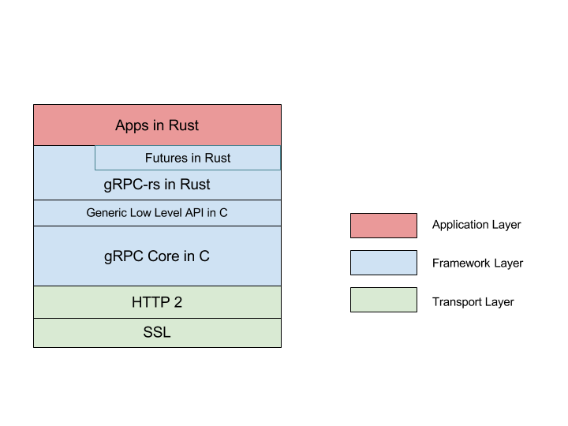

## 介绍

在 [上篇文章](./grpc.md) 中，我们讲到 TiKV 为了支持 [gRPC]，我们造了个轮子 [gRPC-rs]，这篇文章简要地介绍一下这个库。首先我们来聊聊什么是 gRPC。gRPC 是 Google 推出的基于 [HTTP2] 的开源 RPC 框架，希望通过它使得各种微服务之间拥有统一的 RPC 基础设施。它不仅支持常规的平台如 Linux，Windows，还支持移动设备和 IoT，现有十几种语言的实现，现在又多了一种语言 Rust。

gRPC 之所以有如此多的语言支持，是因为它有一个 C 写的核心库(gRPC core)，因此只要某个语言兼容 C ABI，那么就可以通过封装，写一个该语言的 gRPC 库。Rust 对 C 有良好的支持，gRPC-rs 就是对 gRPC core ABI 的 Rust 封装。

Core 能异步处理 RPC 请求，在考虑到 Rust 中已有较为成熟的异步框架 [Futures]，我们决定将 API 设计成 Future 模式。

**gRPC-rs 架构图**



我们将根据架构图从底向上地讲一下，在 [上一篇文章](./grpc.md) 中已经讨论过传输层和协议，在这就不再赘述。

## gRPC Core

Core 中有几个比较重要的对象：

  + Call 以及 4 种类型 RPC： Call 代表了一次 RPC，可以派生出四种类型 RPC，

    - Unary： 这是最简单的一种 RPC 模式，即一问一答，客户端发送一个请求，服务端返回一个回复，该轮 RPC 结束。
    - Client streaming： 这类的 RPC 会创建一个客户端到服务端的流，客户端可以通过这个流，向服务端发送多个请求，而服务端只会返回一个回复。
    - Server streaming： 与上面的类似，不过它会创建一个服务端到客户端的流，服务端可以发送多个回复，
    - Bidirectional streaming： 如果说上面两类是单工，那么这类就是双工了，客户端和服务端可以同时向对方发送消息。

      > 值得一提的是由于 gRPC 基于 HTTP2，它利用了 HTTP2 多路复用特性，使得一个 TCP 连接上可以同时进行多个 RPC，一次 RPC 即为 HTTP2 中的一个 Stream。

  + Channel： 它是对底层链接的抽象，具体来说一个 Channel 就是一条连着远程服务器的 TCP 链接。
  + Server： 顾名思义，它就是 gRPC 服务端封装，可以在上面注册我们的服务。
  + Completion queue: 它是 gRPC 完成事件队列，事件可以是收到新的回复，可以是新来的请求。

简要介绍一下 Core 库的实现，Core 中有一个 [Combiner] 的概念，Combiner 中一个函数指针或称组合子（Combinator）队列。每个组合子都有特定的功能，通过不同的组合可以实现不同的功能。下面的伪码大概说明了 Combiner 的工作方式。

```
class combiner {
  mpscq q; // multi-producer single-consumer queue can be made non-blocking
  state s; // is it empty or executing

  run(f) {
    if (q.push(f)) {
      // q.push returns true if it's the first thing
      while (q.pop(&f)) { // modulo some extra work to avoid races
        f();
      }
    }
  }
}
```

Combiner 里面有一个 mpsc 的无锁队列 q，由于 q 只能有**一个消费者**，这就要求在同一时刻只能有一个线程去调用队列里面的各个函数。调用的入口是 `run()` 方法，在 `run()` 中各个函数会被**序列**地执行。当取完 q 时，该轮调用结束。假设一次 RPC 由六个函数组成，这样的设计使这组函数（RPC）可以在**不同**的线程上运行，这是异步化 RPC 的基础。

Completion queue（以下简称 CQ）就是一个 Combiner，它暴露出了一个 `next()`借口，相当于 Combiner 的 `run()`。由于接口的简单，Core 内部不用开启额外线程，只要通过外部不断调用 `next()` 就能驱动整个 Core。

所有的 HTTP2 处理，Client 的 RPC 请求和 Server 的 RPC 连接全是通过一个个组合子的不同组合而构成的。下面是一次 Unary 的代码。它由6个组合子组成，这些组合子作为一个 batch 再加上 Call 用于记录状态，两者构成了这次的 RPC。

```c
grpc_call_error grpcwarp_call_start_unary(
    grpc_call *call, grpcsharp_batch_context *tag) {

  grpc_op ops[6];
  ops[0].op = GRPC_OP_SEND_INITIAL_METADATA;
  ...
  ops[1].op = GRPC_OP_SEND_MESSAGE;
  ...
  ops[2].op = GRPC_OP_SEND_CLOSE_FROM_CLIENT;
  ...
  ops[3].op = GRPC_OP_RECV_INITIAL_METADATA;
  ...
  ops[4].op = GRPC_OP_RECV_MESSAGE;
  ...
  ops[5].op = GRPC_OP_RECV_STATUS_ON_CLIENT;

  return grpcwrap_call_start_batch(call, ops, tag);
}
```

## 用 Rust 封装 Core

<!-- 适当扩展该节？ -->
介绍完 Core，现在说一下如何用 Rust 封装它。这一层封装并不会产生额外的开销，不像有的语言在调用 C 时会有类型的转换或者 runtime 会有较大开销，在 Rust 中开销微乎其微，这得益于 Rust 用 llvm 做编译器后端，它对 C 有良好的支持，Rust 调用 C ABI 就像调用一个普通的函数，可以做到 Zero-cost。

同时用 Rust 封装 C ABI 是一件很简单的事情，简单到像黑魔法。比如封装 CQ `next()`:

C：

```c
grpc_event grpc_completion_queue_next(grpc_completion_queue *cq,
                                      gpr_timespec deadline,
                                      void *reserved);
```

Rust：

```rust
extern "C" {
  pub fn grpc_completion_queue_next(cq: *mut GrpcCompletionQueue,
                                    deadline: GprTimespec,
                                    reserved: *mut c_void)
                                    -> GrpcEvent;
}
```

接着我们看看如何封装 C 的类型。继续以 `next()` 为例子：

C：

```c
// CQ 指针
grpc_completion_queue *cq;

// grpc_event 结构体
struct grpc_event {
  grpc_completion_type type;
  int success;
  void *tag;
};

```

Rust：

```rust
pub enum GrpcCompletionQueue {}

#[repr(C)]
pub struct GrpcEvent {
    pub event_type: GrpcCompletionType,
    pub success: c_int,
    pub tag: *mut c_void,
}
```

CQ 在 Core 的 ABI 中传递的形式是指针，Rust Wraper 无须知道 CQ 具体的内部结构。对于这种情况，Rust 推荐用无成员的枚举体表示，具体好处有两个，第一，由于没有成员，我们无法在 Rust 中构建该枚举体的实例，第二，Type safe，当传递了一个错误类型的指针时编译器会报错。

`#[repr(C)]` 也是 Rust 的黑魔法之一。加上了这个标签的结构体，在内存中的布局和对齐就和 C 一样了，这样的结构体可以安全地传递给 C ABI。

## Futures in gRPC-rs

经过上一节的封装，我们已经得到了一个可用但是非常裸的 Rust gRPC 库了，[grpc-sys]。在实践中，我们不推荐直接用 [grpc-sys]，直接用它就像在 Rust 中写 C 一样，事倍功半，Rust 语言的诸多特性无法得到施展，例如泛型，Trait，Ownership 等，也无法融入 Rust 社区。

上面说过 Core 能异步处理 RPC，那么如何用 Rust 来做更好的封装呢？ [Futures]！它是一个成熟的异步编程库，同时有一个活跃的社区。 Futures 非常适用于 RPC 等一些 IO 操作频繁的场景。Futures 中也有组合子概念，和 Core 中的类似，但是使用上更加方便，也更加好理解。举一个栗子：

```rust
use futures::{future, Future};

fn double(i: i64) -> i64 { i * 2 }

let ans = future::ok(1)
              .map(double)
              .and_then(|i| Ok(40 + i));

println!("{:?}", ans.wait().unwrap());
```

你觉得输出的答案是多少呢？没错就是 42。在 Core 那节说过不同的组合子组织在一起可以干不同的事，在 Future 中我们可以这么理解，一件事可以分成多个步骤，每个步骤由一个组合子完成。比如上例，`map` 完成了翻倍的动作，`and_then` 将输入加上 40。 现在来看看 gRPC-rs 封装的 API。

```rust
// helloworld.proto
service Greeter {
    // An unary RPC, sends a greeting
    rpc SayHello (HelloRequest) returns (HelloReply) {}
}

impl GreeterClient {
    pub fn say_hello_async(&self, req: HelloRequest) -> ClientUnaryReceiver<HelloReply> {
        self.client.unary_call_async(&METHOD_GREETER_SAY_HELLO, req, CallOption::default())
    }
    ...
}
```

以 [helloworld.proto] 为例，`GreeterClient::say_hello_async()` 向远程 Server 发送一个请求 (`HelloRequest`)，Server 返回给一个结果 (`HelloReply`)。由于是异步操作，这个函数会立即返回，返回的 `ClientUnaryReceiver` 实现了 `Future`，当它完成时就会得到 `HelloReply`。在一般的异步编程中都会有 Callback，用于处理异步的返回值，在这个 RPC 中就是 `HelloReply`，在 Future 中可以用组合子来写，比如 `and_then`，再举一个栗子，现有一次完整的 RPC 逻辑，拿到回复后打印到日志。下面就是 gRPC-rs 的具体用法。

```rust
// 同步
let resp = client.say_hello(req);
println!("{:?}", resp);

// 异步
let f = client.say_hello_async(req)
              .and_then(|resp| {
                  println！("{:?}", resp);
                  Ok(())
              });
executer.spawn(f); // 类似 Combiner,
                   // 用于异步执行 Future，
                   // 常用的有 tokio-core。
```

## Unary RPC

gRPC-rs 根据 service 在 proto 文件中的定义生成对应的代码，包括 RPC 方法的定义（`Method`）、客户端和服务端代码，生成的代码中会使用 gRPC-rs 的 API。那么具体是怎么做的呢？这节还是以 helloworld.proto 为例，来讲讲客户端 Unary RPC 具体的实现。首先，`SayHello` 的 `Method` 记录了 RPC 类型，全称以及序列化反序列化函数。为什么要序列化反序列化函数呢？因为 Core 本身不涉及消息的序列化，这一部分交由封装层解决。在生成的客户端中可以会调用 gRPC-rs 的 API，根据 `Method` 的定义发起 RPC。

```rust
// 生成的代码
const METHOD_GREETER_SAY_HELLO: Method<HelloRequest, HelloReply> = Method {
    ty: MethodType::Unary,
    name: "/helloworld.Greeter/SayHello",
    req_mar: Marshaller { ser: pb_ser, de: pb_de },
    resp_mar: Marshaller { ser: pb_ser, de: pb_de },
};

impl GreeterClient {
    // An unary RPC, sends a greeting
    pub fn say_hello_async(&self, req: HelloRequest)
                           -> ClientUnaryReceiver<HelloReply> {
        self.client.unary_call_async(&METHOD_GREETER_SAY_HELLO, req)
    }
    ...
}

// gRPC-rs 的 API。该函数立即返回，不会等待 RPC 完成。省略部分代码。
pub fn unary_async<P, Q>(channel: &Channel,
                         method: &Method<P, Q>,
                         req: P)
                         -> ClientUnaryReceiver<Q> {
    let mut payload = vec![];
    (method.req_ser())(&req, &mut payload);            // 序列化消息
    let call = channel.create_call(method, &opt);      // 新建 Call
    let cq_f = unsafe {
        grpc_sys::grpcwrap_call_start_unary(call.call, // 发起 RPC
                                            payload,
                                            tag)
    };
    ClientUnaryReceiver::new(call, cq_f, method.resp_de()) // 收到回复后再反序列化
}
```

## 写在最后

这篇简单介绍了 gRPC Core 的实现和 gRPC-rs 的封装，详细的用法，在这就不做过多介绍了，大家如果感兴趣可以查看 [examples]。 gRPC-rs 深入使用了 Future，里面有很多神奇的用法，比如 Futures in gRPC-rs 那节最后的 `executer`， gRPC-rs 利用 CQ 实现了一个能并发执行 Future 的 `executer`（类似 furtures-rs 中的 [Executer]），大幅减少 context switch，性能得到了显著提升。如果你对 gRPC 和 rust 都很感兴趣，欢迎参与开发，目前还有一些工作没完成，详情请点击 [https://github.com/pingcap/grpc-rs](https://github.com/pingcap/grpc-rs)。

参考资料：

[gRPC open-source universal RPC framework][gRPC]

[The rust language implementation of gRPC][gRPC-rs]

[Hypertext Transfer Protocol Version 2 (HTTP/2)
][HTTP2]

[Zero-cost Futures in Rust][Futures]

[gRPC, Combiner Explanation][Combiner]

[Rust, Representing opaque structs](https://github.com/steveklabnik/rust/blob/8c4dc18d2a51321070abccd34182381bdc66054d/src/doc/trpl/ffi.md#representing-opaque-structs)

[Rust repr(), alternative representations](https://doc.rust-lang.org/nomicon/other-reprs.html)

[gRPC - A solution for RPCs by Google](http://d3s.mff.cuni.cz/research/seminar/download/2016-11-15-Tattermusch-gRPC.pdf)

[Tokio, A platform for writing fast networking code with Rust.](https://tokio.rs)

[gRPC]: http://www.grpc.io/
[gRPC-rs]: https://github.com/pingcap/grpc-rs
[HTTP2]: http://httpwg.org/specs/rfc7540.html
[Futures]: https://docs.rs/futures/0.1.14/futures/
[Combiner]: https://github.com/grpc/grpc/blob/7405347cd848f27067b9ce3c029325799ebaa888/doc/combiner-explainer.md
[grpc-sys]: https://github.com/pingcap/grpc-rs/tree/master/grpc-sys
[helloworld.proto]: https://github.com/pingcap/grpc-rs/blob/0d3b2db35eb65e61b59e7b2a9a38b9438f15d766/proto/proto/example/helloworld.proto#L39-L43
[examples]: https://github.com/pingcap/grpc-rs/blob/0d3b2db35eb65e61b59e7b2a9a38b9438f15d766/examples
[Executer]: https://docs.rs/futures/0.1.14/futures/executor/trait.Executor.html
