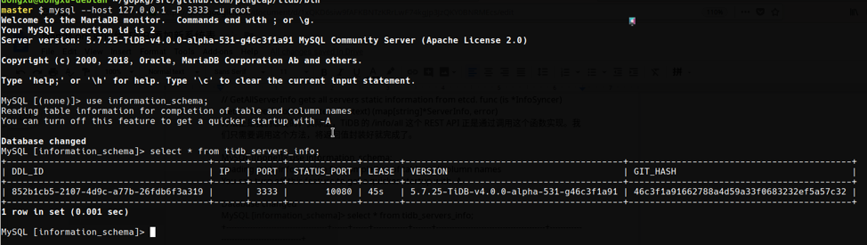

>“TiDB，你已经是一个成熟的数据库了，该学会用自己的 SQL 查自己的状态了。”

对于一个成熟的数据库来说，通过 SQL 来查询系统本身的状态再正常不过，对于 MySQL 来说 `INFOMATION_SCHEMA` 和 `PERFORMANCE_SCHEMA` 里面有大量的信息，基本上通过查询些信息，DBA 就能对整个系统的运行状态一目了然。最棒的是，查询的接口正是 SQL，不需要依赖其他的第三方工具，运用表达力强大的 SQL 甚至可以对这些信息进行二次加工或者过滤，另外接入第三方的运维监控工具也很自然，不需要引入新的什么依赖。

过去由于种种原因，TiDB 很多的内部状态信息是通过不同组件暴露 RESTFul API 来实现，这个方案也不是不好，但是随着 API 的增多，管理成本越来越高，举一个例子：在不参考文档的前提下，用户是很难记住那么多 RESTFul API 的路径的，只能通过将这些 API 封装成命令行工具来使用，但是如果这是一张系统表，只需要一句 `SHOW TABLES` 和几条 `SELECT` 就能够了。当然选择 RESTFul API 还有其他的原因，例如有些操作并不是只读的，是类似命令的形式，例如：手动 split region 这类操作，使用 RESTFul API 会更好，这两者其实并不矛盾，系统表当然是一个很好的补充，这是提升整体软件易用性的一个好例子。

**今天正好有一些时间，花了几十分钟完整的走了一遍流程，给 TiDB 的 `INFORMATION_SCHEMA` 添加了一张名为 `TIDB_SERVERS_INFO` 的表，用来显示集群中所有活着的 tidb-server 的状态信息（基本和 `/info/all` 做的事情差不多），意在抛砖引玉，社区的小伙伴可以参照这篇博客添加新的有用的信息。**

有这个想法后，我的直觉是去找 `information_schema` 的代码看看别的系统表是怎么实现的，照猫画虎就 OK 了（😁没毛病）。 TiDB 的代码组织还算比较直观，在 tidb repo 的根目录下直接看到了一个包叫 `infoschema`，感觉就是它，打开 `inforschema/table.go` 后确实应证了我的猜想，文件开头集中定义了很多字符串常量：

```    
...
tableTiKVStoreStatus                	= "TIKV_STORE_STATUS"
tableAnalyzeStatus                  	= "ANALYZE_STATUS"
tableTiKVRegionStatus               	= "TIKV_REGION_STATUS"
tableTiKVRegionPeers                	= "TIKV_REGION_PEERS"
...

```

这些常量正是 TiDB 的 `INFOMATION_SCHEMA` 中的表名，根据这些变量顺藤摸瓜可以找到同文件里面的 `tableNameToColumns` 这个 map，顾名思义应该是这个 map 通过表名映射到表结构定义，随便打开一个，果然如此：

```
var columnStatisticsCols = []columnInfo{
	{"SCHEMA_NAME", mysql.TypeVarchar, 64, mysql.NotNullFlag, nil, nil}, 
	{"TABLE_NAME", mysql.TypeVarchar, 64, mysql.NotNullFlag, nil, nil}, 
	{"COLUMN_NAME", mysql.TypeVarchar, 64, mysql.NotNullFlag, nil, nil}, 
	{"HISTOGRAM", mysql.TypeJSON, 51, 0, nil, nil}, 
}
```

下一步需要如何填充数据返回给 TiDB 的 SQL Engine，我们注意到 `infoschemaTable` 这个类实现了 `table.Table interface`，很显然这个 interface 就是 TiDB 中对于 Table 获取数据/修改数据的接口，有关获取数据的方法是 `IterRecords`，我们只需要看到 `IterRecords` 中的实现就能知道这些系统表的数据是如何返回给 SQL Engine 的，果然在 `IterRecords` 里面有一个方法，`inforschemaTable.getRows()`，这个方法的定义中有一个巨大的 switch 语句，用于判断是在哪个系统表上，根据这个信息然后返回不同的数据:

```
...
switch it.meta.Name.O {
	case tableSchemata:
		fullRows = dataForSchemata(dbs)
	case tableTables:
		fullRows, err = dataForTables(ctx, dbs) 
	case tableTiDBIndexes: 
		fullRows, err = dataForIndexes(ctx, dbs) 
...
}
```
Bingo! 感觉就是我们需要的东西。

**现在步骤就很清楚了：**

1.  在 `infoschema/tables.go` 中添加一个新的字符串常量 `tableTiDBServersInfo` 用于定义表名；

2.  定义一个 `[]columnInfo：tableTiDBServersInfoCols`，用于定义这张系统表的结构；

3.  在 `tableNameToColumns` 这个 map 中添加一个新的映射关系 `tableTiDBServersInfo => tableTiDBServersInfoCols`；

4.  在 `infoschemaTable.getRows()` 方法中加入一个新的 `dataForTableTiDBServersInfo` 的 swtich case；

5.  搞定。

下一个目标是实现 `dataForTableTiDBServersInfo`，很显然，大致的思路是：

1.  找到这个集群的 PD，因为这些集群拓扑信息；

2.  将这些信息封装成 `tableTiDBServersInfoCols` 中定义的形式，返回给 `getRows` 方法。

通过传入的 ctx 对象，获取到 Store 的信息，	`sessionctx.Context` 是 TiDB 中一个很重要的对象，也是 TiDB 贯穿整个 SQL 引擎的一个设计模式，这个 Context 中间存储在这个 session 生命周期中的一些重要信息，例如我们可以通过 `sessionctx.Context` 获取底层的 Storage 对象，拿到 Storage 对象后，能干的事情就很多了。

本着照猫画虎的原则，参考了一下 `dataForTiDBHotRegions` 的实现：

```
tikvStore, ok := ctx.GetStore().(tikv.Storage) 
```

因为我们的目标是获取 PD 对象，必然地，只有 TiKV 作为 backend 的时候才有 PD，所以这里的类型转换判断是必要的。

其实，通过 PD 获取集群信息这样的逻辑已经在 TiDB 中封装好了，我发现在 `domain/info.go` 中的这个方法正是我们想要的：

```
// GetAllServerInfo gets all servers static information from etcd. func (is *InfoSyncer) 
GetAllServerInfo(ctx context.Context) (map[string]*ServerInfo, error)
```

实际上，TiDB 的 `/info/all` 这个 REST API 正是通过调用这个函数实现，我们只需要调用这个方法，将返回值封装好就完成了。



**自此，我们就完成了一个新的系统表的添加。在自己添加的新表上 SELECT 一下，是不是很有成就感 :) 欢迎大家在此基础上添加更多有用的信息。**
