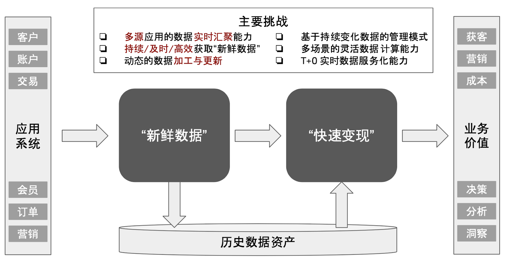
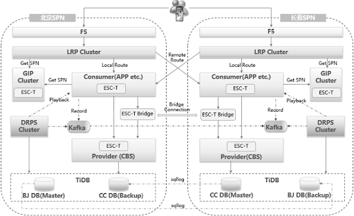
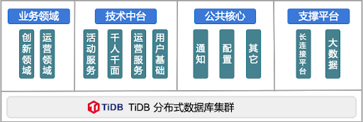
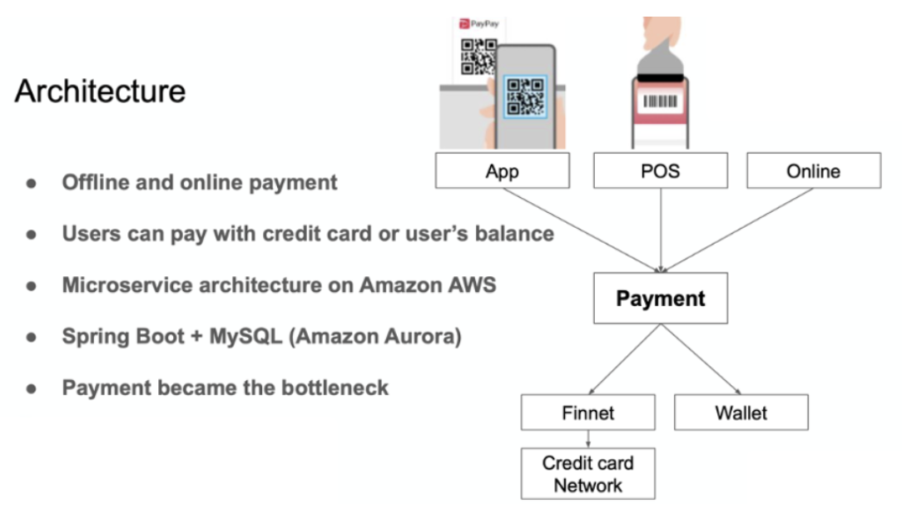
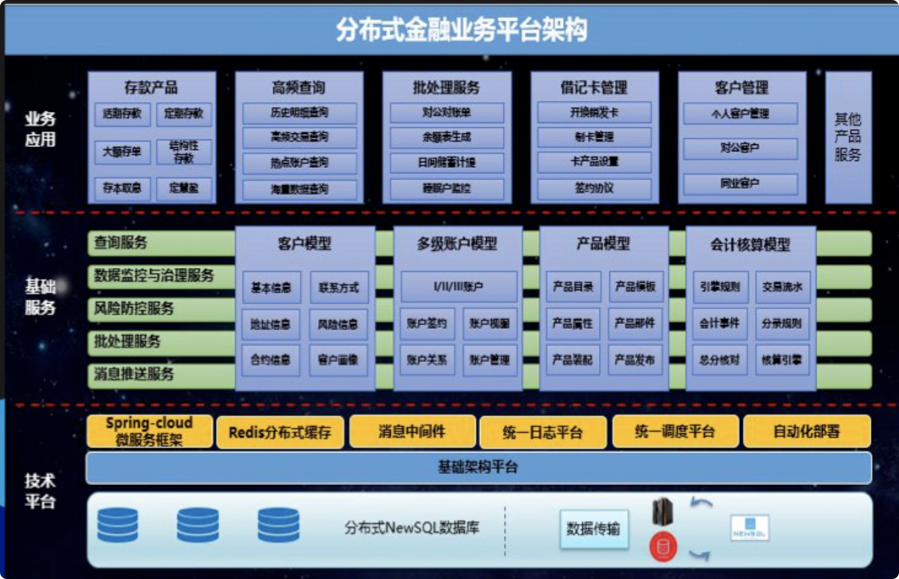
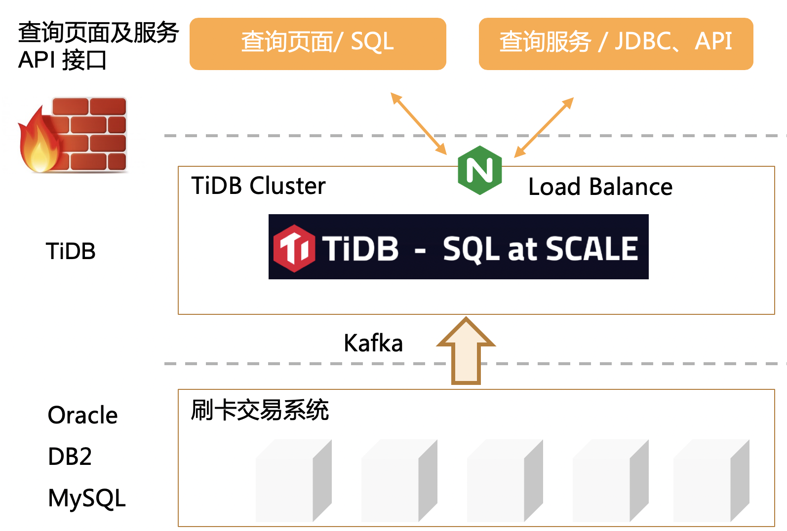
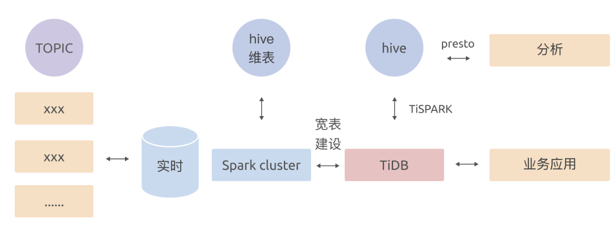

​全球经济数字化转型是大势所趋。加快数字经济发展，推动数字化变革已经成为未来十年经济发展的重要推动力。数字化增长带来新机遇，DTC（Direct To Customer）的模式在众多企业成为获取与服务最终客户的新趋势，但据分析机构报告显示，在全球数字化转型中，大数据项目只有 30-40% 的成功率，通过简化基础的数据平台赋能数字化转型成为一个关键话题。

本文为 PingCAP 解决方案事业部总经理余军在 TiDB 5.0 发布会上进行《Insightful User Case - TiDB 行业应用场景解读》演讲的实录整理，**分享企业级分布式数据库产品 TiDB 如何帮助企业用户完成数字化转型。**

## 数字化转型中的数据价值变现

2020 年全球发生了新冠疫情，在疫情的影响下，各种线下经济活动都加速过渡到线上，数字化转型加速，各种在线服务平台，从在线办公、在线医疗、在线教育，到在线娱乐均得到爆发式增长。2020 年之后，越来越多的企业在考虑如何进一步利用数字化的能力帮助企业完成在整个线上移动端、互联网端的业务闭环，DTC（Direct to Customer) 的业务模式成为了趋势，更多的企业都有了数据架构转型升级的需求。

数据处理在历史上曾经经历过几个阶段，到今天在数字化转型大潮崛起的形势下，数字化技术处理要求发生了巨大的变化，这些变化**主要集中在以下三点：**

1. **数据保鲜**：数据量级大且要求处理快，同时需要对实时数据的实时价值进行充分保鲜；

2. **端到端闭环**：从互联网移动端到在线企业级服务中需要一个完全闭环的数据驱动；

3. **数据价值变现**：在数据驱动的趋势下，很多企业级应用已经脱离了传统的数据服务和数据支撑的基础架构，快速转向了以事件驱动、数据驱动为主的数据变现主题。

在整个数字化转型的过程中，我们认为数据有两个非常核心的要素：第一，各种各样业务发生之际随之而来就产生了新鲜的数据，如何让新鲜数据一直保有实时性的承载价值；第二，当这些新鲜的数据产生之后，如何及时利用新鲜数据完成业务上的快速变现，比如说帮助企业用更低的成本获得更多的客户、如何更高效的推动企业营销活动、如何通过对数据更进一步的实时的观测和分析，来完成业务上的洞察和实时决策等。

## TiDB 企业级关键能力

我们来看一下 TiDB 在数字化转型过程当中，如何利用它的先进架构和技术的支撑能力，加速企业数字化转型的进程。

### 现有方案在联机及实时处理领域的痛点

我们将在线直接承接业务交易的业务系统称为联机系统，这些联机系统是业务产生新鲜数据的第一个阶段。经过多年的发展，数据管理及数据的使用方式已经发生了很大的变化，但是对于新鲜数据的保有和处理技术还停留在四五十年以前的技术。比如常见的利用一些传统关系型数据库、半结构化数据处理技术来承担新鲜数据的产生及加工工作，在这个过程中不可避免需要利用不同数据技术的支撑能力、在不同的数据技术栈中去做数据处理的情况，进而产生了所谓的”**数据孤岛**”现象。

为了解决”数据孤岛”问题，业界推出了大量的分散的数据技术栈；如数据同步工具、数据加工工具、各种各样的长线管道等方式去解决不同数据栈间的数据打通问题。在这个长链路，复杂链路的数据处理过程当中，新鲜数据虽然产生了但最终已经无法再保鲜了。同时，整个处理链路过长，导致数据与时间维度所绑定的实时性价值丢失。另一方面，从业务的视角来看，要获
得全局性新鲜数据的统一视图，在如此复杂的管道网络及复杂数据处理链路的交织局面下也变得非常困难。

作为企业来说，**当新鲜数据产生后往往希望采用通过各种各样的手段将数据进行商业价值的变现，换句话说，也就是我们会对这些数据进行业务驱动下的二次加工，来为不同业务系统提供数据消费能力。**目前在业界，通常不得不采用非常复杂的数据技术栈复合体来支撑，比如对于查询要求较高的联机查询，可能通过 MySQL 或者 Oracle 这类数据库来支撑；对于汇总类的、明细类的，一般会采用如 ClickHouse 或者 Elasticsearch 来分而治之；包括业界很早推出且一直用到今天的传统的 MPP 架构数据仓库产品来进行一些报表和多维离线的分析。这个过程无论从数据的保鲜到数据的价值变现，整个实时性和数据的统一视图对业务的支撑价值的能力都不可避免丢失了。

### TiDB 解决之道

对于 TiDB 来说，**我们从产品设计之初就充分考虑企业级数据处理服务过程中的技术支撑能力**，对于新鲜数据的产生制造，TiDB 通过它的 OLTP Scale 能力，也就是高扩展的面向敏态业务的联机数据处理能力来确保新鲜数据能够实现生产后保鲜，并且能够以极高的效率来完成联机侧的高扩展性的数据支撑服务，同时最重要的就是确保它的实时能力。

当企业需要对新鲜数据进行有效的、快速的价值变现时，TiDB 在技术侧提供了 Realtime HTAP 的实时数据处理及分析的能力，结合行列混合、透明计算服务的能力，可以为企业提供包括实时监控、实时大屏、实时营销、实时风控、实时查询、实时数仓等，既能够保证数据的统一，又能够保证数据消费的实时性，以及通过多样维度来进行数据的价值变现。

## TiDB 助力行业数字化

那么 TiDB 是如何在数字生活的方方面面为企业提供相关服务的呢？

### OLTP Scale：面向金融核心交易场景

亿联银行是国内一家持牌的互联网银行，除了具有传统银行相关的标准业务外，最主要是拥有互联网的属性，有很多业务来自于互联网的流量。对于这类用户来说，TiDB 通过与用户方的深入合作，完成了对亿联银行分布式核心系统项目的建设工作：

- **支撑了亿联银行整个核心的交易系统**

比如核心账务、核心贷款、支付系统、用户中心、资产证券化、人行征信报送、贷款对账等一系列关键交易业务；

- **多中心多活容灾**

北京与长春的两地多中心多活容灾为核心交易保驾护航，以及从 Oracle 系统到 TiDB  迁移的各方面建设的支持工作；

- **为未来就绪**

在未来的互联网场景中，提供高度扩展的业务支撑能力，在 OLTP Scale 方面面向金融核心交易场景的能力，能够帮助金融机构完成核心相关的业务支撑。

### OLTP Scale：面向金融敏态交易场景

平安人寿是国内知名的保险公司，利用 TiDB 完成了“金管家”的在线金融联机交易服务。
这类业务场景有非常明显的一个特点：**短时高峰交易**。

在 2019 年到 2020 年的两年中，平安人寿通过运营“1.08 财神节”活动，构造了单日成交额超过 1000 亿，突破在线保险和理财产品相关的交易记录。这背后是几百个 TiDB 数据库实例在提供运营保障，完成了整个短时高峰交易的支撑。

基于 TiDB 高扩展性、高吞吐量、高联机处理能力等特点，平安人寿的金管家项目顺利完成了整个运营日的交易。

### OLTP Scale：面向金融高增长交易场景

日本排名前列的移动支付公司，在政府推动无现金社会的政策支持下，支付业务正迅速扩张。目前日本大约有 1 亿人口，其中有 2900 万用户和 200 万商家在使用该公司支付服务，近期交易量已达到 10 亿。

TiDB 通过**在线的高吞吐能力和在线扩展能力**，顺利帮助用户从原有的 Amazon Aurora 的数据库转向了 TiDB 的平台，解决了过去以往在高峰支付交易过程当中的性能扩展性问题。

### OLTP Scale : 面向零售高增长交易场景

TiDB 与全球领先的餐饮巨头一起合作，完成了它的订单中心、用户中心、卡券中心以及积分中心相关的关键联机高并发、高扩展系统的核心数据库上线工作。

同时与用户充分研究，如何利用 TiDB 在云原生架构方面的优势，将 **TiDB 和 K8S 的结合**，完美落地在用户的生产环境。同时，通过 TiDB **原生的、高可用、多中心和容灾的**保障能力确保了整个 7×24 小时的业务的支撑。

### Real time HTAP : 面向金融实时数据服务场景

刚才讲完了 TiDB 如何利用 OLTP Scale，也就是高扩展性、敏态的数据联机支撑的能力来为企业提供高并发数据处理服务。我们回头来看，用户如何利用 TiDB 来实现数据价值的快速变现。

我们正在与国内头部的城商行北京银行建设综合数据实时服务平台，这套系统实现了以下**几个重要的功能**：

- **核心系统减负**。从 AS400/DB2 核心环境实时数据同步汇聚到 TiDB，包含手机银行交易等过百亿数据规模交易记录，提供实时联机查询。

- **数据服务化**。规划汇总多样性数据源汇聚到 TiDB 完成综合数据服务能力的搭建。

- **场景多样化**。TiDB 提供的行列混合及 Real time HTAP 能力支撑更多样的数据消费服务。

- **金融级安全**。在北京银行落地包括网联支付，信用贷款等多种关键系统，多年 “0 故障” 运行保障成绩。

TiDB 在北京银行已经落地有两年时间，在这样一套业务平台当中我们也会继续以往这样的零故障的运行保障成绩，继续为北京银行提供安全可靠稳定的服务。

### Real time HTAP : 面向金融的实时数据服务中台

我们在过去的一年当中，也为某金融企业建设了 T+0 的实时数据服务中台，这套 T+0 实时数据服务中台，支撑着整个公司从运营域实时明细数据查询到实时的统计分析查询类相关的数据服务。同时业务支撑也包括对交易数据的查询，比如经常会用到的二维码支付、后端的收单、转接、全渠道服务以及它的国际业务等。

由于 TiDB 具有在线的扩展以及弹性能力，所以这套 T+0 的实时数据服务中台，在整个扩容的过程当中，都是采用在线的**热扩容方式**。同时如我前面所说，这个例子利用 TiDB 内置的高可用的技术完成一个金融级的 T+0 数据服务实时中台服务。

### Real time HTAP : 贝壳金服的数据服务实时中台

贝壳金服是贝壳集团旗下的金融服务公司，为贝壳的用户提供在租房和买卖房屋过程当中的融资租赁的金融服务。我们与贝壳金服的数据团队一起合作也实现了一套实时数据的服务中台，在这套系统当中我们通过将 TiDB 与包括 Flink、Kafka 之类的流式计算系统成功进行了融合，实现了一套实时的数据处理、数据加工以及数据同步的数据支撑平台。

### Real time HTAP : 面向物流实时数据服务场景

在 2020 年期间，我们与国内知名的物流快递公司中通快递完成了实时数据分析的处理平台。

通过将中通的十多个数据消息源进行实时的汇聚：通过 TiDB 之上的 TiSpark 的能力来汇聚超过 10 个 Topic 以上的数据消息，再通过 TiSpark 实时写入 TiDB。在 TiDB 端会进行非常复杂的计算，在 TiDB 存储 70+ 列的宽表：汇聚多个消息 Hive 维表 Join 并实时再写入 TiDB ；同时我们整套平台也提供了非常高效的支撑中通快递，包括重要的二次派件的业务场景的支撑，整个 TiDB 平台能够在 10 分钟内处理三亿多条数据，达到差不多每秒钟 50 万左右的 QPS。

在过去的六年中，经过所有 PingCAP 工程师与社区的不懈努力，**在主干产品 TiDB 中实现了面向企业级的 OLTP 规模化、高扩展、敏态的联机交易以及基于 Realtime HTAP 的实时数据服务这样的能力**。通过这些能力的构建，能够帮助企业快速高效地去完成数字化转型工作。TiDB 已经成为数字化加速背景下企业数据保鲜和数据价值变现的关键基础设施。

